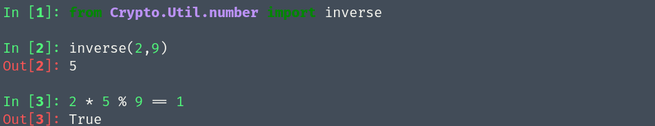

## 模运算基础

我们习惯的绝大多数数集都是无穷的，比如自然数集或实数集

$$
\mathbb{N} = 0,1,2,3,4,\cdots
$$

但在密码学中，几乎所有的加密算法 (对称算法和非对称算法) 都基于有限个元素的运算。 <font color="red">模运算</font>即是在有限整数集中执行算数运算的一种简单方法。

$$
\mathbb{Z}_p = 0,1,2,\cdots,p-1
$$

```bash
9 + 1  = 10        mod 12
9 + 4  = 13 = 1    mod 12
9 + 12 = 21 = 9    mod 12
```
考虑仅有9个数字的集合：
$$
\{0,1,2,3,4,5,6,7,8\}
$$

只要结果小于9，即可正常地执行算数运算:

$$
2 \times 3 = 6 \\
3 + 4 = 7
$$

但是 $4+7$ 怎么办? 可以尝试以下规则：正常执行整数的算数运算，并将结果除以 9,取 <font color="red">余数</font>.

$$
4 + 7 = 11 \equiv 2 \;\; mod \;\; 9
$$

两个整数 $a,b$ 若它们除以模数 $m$ 所得到的余数相同，则称 $a,b$ 对于模 $m$ <font color="red"> 同余 </font> 记作
$$
a\equiv b \;(\;mod \; m\;)
$$

例如
$$
11\equiv 2 \;(\;mod \; 9\;)
$$

事实上，所有除以 9 余数为 2 的整数，都与 2 同余,为一个 <font color="red">  等价类</font> 

$$
[2] = \{\cdots,2-2\cdot9,2-9,2,2+9,2+2\cdot9,\cdots\}
$$


若两个整数 $a,b$ 对于模 $m$ 同余,则对于整数 $c$ 有：
$$
a \;± \; c\equiv b \;±\;c \;(\;mod \;m\;)\\
a \;\times\; c\equiv b \;\times\;c \;(\;mod \;m\;)
$$

例如
$$
11 \;± \; 3\equiv 2 \;±\;3 \;(\;mod \;9\;)\\
11 \;\times\; 3\equiv 2 \;\times\;3 \;(\;mod \;9\;)
$$

$$
3 \div 2 \equiv \;? \;(\;mod\;9\;)
$$
除法可以用乘法来定义，找到 $c$ 满足 $2\times c \equiv 1 \;(\;mod\;9\;)$
$$
c \equiv 5 \;(\; mod \; 9 \;)
$$

代入 $2\times5\equiv1\;(\;mod \;9\;)$

$$
3\div2\times1\equiv\;?\;(\;mod\;9\;)\\
3\div2\times(\;2\times5\;)\equiv\;?\;(\;mod\;9\;)\\
3\times5\equiv\;15\equiv6\;(\;mod\;9\;)
$$

对于非零整数 $a$ ,若 $a$ 与模数 $m$ 互质,则存在 $a$ 的逆元 $a^{-1}$ 满足
$$
\color{red}
a^{-1}\cdot a \equiv 1 \;(\;mod \; m\;)
$$
例如

$$
2^{-1} \equiv 5\;(\;mod\;9\;)
$$

模运算中,除以某个数,等价于乘上这个数的逆元

$$
b \div 2 \; (\;mod\;9\;) \Leftrightarrow b \times 2^{-1}\;(\;mod\;9\;) \Leftrightarrow b \times5 \;(\;mod\;9\;)
$$

注意,并不是所有情况都存在逆元! 例如 2 对于模 10 就不存在逆元

**如何计算模逆元?** 
+ 暴力穷举法
+ 辗转相除法
+ 欧拉定理法

安装 `pyCrypto` 库 `python3 -m pip install pycryptodome`



## 线性同余生成器
序列密码需要通过流密钥生成器来生成密钥流， <font color="red"> 线性同余生成器 </font>即为一种可以生成伪随机序列的算法。
标准的线性同余生成器 (Linear Congruence Generator,LCG) 生成的序列满足下列递推式
$$
x_{n+1}\equiv Ax_n + B \;(\;mod\:M\;)
$$
其中 $A,B,M$ 均为设定的常数，同时需要初始值 $x_0$ 作为种子

在已知常数 $A,B,M$的前提下，若能捕获到线性同余生成器的一个输出，则可以恢复出状态，并通过递推式之后产生的所有随机数。

$$
x_{n+1} \equiv Ax_n + B \; (\;mod\;M\;)\\

$$

$$
x_{n} \equiv (\;x_{n+1} - B)A^{-1} \; (\;mod\;M\;)\\
$$


## 相关利用手法

在已知常数$M$但未知$A,B$的条件下，若能捕获到线性同于生成器的连续两个输出，则可以建立一个关于 $A,B$ 的同余方程:

$$
x_{i+1} \equiv Ax_i + B \;(\;mod\;M\;)
$$
获得 2 个同余方程，可以建立一个方程组，解方程组即可得到 $A,B$:

$$
x_{i+1} \equiv Ax_i + B \;(\;mod\;M\;)\\
x_{j+1} \equiv Ax_j + B \;(\;mod\;M\;)
$$

```python
from Crypto.Util.number import *
from Crypto.Random.random import randrange,getrandbits
class LCG(object):
    def __init__(self, seed):
        self.N = getPrime(256)
        self.a = randrange(self.N)
        self.b = randrange(self.N)
        self.seed = seed % self.N
        self.state = self.seed

    def next(self):
        self.state = (self.a * self.state + self.b) % self.N
        return self.state

```

```python
def challenge3():
    print '[++++++++++++++++] Generating challenge 3 [++++++++++++++++]'
    init_seed = getrandbits(256)
    lcg = LCG(init_seed)
    print '[+] init_seed = getrandbits(256)'
    print '[+] lcg = LCG(init_seed)'
    print '[+] lcg.N = ' + str(lcg.N)
    print '[+] lcg.next() = ' + str(lcg.next())
    print '[+] lcg.next() = ' + str(lcg.next())
    print '[+] lcg.next() = ' + str(lcg.next())
    # print lcg.seed
    guess = int(raw_input("[-] lcg.seed = "))
    if guess != lcg.seed:
        print '[!] Sorry, you are wrong, exit...'
        exit(0)
    print '[++++++++++++++++] Challenge 3 completed [++++++++++++++++]\n'
```

题目给了连续的3个输出,可以联立方程组
$$
x_2 \equiv Ax_1 + B\;(\;mod\;M\;)\\
x_3 \equiv Ax_2 + B\;(\;mod\;M\;)
$$
可以解出$A,B$
$$
A\equiv (\;x_3-x_2\;)(\;x_2-x_1\;)^{-1}(\;mod\;M\;)\\
$$

$$
B\equiv x_3-Ax_2\;(\;mod\;M\;)
$$
再根据递推公式，可以计算出初始化种子 $x_0$

$$
x_0 \equiv (\;x_1-B\;)A^{-1}(\;mod\;M\;)
$$


```python
from gmpy2 import *
from primefac import *
s = [91998030559539294118763300984087645302586520269401699283197802967845643768875, 80069740776294650362142884296348197761629802041548573589982752426687778180055, 55063243971314211579722221731224042285420160417657223615910086478363530969645, 102301473242334107121311900448732568466210701241317168575997729679274391909345, 50041444132184927123261592271067474333230884356724219423508831265553492817229, 50661436852907184517648938922437143528821344611212575011889385677863365840831]
diffs = [s1 - s0 for s1, s0 in zip(s, s[1:])]
zeros = [t2*t0-t1*t1 for t0, t1, t2 in zip(diffs, diffs[1:], diffs[2:])]
N = abs(reduce(gcd, zeros))
factors = factorint(N)
while not isprime(N): # 注意这里N刚开始有可能不是素数导致后面无法求出逆元
    for prime, order in factors.items():
        if prime.bit_length() > 128:
            continue
        N = N / prime**order
a = (s[2] - s[1]) * invert(s[1] - s[0], N) % N
b = (s[1] - s[0] * a) % N
seed = (s[0] - b) * invert(a, N) % N
print seed
```


