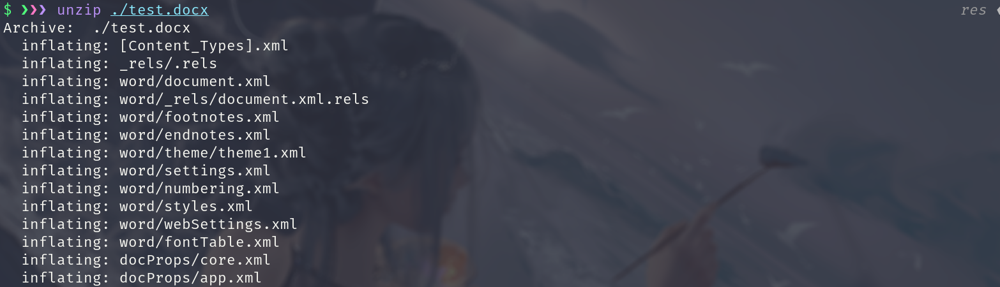
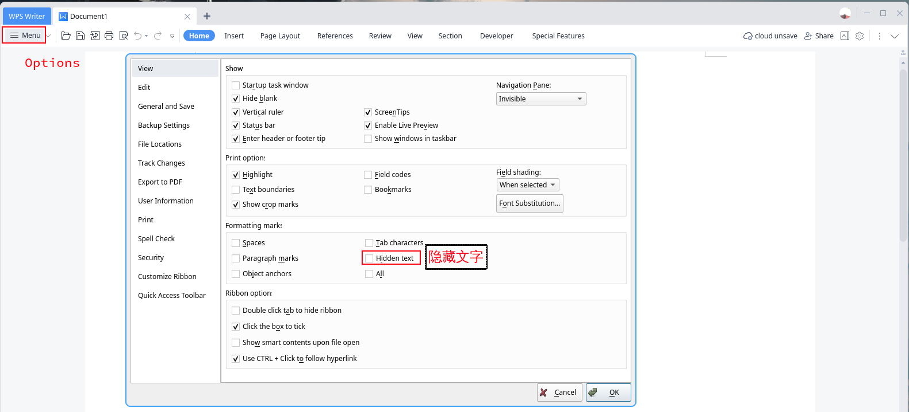

# 文档隐写

## 文档文件格式
Office 系列软件作为优秀的办公软件为我们提供了极大的便利，其中 Word, Excel , PowerPoint 提供了许多在文档中隐藏数据的方法，比如 批注，个人信息，水印，不可见内容，隐藏文字，和定制 XML 数据。我们涉及到的就是提到的隐藏文本功能

利用PDF 文件头添加额外信息，这个区域信息会被 Adobe Acrobat Reader 阅读器忽略

### Word 类文件格式

word 的两种常见格式：

#### doc
文档 (英文缩写: DOC 全称：Document) 是电脑文件中常见文件扩展名的一种，亦是 Word2003 以前版本的文本文档。自Word2007 之后为 docx。该格式原是纯文本文件使用的，多见于不同的操作系统，软硬件的使用说明

#### docx

docx 是 Microsoft Office2007 之后版本使用的，用新的基于XML的压缩文件格式取代了其目前专有的默认文件格式，在传统的文件名扩展名后添加了字母 'x' (即 '.docx' 取代 '.doc','.xlsx'取代'.xls','.pptx'取代了 '.ppt')

word 类文档可以直接该后缀为 zip 解压缩资源文件

PDF 的文件格式

PDF 是一种由 Adobe Systems 发明的一种开放式电子文档交换标准，可用于呈现文本，图像，多媒体元素，网页链接等的文档。它具有广泛的功能。我们必须首先理解的是，PDF 文件格式规范在这里是公开的，任何对 PDF 文件格式感兴趣的人都可以使用。PDF 具有比文本更多的功能，它可以包含图像和其它多媒体元素，可以受密码保护，可以执行 Java Script 等。图像文件的基本结构如下图所示： 

[PDF-Structure](https://resources.infosecinstitute.com/topic/pdf-file-format-basic-structure/)

## 常见文档隐写题型

+ 利用隐藏文本功能进行隐写
+ 利用字体和图片覆盖
+ word 文档的xml转换
+ PDF 文件常用隐写工具
+ PDF 文件中图像覆盖和字体隐藏

### 利用隐藏文本功能进行隐写

出题人使用文档编辑器 (比如我使用的是 WPS office 系列工具也一样)，使用字体隐藏文字来隐藏信息

### word 文档的xml转换

我们可以将 Word 文档转换成 xml 格式，当然反过来我们也可以将xml 转换成 word 文档，这就导致了我们如果重新打包word文档的过程中，有可能被隐藏进其它数据。

解决方式：
将文档文件的后缀名改为 zip
解压后，灵活使用 strings 等命令查找关键信息。

### PDF 文件常用隐写工具

PDF 隐写中，我们最常用的，也是最熟知的工具就是 `wbStego4open` 这是可以把把文件隐藏到 BMP , TXT ,HTML ,和PDF 文件中的工具，当然，这里我们只用它来作为以 PDF 为载体进行隐写的工具

解决方法：
使用 `wbStego4open` 提取隐藏信息

### PDF 文件中图像覆盖和字体隐藏 

PDF 隐写中，出题人除了使用工具，也可利用透明字体和图片来遮住隐藏信息

解决方法：

使用全选快捷键 <kbd> Alt </kbd> + <kbd> a </kbd> 来选中页面上所有文字，然后粘贴到其它编辑器中

### 其它形式
零字节隐藏
http://330k.github.io/misc_tools/unicode_steganography.html

