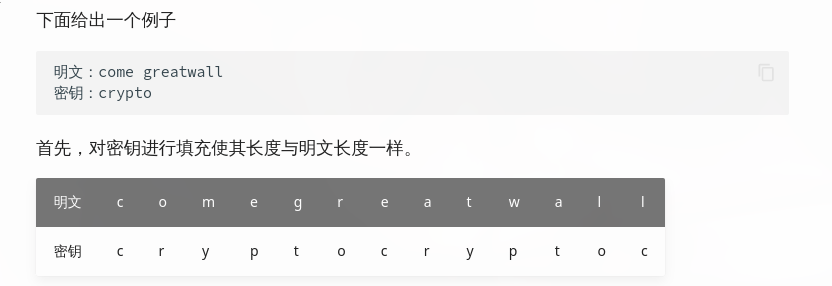
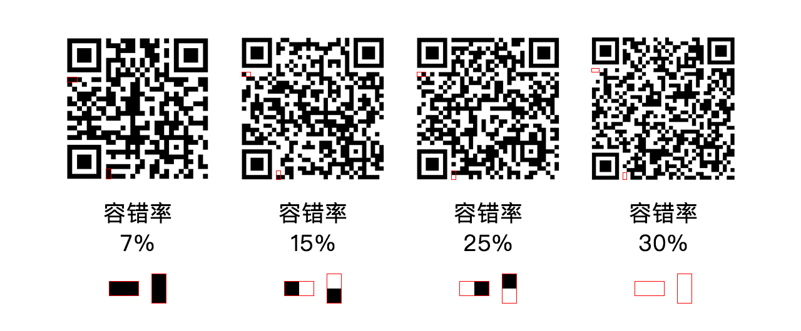
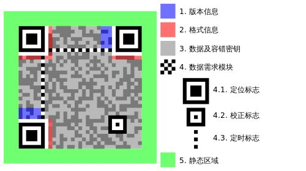
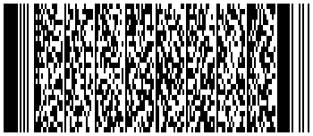
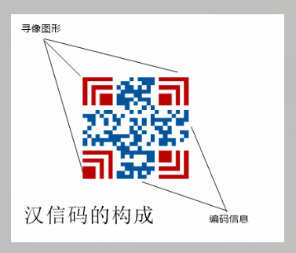

# 编码隐写

## 进制转换


## base 系列编码

### Base64 

Base64 是一种基于64个可打印字符来表示二进制数据的表示方法。由于 `2^6 = 64` 所以每6个比特为一个单元，对应某个可打印字符。3个字节有24个 bit 对应于4个Base64 单元，即3个字节可由4个可打印字符来表示。它可用来作为电子邮件的传输编码。在 Base64 中的可打印字符包括字母 (A-Z,a-z)  数字(0-9) 这样共62个字符,此外两个可打印符号在不同的系统这种而不同。一些如 uuencode 的其它编码方法，和之后 BinHex 的版本使用不同的 64 字符集来代表6个二进制数字，但不被称为 Base64

Base64 常用于在通常处理文本数据的场合，表示，传输，存储一些二进制数据，包括MIME的电子邮件及XML 的一些复杂数据. 

#### 原理

+ 第一步,将每三个字节作为一组，一共是24个二进制位
+ 将这24个二进制位分为4组，每个组有6个二进制位
+ 在每组前面加两个 00 ,扩展成 32 个二进制位,即4个字节
+ 根据下表，得到扩展后的每个字节的对应符号，这就是 Base64 编码值


## 常用编码

## 密码编码

替换加密，移位密码，培根密码，猪圈密码，brainfuck

### 凯撒密码

凯撒密码

凯撒密码（英語：Caesar cipher），或稱凯撒加密、凯撒变换、变换加密，是一种最简单且最广为人知的加密技术。凯撒密码是一种替换加密技术，明文中的所有字母都在字母表上向後（或向前）按照一个固定数目进行偏移後被替换成密文。例如，当偏移量是3的时候，所有的字母A将被替换成D，B变成E，以此类推。

### ROT13

只对字母进行编码，用当前字母往前数的第13个字母替换当前字母，例如当前为 A 编码后变成 N 当前为B,编码后变为 O,以此类推顺序循环。

### 单表替换密码

在单表替换加密中，所有的加密方式几乎都有一个共性，那就是明密文一一对应。所以说，一般有以下两种方式来进行破解

在密钥空间较小的情况下，采用暴力破解方式
在密文长度足够长的时候，使用词频分析，http://quipqiup.com/
当密钥空间足够大，而密文长度足够短的情况下，破解较为困难。

简单替换密码（Simple Substitution Cipher）加密时，将每个明文字母替换为与之唯一对应且不同的字母。它与恺撒密码之间的区别是其密码字母表的字母不是简单的移位，而是完全是混乱的，这也使得其破解难度要高于凯撒密码。 比如：

+ 明文字母 : `abcdefghijklmnopqrstuvwxyz`
+ 密钥字母 : `phqgiumeaylnofdxjkrcvstzwb`
+ a 对应 p，d 对应 h，以此类推。
--- 
+ 明文：the quick brown fox jumps over the lazy dog
+ 密文：cei jvaql hkdtf udz yvoxr dsik cei npbw gdm
+ 而解密时，我们一般是知道了每一个字母的对应规则，才可以正常解密。

Vigenere 密码

Vigenere 密码利用一个凯撒方阵来修改密文中字母的频率。在明文中不同地方出现的同一字母在密文中一般用不同的字母代替。属于多表密码的一种简单形式

若看成一维表，由于共26个字母，每个字母可做一个 i 指定一个替换表，即共26个替换表，即本总密文表长度为 26 * 26


注意： Vigenere 密码的 26个密码表，每个表相对前一个表发生一次左移。若看成二维表，则可能更容易对比。

在线破解无密钥 Vigenere 网址:
https://www.guballa.de/vigenere-solver




```bash
明文：come greatwall
密钥：crypto
密文：efkt zferrltzn
```


移位加密

栅栏密码

栅栏密码 (Rail-fence Cipher) 就是把要加密的明文分成N 个一组，然后把每组的第一个字符组合，每组的第二个字符组合...每一组的第N(最后一个分组可能不足N个) 个字符组合，最后把他们全部连接起来就是密文


## 图形编码

### 条形码

条形码（英語：barcode），是将宽度不等的多个黑条和空白，按照一定的编码规则排列，用以表达一组信息的图形标识符。常见的条形码是由反射率相差很大的黑条（简称条）和白条（简称空）排成的平行线图案。条形码可以标出物品的生产国、制造厂家、商品名称、生产日期、图书分类号、邮件起止地点、类别、日期等信息，因而在商品流通、图书管理、邮政管理、银行系统等许多领域都得到了广泛的应用

模块： 组成条码的基本宽度单位。说白了，条码上，每 0.33 毫米宽代表一个模块。一个模块宽的条 (条形码黑色部分) 表示二进制 '1' 两个模块宽的条 (黑) 表示二进制 '11' 一个模块宽的空 (条形码白色部分) 表示二进制 '0'

条形码修复补全
出题人可能根据条形码的上下一致的特性，对条形码的部分进行遮挡，去除等操作。

解决方法：
+ 使用 PS 等图像处理工具进行修复
+ 使用 python 编写脚本


### 二维码

二维条码/二维码（2-dimensional bar code）是用某种特定的几何图形按一定规律在平面（二维方向上）分布的、黑白相间的、记录数据符号信息的图形.在许多种类的二维条码中，常用的码制有：Data Matrix、MaxiCode、Aztec、QR Code、Vericode、PDF417、Ultracode、Code 49、Code 16K等.二维码的名称是相对于一维码来说的，比如以前的条形码就是一个 "一维码" ，它的有点有： 二维码存储的数据更大，可以包含数字，字符，及中文文本等混合内容，具有一定的容错性(在部分损坏以后可正常读取) 空间利用率高等。




QR Code
QR Code(Quick Response Code) 是二维码的一种编码方式，通过与背景颜色存在对比的色块表示二进制数据 0 和 1 , 通过色块组成的二维矩阵表示数字，英文，汉字，日文等内容。计算机或智能终端可以通过图像识别设备对其进行解码的操作

1994 年，日本丰田汽车的零部件供应商DENSO WAVE 公司的原昌弘设计发明 QR Code DENSO WAVE 拥有 QR Code 的专利权，但为了让更多人使用 QR Code 该公司表示放弃行使专利权。 QR Code 在 2000 年被制定为 ISO/IEC 18004 标准，并在 2006年和2015年两次被优化。由于 QR Code 具有比条形码存储信息量大，抗干扰能力强等优点，被人们广泛用于手机扫码等操作。




[](https://tuzim.net/blog/21.html) 
[<++>](https://juejin.cn/post/7020761787578449956) 
[<++>](https://www.v2ex.com/t/484091) 

二维码修复补全

出题人可能根据二维码的特性，对二维码进行反色，去除定位点，涂抹，去掉部分关键位等方式修改图片

解决方法：
+ 使用 stegosolve 
+ 使用 PS 等图像处理工具进行修复
+ 使用 python 编写脚本

PDF417

PDF417二维条码是一种堆叠式二维条码，应用最为广泛。PDF417条码是由美国SYMBOL公司发明的，PDF（Portable Data File）意思是“便携数据文件”。组成条码的每一个条码字符由4个条和4个空共17个模块构成，故称为PDF417条码。 PDF417条码需要有417解码功能的条码阅读器才能识别。PDF417条码最大的优势在于其庞大的数据容量和极强的纠错能力。



QRcode 可以用微信等扫码工具解决，常见的扫码工具无法识别 PDF417,可以通过在线网站来识别。

+ 在线网站解码
+ https://online-barcode-reader.inliteresearch.com

汉信码
汉信码是一种全新的二维矩阵码，由中国物品编码中心牵头组织相关单位合作开发，完全具有自主知识产权。和国际上其他二维条码相比，更适合汉字信息的表示，而且可以容纳更多的信息。

<div align="center"></div>

可能会经过去除识别块，和反色等操作
+ 使用 PS 等图像处理工具进行修复
+ 使用 python 编写脚本

<kbd class="keybord"> Ctrl </kbd> + <kbd class="keybord"> i </kbd>&ensp; 颜色反转

