[题目下载链接](./w1.assets/4nums.zip)

## Zip 暴力破解

当我们下载下来这个题目的时候，得到了一个 zip 文件，我们首先尝试对其进行解压，发现要解压这个压缩包，需要提供密码

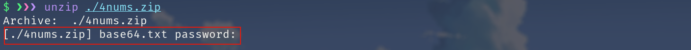

我们首先怀疑这个文件是否为 zip 伪加密，但是看见文件名为 4nums, 是否在提示我们说，这个文件的密码是由 4个数字组成 ?

我们使用 `john` 这个工具对其进行暴力破解的尝试。

> 在 windows 环境下我们可以使 `ARCHPR` 这类压缩包暴力破解工具。(这边使用开源的 john 进行演示)

先用 john 里内置的 python 小工具 ( `zip2john` ) 将该压缩包转换成 john 能识别的编码格式。

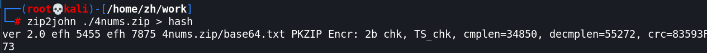

然后我们使用 `crunch` 生成 4位数字的密码字典。

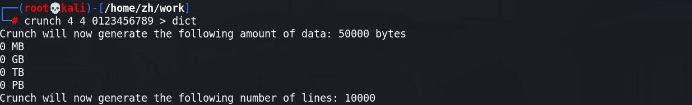

然后使用 john 对其进行暴力破解

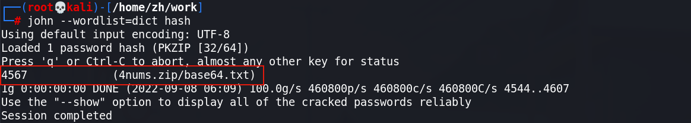

发现成功获取到密码 `4567`

然后使用该密码对其进行解压，发现成功解压出一个文本文件

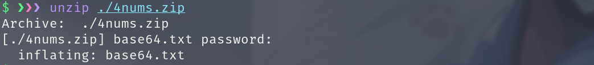

## Base64 解密

打开文件发现这些字符极其像 `Base64` 编码.

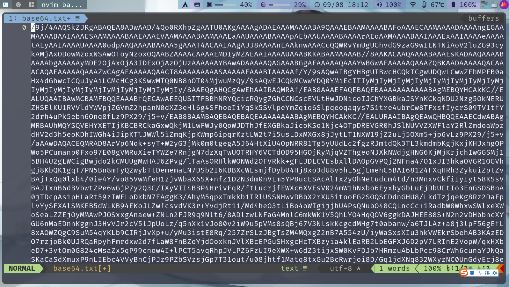

所以我们使用 `Cyber Chef` 这个加解码网站，对其进行解码。

发现解码后的内容并不是那种可见的 ascii ，而是类似一种文件。

然后我们查看了前几个字节文件头，发现解码后的内容很有可能是 jpeg 文件。 

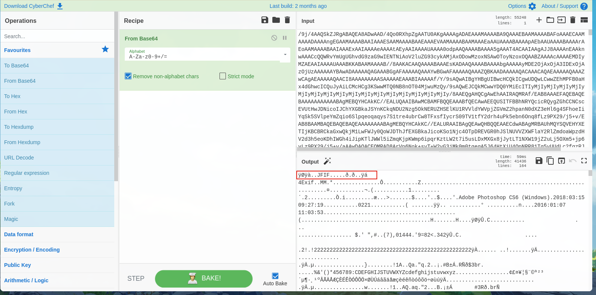

所以我们将解码后的内容保存为一个 jpeg 后缀的文件。

发现为一张看着没有什么有价值信息的图片。

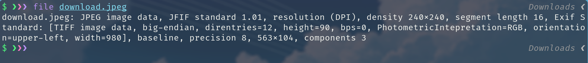

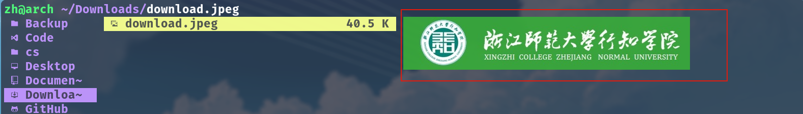

## 文件隐写

对该文件进行分析，发现该图片可能隐藏了某个文件。

我们使用 `binwalk` 查看该文件发现确实在里面存在一个 `zlib` 文件

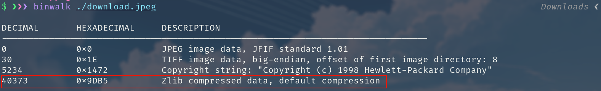

我们使用 `-e` 参数尝试对这两个文件进行分离.

发现成功得到了一个标准的 zlib 文件。

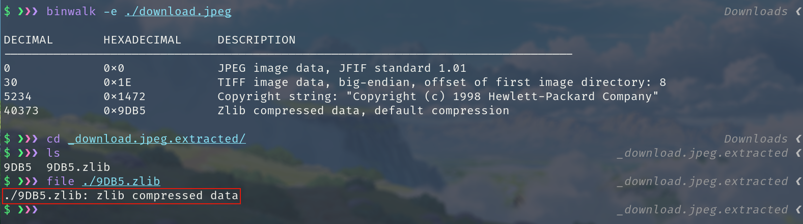

经常写 MISC 应该了解 `zlib` 文件也是一个类似 `zip,rar` 的压缩文件。

其实我们只需要对该后缀名进行适当的网络查阅 (STFW) 就能知道如何对该文件进行解压了。

+ [What is zlib file?](https://en.wikipedia.org/wiki/Zlib)
+ [How to uncompress zlib file](https://unix.stackexchange.com/questions/22834/how-to-uncompress-zlib-data-in-unix)

这边我们使用 `zlib-flate` 命令对其进行解压。

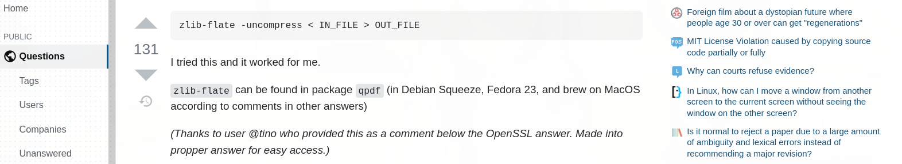

发现成功提取出来一个 `png` 文件

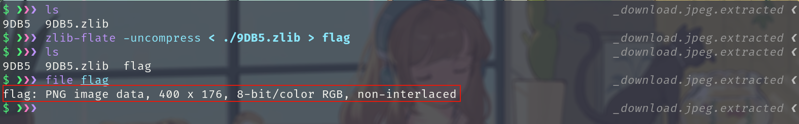

## 修改图片高度

当我们打开这个png 图片 文件时，发现好像只有一半显示出来了，并没有下半部分。

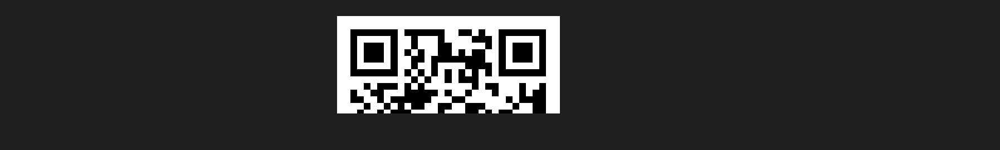

然后我们尝试使用 `zsteg` 查看该图片最低有效位，图片格式等信息，发现并没有什么有用的信息。

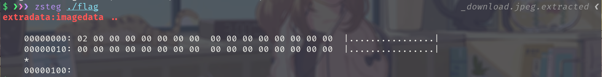

然后使用使用 `pngcheck` 查看一下该图片的校验和,发现校验和错误，很显然，这个文件被修改过。并且校验和没被修改。

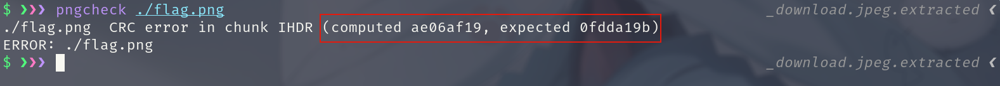

到这边我们的方向基本就很明确了，就是修改图片的高度

我们使用 `xxd` 工具查看并修改该文件的二进制。

> 在 Windows 环境下你可以使用 `010 editor` `winhex` 类似的二进制编辑工具进行修改

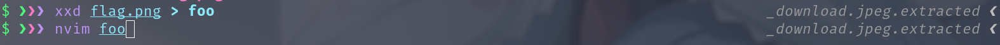

发现其高度明显比宽度少很多，我们知道这个二维码有很大概率是正方形。

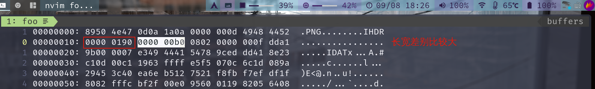

所以我们将高度修改为宽度的值，然后进行保存

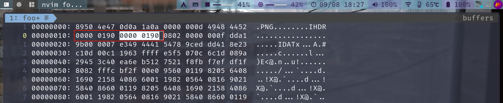

然后我们使用 `xxd -r` 命令还原成 png 原本的样式

这个时候我们再使用 `pngcheck` 发现并没有报 CRC 校验和错误。
说明我们的修改是正确的

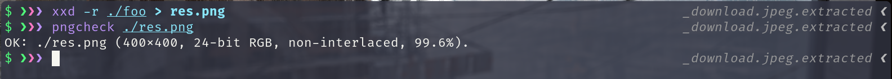

然后我们再次打开该图片发现二维码完整了

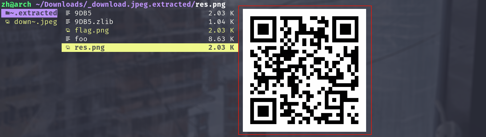

我们可以使用手机或者别的工具获取二维码的信息: flag

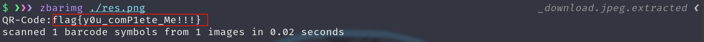
