## PWN 简介

<div style="border-radius:15px;display:block;background-color:#a8dadc;border:2px solid #aaa;margin:15px;padding:10px;">
"PWN" 是一个黑客语法的俚语词，是指攻破设备或者系统。发出类似 "砰"，对于黑客而言，这就是成功实施黑客攻击的声音-(砰的一声),被"黑"的电脑或者手机就被你操纵了。
</div>


<font color="red"> CTF 比赛中的 PWN 多指二进制漏洞的利用。 </font>PWN相比与WEB来说，入门更难一些，需要的前置知识更多一些。一般比赛中出现的 PWN 题目多为 linux 环境的 ELF 文件 (多为 ubuntu 平台下)

学习网站
+ [CTF-wiki](https://ctf-wiki.org) CTF-wiki 是一个关于CTF的社区项目，上面有着各个方向的学习路线与讲解。只是部分讲解并不是很清楚，需要自己多想多动手
+ [pwnable.tw](https://pwnable.tw/) pwnable.tw 是一个著名的刷题网站，网站上的题目都十分有意思，可以学到许多新的东西。只是后面部分的题目并没有 writeup
+ [buuctf](https://buuoj.cn/) buuctf 是北京联合大学的 CTF 题目平台，上面有着各种比赛的题目环境，适合大家复现比赛的题目。

<font color="red">  提升自己最好的方式就是**以赛代练** </font>

不过要记得在比赛结束后根据 writeup 找到自己知识的漏洞，然后补上它。

## 环境搭建

这边我们使用 docker `(ubuntu:20.04)` 进行演示

```bash
docker run -it --name pwn --hostname=pwn -v /home/Docker:/home \
--cap-add=SYS_PTRACE --security-opt seccomp=unconfined \
ubuntu:20.04 /bin/bash
```

### 更新源

可以选择 北京外国语大学的镜像
+ https://mirrors.bfsu.edu.cn/help/ubuntu/

```bash
# 默认注释了源码镜像以提高 apt update 速度，如有需要可自行取消注释
deb https://mirrors.bfsu.edu.cn/ubuntu/ focal main restricted universe multiverse
# deb-src https://mirrors.bfsu.edu.cn/ubuntu/ focal main restricted universe multiverse
deb https://mirrors.bfsu.edu.cn/ubuntu/ focal-updates main restricted universe multiverse
# deb-src https://mirrors.bfsu.edu.cn/ubuntu/ focal-updates main restricted universe multiverse
deb https://mirrors.bfsu.edu.cn/ubuntu/ focal-backports main restricted universe multiverse
# deb-src https://mirrors.bfsu.edu.cn/ubuntu/ focal-backports main restricted universe multiverse
deb https://mirrors.bfsu.edu.cn/ubuntu/ focal-security main restricted universe multiverse
# deb-src https://mirrors.bfsu.edu.cn/ubuntu/ focal-security main restricted universe multiverse

# 预发布软件源，不建议启用
# deb https://mirrors.bfsu.edu.cn/ubuntu/ focal-proposed main restricted universe multiverse
# deb-src https://mirrors.bfsu.edu.cn/ubuntu/ focal-proposed main restricted universe multiverse
```

```bash
sudo sed -i "s@http://.*archive.ubuntu.com@https://mirrors.bfsu.edu.cn@g" /etc/apt/sources.list
sudo sed -i "s@http://.*security.ubuntu.com@https://mirrors.bfsu.edu.cn@g" /etc/apt/sources.list
```

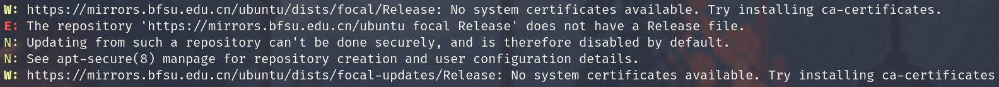

报错将源替换为 `http` 即可

### 安装 python 环境

```bash
apt update
apt install python
apt install python3
apt install python3-pip

# install python2-pip
apt install curl
curl -sSL https://bootstrap.pypa.io/pip/2.7/get-pip.py -o get-pip.py
python get-pip.py

```

### `pwntools`

pwntools 是 pwn 题目编写必备的python库,可以有效的提高我们的 exp 编写效率

我们只需要使用 pip 安装即可

```bash
pip install -i https://mirrors.aliyun.com/pypi/simple capstone
pip install -i https://mirrors.aliyun.com/pypi/simple pwntools
```

如果我们进入 python 的命令提示符内，输入 `from pwn import *` 如果没报错，大概率就是安装成功了。

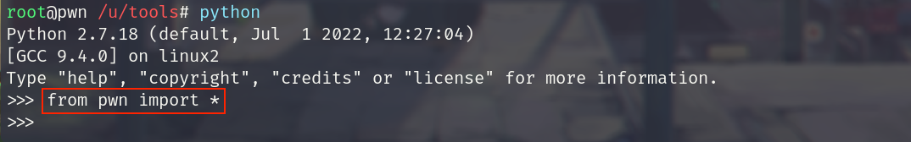


### `pwndbg`

如果你是使用 ubuntu 镜像在 `Vmware/virtualbox` 安装的 ubuntu, gdb 默认是安装了。

```bash
apt install gdb
apt install git
```

```bash
git clone https://github.com/pwndbg/pwndbg
cd pwndbg
./setup.sh
```

<div style="border-radius:15px;display:block;background-color:pink;border:2px solid #aaa;margin:15px;padding:10px;">
如果你是使用 docker 进行安装的 ubuntu 的话,安装完 pwndbg 一般会报下面这个错误。
</div>


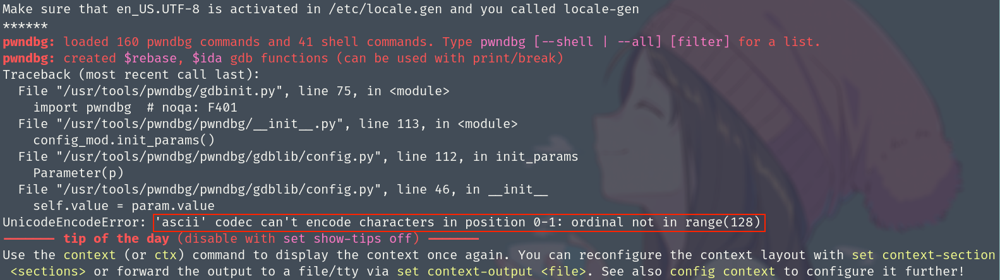

发生这个报错的原因 `(StackOverFlow)`
+ `The problem is that you're trying to print a unicode character, but your terminal doesn't support it.`
+ `You can try installing language-pack-en package to fix that:`

解决方案我们只需要安装一下 `language-pack-en` 这个包即可。

```bash
apt install language-pack-en
```

当我们运行 gdb 后显示如下界面即正常安装 `pwndbg`

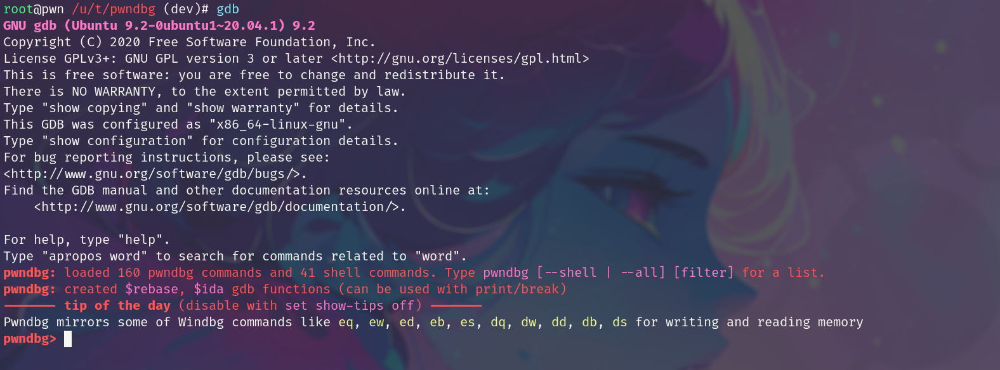

pwndbg 是一个 Github 项目，用于对 gdb 进行辅助增强

同时其内置了一些对 ptmalloc 的堆进行分析的小工具

尽量用最新版即可


### `pwngdb`

`pwngdb` 同样是用于 `gdb` 的辅助增强插件，包含许多好用的小工具，但是与 `pwndbg` 有一定的冲突,需要手动修改一下

<div style="border-radius:15px;display:block;background-color:pink;border:2px solid #aaa;margin:15px;padding:10px;">
以下安装命令的默认路径是在家目录 ( 如果你想安装在特定的目录，你需要对下面代码进行相应的修改 )
</div>

```bash
cd ~/ && git clone https://github.com/scwuaptx/Pwngdb.git
sed -i "1d" ~/Pwngdb/.gdbinit
cat ~/Pwngdb/.gdbinit >> ~/.gdbinit
sed -i "s/heap(/heapbase(/g" ~/Pwngdb/pwngdb.py
```

关闭地址随机化。

```bash
set disable-randomization off
/proc/sys/kernel/randomize_va_space
```
当我们运行 gdb 调试一个软件,运行 `tls` 命令，能够成功执行，就代表成功安装了 `pwngdb` 这个工具。 (如下图:)

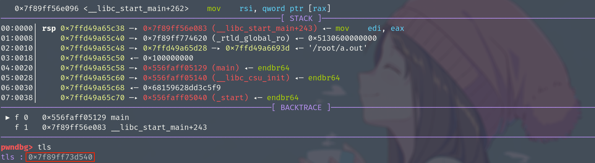

### `ropper`


ropper 同样是一个比较好用的 gadget 查找工具

https://github.com/sashs/Ropper

```bash
pip install -i https://mirrors.aliyun.com/pypi/simple/ capstone
pip install -i https://mirrors.aliyun.com/pypi/simple/ filebytes
pip install -i https://morrors.aliyun.com/pypi/simple/ ropper
```
当我们能运行 `ropper` 这条命令时，就证明 ropper 安装成功了。

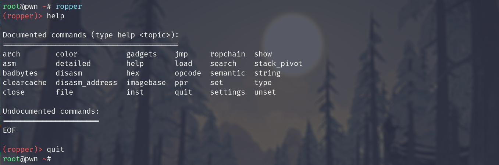

### `seccomp-tools/one_gadget`

https://github.com/david942j/seccomp-tools

> 安装这两个工具我们需要首先安装 `gem` 与 `ruby`

```bash
apt install gem
apt install ruby
apt install ruby-dev
```
安装 `seccomp-tools`,`one_gadget` 这个两个工具，我们只需要运行以下命令即可

```bash
gem install seccomp-tools
gem install one_gadget
```
### `glibc-all-in-one`

安装 `glibc-all-in-one` 我们只需要使用以下命令

```bash
git clone https://github.com/matrix1001/glibc-all-in-one
```

将 `glibc-all-in-one` 下载下来之后的结构如下

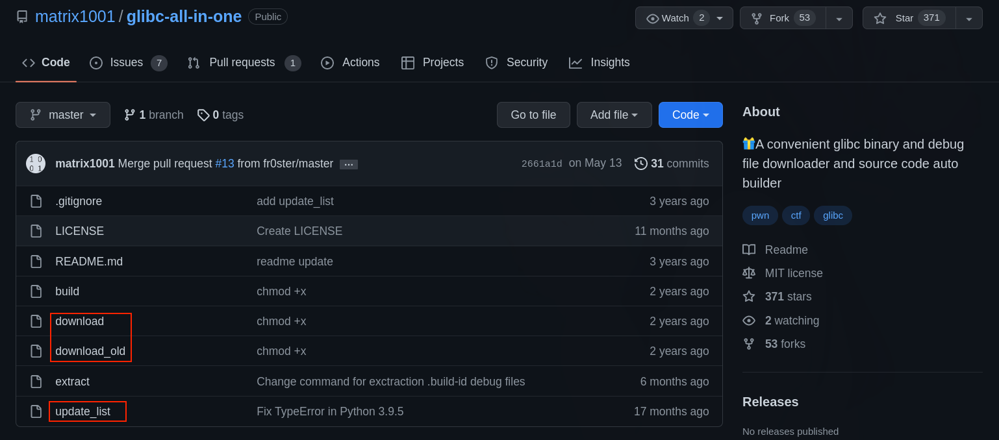

<font color="red">  而这些下载脚本会调用 `wget` 这个命令行工具,所以如果想使用这个工具，我们需要下载 `wget` </font>

```bash
apt install wget
```

## 常用工具使用

### GDB 

程序运行参数

```bash
set args 指定运行时参数 (set args "xxx")
show args 查看设置好的运行参数
设置断点
break 设置断点,简写为 b (b *0x401000)
info break 查看设置号的断点，简写为 i b
delete 删除断点，简写为 d (d 1 删除第一个断点)
```

调试程序

```bash
run 运行程序 简写为 r
next 单步跟踪 一行一行的执行 简写为 n (代码层面) ni 汇编层面
step 步入 进入被调用函数 简写为 s si
finish 退出函数 简写为 fin
until 在循环内单步跟踪时，可跳出循环，简写为 u
continue 继续运行程序到下一个断点 简写为 c

```

查看运行时数据

```bash
print 打印有符号变量，字符串，表达式等的值，可简写为 p
stack 查看栈数据，后可跟数字输出指定行号
x 以格式化的形式打印内存数据，格式为 x/FMT address 
```
格式字符串有 o(八进制),x(16进制),d(10进制),u(无符号十进制),t(二进制),f(浮点数),a(地址),i(指令),c(字符),s(字符串),z(16进制对齐).同时在FMT 后面还可以加上每个单元


### pwntools

```python
s = process(file)
r = remote("host",port)
s.sendline() s.sendlineafter()
s.recvline() s.recvuntil()
s.send() s.sendafter()
s.recv()
```

### glibc-all-in-one

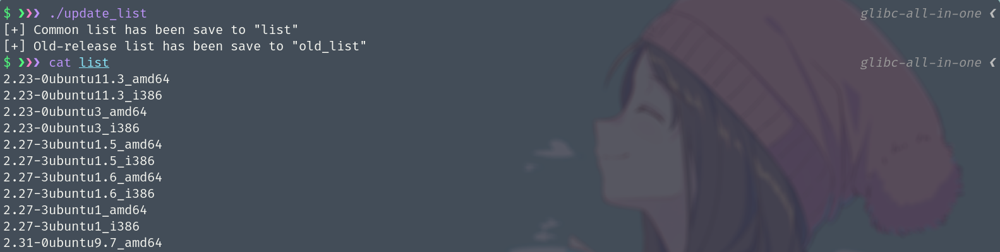
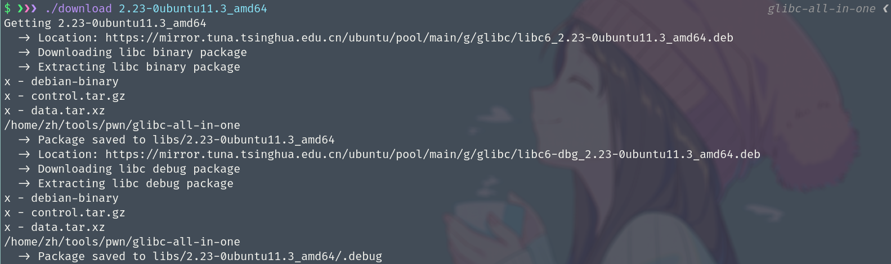

```bash
apt install wget
git clone https://github.com/matrix1001/glibc-all-in-one
```


多版本 glibc

```bash
apt install patchelf
```

```bash
patchelf --set-interpreter ./2.23-0ubuntu11.3_amd64/ld-2.23.so ./test
patchelf --print-needed ./test
patchelf --replace-needed libc.so.6 ./2.23-0ubuntu11.3_amd64/libc-2.23.so ./test
ldd test
```

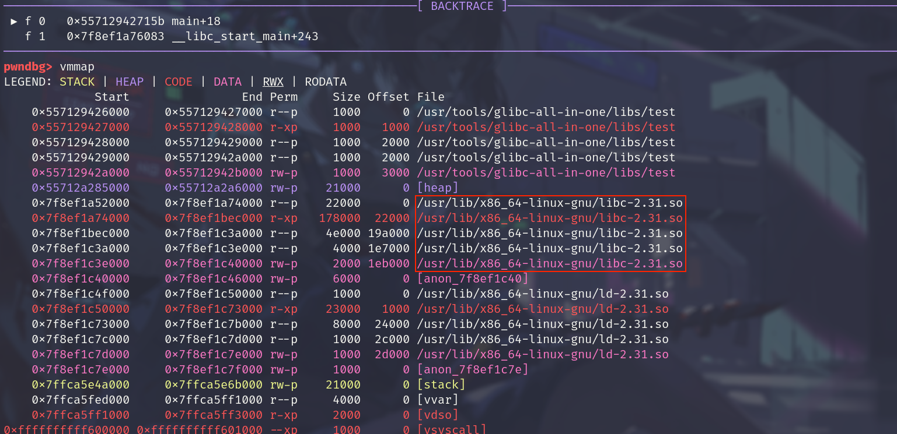

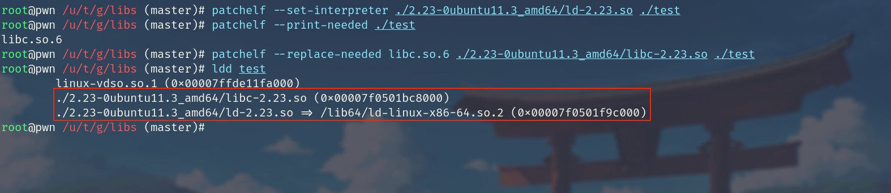
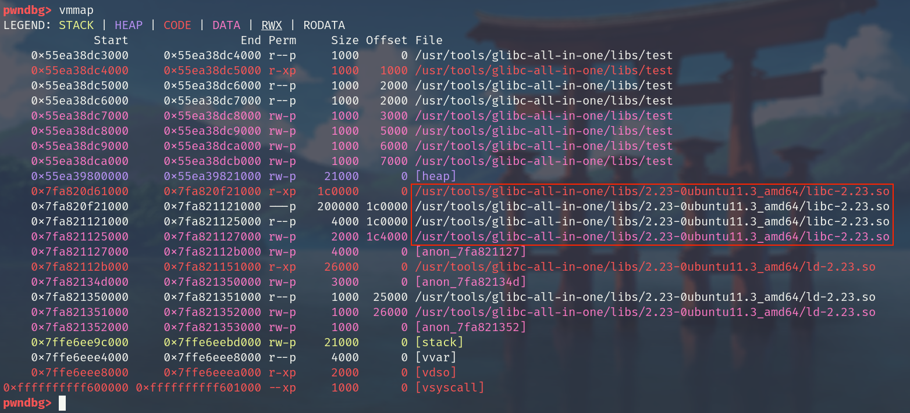
