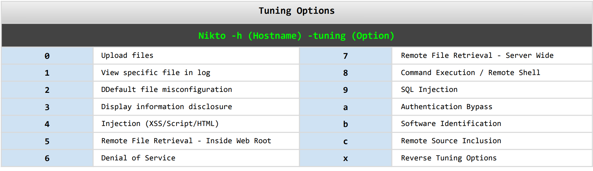

# Kali Linux 渗透测试

[Kali Linux tools](https://www.kali.org/tools/)


```bash
# install some tools about dns like: dig ...
sudo apt-get install dnsutils
```

## 信息收集


### acccheck
+ 密码破解工具
+ SMB 协议分析工具
	+ TCP445端口
	+ MS08-067
	+ WannaCry


## 漏洞分析

### nikto
> 命令参数的使用 [nikto cheatsheet](https://cdn.comparitech.com/wp-content/uploads/2019/07/NIkto-Cheat-Sheet.pdf)


#### 基本描述
**Web扫描器 ( 基于 LibWhisker 开发)**
+ 服务器软件配置错误
+ 默认文件,不安全的文件
+ 过期版本的软件
+ 常见漏洞类型

**扫描器**
+ 向目标发包,根据回包类型和内容进行判断

**404错误检测逻辑 ( no404 )**
> nikto 在这方面做得比较好,这就导致使用该扫描器会相对较慢
+ 不存在的内容,服务返回 404
+ 不存在的内容,服务返回200,取关键字 (不同类型的文件)
+ 每种类型文件随机命名访问,取页面不变内容 MD5 值,进行比对 (慢)
#### 基本使用
> 在使用 nikto 扫描时,如果想查看详细的扫描过程,可以按一下<kbd>v</kbd>

```bash
nikto -h 192.168.1.1 -ssl	nossl
```
|参数|描述|
|-|-|
|`-p 80,8080,443`|指定多端口|
|`-useproxy`|使用代理 (不支持SOCKS代理)|
|`host.txt`|主机列表文件|
|`-vhost`|虚拟主机 (Host头)|
|`-config`|配置文件|
|`-Format htm -o scan.html`| 保存结果|
|`-evasion`|避免触发IDS报警|

`-evasion` 参数的选项
1. 随机URL编码	
2. 自选则路径 (/./)
3. URL过早结束
4. 优先长随机字符串
5. 参数欺骗
6. TAB替换空格
7. 使用变化URL
8. 使用 Windows 路径分隔符 `\`


#### 密码认证相关参数
|参数|描述|
|-|-|-|
|`-id`|基本身份验证 (user:password)|
|`-list-plugins`| 插件列表|
|`-Plugins`|指定插件(默认全部)|
|`-mutate`|选择变形技术 (1-6)|
|`-mutate-options`|变形技术额外选项(字典)|
<font color=gray>mutate 选项一般用在爆破文件,目录,子域名,用户名等,<font color=black>但它并不常用,一来是使用这个参数会极大地增加扫描流量,二来效果也并不是太好</font></font>

<font color=red> `-Tuning` 参数的使用</font> 




#### 配置文件
**配置文件路径:**
1. `/etc/nikto.conf`
2. `$home/nikto.conf`

#### 交互命令
空格 当前扫描状态
v 扫描详细信息
d debug 信息
e 错误信息
p 扫描进程
r 重定向信息
c cookie 信息
a 身份认证信息
q 退出
N 扫描下一个主机
P 暂停

---

### Slowhttptest

#### 基本描述
** HTTP 应用层拒绝服务攻击工具**
+ 针对低宽带慢速拒绝服务攻击 ( HTTP SYN )
+ 针对apache,tomcat ( 最新版本已修复此漏洞 )
+ ulimite -n 7000
+ 支持代理
原理:
+ 大量消耗目标并发连接池
+ 缓慢发送不完整的HTTP请求,服务等待并保持连接
+ Slowloris: http 请求头只发送一个 `\r\n` (正常是两个)
+ SlowPOST: content-length声明长度,但body部分缓慢发送
+ Range: 向服务器发送恶意range请求范围
+ SlowRead: 慢速读取接收服务器返回数据

## web渗透


## 数据库评估


## 密码审计
> 在渗透测试中,往往我们会遇到目标系统实施了强安全措施,安装了所有补丁,无任何已知漏洞的情况.

这个时候我们可以通过<font color=red>获取目标系统登入凭据</font>,从而达到不触发系统报警的入侵

**身份认证**
+ 你知道什么 (<font color=green>账号密码</font>,pin,passphrase)
+ 你有什么 ( 令牌,token,key,证书,密保,手机)
+ 你是谁 (指纹,视网膜,虹膜,掌纹,面部识别..)
+ 以上方法结合使用 ( 多因素身份认证 )
### crunch


