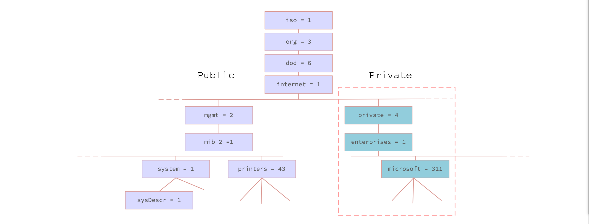
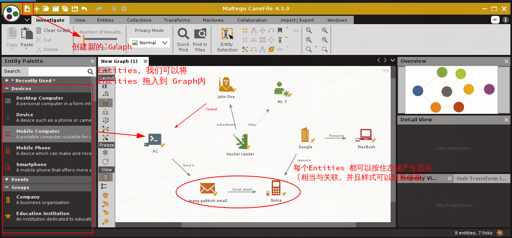
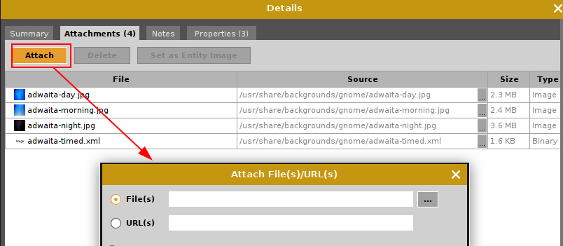
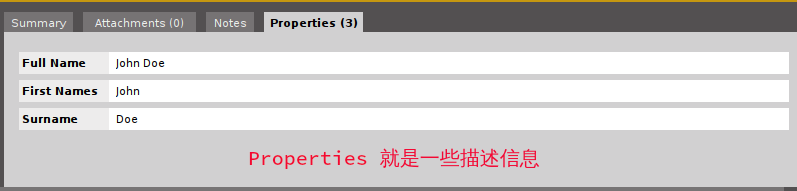
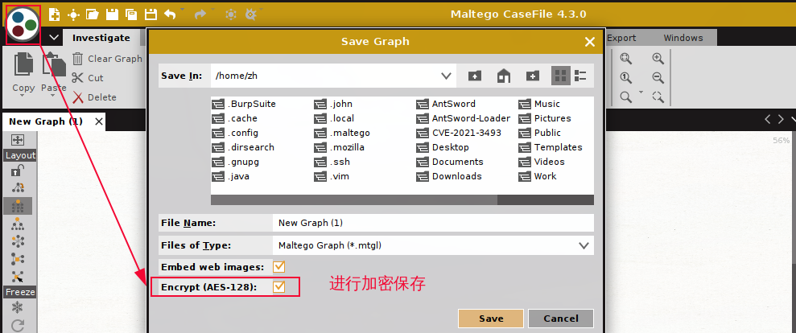
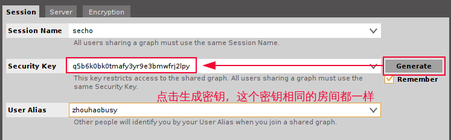
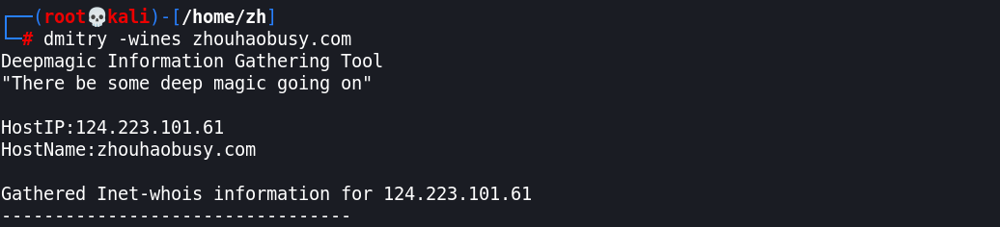
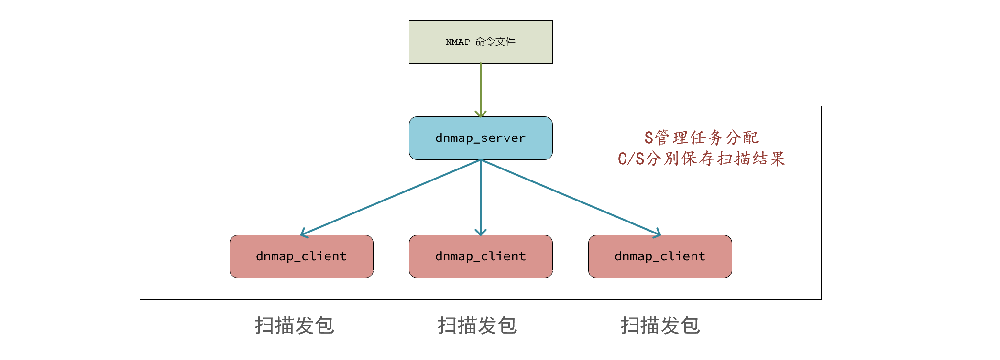
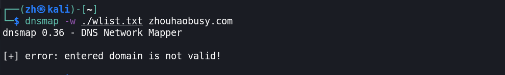

# Information Gathering

## 网络路径追踪

### `traceroute`

**渗透测试初期信息收集阶段**

通常用法:

+ **基于 ICMP 协议**
    + IP 头部 TTL 值递增，根据返回地址判断路径
+ 弊端
  + <font color='red' face=Monaco size=3>路径设备禁用 ICMP 数据包时，探测无效</font>

我们可以直接使用 `traceroute 域名` 这种方式来进行网络路径追踪.当然我们还用通过使用 IP 地址的方式。

我们先使用 `dig` 命令获得主机的域名解析记录，然后选择一条 主机 A 记录的 IP地址进行网络路径的追踪。


可以发现我们成功获得了一些有用的结果。 <font color='red' face=Monaco size=3>但也还是有很多网络结点并没有成功追踪到如第8跳，第10跳之后的都没成功</font>


为验证其发包方式，我们使用 `wireshark` 对这条命令产生的数据包进行抓包。


我们可以发现，真的和我们预想的一样，每次探测都会发3个 `udp` 的包，然后 `TTL` 值递增 1.

### `tcptraceroute`

> `tcptraceroute` 内部实现本质上还是使用 `traceroute` 这个命令

+ **基于 TCP 协议的路径追踪**
    + `traceroute -T IP`
    + `tcptraceroute IP  # shell script`
+ 技术原理
  + 发送 TTL 值递增的 SYN 包
+ 弊端
  + 不建立完整的 TCP 握手，会被某些 NAT 设备丢弃包

`traceroute` 命令其实能支持很多种网络路径追踪的发包方式，我们可以通过增加 `-T` 选项来指定使用 TCP 协议来进行路径追踪。

我们可以发现，这个结果和上面单纯使用 `traceroute` 命令产生的结果完全不一样。

+ 其实并没有这么多路径结点（只有 11 个）
+ 前面结点的发现并没有单纯使用 `traceroute` 命令来追踪产生的效果好。


我们同样使用 `wireshark` 对其进行抓包，发现确实是使用 `tcp` 包进行网络追踪，而且也是 同一 TTL 值会发三次相同的包。


我们使用 `tcptraceroute` 命令进行追踪，<font color='red' face=Monaco size=3>发现其实现是使用 `traceroute -T -O info IP`</font> .


### `0trace`

[what is 0trace | steps to use 0trace | how to install 0trace](https://devilzlinux.blogspot.com/2017/10/what-is-0trace-steps-to-use-0trace-how.html)

<font color='red' face=Monaco size=3> `0trace` 命令其实是一个 shell 脚本，他会调用我们系统内别的命令来进行网络追踪。 </font>

+ **基于正常会话的 TCP 协议路径跟踪**
  + `0trace iface IP Port`
+ 技术原理
  + 基于正常 TCP 会话发送 ACK 包
  + IP 头部 TTL 递增
+ 优势
  + 可能探测到内网地址段
  + 绕过某些防火墙限制

---
在进行网络路径追踪时，我们一定要 <font color='red' face=Monaco size=3>同时使用这三个工具进行追踪</font> ，因为这三个工具各具特色，能达到互补的效果。然后我们只需要将三种结果整合一下即可。

<font color='red' face=Monaco size=3>**而对于以下情况可能会导致我们上面的那些工具、方法无效**</font> 
  + 目标防火墙丢弃所有出站 ICMP 数据包
  + 目标防火墙做 TTL 值重写或全包重写
  + 路径中存在应用层代理/负载均衡设备
  + 防火墙后没有明确的三层设备
  + IDP/IPS 容易检测到 TCP 特征

当我们运行这个命令时，可以发现它并没有获得我们想要的结果，<font color='red' face=Monaco size=3>那是因为这条命令需要等待我们与目标建立完整的 TCP 会话才行</font>


所以我们要先使用浏览器访问一下该网站，然后 `0trace` 就能成功进行分析了。

> 可能访问之后，并不会立即返回结果，需要等待一段时间。

如果你使用域名的方式，访问要探测的主机，等了很久 `0trace` 还是没有给我们返回结果时，<font color='red' face=Monaco size=3>我们可以尝试使用与 `0trace` 命令后面的 IP 地址在浏览器上进行访问</font> 


## SMB 密码破解

### `acccheck`

+ 密码破解工具
+ SMB 协议分析工具
	+ TCP445端口
	+ MS08-067
	+ WannaCry


原理

尝试连接目标默认共享
+ `IPC$`
+ `ADMIN$`

命令参数
+ `t/T`
+ `u/U`  
+ `p/P`
+ `-v`

<!-- TODO:  <19-08-22,演示 > -->

## 二层主机发现
### `arping`
**原理**

ARP 协议解析 IP 地址到 MAC 地址的对应关系

arping 发送 ARP 探测包

神奇的安装

+ Kali 默认安装了个阉割版
  + 只有基本功能
+ 手动安装
  + `sudo apt-get install arping`
  + 前后对比
+ ARP 缓存
  + `cat /proc/sys/net/ipv4/neigh/default/gc_stale_time`
  + `ip link set arp off dev eth0`
  + `ip link set arp on dev eth0`


查看 arp 缓存时间，默认单位为秒


原理

+ 默认每秒发送一个请求
+ `-i` 指定发包网卡
+ 加快扫描速度
  + `-w` 发包间隔微秒
  + `-W` 浮点数秒
+ 限定发包数量 `-c`

+ 名称、IP、MAC
  + `-0` 来源IP `0.0.0.0`
  + `-b` 来源IP `255.255.255.255`
  + `-s` 设定来源 MAC
  + `-S` 设定来源 IP
+ `-P` 发 ARP reply
+ ARP 地址欺骗
+ 检测地址冲突

<!-- TODO:  <19-08-22,演示 > -->

## 开源信息收集
### ~~`automater`~~

+ **这款工具至今已经好几年没更新了**
+ 这个软件使用 python2,并且在 <font color='red' face=Monaco size=3>最新版本的 Kali Linux 上并没有预装这款工具了</font> 
+ 而且使用的都是国外网站的域名，所以我们几乎不能使用该软件

当然我们还是可以安装 [Install Guide](http://www.tekdefense.com/automater/) 并试着使用它。

**下面还是对它做一个基本的介绍，和使用**  

+ OSINT 开源智能
  + 公开渠道可获得的信息
+ 渗透测试者
  + IP，域名，邮件地址，图片，公司地址，个人信息，电话...
+ 事件调查
  + 可疑IP，URL,文件HASH
  + 开源的信息公布平台（VT等）
+ 基于 Python 语言开发

---

+ 信息查询开源
  + `/usr/share/automater/tekdefence.xml` 老版本 kali linux 默认路径
  + ~~`/usr/share/automater/sites.xml`~~ 早以被遗弃
+ SSL 证书报错
  + `pip install certifi`
  + `sudo pip install requests==2.7.0`

<font color='red' face=Monaco size=3>我们可以自己写一个威胁分析的软件，并且可以尝试扩展定制添加国内资源</font>

## SNMP 信息收集

**SNMP 协议**

> ***Simple Network Management Protocol (SNMP).***

+ 监控目标设备
  + 操作系统，硬件设备，服务应用
  + <font color='red' face=Monaco size=3>UDP 161 端口 ( Agent open )</font> 
  + 软硬件配置
  + 网络协议状态
  + 设备性能及资源利用率
  + 设备报错事件信息
  + 应用程序状态
+ `Manager / Agent`
  + 管理端 / 客户端

**Agent**
+ MIB - 管理信息库
  + 管理对象集合的树形结构数据库
  + 每个管理对象对应一个 OID
    + `.iso.org.dod.internet.mgmt.mib-2.interfaces.ifTable.ifEntry.ifOperStatus`
    + `.1.3.6.1.2.1.2.2.1.8` <font color='red' face=Monaco size=3>这种方式更常见</font>
+ Public / Private 分支
  + IETF / 企业



**权限**
+ 只读 / 读写
  + `Community` 相当于密码
  + `public / private` 默认值
+ 安全问题
  + 只读权限泄露导致信息泄露
  + 读写权限泄露导致服务器配置被篡改

### braa

+ SNMP 服务扫描工具
+ 不基于已有库和模块，全新重构了 SNMP 协议栈的实现
  + 舍弃规范 SNMP 通信确认机制，为快速而生
  + 单进程并发扫描多目标，资源消耗小
+ 只支持直接使用 OID 进行探测


`braa community@IP:Port:OID`

```bash
# 修改联系人为kali
braa public@192.168.31.215:161:.1.3.6.1.2.1.1.4.0
```

```bash
.1.3.6.1.2.1.25.4.2.1.2.*    # 进程列表
.1.3.6.1.2.1.1.6.0           # 物理位置
.1.3.6.1.2.1.25.1.1.*        # 开机时长
.1.3.6.1.4.1.77.1.2.25.1.*   # 所有用户
.1.3.6.1.4.1.777.1.4.1.0     # 工作组/域名
.1.3.6.1.2.1.2.2.1.*         # 网卡信息
.1.3.6.1.2.1.25.2.*          # 硬盘信息
.1.3.6.1.2.1.1.1.0           # 系统基本信息
.1.3.6.1.2.1.1.4.0           # 联系人
.1.3.6.1.2.1.1.5.0           # 主机名
.1.3.6.1.2.1.25.6.3.1.*      # 软件列表
```
```bash
# 修改联系人为kali
braa private@192.168.31.215:161:.1.3.6.1.2.1.1.4.0=kali
```

## 思科信息收集类工具
**CDP 协议**
> ***Cisco Discovery Protocol (CDP)***
+ 思科私有二层协议，用于发现直连设备
+ 通过二层协议描绘网络拓扑
+ 避免三层协议配置错误导致的问题
+ HP: LLDP协议, 华为: NDP协议
+ 版本:v1,v2

---

+ 工作原理
  + 每分钟发一个通告
  + 包中含默认TTL值 -- 180秒
  + 目标地址 `01-00-0c-cc-cc-cc`
+ 适用于以太网，帧中继，ATM网络

思科设备常用命令
```bash
show cdp neighbor
show cdp neighbor detail
show cdp traffic
show cdp entry
show cdp interface
cdp run  # 全局启动 cdp
cdp enable # 接口模式下启动 cdp
```


### `cdpsnarf`


## 情报分析

### casefile
+ 离线绘制关系图
  + IT 安全事件
  + 行政执法
+ OSINT / HUMINT
  + 图形展现工具
  + 信息片段关联
  + 生成信息地图
  + 事件调查 、 案件分析
+ 简化版的 Maltego ( 没有 transforms )

我们知道在警方调查复杂的刑事案件，或者犯罪集团时会采用如下的人物关系图。

<div align='center'></div>

其实不管是搞安全，还是渗透，搞清楚目标设备的关系，是非常重要的，而使用一种可视化的方式进行显示，更有利于我们分析。

<font color='red' face=Monaco size=3>而 casefile 其实就是做这样的工作，方便我们绘制类似于人物关系的可视化图。</font>


案件调查

+ graph
  + 用于分析一个事件的完整图形
  + 包含所有信息片段及关联
+ entities
  + 按类型划分的信息片段类型
  + 用于关联分析的信息片段
  + note 描述信息
  + Attackment 附件图片，文档
  + Properities 属性
  + bookmark 显示书签，颜色。



<table>
  <tr>
    <td>Attackment 附件</td>
    <td>Properities 属性</td>
    <td>Bookmark / note</td>
  </tr>
  <tr>
    <td></td>
    <td></td>
    <td></td>
  </tr>
</table>




输入完密码后，我们就多了一个后缀为 `.mtgl` 的文件，而这个后缀的文件就是 `Maltego` 能识别的文件，当下次我们在用 casefile 打开这个文件时，就需要我们输入密码，才能打开。


协作

+ 与团队成员共享 Graph
+ 共同编辑
+ 聊天沟通
+ `Session Name` 聊天室名称
+ `Security Name` 密码
+ `Server` 只支持 `Paterva` 官方服务器
+ `Encryption` 加密密钥长度

casefile 还能开启共享协作功能
我们只需要点击如下按钮，进行相关配置之后，就能开启共享协作的功能了。


到这个界面，点击生成之后，我们就获得了一串密钥，而这个密钥一定要保存下来，因为后续所有人进房间都是通过房间号和这个密钥



## 深层信息收集
### dmirty
> Deepmagic Information Gathering Tool
+ 主动加被动信息收集辅助工具
+ TCP 端口扫描
+ IP,域名Whois 信息查询
+ Netcraft.com 主机信息
+ 子域名查询
+ 邮件地址查询
+ 主机启动时间

---

参数与使用方法。
+ 被动信息收集:
  + `-i` Whois 查询 IP 地址
  + `-w` Whois 查询域名
  + `-n` netcraft.com 站点搜索
  + `-s` 搜索子域 (搜索引擎，最大 40 个字符)
  + `-e` 邮件地址 (搜索引擎，最大 50 个字符)
+ 主动信息收集 
  + `-p` 端口扫描
  + `-f` 与 `-p` 参数一起使用，显示 filitered 状态的端口
  + `-b` 与 `-p` 参数一起使用，显示 open 端口的 banner 信息
  + `-t` 控制速度 (0-9,默认 2)

```bash
dmitry -wines host.net  # 被动收集
dmitry -pfb -t 9 host.net
```


## 分布式扫描管理

### ~~dnmap~~

<div style='border-radius:15px;display:block;background-color:#a8dadc;border:2px solid #aaa;margin:15px;padding:10px;'><code>dnmap</code>这款工具，默认没有在 Kali 上集成了，可能是因为它使用 Python2 的原因，也有可能因为其并没有人进行维护的原因。
<font color='red' face=Monaco size=3>总的来说这款工具相对来说已经比较老了</font></div>

当然我们还是可以通过以下命令进行安装 [dnmap 使用/安装](https://blog.csdn.net/whatday/article/details/78763133)

```bash
sudo apt-get install python-openssl python-twisted
wget http://downloads.sourceforge.net/project/dnmap/dnmap_v0.6.tgz
tar -xvzf dnmap_v0.6.tgz
```
<font color='red' face=Monaco size=3>面对小地址范围的扫描如 一个，几个或几十个一个网段，它都能工作得很好</font>。完全没必要使用 `dnmap`这款分布式扫描工具。但是面对非常大的网络，想要完整地进行扫描，这时我们就要使用 `dnamp` 了。

分布式 nmap 扫描框架
使用于扫描大量地址



基本用法

+ 服务器端 （ 监听46001端口 ）
  + `dnamp_server -f commands.txt`
+ 客户端
  + `dnamp_client -s <server-ip> -a <alias>`
+ C/S 通信使用TLS加密
  + `dnmap_server -f commands.txt -P server.pem`
  + Kali 自带证书过期已久，使用报错
    + ~~`/usr/share/dnmap/server.pem`~~

我们可以使用以下命令来生成新的密钥

```bash
openssl req -newkey rsa:2048 -new -nodes -x509 -days 3650 \
-keyout key.pem -out server.pem; \
cat key.pem >> server.pem; \
rm -f key.pem
```
## 域名信息收集

+ dns 是最主要的服务暴露信息来源
+ 收集 DNS 域名信息
  + 发现开放端口的主机
  + 发现子域及开放端口
  + DNS 域名注册信息
  + DNS 服务器区域传输

我们知道，域名信息收集的方式有以下几种，所以接下来的工具就是针对这几个方式,来尝试获取目标域名相关的信息。
+ 字典爆破
+ 搜索引擎
+ whois 查询
+ 区域传输

---

### dnsenum

+ dns 是最主要的服务暴露信息来源
+ 收集 DNS域名信息
  + 发现开放端口的主机
  + 发现子域名及开放端口
  + DNS 域名注册信息
  + DNS 服务器区域传输

+  综合的域名信息查询工具
   +  A , NS , MX 记录， bind 版本及区域传输
+ 字典爆破
  + `-f /usr/share/dnsenum/dns.txt`
+ 反向域名解析
  + 对发现地址所在的 C 段进行反向查询
  + 禁用 `--noreverse`
+ Google 搜索
  + `-s` 子域数量， `-p` 页数

```bash
dnsenum baidu.com
```

### dnsmap
<font color='red' face=Monaco size=3>这个工具也有点过时了，它只支持单线程模式。并且也没人维护了。</font>

它功能单一，只能用来进行域名的爆破，但是使用起来效果还行，所以还是被 kali 使用。


+ 字典爆破子域名和主机记录
+ 单线程
+ 默认使用内建字典文件  

```bash
dnsmap zhouhaobusy.com
dnsmap -w wordlist.txt -r result.txt zhouhaobusy.com
dnsmap-bulk.sh domains.txt
```
+ `-d` 两次查询间隔时间 (毫秒)  
```bash
dpkg -L dnsmap
# /usr/share/dnsmap/wordlist_TLAs.txt
```
<font color='red' face=Monaco size=3>字典文件一定要在域名后面,不然会报如下错误</font> 



当我们放在后面时，发现能成功执行。


### dnsrecon

+ `dnsrecon -d abcd.cn`
  + 基本（SOA,NS,A,AAAA,MX,SRV）
+ `dnsrecon -r 8.8.8.0/26`
  + 反向
+ `dnsrecon -a -d abcd.com`
  + 标准加 axfr 区域传输
+ `dnsrecon -w -d abcd.com`
  + 标准加 whois 查询
+ `dnsrecon -g -d abcd.com`
  + 标准加 google
+ `dnsrecon -D dict abcd.com`
  + 字典爆破主机和子域名
+ `dnsrecon -z -d weberdns.de`
  + 当域启动了 DNSSEC ,对于缺乏防护的DNS服务器，可以利用 NSEC 记录获取区域内全部记录，无需爆破

## DNS 区域文件检查
### dnswalk

   
DNS 区域文件检查工具
发现配置问题

> 其实这款工具开发初衷,并不是给我们渗透测试人员使用的,而是给网站管理员，查看他们的 DNS 配置文件是否正确，并且规范。
所以要求，主机必须开放区域传输，我们才能使用这条命令。

而一般来讲，网站出于安全考虑，对于陌生的 IP 地址都是禁止其对网站进行区域传输

`dnswalk -radmilF`
  + `-r` 对指定域的子域进行递归查询
  + `-a` 发现重复 A 记录发出告警
  + `-d` 将调试状态信息输出到 stderr
  + `-m` 仅检查上次运行后发生变化的记录
  + `-F` 检查 PTR 记录 (反向域名记录) IP 是否与对应 A 记录相符
  + `-i` 不检查域名中无效字符
  + `-I` 检查区域文件中 NS 记录主机是否能返回正确的权威应答.
   
<font color='red' face=Monaco size=3>`dnswalk` 这条命令运行时，后面接的域名一定要在结尾添加 `.`</font>

应该按照如下命令使用。

```bash
dnswalk sina.com.cn.
```

## 域名解析过程追踪
### dnstracer
