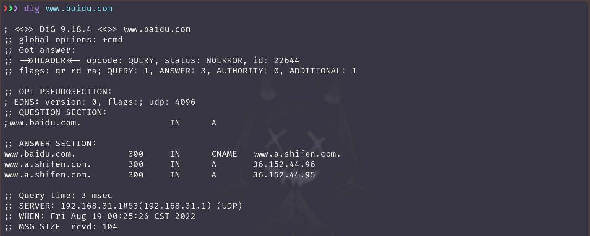
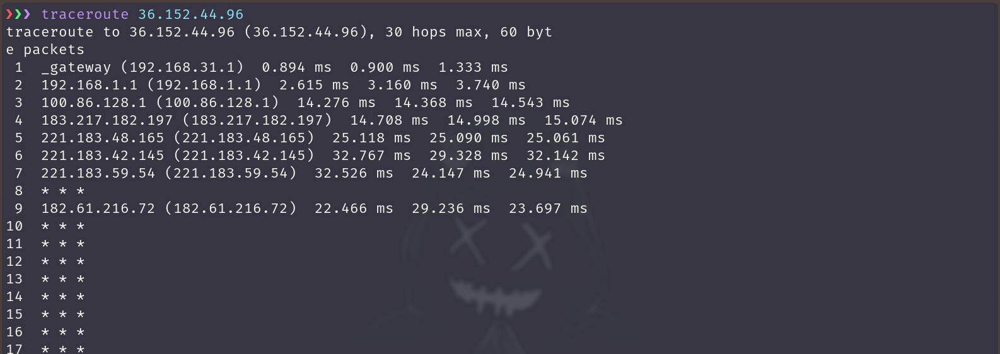
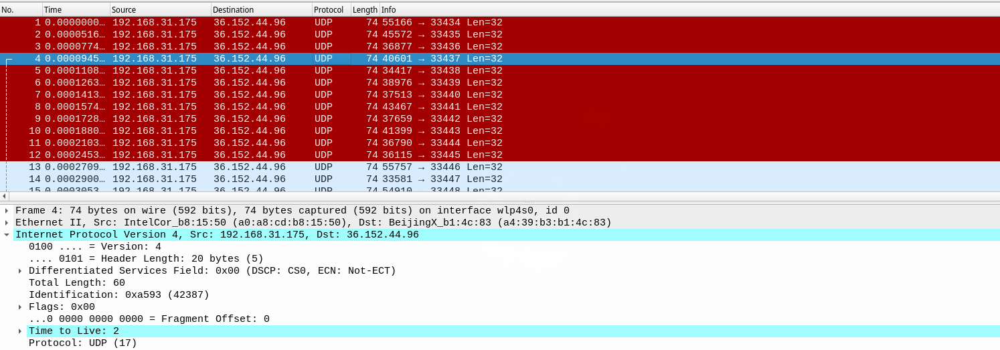
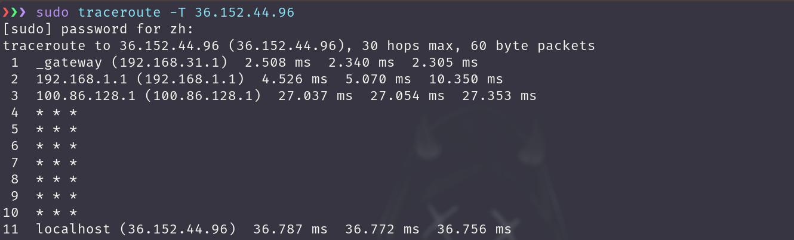
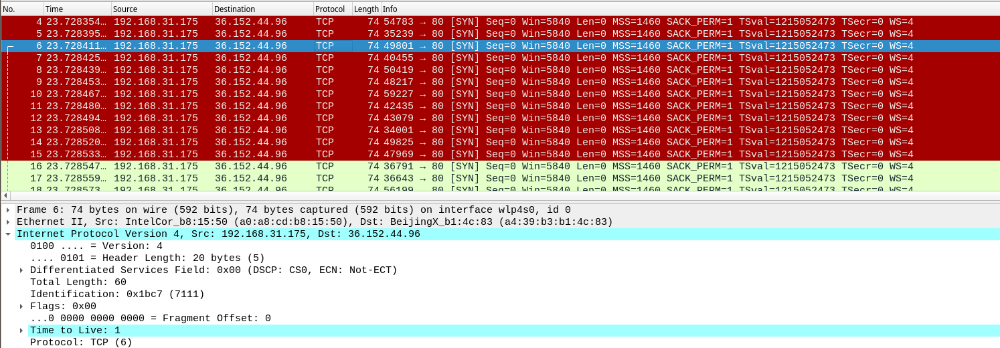
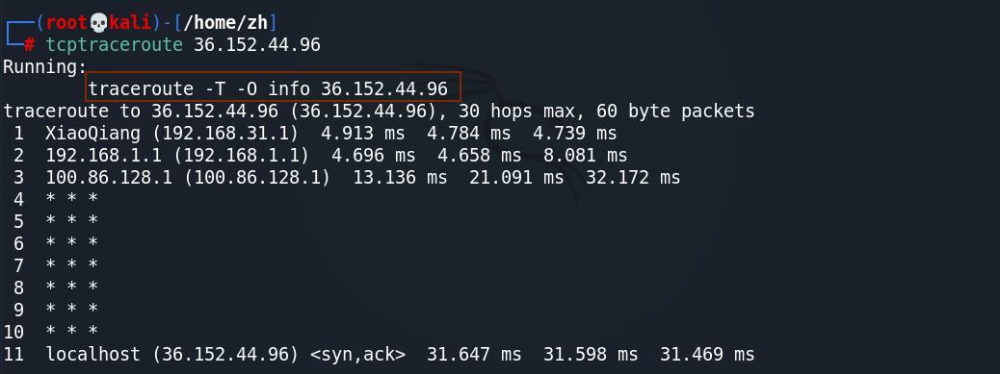
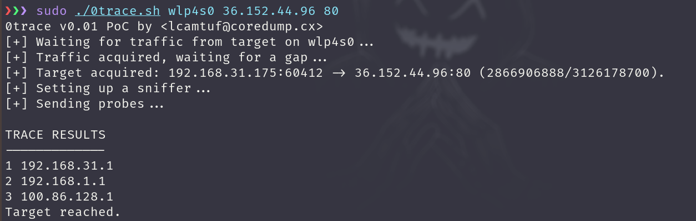
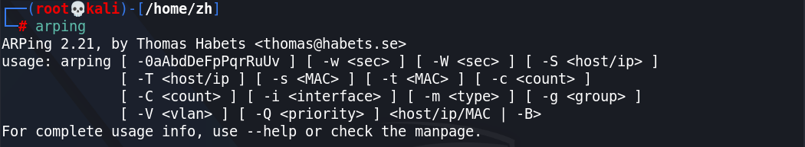

# Information Gathering

## 网络路径追踪

### `traceroute`

**渗透测试初期信息收集阶段**

通常用法:

+ **基于 ICMP 协议**
    + IP 头部 TTL 值递增，根据返回地址判断路径
+ 弊端
  + 路径设备禁用 ICMP 数据包时，探测无效

我们可以直接使用 `traceroute 域名` 这种方式来进行网络路径追踪.当然我们还用通过使用 IP 地址的方式。

我们先使用 `dig` 命令获得主机的域名解析记录，然后选择一条 主机 A 记录的 IP地址进行网络路径的追踪。

可以发现我们成功获得了一些有用的结果。 但也还是有很多网络结点并没有成功追踪到如第8跳，第10跳之后的都没成功

为验证其发包方式，我们使用 `wireshark` 对这条命令产生的数据包进行抓包。

我们可以发现，真的和我们预想的一样，每次探测都会发3个 `udp` 的包，然后 `TTL` 值递增 1.

### `tcptraceroute`

> `tcptraceroute` 内部实现本质上还是使用 `traceroute` 这个命令

+ **基于 TCP 协议的路径追踪**
    + `traceroute -T IP`
    + `tcptraceroute IP  # shell script`
+ 技术原理
  + 发送 TTL 值递增的 SYN 包
+ 弊端
  + 不建立完整的 TCP 握手，会被某些 NAT 设备丢弃包

`traceroute` 命令其实能支持很多种网络路径追踪的发包方式，我们可以通过增加 `-T` 选项来指定使用 TCP 协议来进行路径追踪。

我们可以发现，这个结果和上面单纯使用 `traceroute` 命令产生的结果完全不一样。

+ 其实并没有这么多路径结点（只有 11 个）
+ 前面结点的发现并没有单纯使用 `traceroute` 命令来追踪产生的效果好。

我们同样使用 `wireshark` 对其进行抓包，发现确实是使用 `tcp` 包进行网络追踪，而且也是 同一 TTL 值会发三次相同的包。

我们使用 `tcptraceroute` 命令进行追踪，发现其实现是使用 `traceroute -T -O info IP` .

### `0trace`

[what is 0trace | steps to use 0trace | how to install 0trace](https://devilzlinux.blogspot.com/2017/10/what-is-0trace-steps-to-use-0trace-how.html)

 `0trace` 命令其实是一个 shell 脚本，他会调用我们系统内别的命令来进行网络追踪。 

+ **基于正常会话的 TCP 协议路径跟踪**
  + `0trace iface IP Port`
+ 技术原理
  + 基于正常 TCP 会话发送 ACK 包
  + IP 头部 TTL 递增
+ 优势
  + 可能探测到内网地址段
  + 绕过某些防火墙限制

---
在进行网络路径追踪时，我们一定要 同时使用这三个工具进行追踪 ，因为这三个工具各具特色，能达到互补的效果。然后我们只需要将三种结果整合一下即可。

**而对于以下情况可能会导致我们上面的那些工具、方法无效** 
  + 目标防火墙丢弃所有出站 ICMP 数据包
  + 目标防火墙做 TTL 值重写或全包重写
  + 路径中存在应用层代理/负载均衡设备
  + 防火墙后没有明确的三层设备
  + IDP/IPS 容易检测到 TCP 特征

当我们运行这个命令时，可以发现它并没有获得我们想要的结果，那是因为这条命令需要等待我们与目标建立完整的 TCP 会话才行

所以我们要先使用浏览器访问一下该网站，然后 `0trace` 就能成功进行分析了。

> 可能访问之后，并不会立即返回结果，需要等待一段时间。

如果你使用域名的方式，访问要探测的主机，等了很久 `0trace` 还是没有给我们返回结果时，我们可以尝试使用与 `0trace` 命令后面的 IP 地址在浏览器上进行访问 

## SMB 密码破解

### `acccheck`

+ 密码破解工具
+ SMB 协议分析工具
	+ TCP445端口
	+ MS08-067
	+ WannaCry

原理

尝试连接目标默认共享
+ `IPC$`
+ `ADMIN$`

命令参数
+ `t/T`
+ `u/U`  
+ `p/P`
+ `-v`

<!-- TODO:  <19-08-22,演示 > -->

## 二层主机发现
### `arping`
**原理**

ARP 协议解析 IP 地址到 MAC 地址的对应关系

arping 发送 ARP 探测包

神奇的安装

+ Kali 默认安装了个阉割版
  + 只有基本功能
+ 手动安装
  + `sudo apt-get install arping`
  + 前后对比
+ ARP 缓存
  + `cat /proc/sys/net/ipv4/neigh/default/gc_stale_time`
  + `ip link set arp off dev eth0`
  + `ip link set arp on dev eth0`

查看 arp 缓存时间，默认单位为秒

原理

+ 默认每秒发送一个请求
+ `-i` 指定发包网卡
+ 加快扫描速度
  + `-w` 发包间隔微秒
  + `-W` 浮点数秒
+ 限定发包数量 `-c`

+ 名称、IP、MAC
  + `-0` 来源IP `0.0.0.0`
  + `-b` 来源IP `255.255.255.255`
  + `-s` 设定来源 MAC
  + `-S` 设定来源 IP
+ `-P` 发 ARP reply
+ ARP 地址欺骗
+ 检测地址冲突

<!-- TODO:  <19-08-22,演示 > -->

## 开源信息收集
### ~~`automater`~~

+ **这款工具至今已经好几年没更新了**
+ 这个软件使用 python2,并且在 最新版本的 Kali Linux 上并没有预装这款工具了 
+ 而且使用的都是国外网站的域名，所以我们几乎不能使用该软件

当然我们还是可以安装 [Install Guide](http://www.tekdefense.com/automater/) 并试着使用它。

**下面还是对它做一个基本的介绍，和使用**  

+ OSINT 开源智能
  + 公开渠道可获得的信息
+ 渗透测试者
  + IP，域名，邮件地址，图片，公司地址，个人信息，电话...
+ 事件调查
  + 可疑IP，URL,文件HASH
  + 开源的信息公布平台（VT等）
+ 基于 Python 语言开发

---

+ 信息查询开源
  + `/usr/share/automater/tekdefence.xml` 老版本 kali linux 默认路径
  + ~~`/usr/share/automater/sites.xml`~~ 早以被遗弃
+ SSL 证书报错
  + `pip install certifi`
  + `sudo pip install requests==2.7.0`

我们可以自己写一个威胁分析的软件，并且可以尝试扩展定制添加国内资源

## SNMP 信息收集
### braa