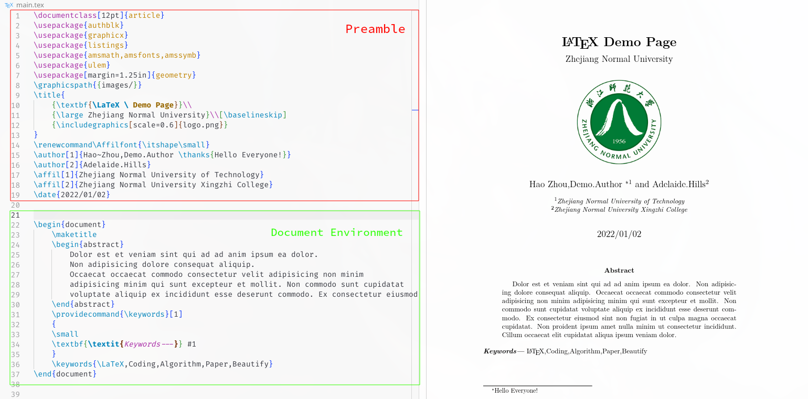

## 学习使用 LaTeX

### 简介
[LaTex 介绍文档](https://github.com/CTeX-org/lshort-zh-cn) 

想编写LaTex 文档我们有很多方式，如使用在线网站编辑器如 [Overleaf](https://www.overleaf.com),或者自己下载 LaTex的编译器,自己编译

常见的编译器引擎有 `xelatex,pdflatex`


在 LaTex 中一般分为两个部分
+ Preamble(前言) 
+ Document Environment(文档环境)



#### Preamble

在 Preamble 中我们首先需要指定文档类型,可以使用 `\documentclass{}` 命令来指定

命令中括号内填写编码格式,花括号里面填写文章的类型,如下：

```latex
\documentclass[UTF8]{artical}
\documentclass[UTF8]{book}
\documentclass[UTF8]{report}
\documentclass[UTF8]{beamer}
```
+ `artical` 代表普通文章类型
+ `book` 代表书籍类型
+ `report` 代表报告类型
+ `beamer` 代表幻灯片类型

在 Preamble 我们还可以指定我们需要使用什么包(可以提供额外的 LaTex 命令,从而实现更强大的功能),使用 `\usepackage{}` 命令来指定
```latex
\usepackage[margin=1.25in]{geometry}
\usepackage{amsmath,amssymb,amsfonts}
\usepackage{graphicx}
```
+ `geometry` 这个包可以指定文档的布局样式如页边距等数值
+ `amsmath,amssymb,amsfonts` 这三个包包含了大量的数学符号，数学公式的支持
+ `graphicx` 可以帮助我们导入图片


#### Document Env

文档环境我们可以使用以下方式来创建,在文档环境内我们可以使用很多 Latex 命令来帮助我们进行排版和设计。

如我们可以使用 `\includegraphics` 来引用图片

```latex
\begin{document}
    \begin{center}
        {\Huge Big Centered Text}
    \end{center}
	Long Paragraph Contents
	\begin{center}
        \includegraphics*[width=0.4\linewidth]{binutils.png}
    \end{center}
\end{document}
```


### 文本控制
Basic Text Manipulation

首先我们需要了解的就是文档整个的文本字体大小
这个我们可以在 Preamble 中通过指定 `\documentclass[option]{article}` 里的 `option` 来指定默认字体大小

```latex
\documentclass[10pt]{article} %% 默认文档字体是 10pt 大小
\documentclass[11pt]{article}
\documentclass[12pt]{article}
```

我们也可以通过命令来更改文本字体大小如 `\large`

这样会将后面的文字的样式都发生改变

```latex
Normal size text \LARGE LARGE text
```

我们可以使用以下方式来改变特定的几个字的样式。
```latex
Normal size text \LARGE{LARGE} text
```

其它字体大小相关的包有 `extsizes,anyfontsize`


### 字体样式


+ 设置粗体为 `\textbf{}`
	+ `bf` 为 `bold font` 的缩写
+ 设置斜体为 `\textit{}`
	+ `it` 为 `italic` 的缩写
+ 设置下划线为 `\underline{}`


```tex
\textbf{}
\textit{}
\underline{}
```
> 默认的 `\underline{}` 样式对长段落的支持并不太好,我们可以使用 `ulem` 来解决这个问题

并且我们可以使用 `ulem` 这个包来获得更多的下划线样式

```latex
\usepackage{ulem}
\uline
\uuline
\uwave
```

我们可以使用 `\emph` 来强调某些字,它会根据前面包裹的样式来选择使用什么样式

```latex
\emph{Emphasis} 
```

设置字体：

```latex
\textrm %% 默认的罗马字体
\textsf %% Sans Serif 字体
\texttt %% Typewriter 字体 (等宽)
```


我们可以使用 `\maketitle` 来将上面定义好的标题给显示出来

```latex
\documentclass[UTF8]{article}
\title{First glance of LaTex}
\author{ZhouHaoBusy}
\date{2022.6.26}

\begin{document}
\maketitle
this is my first \LaTeX() page,
hope it can help you to study \LaTeX()
   
\end{document}
```

**可以中文和英文混用的格式**
```tex
\documentclass[UTF8]{ctexart}
```
> 新产生一个段落需要两个换行符来实现,一个换行符只会生成一个空格


我们可以使用以下方式来居中段落
```latex
\begin{center}
Contents
\end{center}
```
我们也可以使用以下方式来向左向右对齐文本
```latex
\begin{flushleft}
\end{flushleft}

\begin{flushright}
\end{flushright}
```


我们可以使用以下方式来进行换行

```
This is a line of text. \\
This is another line of text. \\[\baselineskip]
This is yet another line of text. \\[2\baselineskip]
```
段落我们可以使用 `\noindent` 来指定该段落不缩进
一个空行就代表一个新的段落

我们可以通过以下命令来指定缩进的长度

```latex
\setlength{\parindent}{1cm}
\setlength{\parindent}{15pt}
```


开启一个新的章节 花括号内代表章节名字

```tex
\section{}
\subsection{}
\subsubsection{}
```
> 我们可以使用空行(换行) 或者 `\par` 命令来实现多个段落的分割

如果是书籍排版等需要生成比 section 更大的排版我们可以使用 `\chapter{}` 通常来表示书籍的第几章

```tex
\chapter{}
```

比`\chapter{}` 还要的的还有 `\part{}` 通常来表示书籍中的第几部分

如果我们需要在文档中添加图片我们需要引入 `graphicx` 包 然后使用 `\includegraphics{}`花括号内填入图片名称 可以省略掉后面的 png 扩展名


```tex
\usepackage{graphicx}
\includegraphics{head}
```

`textwidth` 代表当前文本区域的宽度

```tex
\includegraphics[width=0.5\textwidth]{head}

```

如果我们需要给图片添加一个标题

我们可以先将图片嵌套在一个 `figure` 环境(标签)中

+ 使用 `\caption` 来设置图片标题
+ 使用 `\centering`来将图片居中显示

```tex
\begin{figure}
\centering
\includegraphics[width=0.5\textwidth]{head}
\caption{This is a simple title}
\end{figure}
```

```latex
\usepackage{subcaption}

\begin{figure}[h]
\begin{subfigure}{0.5\textwidth}
\end{subfigure}
\begin{subfigure}{0.5\textwidth}
\end{subfigure}
\end{figure}
```

`wrapfig`包提供了一个有用的功能，即可以让文字浮动在图片周围

```latex
\begin{wrapfigure}{l}{0.25\textwidth}
\includegraphics[width=0.9\linewidth]{lion-logo} 
\end{wrapfigure}
```

列表
要使用列表我们需要先切换到列表的环境
`environment` 
> `environment` 是 LaTeX 中的一个专用术语,它就像编程语言里面的作用域


任何介于 `\begin{}` 和 `\end{}` 之间的内容都属于同一环境,位于同一环境中的内容将会共享相同的文字格式

对于无序列表的创建我们可以使用 `itemize` 环境
列表中的每个元素都需要以 `\item` 开头

对于有序列表(也就是前面带编号的列表) 我们则可以使用 `enumerate` 环境 与无序列表相同，列表中的元素同样需要以 `\item` 开头


数学公式

行内公式需要写在两个美元符号之间 `$...$`

如这段代码`$E=mc^2$` 将会生成爱因斯坦的质能方程
$E=mc^2$


如果我们希望将公式写在单独的一行我们则可以使用 `equation` 这个环境

`equation` 这个环境我们可以简写成 `\[E=mc^2\]`

对于复杂的公式我们需要单独记忆这些表达式

如 `\over` 代表几分之几

```tex
\begin{equation}
d={k \varphi(n)+1} \over e
\end{equation}
```

[在线 LaTeX 公式编辑器](https://latex.codecogs.com/eqneditor/editor.php) 

表格

创建表格我们有两种方式
+ `Table` 环境
	+ 一般用在学术论文里，会创建有标签的表格如 `Table 1.1`
+ `Tabular` 环境
	+ 通常的表格环境

```latex
\begin{tabular}{l|c|r}
	1 & 2 & 3\\
	1 & 2 & 3
\end{tabular}
```

```latex
    \begin{table}
        \caption{Table Title}
        \begin{tabular}{l|c|r}
			\hline
            1 & 2 & 3\\
            1 & 2 & 3
        \end{tabular}
    \end{table}
```


我们可以使用 tabular 环境在当前位置创建一个表格

+ `c` 代表 `centering` 居中
+ `l` 代表 `left` 向左对齐
+ `r` 代表 `right` 向右对齐


```tex
\begin{tabular}{c c c}
Cell1 & Cell2 & Cell3 \\
Cell4 & Cell5 & Cell6 \\
Cell7 & Cell8 & Cell9
\end{tabular}
```
我们可以使用 `\hline` 来添加横线 在上面 `tabular` 后面那个花括号添加`|` 来添加竖线 并还可以通过 `p{2cm}` 来指定单列长度 `p` 代表 `paragraph`是一种允许设置列宽的列格式

我们也可以使用 `hhline` 这个包来获得更多表格样式的支持

```latex
\usepackage{hhline}
\hhline{commands}
```
```latex
\hhline{|-~|=|}
```

### 设置表格宽度

```latex
\begin{tabular}{|C{4cm}|}
\hline
This is much text is no longer problematic \\
\hline
\end{tabular}
```
<++>

我们还有更多的表格包，来实现更强大的功能

```latex
\usepackage{booktabs}
\usepackage{tabularx}
\usepackage{colortbl}
\usepackage{longtable}
```


我们可以使用以下命令来查看表格相关文档
```bash
texdoc booktab
texdoc longtab
texdoc tabu
```


```latex
\usepackage{mathdots}
\iddots
```


### 合并表格

```latex
\usepackage{multirow}
```
<++>

```tex
\begin{document}
\begin{tabular}{|p{2cm}|c|c|}
\hline \hline
Cell1 & Cell2 & Cell3 \\
\hline
Cell4 & Cell5 & Cell6 \\
\hline
Cell7 & Cell8 & Cell9 \\
\hline
\end{tabular}
\end{document}
```

如果我们需要给表格添加一个标题
我们可以先将整个表格放在一个 `table` 环境里随后我们可以通过 `\caption{}` 命令指定表格的标题并通过 `\center` 


我们可以使用以下命令来插入图片
```latex
\usepackage{graphicx}
\graphicspath{{images/}}
\includegraphics[scale=0.5]{logo.png}
\includegraphics[angle=45,width=0.5\textwidth]{logo.png}
```


## 排版

```latex
\hspace{1cm}
\vspace{1cm}
```


小样式的大写字母
```latex
\textsc{}
```


`\fbox{}` 一般用在文本上,`\boxed` 一般用在数学公式或者图片上
```latex
\fbox{}
\boxed{}
```

```latex
\hrulefill %% 创建一条实线填充一行
\dotfill  %% 创建一条虚线(点) 填充一行
```

```latex
\rule{width}{thickness}
```

```latex
    \begin{tabular}{|c|c|c|}
        \hline
        Very Long Text & Very Long Text & Very Long Text \\
        \hline
        \multicolumn{2}{|c|}{Center Merged} \\
        \hline
        Text & \multicolumn{1}{|l|}{Left Aligned Merged}\\
        \hline
    \end{tabular}\\

    \vspace{0cm}
    \begin{tabular}{|c|c|}
        \hline
        \multirow{1}{*}{Row Merge} & Text \\
        & Text \\
        \hline
    \end{tabular}\\
```

### 标准标题

```latex
\title{Everything You Need to Know}
\author{ZhouHaoBusy}
\date{February 30}
```


```latex
\usepackage{tocloft}
\tableofcontents
```
<++>


### 超链接
```latex
\usepackage{hyperref}
\hyperref[label](link text)
\ref
\ref*{}
\href{url}{text}
```

```latex
\input{}
\include{}
```


这边使用论文排版进行演示
作者单位
使用`\author`即可注明作者，但是对于大部分的期刊而言，单位等格式都已经指定了固定格式，这里我们使用最简单的`authblk`包作为示例,`\usepackage{authblk}`，需要注意的是，作者信息也是作为题目的一部分，故而，我们需要在，此外，如果需要对作者进行标注（如邮箱或者通讯作者，在作者后增加`\thanks`命令即可）：


所以封面我们可以使用以下方式来进行展示

```latex
\documentclass[12pt]{article}
\usepackage{authblk}
\usepackage{graphicx}
\graphicspath{{images/}}
\title{
    {\textbf{\LaTeX \ Demo Page}}\\
    {\large Zhejiang Normal University}\\
    {\ }\\ 
    {\includegraphics[scale=0.6]{logo.png}}
}
\renewcommand\Affilfont{\itshape\small}
\author[1]{Hao~Zhou, Demo.Author \thanks{Hello Everyone!}}
\author[2]{Adelaide.Hills}
\affil[1]{Zhejiang Normal University of Technology}
\affil[2]{Zhejiang Normal University Xingzhi College}	
\date{2022/01/02}

\begin{document}

    \maketitle
\end{document}
```


## 数学符号展示

一般我们要包含这几个包
```latex
usepackage{amsmath,amsfonts}
```


```latex 
\begin{align*}
f(x) & = 
\end{align*}
```

我们可以使用`\mathbb{}` 来设置双线大写字母
我们可以使用 `\text{}` 命令在Math Mode 里插入文本


代码片段

```latex
\lstset{frameround=fttt}
\begin{lstlisting}[frame=trBL]
	import numpy
	print("Hello World")
\end{lstlisting}
```


[Arch Wiki 官方手册](https://wiki.archlinux.org/title/TeX_Live#Installation) 

修复 tlmgr 的bug
```bash
# 将下面这段加入到自己.bashrc/.zshrc 等终端初始化文件中

alias tlmgr='TEXMFDIST/scripts/texlive/tlmgr.pl --usermode'
# Arch 默认为 : /usr/share/texmf-dist
alias tlmgr='/usr/share/texmf-dist/scripts/texlive/tlmgr.pl --usermode'

```

并修改 `tlmgr.pl` 文件
将 `$Master = "$Master/../..";` 替换成 `$Master = "${Master}/../../..";`


```bash
# 添加阿里云镜像
tlmgr option repository https://mirrors.aliyun.com/CTAN/systems/texlive/tlnet
```

```bash
tlmgr install ctex
```

