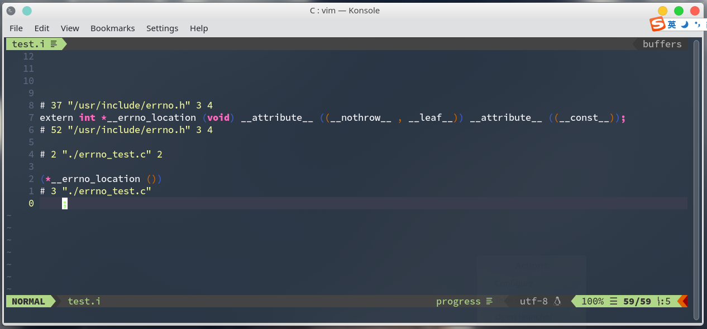
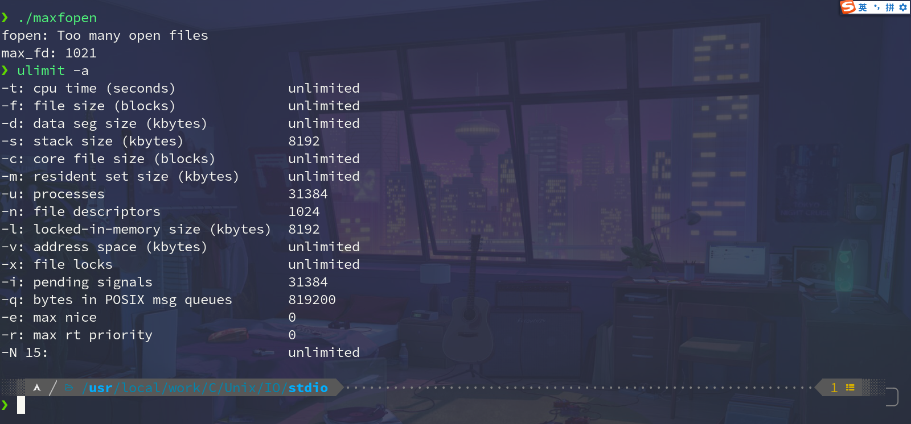
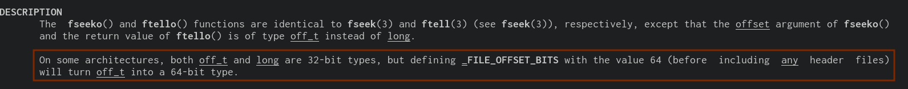
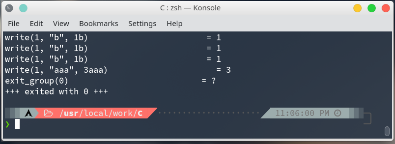
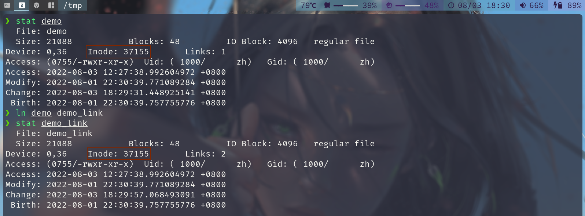
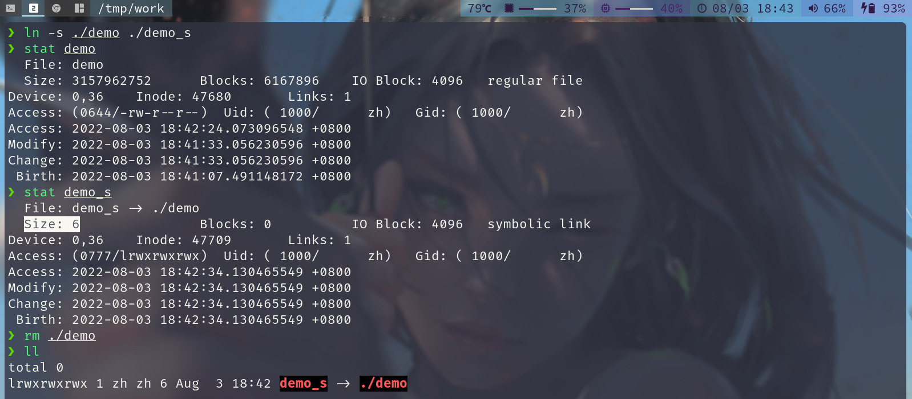
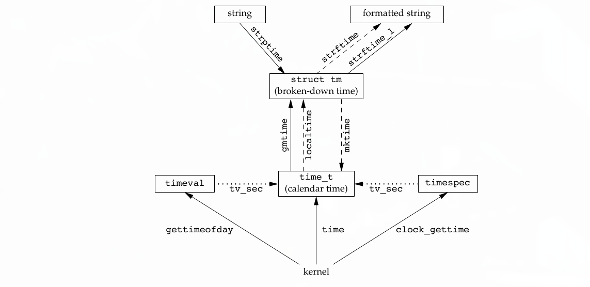
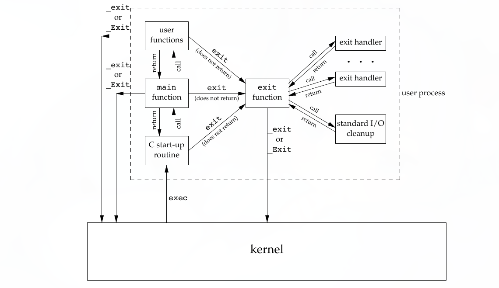

# Linux_C 系统开发学习笔记 

学习Unix环境编程,一定要学会使用man来查看帮助文档。

man 的基本使用:
+ 查看标准库函数 `man 3 fopen`
+ 查看系统调用 `man 2 read`
+ 查看机制   `man 7 tcp man 7 socket man epoll`

## IO

> I/O ：input & output,是一切实现的基础

+ stdio:标准IO(优先使用标准IO)
+ sysio:系统调用IO(文件IO)


<font color="red" face=Monaco size=3>标准IO — 效率高  </font>

<font color="red" face=Monaco size=3>系统调用： 内核向用户层提供的一个接口（API ），让用户层能访问到内核所管理的内容 — 实时的  </font>


关于 IO 操作相关的 API

```c
fopen();
fclose();
fgetc();
fputc();
fgets();
fputs();
fread();
fwrite();
printf();
scanf();
fseek();
ftell();
rewind();
fflush();
```


### 标准IO

**stdio: FILE 类型贯穿始终**

<font color="red" face=Monaco size=3>关于Unix 环境编程的报错机制  </font>

在使用 errno 等系统库函数时，一定要包含对应的头文件，否则会出现，难以预料的 bug！

> 如果没有函数原型，编译器默认会把所以函数的返回值都当做返回int 类型来对待。


而很多人忘包含头文件（a行代码）而使用 b行代码来掩盖问题 如下代码片段

因为没有 `malloc` 函数原型，编译器会认为其返回值为 int 类型，而接收其返回值的确是 一个 int 类型的指针，故会报一个警告，而有时我们会去除这个警告而使用强制转换来掩盖真实的问题！(现在的gcc编译器版本能察觉出问题所在)

```c
#include <stdio.h>
//a #include <stdlib.h>
int main(){
	int *p = malloc(sizeof(int));
	//b int *p = (int *)malloc(sizeof(int));
	return 0;
}
```

```c
// vim /usr/include/asm-generic/errno-base.h
// errno 以前errno是一个全局变量，现在errno是一个宏
#include <errno.h>
errno;
```
对其进行预编译后查看发现文件里没有 `errno` 这个变量
,所以可以认定`errno` 不是一个变量而是一个宏 (私有化数据)

<font color="red" face=Monaco size=3>编译指令：  </font>
`gcc -E errno_test.c -o test.i`




`strerror()` 将 `errorno` 以提示信息输出(格式化)


```c
// perror(); print a system error message 

// strerror(errno); return string describing error number
// @return: char* so we must include string.h
#include <stdio.h>
#include <stdlib.h>
#include <errno.h>
#include <string.h>
int main(){
    FILE *fp = NULL;
    fp = fopen("empty","read"); 
    if (fp == NULL) {
        // fprintf(stderr,"fopen() failed! errno = %d\n",errno )
        // perror("fopen()");
        fprintf(stderr,"fopen() failed : %s\n",strerror(errno));
        exit(1);
    }
    puts("OK! open the file successful!");
    fclose(fp);
    exit(0);
}

```


<font color="red" face=Monaco size=3>追加属性 （writing at end of file）一定是在文件最后一个有效字节的下一个位置  </font>


看到有 `fclose();` 这个函数,我们可以知道返回的 `FILE *` 类型的变量是在堆上的

有开启和释放成对操作都是在堆上，而没有成对操作的可能在堆上，也可能在静态区

+ 如果在栈上，不能返回局部变量的地址,当fopen()函数调用结束，局部变量都被释放掉了
+ 静态区里共用同一块空间，所以如果在静态区，那么后一次使用的 fopen() 会把上一次使用的fopen()的结果覆盖


---
> 查看系统的一个进程默认能同时打开多少个文件

```c
#include <stdio.h>
#include <stdlib.h>
int main() {
  FILE *fp = NULL;
  int max_fd = 0;
  while (1) {
    fp = fopen("/dev/null", "r");
    if (fp == NULL) {
      perror("fopen");
      break;
    }
    max_fd += 1;
  }
  printf("max_fd: %d\n", max_fd);
  exit(0);
}

```

其实每个进程最大打开文件数是有限的 我们可以使用 `ulimit -a` 来查看。

而默认最大文件打开数为1021

 
 

因为每个进程默认都会打开标准输入、标准输出、标准错误输出，占用了0、1、2。在c语言的标准库`unistd.h`中定义，代码如下：

```c
/* Standard file descriptors.  */
#define	STDIN_FILENO	0	/* Standard input.  */
#define	STDOUT_FILENO	1	/* Standard output.  */
#define	STDERR_FILENO	2	/* Standard error output.  */
```

权限
> 查看系统中umask的值: 可以使用 umask 命令

```python
oct(0o666 & (~umask))
```
所以 umask 值越大,默认创建出来的文件权限就越低


```c
getchar()  is equivalent to getc(stdin)
putchar(c) is equivalent to putc(c,stdout)
getc() is equivalent to fgetc()
putc() is equivalent to fputc()
```

---
> 使用标准IO实现一个简单的cp命令

```c
// char 型变量有无符号类型，任何标准C中都没有定义
#include <stdio.h>
#include <stdlib.h>
int main(int argc, char *argv[]) {
  if (argc <= 2) {
    printf("Usage: %s <file1> <file2>\n", argv[0]);
    exit(1);
  }
  FILE *src, *dst = NULL;
  int c; // don't use char

  src = fopen(argv[1], "r");
  if (src == NULL) {
    fprintf(stderr, "Error opening file %s\n", argv[1]);
    exit(1);
  }

  dst = fopen(argv[2], "w");
  if (dst == NULL) {
    fclose(src);
    fprintf(stderr, "Error opening file %s\n", argv[2]);
    exit(1);
  }
  while (1) {
    c = fgetc(src);
    if (c == EOF)
      break;
    fputc(c, dst);
  }
  fclose(dst);
  fclose(src);
  fprintf(stdout, "Copy Successful\n");
  exit(0);
}

```

> gets() 函数有缓冲区溢出漏洞
```c
#define SIZE 5
char buf[SIZE];
fgets(buf,SIZE,stream);
// 如果有一个文件内容为 abcd 需要读两次
// 1. --> a b c d '\0'
// 2. --> '\n' '\0'
```

`fgets(buf，size，stream)` 函数读取有两种情况

1. 读取到 `size - 1` 个字节 (最后一个字节留给尾零的)
2. 读到换行符 `'\n'`

```c
fgets()
```

```c
// 1. 数据量足够
// 2. 只有五个字节
fread(buffer,1,10,fp);
// 1 -> 10 -> 10字节
// 2 -> 5  -> 5字节

fread(buffer,10,1,fp);
// 1 -> 1 -> 10字节
// 2 -> 0 -> ??? 所以保险起见最好使用上面这种，单字节读取
```


> atoi / sprintf 函数的基本使用
```c

#include <stdio.h>
#include <stdlib.h>

int main() {
  char str[] = "123a45";
  printf("%d\n", atoi(str)); // the output is 123
  int year = 2022, month = 1, day = 13;
  char buf[1024];
  sprintf(buf, "%d-%d-%d", year, month, day); // the same as itoa
  // use snprintf will fine
  puts(buf);
  exit(0);
}

```

### 文件位置指针

+ `fseek();`
+ `ftell();`
+ `rewind();`

关于文件位置指针的三个宏
```c
SEEK_SET // 文件开始处
SEEK_CUR // 当前文件位置
SEEK_END // 文件尾

rewind() == (void) fseek(stream,0L,SEEK_SET)
// 将文件位置指针调到文件首
```

> 空洞文件: ASCII 码全为0的文件

<font color="red" face=Monaco size=3> 迅雷，等下载器下载文件时，刚开始时很快产生了一个磁盘占用和需下载的文件完全一样的文件 </font>

 
`fseeko` `ftello` 用来解决偏移量不够的问题但不是标准的C函数

```make
CFLAGS+=-D_FILE_OFFSET_BITS=64
```



默认的标准输出是行缓冲模式

`stdout` 默认会遇见换行 `\n` 才会刷新缓冲区

```c
#include <stdio.h>
#include <stdlib.h> 

int main(){

	printf("Before while death loop!");
	// fflush(stdout);
	while(1);
	printf("After while death loop");
	// if you not use fflush then you will see nothing output in the terminal!
	// fflush(NULL);
}
```

但我们可以使用 `fflush` 来刷新缓冲区


> 缓冲区的作用：合并系统调用

+ 行缓冲：换行时候刷新，满了的时候刷新，强制刷新 (标准输出就是这样)
+ 全缓冲：满了的时候刷新，强制刷新 (默认，只要不是终端设备 标准输出是这样，是因为他是终端设备)
+ 无缓冲：需要立即输出的内容如 `stderr`

当然我们可以使用 `setvbuf()` 来修改缓冲模式,但一般不建议修改缓冲模式


完整地获取一行 

```makefile
CFLAGS+=-D_GNU_SOURCE
```
但 `getline` 只遵守 `POSIX.1-2008` 故我们有必要在实际生产环境中自己封装实现 `getline` 这种函数的小功能

```c
Both getline() and getdelim() were originally GNU extensions. 
They were standardized in POSIX.1-2008. 
```


<font color="red" face=Monaco size=3> 临时文件的一些问题： </font>

1. 如何创建临时文件不冲突
2. 如何才能及时销毁 

`tmpnam`( 获取一个临时文件名 ): 不能将获取临时文件名并创建文件合并为一个原子操作

`tmpfile`( 创建一个临时(匿名)文件 ): 
**匿名文件：在磁盘上看不见，只获得了一个 `FILE *` `ls -a` 并不能查看匿名文件**

<font color="gray" face=Monaco size=3> 一个文件如果说没有任何的硬链接指向它，而当前文件的打开计数又已经成为 0 值，那么这块数据就会被操作系统释放 </font>


### 系统调用IO

> `fd (file descriptors)` 文件描述符是在系统调用IO中贯穿始终的类型


文件描述符的概念: <font color="green" face=Monaco size=3> (是一个整形数，数组下标 文件描述符优先使用当前可用范围内最小的) </font>

文件IO的操作相关函数：`open,close,read,write,lseek`

文件IO与标准IO的区别

+ <font color="red" face=Monaco size=3> 文件IO的响应速度快</font>
+ 而标准IO的吞吐量大


**标准IO与系统调用IO不可混用** (标准IO有缓冲机制,每次操作的文件指针位置不好确定是否进行了修改)


```c
#include <stdio.h>
#include <stdlib.h>
#include <unistd.h>

int main(){
	putchar('a');
	write(1,"b",1);
	putchar('a');
	write(1,"b",1);
	putchar('a');
	write(1,"b",1);
	exit(0); // The output is bbbaaa
}
```
使用 `strace` 查看其系统调用后，可发现先会调用三个系统调用，3个标准IO操作会先将数据放入缓冲区，然后执行一条系统调用。


---

系统IO与标准IO的相互转换:

+ 标准IO转换成系统调用IO的函数 ： `fileno`
+ 系统调用IO转换成标准IO的函数 ：`fdopen`


IO的效率问题

+ 文件共享: 多个任务共同操作一个文件，或者协同完成任务
+ 原子操作: 不可分割的操作
	+ 作用：解决竞争和冲突如 `tmpnam`
+ 程序中的重定向：
	+ `dup`
	+ `dup2` 
+ 同步：
	+ `sync,fsync,fdatasync`
+ 硬件相关的函数
	+ `fcntl();`
	+ `ioctl();`

`/dev/fd/目录` 虚目录 显示当前进程的文件描述符（谁看就是谁）


需要有宏观编程的思想，
1. 不要有内存泄露
2. 不要有写越界的现象
3. 永远不要当做自己在写 main函数 而要把自己当成在写模块，尽量保证在调用这个模块前和调用模块后的环境保持一致.
 


---

> 写的加速机制，写的缓冲区 `buffer` 读的加速机制，读的缓冲区 `cache`


`r   ->  O_RDONLY`

`r+  ->  O_RDWR`

`w   -> O_WRONLY|O_CREAT|O_TRUNC`

`w+  -> O_RDWR|O_CREAT|O_TRUNC`

> 如何区别一个函数是变参函数实现还是函数重载实现？

在调用这个函数时，自己构造出超过函数原型的参数个数，然后进行编译，如果编译没有出错或者只是给了个警告，那就是由变参函数实现的。

使用系统调用IO 来实现 copy 命令

```c
#include <fcntl.h>
#include <stdio.h>
#include <stdlib.h>
#include <unistd.h>
#define BUFSIZE 1024
int main(int argc, char *argv[]) {
  int sfd, dfd;
  char buf[BUFSIZE]; // declare the buffer for read and write
  int length;        // the real read length
  int ret, pos;
  if (argc < 3) {
    fprintf(stderr, "Usage:....\n");
    exit(1);
  }

  sfd = open(argv[1], O_RDONLY);
  if (sfd < 0) {
    perror("open()");
    exit(1);
  }
  dfd = open(argv[2], O_WRONLY | O_TRUNC | O_CREAT, 0600);

  if (dfd < 0) {
    close(sfd);
    perror("Open()");
    exit(1);
  }

  while (1) {
    length = read(sfd, buf, BUFSIZE);
    if (length < 0) {
      perror("read()");
      break;
    }
    if (length == 0)
      break;
    pos = 0; // initialization the tmp position

    while (length > 0) // Insist on writing enough n bytes
    {
      ret = write(dfd, buf + pos, length);
      if (ret < 0) {
        perror("write()");
        exit(1); // will generate memory leak (close())
      }
      pos += ret;
      length -= ret;
    }
  }
  close(dfd);
  close(sfd);
  exit(0);
}
```
为什么不坚持读够 len个字节，因为设备上不一定有 1024 个字节.


- [x] 判断 BUFSIZE 大小对性能的影响


- [X] 写程序删除一个文件的第10行

补充函数： `man 2 truncate` 

```c

                  
```


```c
#include <fcntl.h>
#include <stdio.h>
#include <stdlib.h>
#include <unistd.h>

#define FNAME "/tmp/out"
int main() {

  int fd = open(FNAME, O_WRONLY | O_TRUNC | O_CREAT, 0600);
  if (fd < 0) {
    perror("open()");
  }
  dup2(fd, 1); // 相当于 close(1);  dup(fd);的原子操作;

  if (fd != 1)
    close(fd);
  //-------------------------------
  puts("Hello World");

  // there need to recovery the stdout
}
```

`sync,fsync` 刷新数据

`fdatasync` 只刷数据不刷新亚数据 
 <font color="red" face=Monaco size=3> 亚数据：(文件修改时间，文件属性...) </font>

`fcntl` 管理文件描述符 (文件描述符所变的魔术几乎都来源于该函数)


`ioctl` 设备相关内容


## 文件系统

类似 ls 的实现

### 目录和文件

#### 获取文件属性

有一个命令 `stat` 是用`stat`封装出来的


+ `stat` : **通过文件路径获取属性**， 面对符号链接文件时获取的是所指向的目标文件
+ `fstat`: **通过文件描述符获取属性**
+ `lstat`: **通过文件路径获取属性**，面对符号链接文件时获取的是符号链接文件的属性


```c
#include <stdio.h>
#include <stdlib.h>
#include <string.h>
#include <sys/stat.h>
static off_t flen(const char *fname) {

  struct stat statres;
  int resp = stat(fname, &statres);
  if (resp < 0) {
    perror("stat()");
    exit(1);
  }
  return statres.st_size;
}

int main(int argc, char **argv) {

  if (argc < 2) {
    fprintf(stderr, "Usage.....\n");
  }
  printf("The length of %s is %ld", argv[1], flen(argv[1]));
}
```

七种文件属性 `dcb-lsp`
+ `d` - directory 目录文件
+ `c` - character 字符设备文件
+ `b` - block 块设备文件
+ `-` - regular 普通文件
+ `l` - link 符号链接文件
+ `s` - socket 网络套接字文件
+ `p` - pipe 命名管道文件

---

`man inode` 查看关于目录的内容


**获取文件属性**

```c
#include <stdio.h>
#include <stdlib.h>
#include <sys/stat.h>

static int ftype(const char *filepath) {
  struct stat statres;
  int res = stat(filepath, &statres);
  if (res < 0) {
    perror("stat()");
    exit(1);
  }
  if (S_ISREG(statres.st_mode))
    return '-';
  else if (S_ISDIR(statres.st_mode))
    return 'd';
  else if (S_ISSOCK(statres.st_mode))
    return 's';
  else if (S_ISLNK(statres.st_mode))
    return 'l';
  else if (S_ISCHR(statres.st_mode))
    return 'c';
  else if (S_ISBLK(statres.st_mode))
    return 'b';
  else if (S_ISFIFO(statres.st_mode))
    return 'p';
  else
    return '?';
}

int main(int argc, char **argv) {
  if (argc < 2) {
    fprintf(stderr, "Usage...\n");
    exit(1);
  }
  int res = ftype(argv[1]);
  printf("The file's type is: %c\n", res);
  exit(0);
}
```

#### 文件访问权限

`st_mode` 是一个16位的位图，用于表示文件类型，文件访问权限，及特殊权限位


#### umask 


umask

> 主要作用：防止产生权限过松的文件


在shell命令中可以使用 `umask` 来获取 `umask` 的值

`umask 0002` 将umask的值修改为 `0002`

> 查看系统中umask的值: 可以使用 umask 命令

```python
oct(0o666 & (~umask))
```
所以 umask 值越大,默认创建出来的文件权限就越低


#### 文件权限的更改

`chmod fchomd`

例如：我们可以使用 `chmod 664 demo.c` `chmod u/a/o/g+x demo.sh`

#### 粘住位

t位

在内存当中保留该可执行程序(二进制文件)的痕迹，在下次装载时会比较快

现在操作系统的设计已经不需要这个功能了(默认就会实现上面的操作)
目前有t位的设计在 `/tmp` 目录下


#### 文件系统：FAT,UFS
文件系统：文件或数据的存储和管理

FAT/16/32 实质是静态存储的单链表 (arr)
UFS 文件系统

`link()/unlink()/remove()/rename()`


> 我们可以使用 `unlink()` 来生成匿名文件，使用 `open()` 创建一个文件后，立马使用 `unlink()` 这个直到执行`close()` 才会被释放 


#### 硬链接/符号链接

+ 硬链接
  + 硬链接与目录项是同义词
  + 硬链接就相当于两个指针指向同一个空间
  + <font color='red' face=Monaco size=3>不能给分区建立，不能给目录建立硬链接</font> 
+ 符号链接
  + 相当于 Windows 下的快捷方式
  + <font color='red' face=Monaco size=3>编辑符号链接文件时,会改变源文件内容</font> 

<table>
  <tr>
    <td>硬链接</td>
    <td>符号链接</td>
  </tr>
  <tr>
    <td></td>
    <td></td>
  </tr>
</table>


#### utime

`utime` 可以更改文件最后一次读和写的时间

+ `atime` 最后一次进入文件的时间
  + `Access timestamp (atime): which indicates the last time a file was accessed.`
+ `mtime` 最后一次修改文件内容的时间
  + `Modified timestamp (mtime): which is the last time a file’s contents were modified.`
+ `ctime` 最后一次修改文件元数据的时间
  + `Change timestamp (ctime): which refers to the last time some metadata related to the file was changed`
---


<font color='red' face=Monaco size=3>`ctime` 不是文件创建时间</font>


#### 目录的创建和销毁
+ mkdir
+ rmdir

#### 更改当前工作路径
+ chdir
+ fchdir
+ getcwd


#### 分析目录/读取目录内容

`glob`


递归： 如果一个变量完全在递归点之前使用,或者说只在递归点之后出现，那么该变量能存放在静态区或声明成全局变量

使用 pattern 不包含隐藏文件

[extract the bits from st_mode ](https://stackoverflow.com/questions/35375084/c-unix-how-to-extract-the-bits-from-st-mode#:~:text=st_mode%20is%20of%20type%20mode_t,back%20from%20text%20to%20native)

opendir
closedir
readdir(3)
rewinddir
seekdir
telldir


### 系统数据文件和信息
`/etc/passwd`
`/etc/shadow`
`/etc/group`

为什么不直接去这三个文件里找用户信息?
+ 因为在某些系统里可能并存在这三个文件 
  + 如: FreeBSD $\rightarrow$ BDB 数据库
  + HP Unix $\rightarrow$ file system 26个文件夹存放
  + Linux 大多会采用上面三个文件来进行存储

```c
#include <sys/types.h>
#include <pwd.h>
getpwuid();
getpwnam();
```

```c
#include <sys/types.h>
#include <grp.h>
getgrgid();
getgrnam();
```
加密: 安全: 攻击成本大于收益

+ 口令的随机校验

第一个字段：加密方式
第二个字段：salt值
第三个字段：加密后的字符串
```c
#include <shadow.h>
#include <crypt.h>
getspnam();
getspent();
crypt(); // version
```
```c
#include <stdio.h>
#include <stdlib.h>
#include <unistd.h>
#include <crypt.h>
#include <shadow.h>
#include <assert.h>
#include <string.h>


int main(int argc,char **argv){
	assert(argc >= 2);
	char* crypted_pass;
	char* input_pass;
	char* setting;
	struct spwd *shadow_line;
	input_pass = getpass("Please enter your password:");
	shadow_line = getspnam(argv[1]);
	
	crypted_pass = crypt(input_pass,shadow_line->sp_pwdp); // have some bug
														   //
	if(strcmp(shadow_line->sp_pwdp,crypted_pass) == 0)
		puts("Ok ... \n");
	else
		puts("Error ...\n");
	

	exit(EXIT_SUCCESS);
}
```
当我们使用普通用户运行这个程序时，会报段错误，因为普通用户并没有权限读取 `shadow` 文件


#### 时间戳

计算机喜欢单纯的数字或大整数，用户喜欢字符串，而程序员喜欢结构体



`time_t` `char*` `struct tm`


```c
time();
gmtime();
localtime();
mktime();
strftime();
```
我们可以使用 `date +"%Y-%m-%d"`  来输出我们想要格式的字符串时间


### 进程环境


进程环境

main()函数
进程的终止
命令行参数的分析
环境变量
C程序的存储空间布局
库
函数跳转
资源的获取及控制


+ **正常终止**
  + 从main函数返回
  + 调用exit
  + 调用_exit或_Exit
  + 最后一个线程从其启动进程中返回
  + 最后一个线程调用pthread_exit
+ **异常终止**
  + 调用abort
  + 接到一个信号并终止
  + 最后一个线程对其取消请求作出的响应

atexit() 钩子函数


+ `exit();` 函数会将钩子函数,IO流数据刷新,等操作
+ `_exit();` 函数并不会进行同步数据，运行钩子函数等操作,而是直接进入内核退出程序


出现了我们非预期的错误，为反正错误的进一步扩大，我们需要调用 `_exit();` 函数 

<div align='center'>
  
</div>

请写一个函数，完成接受两个无符号32位整形数，并返回其中较大的那个（不许使用关系和判断）


### 命令行参数分析

+ `getopt()`
+ `getopt_long()`


### 环境变量


+ `getenv`
+ `setenv`
+ `putenv`

<div style='border-radius:15px;display:block;background-color:#a8dadc;border:2px solid #aaa;margin:15px;padding:10px;'>
我们知道 setenv 有覆盖的选项，如果原始串大小很小，而新覆盖的字符串很长，会不会发生溢出现象?
</div>

<font color='red' face=Monaco size=3>其实 setenv 这个函数会先将原来存放环境的那块空间给释放掉，然后再堆上重新申请空间，将新的环境变量的内容填充进去</font>

```c
#include <stdio.h>
#include <stdlib.h>
extern char **environ;


int main(){
	int i;
	for(i=0;environ[i] != NULL; i++)
		puts(environ[i]);

}

```

### C程序的存储空间布局

一个 32 位程序它的虚拟存储空间有 4G

```bash
pmap
```
### 库

+ 动态库
+ 静态库
+ 手工装载库

`dlopen`
`dlclose`
`dlsym`
`dlerror`

```c

### 函数跳转

setjump
longjump

```c
u_int32_t max(const u_int32_t lhs,const u_int32_t rhs){
	int a = lhs;
	int b = rhs;
	int64_t tmp_reg = a - b; 
	printf("%ld\n",tmp_reg);
	u_int64_t symbol_flag = tmp_reg >> 63 & 1;
	u_int32_t res = symbol_flag & 1;
	printf("%d\n",res);
	return !res * lhs + res * rhs;
}
```

```c
u_int32_t max(const u_int32_t lhs,const u_int32_t rhs){
	int a = lhs;
	int b = rhs;
	int64_t tmp_reg = a - b; 
	printf("%ld\n",tmp_reg);
	u_int64_t symbol_flag = tmp_reg >> 63 & 1;
	u_int32_t res = symbol_flag & 1;
	printf("%d\n",res);
	return !res * lhs + res * rhs;
}

```


请写一个函数判断无符号32位数中二进制形式中有几个1

getrlimit setrlimit

进程基本知识

进程标识符 pid 类型：传统意义来讲为有符号16位的整形数 pid_t 现在其类型在不同机器上已不具有确定性了 进程号是顺次向下使用，而不是优先使用最小的

getpid 获取当前进程的进程号

getppid 获取当前进程父进程的进程号

ps -ax -L

ps axf

ps axm 进程的产生 fork(); 注意关键字：duplicating 意味着拷贝，克隆，一模一样等含义

fork后父子进程的区别：fork的返回值不一样，pid不同，ppid也不同 未决信号和文件锁不继承，资源利用量清零

init进程 1号 是所有进程的祖先进程 vfork();

```c
#include <stdio.h>
#include <stdlib.h>
#include <unistd.h>
int main(int argc, char *argv[])
{
	pid_t pid;
	printf("Begin...\n");
	fflush(NULL); // All streams must be flushed before fork!
	pid = fork();
	if(pid < 0 ){
		perror("fork()");
		exit(1);
	}
	else{
		if (pid == 0) { // child
			printf("[%d] -- The child is working\n",getpid());
		}
		else{          // parent 
		//	sleep(1); If we do this, the child process will execute first
			printf("[%d] -- The parent is working\n",getpid());
		}

	}	
	printf("End...\n");
	exit(0);
}
```

```c

#include <stdio.h>
#include <stdlib.h>
#include <unistd.h>
int main(int argc, char *argv[])
{
	pid_t pid;
	printf("Begin...\n");
	fflush(NULL); // All streams must be flushed before fork!
	pid = fork();
	if(pid < 0 ){
		perror("fork()");
		exit(1);
	}
	else{
		if (pid == 0) { // child
			printf("[%d] -- The child is working\n",getpid());
		}
		else{          // parent 
		//	sleep(1); If we do this, the child process will execute first
			printf("[%d] -- The parent is working\n",getpid());
		}

	}	
	printf("End...\n");
	exit(0);
}
```

在fork之前一定要记得刷新缓冲区,否则被fork的子进程将复制缓冲区的内容。

```c
#include <stdio.h>
#include <stdlib.h>
#include <unistd.h>
#define LEFT   30000000
#define RIGHT  30000200 


int main()
{
	int i;
	int isprimer;

	for (i = LEFT; i <= RIGHT; i++)
	{
		isprimer= 1;
		for(int j=2; j<i/2; j++)
		{
			
			if(i % j == 0)
			{
				isprimer = 0;
				break;
			}

		}
		
		if(isprimer)
			printf("[%d] is primer!\n",i);
		
	}

	exit(0);

}
```

```c
#include <stdio.h>
#include <stdlib.h>
#include <unistd.h>
#define LEFT   30000000
#define RIGHT  30000200 

int main()
{
	int i;
	int isprimer;

	for (i = LEFT; i <= RIGHT; i++)
	{
		isprimer= 1;
		for(int j=2; j<i/2; j++)
		{
			
			if(i % j == 0)
			{
				isprimer = 0;
				break;
			}

		}
		
		if(isprimer)
			printf("[%d] is primer!\n",i);
		
	}

	exit(0);

}
```

```c

#include <stdio.h>
#include <stdlib.h>
#include <unistd.h>
#define LEFT   30000000
#define RIGHT  30000200 


int main()
{
	int i;
	int isprimer;
	pid_t pid;

	for (i = LEFT; i <= RIGHT; i++)
	{
		fflush(NULL);
		pid = fork();

		if (pid < 0) {
			perror("fork()");
			exit(1);
		}
		if(pid == 0){
			isprimer= 1;
			for(int j=2; j<i/2; j++){
				if(i % j == 0){
					isprimer = 0;
					break;
				}
			}
			if(isprimer)
				printf("[%d] is primer!\n",i);
			exit(0);
		}
				
	}

	exit(0);

}

```

```c
#include <stdio.h>
#include <stdlib.h>
#include <unistd.h>
#define LEFT   30000000
#define RIGHT  30000200 


int main()
{
	int i;
	int isprimer;
	pid_t pid;

	for (i = LEFT; i <= RIGHT; i++)
	{
		fflush(NULL);
		pid = fork();

		if (pid < 0) {
			perror("fork()");
			exit(1);
		}
		if(pid == 0){
			isprimer= 1;
			for(int j=2; j<i/2; j++){
				if(i % j == 0){
					isprimer = 0;
					break;
				}
			}
			if(isprimer)
				printf("[%d] is primer!\n",i);
			exit(0);
		}
				
	}

	exit(0);

}
```
父子进程是由调度器的调度策略来决定哪个进程先运行。 进程的消亡及释放资源 exec 函数族

可重入函数：