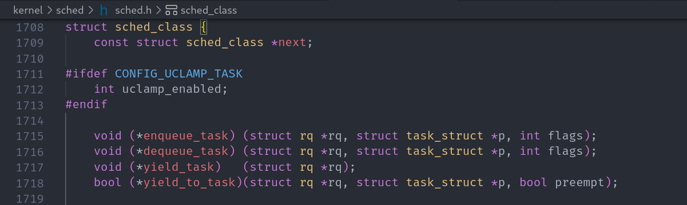

## 调度器

	进程调度的目的: 最大限度利用CPU时间

调度：就是按照某种调度算法设计,从进程的就绪队列当中选取进程分配CPU资源,主要协调对CPU等相关资源使用


Linux 内核中用来安排调度进程 （一般程序的执行过程）执行的模块称为 **调度器** ( Scheduler ),它可以切换进程状态 ( Process status ) 如： 执行，可中断睡眠，不可中断睡眠，退出，暂停等


<font color="red" face=Monaco size=3> 调度器相当于CPU中央处理器的管理员,主要负责完成两件事情： </font>

+ 选择某系就绪进程来执行
+ 打断某些执行的进程让题目变成就绪状态

> 如果调度器支持就绪状态切换到执行状态，同时支持从执行状态切换到就绪状态，该调度器为**抢占式调度**

### 调度类源码分析
调度类 `sched_class` 结构体

Linux 内核抽象一个调度类 `struct sched_class` 结构体表示调度类 具体源码如下



```c
// 调度类 sched_class 如下
struct sched_class {
	/*操作系统当中有多个调度类，按照调度优先级排成一个链表*/
	const struct sched_class *next;

#ifdef CONFIG_UCLAMP_TASK
	int uclamp_enabled;
#endif
	/*将进程加入到执行队列当中，即将调度实体（进程）存放在红黑树当中，
	并对 nr_running 变量自动加一*/
	void (*enqueue_task) (struct rq *rq, struct task_struct *p, int flags);
	/*从执行队列当中删除进程，并对 nr_running 变量自动减一*/
	void (*dequeue_task) (struct rq *rq, struct task_struct *p, int flags);
	/*放弃 CPU 执行权限，实际上此函数执行先出队后入队，
	在这种情况它直接将调度实体存放在红黑树的最右端*/
	void (*yield_task)   (struct rq *rq);
	bool (*yield_to_task)(struct rq *rq, struct task_struct *p, bool preempt);

	/*专门用于检查当前进程是否可以被新进程抢占*/
	void (*check_preempt_curr)(struct rq *rq, struct task_struct *p, int flags);

	/*选择下一个要运行的进程*/
	struct task_struct *(*pick_next_task)(struct rq *rq);

	/*将进程放回到运行队列当中*/
	void (*put_prev_task)(struct rq *rq, struct task_struct *p);
	void (*set_next_task)(struct rq *rq, struct task_struct *p, bool first);

#ifdef CONFIG_SMP
	int (*balance)(struct rq *rq, struct task_struct *prev, struct rq_flags *rf);
	/* 为进程选择一个合适的 CPU */
	int  (*select_task_rq)(struct task_struct *p, int task_cpu, int sd_flag, int flags);

	/* 迁移任务到另一个 CPU */
	void (*migrate_task_rq)(struct task_struct *p, int new_cpu);

	/* 专门用于唤醒进程 */
	void (*task_woken)(struct rq *this_rq, struct task_struct *task);

	/* 修改进程在 CPU 的亲和力 */
	void (*set_cpus_allowed)(struct task_struct *p,
				 const struct cpumask *newmask);

	/* 启动/禁止运行队列 */
	void (*rq_online)(struct rq *rq);
	void (*rq_offline)(struct rq *rq);
#endif

	void (*task_tick)(struct rq *rq, struct task_struct *p, int queued);
	void (*task_fork)(struct task_struct *p);
	void (*task_dead)(struct task_struct *p);

	/*
	 * The switched_from() call is allowed to drop rq->lock, therefore we
	 * cannot assume the switched_from/switched_to pair is serliazed by
	 * rq->lock. They are however serialized by p->pi_lock.
	 */
	void (*switched_from)(struct rq *this_rq, struct task_struct *task);
	void (*switched_to)  (struct rq *this_rq, struct task_struct *task);
	void (*prio_changed) (struct rq *this_rq, struct task_struct *task,
			      int oldprio);

	unsigned int (*get_rr_interval)(struct rq *rq,
					struct task_struct *task);

	void (*update_curr)(struct rq *rq);

#define TASK_SET_GROUP		0
#define TASK_MOVE_GROUP		1

#ifdef CONFIG_FAIR_GROUP_SCHED
	void (*task_change_group)(struct task_struct *p, int type);
#endif
};

```
调度器可分为 :
+ `stop_sched_class` : 停机调度类
+ `dl_sched_class` : 限期调度类
+ `rt_sched_class` : 实时调度类
+ `fair_sched_class` : 公平调度类 ( CFS调度器 )
+ `idle_sched_class` : 空闲调度类

<font color="red" face=Monaco size=4> 这5种调度类的优先级从高到低依次为：停机调度类，限期调度类，实时调度类，公平调度类，空闲调度类</font>


+ **停机调度类**：优先级是最高的调度类，停机进程是优先级最高的进程，可以抢占所有其它进程，其它进程不能抢占停机进程
+ **限期调度类**：最早使用优先算法，使用红黑树把进程按照绝对截止期限从小到大排序，每次调度时选择绝对截止期限最小的进程
+ **实时调度类**：为每个调度优先级维护一个队列
+ **公平调度类**：使用完全公平调度算法，完全公平调度算法引入虚拟运行时间的相关概念：
<font color="darkcyan" face=Monaco size=3> 虚拟运行时间 = 实际运行时间 * nice对应的权重 /  进程权重 </font>
+ **空闲调度类**：每个CPU上有一个空闲线程，即0号线程。空闲调度类优先级别最低，仅当没有其它进程可以调度的时候，才会调度空闲线程.


`task_struct` 结构体中采用三个成员表示进程的优先级: <span style="border-bottom:2px dashed darkcyan;">prio 和 normal_prio 表示动态优先级 static_prio 表示进程的静态优先级</span>


内核将任务优先级划分,实时优先级范围是 0 到 MAX_RT_PRIO - 1 ( 即99 ) 而普通进程的静态优先级范围是从 MAX_RT_PRIO 到 MAX_PRIO - 1  ( 即 100 到 139 )


<font color="blue" face=Monaco size=3>  进程分类 ： </font>
+ 实时进程 ( Real-time Process )：优先级高，需要立即被执行的进程
+ 普通进程 ( Normal Process)：优先级低，更长执行时间的进程

<span style="border-bottom:2px dashed darkred;">进程的优先级是一个 0 - 139 的整数来表示。数值越小，优先级越高，其中优先级 0 - 99 留给实时进程，100 - 139 留给普通进程</span>


### 内核调度策略

Linux内核提供一些调度策略供用户应用程序来选择调度器。

Linux 内核调度策略源码分析如下


+ `SCHED_NORMAL` : 普通进程调度策略,使task 选择CFS 调度器来调度运行
+ `SCHED_FIFO` : 实时进程调度策略,先进先出调度没有时间片，没有更高优先级的状态下，只有等待主动让出CPU
+ `SCHED_RR` : 实时进程调度策略，时间片轮转, 进程使用完时间片之后加入优先级对应运行队列当中尾部，把 CPU 让给同等优先级的其它进程
+ `SCHED_BATCH` : 普通进程的调度策略,批量处理，使 task 选择CFS 调度器来调度运行
+ `SCHED_IDLE` 普通进程调度策略, 使task 以最低优先级选择 CFS 调度器来调度运行
+ `SCHED_DEADLINE` 限期进程调度策略，使task 选择 Deadline 调度器来调度运行

> 其中 stop 调度器和DLE-task 调度器，仅被使用于内核，用户没有办法进行选择

## CFS 调度器

<font color="red" face=Monaco size=4> CFS调度器基本原理: </font>

<span style="border-bottom:2px dashed red;">完全公平调度算法体现在对待每个进程都是公平的让每个进程都运行一段相同的时间片,这就是基于时间片轮询调度算法。</span>


<font color="darkgreen" face=Monaco size=3> CFS定义一种新调度模型 </font>，它给cfs_rq（cfs的run queue）中的每一个进程都设置一个虚拟时钟-virtual runtime(vruntime)。如果一个进程得以执行，随着执行时间的不断增长，其 vruntime也将不断增大，没有得到执行的进程vruntime将保持不变

<font color="red" face=Monaco size=3>  进程描述符 task_struct 结构中 有几个成员与调度有关，具体成员 ： prio normal_prio static_prio rt_priority 等</font>


**实际运行时间**

CFS (Completely Fair Scheduler) 的简称 在实际当中必须会有进程优先级高或者进程优先级低，CFS调度器引入权重，使用权重代表进程的优先级，各个进程安装权重比例分配CPU时间

假设有两个进程 α , β ( α 的权重分别为 1024 , β 的权重为 2048 )
+ α 获得CPU时间比例为 ： `1024/(1024+2048) = 33% 左右`
+ β 获得CPU时间比例为 ： `2038/(1024+2048) = 66% 左右`

在引入权重之后分配给进程的时间计算公式如下：

<font color="red" face=Monaco size=3> 实际运行时间 = `调度周期 * 进程权重/ 所有进程权重之和` </font>

**虚拟运行时间**

虚拟运行时间 = `实际运行时间 * NICE_0_LOAD / 进程权重 = ( 调度周期 * 进程权重 / 所有进程权重之和 ) * NICE_0_LOAD / 进程权重 = 调度周期 * 1024 / 所有进程权重之和`

在一个调度周期里面，所有进程的虚拟运行时间是相同的，所以在进程调度时，只需要找到虚拟运行时间最小的进程调度运行即可.


> 调度子系统各个组件模块

+ 主调度器：通过调用 schedule() 函数来完成进程的选择和切换
+ 周期性调度器：根据频率制动调用 schedule_tick() 函数，作用根据进程运行时间触发调度
+ 上下文切换：主要做两个事情 ( 切换地址空间，切换寄存器，和栈空间)


### CFS 调度器类

CFS调度器类在Linux源码分析


+ `idle_sched_class`：空闲调度类
+ `enqueue_task_fair` : 当任务进入可运行状态时，用此函数将调度实体存放到红黑树，完成入队操作。
+ `dequeue_task_fair` : 当任务退出可运行状态时，用此函数将调度实体从红黑树中移除，完成出队操作。

### CFS调度器就绪队列

调度管理是各个调度器的职责。CFS的顶级调度就队列 struct cfs_rq，Linux内核源码目 录：kernel/sched/sched.h


`cfs_rq` 跟踪就绪队列信息以及管理就绪态调度实体，并维护一颗按照虚拟时间排序的红黑树 `struct rb_root_cached task_timeline`

`task_timeline -> rb_root` 是红黑树的根
`task_timeline -> rb_leftmost` 指向红黑树中最左边的调度实体，即虚拟时间最小的调度实体
