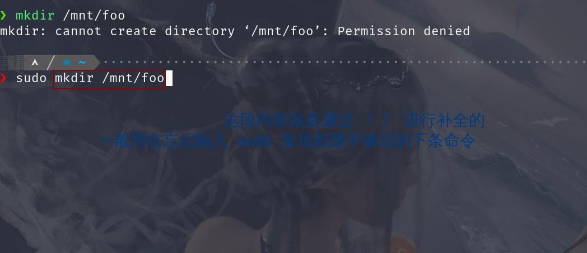

## Linux 基础

下面的笔记都是通过学习这个课程记录的
+ [The Missing Semester of Your CS Education](https://missing.csail.mit.edu/)

系统内核存放信息路径 `/sys/class/`

如关于屏幕亮度的 `backlight`
关于电池容量的 `powercap`

我们可以通过下面的方式修改屏幕的亮度

```bash
echo 500 | sudo tee /sys/class/backlight/intel_backlight/brightness
```


### Shell 编程

变量赋值左右两边不能有空格,取变量值时应在变量前加 `$` 符号


```bash
foo=bar # correct way
foo = bar # error way
echo $foo 
```
定义字符类型我们有两种方式

```bash
echo "Hello World" # 双引号
echo 'Hello World' # 单引号
```
双引号定义的字符串里面可以包含变量
而单引号则不行


+ `$0` : 代表当前脚本的名字
+ `$1` `$2` `$3` `...` `$n` : 代表第n个参数
+ `$_` : 代表上一个命令的最后一个参数
+ `$?` : 代表上一个命令的错误码 <font color="red" face=Monaco size=3>  一般来讲 0  表示执行正确</font>
+ `$@` : 会将所有的参数都展开来

```bash
# mcd.sh
mcd () {
	mkdir -p "$1";
	cd "$1";
}
```
我们可以将其进行加载 

```bash
~ $ source mcd.sh
~ $ mcd test
~/test $ 
```

<font color="red" face=Monaco size=3> 我们在终端里输入 `!!` 后按一下tab 键会将上一条命令替换掉 `!!`  </font>


我们还可以将命令的结果赋值给变量
```bash
/sys/class >>> foo_path=$(pwd)
/sys/class >>> cd
~ >>> echo $foo_path
/sys/class
```

```
cat <(ls) <(ls ..)
```
相当于将`ls` 操作得到的结果放到一个零时文件里 然后 `ls ..` 操作的结果也放到这个零时文件里,然后将两种结果连接在一起

```bash

#! /bin/bash
echo "Starting program at $(date)" # Date will be subtituted
echo "Running program $0 with $# arguments with pid $$"

for file in "$@"; do
	grep foobar "$file" > /dev/null 2> /dev/null
	# when pattern is not found , grep has exit status 1
	# We redirect STDOUT and STDERR to a null register since we do not care about them
	if [[ "$?" -ne 0 ]]; then
		echo "File $file does not have any foobar adding one"
		echo "# foobar" >> "$file"
	fi
done
```
`[[ "$?" -ne 0 ]]` 如果你看不懂这个语法或许你可以 `man test`

`?` 代表单个字符

```bash
ls progect?
```

```bash
touch project{1,2}/src/test/test{1,2,3}.py
```
如果这时候我们按一下 <kbd class="keybord"> tab </kbd>&ensp;键的话，`zsh` 会将这些参数进行展开

```bash
touch project1/src/test/test1.py project1/src/test/test2.py \
project1/src/test/test3.py project2/src/test/test1.py \
project2/src/test/test2.py project2/src/test/test3.py
```
`{a..e}` 将会展开成 `a b c d e` 
`{1..4}` 将会展开成 `1 2 3 4`

```bash
touch {foo,bar}/{a..j}
```


```bash
diff <(ls foo) <(ls bar)
```


`#!/usr/bin/env python` : 表示在环境变量里面找到 `python` 这个解释器


我们可以使用 `shellcheck` 来检测我们 `shell` 脚本是否规范和正确，还会适当对出现的不规范情况给出适当性的建议
可能你的目标系统上并没有内置这个工具,这时你就需要根据直接的系统来安装

`Arch Linux` 安装 `shellcheck` 的命令如下

```bash
sudo pacman -S shellcheck
yay -S shellcheck-bin
```


获得命令的大量常用命令示例，帮助我们敲命令
```bash
tldr command  # tldr ffmpeg
curl cheat.sh/command # curl cheat.sh/ffmpeg
```


**我们可以使用 `shellcheck` 命令来检查我们shell脚本编写的规范和正确性**

`find` 命令的使用

`find . -name src -type d`

`find . -path '**/luck/*.py' -type f`

`find . -name '*.tmp' -exec rm {} \;`

`fd` 

`locate` 我们可以使用 `sudo updatedb` 来更新文件索引

`type`

`grep -R foobar .`

`rg "import requests" -t py ~/scratch`
`rg "import requests" -t py -C 5 --stats ~/scratch`
`--stats` 显示匹配的总体相关信息

`rg -u --files-without-match "^#\!" -t sh`
`ag`
`-u` 表示不要忽略文件 
`shebang` -> `#!`

<kbd class="keybord"> Ctrl </kbd> + <kbd class="keybord"> R </kbd>&ensp; 回溯搜索 `backward search`


`[ -f ~/.fzf.zsh ] && source ~/.fzf.zsh`

<kbd class="keybord"> Alt </kbd> + <kbd class="keybord"> F </kbd>&ensp; 在shell 里将光标往前移动一个单词

<kbd class="keybord"> Alt </kbd> + <kbd class="keybord"> B </kbd>&ensp; 在shell 里将光标往前移动一个单词

+ `ls -R`
+ `tree`
+ `broot`
+ `nnn`


## 数据处理 `(Data Wrangling)`


在使用 SSH 连接服务器时我们经常要使用这种方式
而重复次数比较多时就会比较麻烦(有时IP地址忘记了)


我们想使用下面这种方式进行远程主机的连接

```bash
ssh server
```
我们只需要将下面的配置保存到 `~/.ssh/config`
文件即可

```
Host server
Hostname actualServerNameOrIp
User yourUserName
```
不过一下信息你得根据你自己的情况进行相应的更改

+ `server` : 服务名(使用ssh连接时想用的名字)
+ `actualServerNameOrIp` : 真实的服务器名称或者其 IP 地址
+ `yourUserName`: 想要以什么用户去连接该服务器如 `root`

[SSH Essentials:Working with SSH Servers Clients and Keys](https://www.digitalocean.com/community/tutorials/ssh-essentials-working-with-ssh-servers-clients-and-keys) 


我们可以使用以下方式 **( 使用`''` 引号将要运行的命令包裹起来)** 让命令在远程服务器上运行对应的命令然后返回给我们本地


 

我们可以使用 `sed` 命令来过滤我们想要的信息

**而 sed 会将我们不想要的东西根据我们的正则表达式来替换或去除**
相当于vim 里面 `command line` 模式下的替换

```vim
:%s/old_pattern/new_pattern/
```
而且默认也和 vim 一样为一行只替换一次但我们在后面添加 `g` `global` 之后就会全部替换 (只要遇见满足条件的字符串就会替换掉)


我们可以使用 `-E` 来使用扩展正则

```bash
echo 'abcabaab' | sed 's/\(ab\)*//g'
```
```bash
echo 'abcabaab' | sed -E 's/(ab)*//g'
```
```bash
echo 'abacabcabbc' | sed -E 's/(ab|bc)*//g'

```
`(ab)` 里的 `()` 这个括号将 `ab` 字符变成了一个整体,只有 `ab` 这种形式的才会被替换掉


```bash
cat ./secho_log.log | sed 's/.*Disconnected from//'
```
### 命令行环境 `(command line environment)`

我们可以使用这种方式 **`vim $(fzf)`** 来模糊编辑我们的文件

`git rev-parse --abbrev-ref HEAD` 获得当前`git` 分支的名字

`basename $(realpath .)`


`indent` 工具来进行代码格式化

```bash
# indent 格式化输出
# pygmentize 高亮代码
gcc -E ./Demo.c | indent - | pygmentize
```
我们可以使用 `-Wl` 给链接器 `ld` 传参数如 `--verbose`

```bash
gcc -Wl, --verbose ./Demo.c
```
`-n` 打印出所有 make 将运行的命令 `-B` 无条件 make 所有目标
```bash
make -nB
```

## Git 版本控制


