> 学习链接 ( 墙裂推荐 :) )
+ [JYY 计算机系统基础课视频](https://www.bilibili.com/video/BV1qa4y1j7xk?spm_id_from=333.999.header_right.history_list.click)
+ [JYY WIKI](http://jyywiki.cn/)
+ [The Missing Semester of Your CS Education](https://missing.csail.mit.edu/)

## C语言基础
+ [Linux C Programming](https://docs.huihoo.com/c/linux-c-programming/)
+ [JYY's Slide](http://jyywiki.cn/ICS/2020/slides/2.slides#/) 
+ [The Art of Readable Code](https://mcusoft.files.wordpress.com/2015/04/the-art-of-readable-code.pdf) 


在 IDE 里，为什么我们只需要按一个键 ( 通常为<kbd class="keybord"> F5 </kbd>&ensp; )，就能编译运行？

+ **编译、链接:**
`.c → 预编译 → .i → 编译 → .s → 汇编 → .o → 链接 → a.out`
+ **加载执行:** `./a.out`

背后其实是通过调用命令行工具逐步完成的: `RTFM: gcc --help; man gcc`

+ 控制行为的三个选项：`-E, -S, -c`
+ 我们也可以使用这个选项来生成所有中间文件 ：`-save-temps`


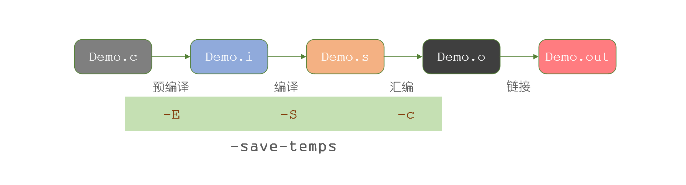

#### 预编译

<font color="red" face=Monaco size=4> 以 `#` `##` 开头的操作符参与预编译的过程 </font> 

`C` 语言不像现代语言如 `python` 的 `import` 一样会解析 `moudle` 然后将类似于符号表之类的东西导入进来因为在 C 语言那个时代 编译是一个非常宝贵的资源， 它会占用非常多的时间，尤其是一个非常大的项目

**所以在 C 语言里 `#include` 其实就是将其包含的内容原样包含进来 (复制粘贴)**


```c
// the file a.c content
int main()
{
  printf(
    #include "a.inc"
  );
}

// the file a.inc content
#include "b"

// the file b content
"Hello World!"
```
我们尝试编译并运行一下上面的 `a.c` 文件:
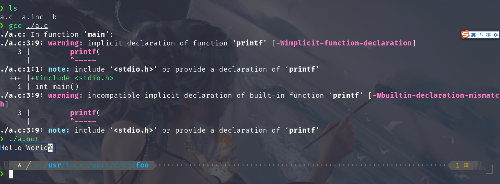
发现成功编译并成功输出了 `Hello World` (这时候是不是觉得很神奇？ :) )


`#include <> 指令`


以下代码有什么区别？

```c
#include <stdio.h>
#include "stdio.h"
```

当我们使用`#include <SDL2/SDL2.h>` 为什么在没有安装这个库时会发生错误？
+ [X] 那是因为使用 `#include<...>`时 编译器默认会根据默认库路径去寻找对应的库文件,而没有安装,编译器找不到对应的库文件,所以会发生错误。


为了解编译器进行了什么操作，我们可以使用：`gcc --verbose`
+ **`--verbose` 选项是用来查看详细的编译日志**


我们可以在日志里看见如下信息。也就解释了当我们 `#include<stdio.h>` 系统会以什么方式去查找到这个文件

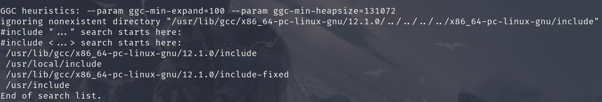

所有尖括号 `<>` 都会去系统路径上去寻找

这时如果我们把 上面的 `a.c`的 `#include "a.inc"` 改成 `#include <a.inc>` 再进行编译发现编译错误,如下：
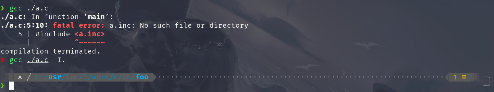


当我们使用 `-I` 选项时我们就能添加指定路径,即使这个路径并不存在 `-I` 和路径之间不能有空格 这是历史遗留问题 `gcc ./a.c -I.` : 表示将当前路径加入到系统查找路径中。


这时我们在查看其 `verbose` 信息我们可以发现 在`<..>` 路径里多了当前路径 `.` 所以我们刚刚的编译成功通过了

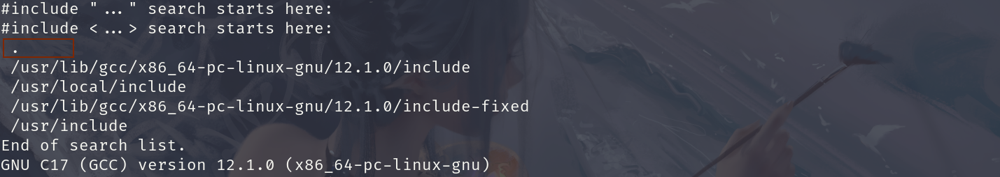


你可能在书/阅读材料上了解过一些相关的知识

但更好的办法是阅读命令的日志信息，里面包含了编译器所有行为。
`gcc --verbose a.c`

有趣的预编译:以下代码会输出什么？
```c
#include <stdio.h>

int main() {
#if aa == bb
  printf("Yes\n");
#else
  printf("No\n");
#endif
}
```

我们将下面这段代码进行编译并运行，发现并没有报错，能成功运行


#### 宏定义与展开

**宏展开：通过复制/粘贴改变代码的形态**

**我们发现有预处理的宏是可有可无的**,如在 32 位环境下 `__x86_64__` 这个宏就没有被定义,而在 64 位下 `__x86_64__` 就被定义了  所以 `aa` 和 `bb`  在一开始就有一定的含义 ( 空的含义 ) 

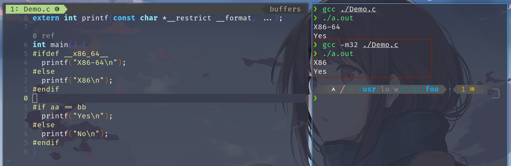

所以空 `aa` 等于空 `bb` 故编译后运行这段代码将会输出 `Yes`


+ [x] 为什么我们每次写 `C` 代码时都要 `#include<stdio.h>` ?

+ 其实我们每次引入 `#include<stdio.h>` 是因为我们需要使用里面的函数 如 `printf` 如果你不需要使用这些函数时，也就不需要`#include`对应库了

所有如果我们要使用 `printf` 而不想 `#include<stdio.h>` 的话，我们只需要将 `printf` 的声明复制粘贴到源代码中即可，而 `#include` 做的事情，本身就是复制粘贴.

你可以试着将下面代码复制粘贴后编译运行，你将得到一个 `Hello World` 输出.
```c
extern int printf(const char *__restrict __format, ...);
int main() {
  printf("Hello World!\n");
}
```

+ `#include → 粘贴文件`
+ `aa, bb → 粘贴符号`

因为 **C 语言的预处理仅仅只是文本的替换**
所以在 C 语言里能使用以下方式进行字符串的拼接

```c
#define ARCH "Arch Linux"
int main()
{
    printf("The arch is " ARCH "\n");
}

// the output is: The arch is Arch Linux
```

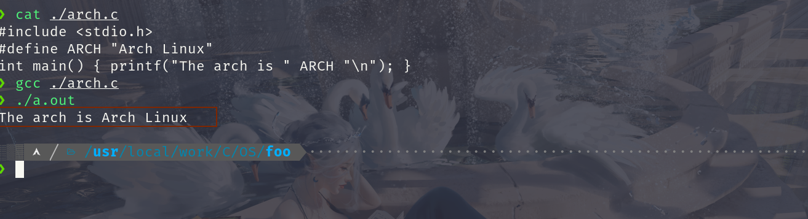


如下面程序 `TEN(A)` 将会替换成 10 个 A 而一个 A 将会替换成 `"aaaaaaaaaa"`

> 在C 语言里 如果两个字符串中间没有任何字符将会被拼接在一起 如下面程序将会输出 `HelloWorld` 而不会报错。

```c
#include <stdio.h>
int main(){
  printf("Hello" "World");
  return 0;
}
```
所以最后 G 将会被替换成 `10^8` 个a

```c
#define A "aaaaaaaaaa"
#define TEN(A) A A A A A A A A A A
#define B TEN(A)
#define C TEN(B)
#define D TEN(C)
#define E TEN(D)
#define F TEN(E)
#define G TEN(F)
int main() { puts(G); }

```
我们也说了它做的仅仅只是文本替换，当我们查看其二进制文件时，我们真的能看见 `10^8` 个a 并且这个二进制文件贼大。
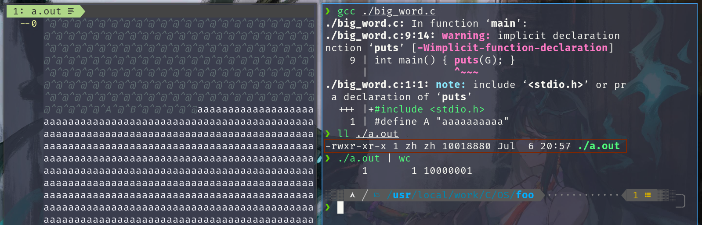


如何躲过 Online Judge 的关键字过滤？

**`##` 这个符号其实就是将左边和右边的字符拼接起来**

`#define SYSTEM sys ## tem`

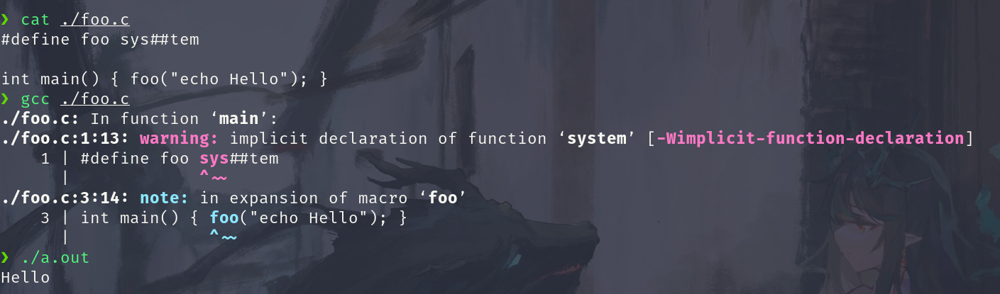

```c
#define foo sys ## tem
int main(){
    foo("echo Hello");
}
```

如何毁掉一个身边的同学？ `#define true (__LINE__ % 16 != 0)`


```c
#define s (((((((((((((((( 0
#define _ * 2)
#define X * 2 + 1)
static unsigned short stopwatch[] = {
  s _ _ _ _ _ X X X X X _ _ _ X X _ ,
  s _ _ _ X X X X X X X X X _ X X X ,
  s _ _ X X X _ _ _ _ _ X X X _ X X ,
  s _ X X _ _ _ _ _ _ _ _ _ X X _ _ ,
  s X X _ _ _ _ _ _ _ _ _ _ _ X X _ ,
  s X X _ X X X X X _ _ _ _ _ X X _ ,
  s X X _ _ _ _ _ X _ _ _ _ _ X X _ ,
  s X X _ _ _ _ _ X _ _ _ _ _ X X _ ,
  s _ X X _ _ _ _ X _ _ _ _ X X _ _ ,
  s _ _ X X X _ _ _ _ _ X X X _ _ _ ,
  s _ _ _ X X X X X X X X X _ _ _ _ ,
  s _ _ _ _ _ X X X X X _ _ _ _ _ _ , };

```

`X-Macros`
宏展开：通过复制/粘贴改变代码的形态

反复粘贴，直到没有宏可以展开为止
例子：`X-macro`

```c
#define NAMES(X) \
  X(Tom) X(Jerry) X(Tyke) X(Spike)

int main() {
  #define PRINT(x) puts("Hello, " #x "!");
  // # 代表将 # 后面的内容 (x) 作为字符串
  NAMES(PRINT)
}
```

发生在实际编译之前 也称为元编程 (meta-programming)

gcc 的预处理器同样可以处理汇编代码
C++ 中的模板元编程; Rust 的 macros; ...
Pros

提供灵活的用法 (X-macros) 接近自然语言的写法 Cons

破坏可读性 [IOCCC](https://www.ioccc.org/)、程序分析 (补全)、…… 

```c
#define L (
int main L ) { puts L "Hello, World" ); }
```

有用的 `X-macros`:

我们可以使用`do{} while(0)` 来包含代码片段来设计 X-macros 函数 如下：

```c
#define println(...) \
  do {
	printf(__VA_ARGS__); \
	printf("\n"); \
  } while(0)
```

### 编译、链接

一个不带优化的简易 (理想) 编译器

C 代码的连续一段总能找到对应的一段连续的机器指令
这就是为什么大家会觉得 C 是高级的汇编语言！

```c
int foo(int n) {
  int sum = 0;
  for (int i = 1; i <= n; i++) {
    sum += i;
  }
  return sum;
}
```


将多个二进制目标代码拼接在一起
C 中称为编译单元 `(compilation unit)`

我们甚至可以链接 `C++, rust, ...`代码 [Rust in C](https://docs.rust-embedded.org/book/interoperability/rust-with-c.html) 

当我们编译下面的代码 查看其汇编代码时
+ 被我们声明成 `C` 代码的函数正确生成对应的 `C` 的汇编 
+ 而没被声明成 `C` 代码的函数它的汇编代码 为 C++ 格式 ( 它有着它特殊的含义 `Z` 代表 返回值为`int`,`3` 代表函数名字符长度 `bar` 为函数名 `v` 代表 `void` 代表参数为空 )


```c
extern "C" {
  int foo() { return 0; }
}
int bar() { return 0; }
```

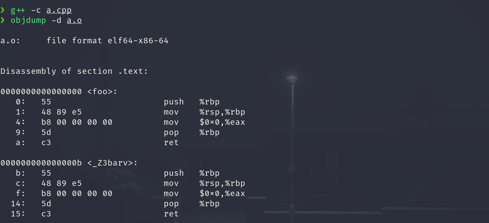


### 加载

C 程序执行的两个视角

**静态：** <font color="red" face=Monaco size=3> C 代码的连续一段 </font> 总能对应到一段连续的 <font color="red" face=Monaco size=3> 机器指令 </font>

**动态：** <font color="red" face=Monaco size=3> C 代码执行的状态 </font> 总能对应到 <font color="red" face=Monaco size=3> 机器的状态 </font>

---
+ 源代码视角
	+ 函数、变量、指针……
+ 机器指令视角
	+ 寄存器、内存、地址……

> 两个视角的共同之处：内存

+ 代码、变量 (源代码视角) = 地址 + 长度 (机器指令视角)
+ (不太严谨地) 内存 = 代码 + 数据 + 堆栈

<font color="red" face=Monaco size=3>  因此理解 C 程序执行最重要的就是内存模型 </font>

一个可执行程序从 main 函数开始执行: 标准规定 C 程序从 main 开始执行


+ [X] **思考题：谁调用的 main？进程执行的第一条指令是什么？**

```c
int main(int argc, char *argv[]);
// argc (argument count): 参数个数
// argv (argument vector): 参数列表 (NULL结束)
```
上次课已经演示过

`ls -al (argc = 2, argv = ["ls", "-al", NULL])`

`main, argc 和 argv` 一切皆可取地址！

```c
void printptr(void *p) {
  printf("p = %p;  *p = %016lx\n", p, *(long *)p);
}
int x;
int main(int argc, char *argv[]) {
  printptr(main);  // 代码
  printptr(&main);
  printptr(&x);    // 数据
  printptr(&argc); // 堆栈
  printptr(argv);
  printptr(&argv);
  printptr(argv[0]);
}
```

类型：对一段内存的解读方式

非常 “汇编” —— 没有 class, polymorphism, type traits, ...

C 里所有的数据都可以理解成是地址 (指针) + 类型 (对地址的解读)

例子 (是不是感到学了假的 C 语言)

```c
int main(int argc, char *argv[]) {
  int (*f)(int, char *[]) = main;
  if (argc != 0) {
    char ***a = &argv, *first = argv[0], ch = argv[0][0];
    printf("arg = \"%s\";  ch = '%c'\n", first, ch);
    assert(***a == ch);
    f(argc - 1, argv + 1);
  }
}
```

> 为什么要学习 C 语言
+ C 语言简单 (在可控时间成本里可以精通)
+ C 语言通用 (大量系统是用 C 语言编写的)
+ C 语言实现对底层机器的精确控制 ([鸿蒙](https://gitee.com/openharmony) )


## 编程实践
> 本节阅读材料
+ [JYY's Slide](http://jyywiki.cn/ICS/2020/slides/3.slides#/2/3) 


### 编写可读代码

一个极端 (不可读) 的例子: [IOCCC'11 best self documenting program](https://www.ioccc.org/2011/hou/hou.c)

**不可读 = 不可维护**

```c
puts(usage: calculator 11/26+222/31
  +~~~~~~~~~~~~~~~~~~~~~~~~calculator-\
  !                          7.584,367 )
  +~~~~~~~~~~~~~~~~~~~~~~~~~~~~~~~~~~~~+
  ! clear ! 0 ||l   -x  l   tan  I (/) |
  +~~~~~~~~~~~~~~~~~~~~~~~~~~~~~~~~~~~~+
  ! 1 | 2 | 3 ||l  1/x  l   cos  I (*) |
  +~~~~~~~~~~~~~~~~~~~~~~~~~~~~~~~~~~~~+
  ! 4 | 5 | 6 ||l  exp  l  sqrt  I (+) |
  +~~~~~~~~~~~~~~~~~~~~~~~~~~~~~~~~~~~~+
  ! 7 | 8 | 9 ||l  sin  l   log  I (-) |
  +~~~~~~~~~~~~~~~~~~~~~~~~~~~~~~~~~~~(0
);
```

一个现实中可能遇到的例子

人类不可读版 (STFW: clockwise/spiral rule)
```c
void (*signal(int sig, void (*func)(int)))(int);
```

人类可读版
```c
typedef void (*sighandler_t)(int);
sighandler_t signal(int, sighandler_t);
```

编写代码的准则：降低维护成本
```
Programs are meant to be readby humans and only incidentally 
for computers to execute. — D. E. Knuth
(程序首先是拿给人读的，其次才是被机器执行。)
```
**宏观** : 做好分解和解耦 (现实世界也是这样管理复杂系统的)

**微观**
+ “不言自明”
: <font color="red" face=Monaco size=3>  通过阅读代码能理解一段程序是做什么的 `specification` </font>
+ “不言自证”
: <font color="red" face=Monaco size=3>  通过阅读代码能验证一段程序与 `specification` 的一致性 </font>

> **例子：实现数字逻辑电路模拟器**

数字逻辑电路模拟器: 假想的数字逻辑电路
1. 若干个 `1-bit` 边沿触发寄存器 `(X, Y, ...)`
2. 若干个逻辑门

+ [X] **你会如何设计这个数值逻辑电路模拟器？**

基本思路： <font color="red" face=Monaco size=3>   状态 (存储) 模拟 + 计算模拟 </font>

+ 状态 = 变量 
	+ `int X = 0, Y = 0;`

+ 计算
    + `X1 = !X && Y;`
    + `Y1 = !X && !Y;`
    + `X = X1; Y = Y1;`

```c
#define FORALL_REGS(_)  _(X) _(Y)
#define LOGIC           X1 = !X && Y; \
                        Y1 = !X && !Y;

#define DEFINE(X)       static int X, X##1;
#define UPDATE(X)       X = X##1;
#define PRINT(X)        printf(#X " = %d; ", X);

int main() {
  FORALL_REGS(DEFINE);
  while (1) { // clock
    FORALL_REGS(PRINT); putchar('\n'); sleep(1);
    LOGIC;
    FORALL_REGS(UPDATE);
  }
}

```
> 使用预编译的好处和坏处：

**好处：**
+ 增加/删除寄存器只要改一个地方
+ 阻止了一些编程错误
+ 忘记更新寄存器
+ 忘记打印寄存器
+ “不言自明” 还算不错

**坏处：**
+ 可读性变差 (更不像 C 代码了)
+ “不言自证” 还缺一些
+ 给 IDE 解析带来一些困难

更完整的实现：数码管显示
[logisim.c](./foundation.Demo/logisim.c) 和 [display.py](./foundation.Demo/display.py)

```bash
sudo pacman -S tk
sudo apt-get install tk
pip install turtle
pip install tk
```
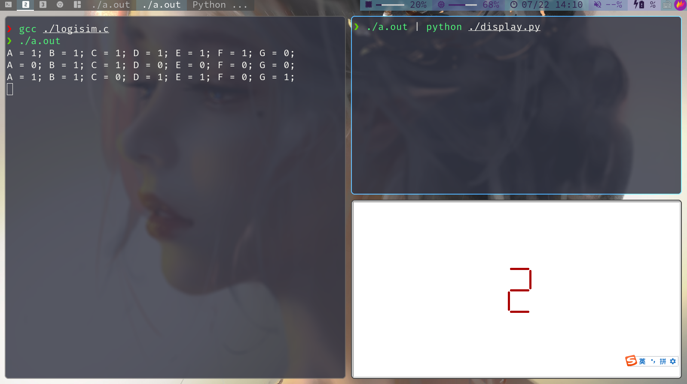


你也可以考虑增加诸如开关、UART 等外设

原理无限接近大家数字电路课玩过的 FPGA 等等……FPGA？

这玩意不是万能的吗？？？
我们能模拟它，是不是就能模拟计算机系统？
Yes!
我们实现了一个超级超级低配版 NEMU!


YEMU: 模拟指令执行
在时钟信号驱动下，根据  更新系统的状态

RISC 处理器 (以及实际的 CISC 处理器实现)：

+ 取指令 `(fetch)`: 读出 `M[R[PC]]` 的一条指令
+ 译码 `(decode)`: 根据指令集规范解析指令的语义 (顺便取出操作数)
+ 执行 `(execute)`: 执行指令、运算后写回寄存器或内存

最重要的就是实现 `idex()`

这就是 PA 里你们最挣扎的地方 (囊括了整个手册)

```c
int main() {
  while (!is_halt(M[pc])) {
    idex();
  }
}
```
> 代码例子一

```c
void idex() {
  if ((M[pc] >> 4) == 0) {
    R[(M[pc] >> 2) & 3] = R[M[pc] & 3];
    pc++;
  } else if ((M[pc] >> 4) == 1) {
    R[(M[pc] >> 2) & 3] += R[M[pc] & 3];
    pc++;
  } else if ((M[pc] >> 4) == 14) {
    R[0] = M[M[pc] & 0xf]; 
    pc++;
  } else if ((M[pc] >> 4) == 15) {
    M[M[pc] & 0xf] = R[0];
    pc++;
  }
}
```
> 代码例子 2

是否好一些？
不言自明？不言自证？
```c
void idex() {
  u8 inst = M[pc++];
  u8 op = inst >> 4;
  if (op == 0x0 || op == 0x1) {
    int rt = (inst >> 2) & 3, rs = (inst & 3);
    if      (op == 0x0) R[rt]  = R[rs];
    else if (op == 0x1) R[rt] += R[rs];
  }
  if (op == 0xe || op == 0xf) {
    int addr = inst & 0xf;
    if      (op == 0xe) R[0]    = M[addr];
    else if (op == 0xf) M[addr] = R[0];
  }
}
```


> 代码例子3  **[YEMU 源码下载](./foundation.Demo/yemu.tar.gz)**

```c
typedef union inst {
  struct { u8 rs  : 2, rt: 2, op: 4; } rtype;
  struct { u8 addr: 4,        op: 4; } mtype;
} inst_t;
#define RTYPE(i) u8 rt = (i)->rtype.rt, rs = (i)->rtype.rs;
#define MTYPE(i) u8 addr = (i)->mtype.addr;

void idex() {
  inst_t *cur = (inst_t *)&M[pc];
  switch (cur->rtype.op) {
  case 0b0000: { RTYPE(cur); R[rt]   = R[rs];   pc++; break; }
  case 0b0001: { RTYPE(cur); R[rt]  += R[rs];   pc++; break; }
  case 0b1110: { MTYPE(cur); R[RA]   = M[addr]; pc++; break; }
  case 0b1111: { MTYPE(cur); M[addr] = R[RA];   pc++; break; }
  default: panic("invalid instruction at PC = %x", pc);
  }
}
```
有用的 C 语言特性
`Union / bit fields`
```c
typedef union inst {
  struct { u8 rs  : 2, rt: 2, op: 4; } rtype;
  struct { u8 addr: 4,        op: 4; } mtype;
} inst_t;
```

指针

内存只是个字节序列
无论何种类型的指针都只是地址 + 对指向内存的解读

```c
inst_t *cur = (inst_t *)&M[pc];
  // cur->rtype.op
  // cur->mtype.addr
  // ...
```

小结
如何管理 “更大” 的项目 (YEMU)?

我们分多个文件管理它
+ `yemu.h` - 寄存器名；必要的声明
+ `yemu.c` - 数据定义、主函数
+ `idex.c` - 译码执行
+ `Makefile` - 编译脚本 (能实现增量编译)

使用合理的编程模式 减少模块之间的依赖 `enum { RA, ... , NREG }`

合理使用语言特性，编写可读、可证明的代码 `inst_t *cur = (inst_t *)&M[pc]`

NEMU 就是加强版的 YEMU

---
**更多的计算机系统模拟器**

1. **`am-kernels/litenes`**
+ 一个 “最小” 的 NES 模拟器
+ 自带硬编码的 ROM 文件

2. **`fceux-am`**
+ 一个非常完整的高性能 NES 模拟器
+ 包含对卡带定制芯片的模拟 (src/boards)

3. **`QEMU`**
+ 工业级的全系统模拟器
+ 2011 年发布 1.0 版本
+ 有兴趣的同学可以 [RTFSC](http://wiki.qemu.org/download/qemu-1.0.tar.gz)
作者：传奇黑客 [Fabrice Bellard](https://bellard.org/)

---

## NEMU 框架
### 编译运行
> 本节阅读材料
+ [JYY's Slide](http://jyywiki.cn/ICS/2020/slides/4.slides#/) 
+ [Unix-Hater's Handbook](https://web.mit.edu/~simsong/www/ugh.pdf)
+ [A Visual Git Reference](https://marklodato.github.io/visual-git-guide/index-en.html)
+ [Visualizing Git Concepts with D3](http://onlywei.github.io/explain-git-with-d3/)
+ [Pro Git](https://git-scm.com/book/en/v2)
> The UNIX-Hater's Handbook (and Beyond) 写于 1994 年
+ Simson Garfinkel 的主页有[电子版](https://web.mit.edu/~simsong/www/ugh.pdf)
    + 说有道理也有道理
    + 说没道理也没道理
+ 至少指出了 UNIX 的一些缺陷 
	+ **user friendly**
	+ 命令行/系统工具的缺陷

**但今天 UNIX/Linux 已经成熟多了！**

#### Git / GitHub


<span style="color:blue">
</span>
<details>
  <summary style="color:darkcyan">
  GitHub Introduction
  </summary>
  <p>GitHub is a development platform inspired by the way you work. From open source to business, you can host and review code, manage projects, and build software alongside 50 million developers. (不愧为全球最大的同性交友网站)
  </p>
</details>

**GitHub - 无所不能的代码聚集地方**
+ 有整个计算机系统世界的代码
+ 硬件、操作系统、分布式系统、库函数、应用程序……
+ 学习各种技术的最佳平台
+ 海量的文档、学习资料、博客 (新世界的大门)
+ 提供友好的搜索 例子：awesome C

**如何快速学习 Git?**
+ 我们已经知道开源社区的强大了
+ 所以你还在使用百度来查询你想要学习的资料吗？
+ 一个好的文档是真实存在的。
  + [A Visual Git Reference](https://marklodato.github.io/visual-git-guide/index-en.html)
  + [Visualizing Git Concepts with D3](http://onlywei.github.io/explain-git-with-d3/)

有趣的 “--”

UNIX 的设计缺陷 (UGH 中点名批评)

+ 虽然是编程语言，但 Shell 更贴近自然语言
+ 有很多 corner cases
	+ 如果有一个文件叫 “-rf”……怎么删除它？？？
	+ best practice: 文件名不以 “-” 开头、不含空格/符号……


我们可以使用 “白名单” `.gitignore` 文件来控制我们需要对哪些文件进行版本控制


<font color="red" face=Monaco size=3> 基本原则：一切生成的文件都不放在 Git 仓库中 </font>

只在 Git repo 里管理 `.c`, `.h` 和 `Makefile`
```bash
*       # 忽略一切文件
!*/     # 除了目录
!*.c    # .c
!*.h    # ...
!Makefile*
!.gitignore
```

Git: 代码快照管理工具
+ 是一种 “可持久化数据结构”
+ 拓展阅读：[Pro Git](https://git-scm.com/book/en/v2)

框架代码中的两处非常规 Git 使用
+ 提交脚本
	+ 仅上传 .git；在服务器执行 git reset
	+ 减少提交大小 (仅源文件)
+ Git 追踪
	+ 编译时强制提交，获取同学编码的过程

**思考题：如何管理自己的代码快照？**
>提示：分支/HEAD/... 只是指向快照的指针 (references)

#### make 
回顾：[YEMU 模拟器](./foundation.Demo/yemu.tar.gz)

**Makefile 是一段 “declarative” 的代码**
+ 描述了构建目标之间的依赖关系和更新方法
+ 同时也是和 Shell 结合紧密的编程语言
	+ 能够生成各种字符串
	+ 支持 “元编程” (#include, #define, ...)


Lab 代码的构建: <br>
顶层 (top-level) Makefile:
```makefile
# := -> C #define
       NAME   := $(shell basename $(PWD))
export MODULE := Lab1

# 变量 -> 字面替换
all: $(NAME)-64 $(NAME)-32

# include -> C #include
include ../Makefile
```


> 构建目标
+ 总目标
  + `.DEFAULT_GOAL := commit-and-make`
  + `commit-and-make: git all (all 在顶层 Makefile 中定义)`
+ 可执行文件
  + `multimod-64: gcc -m64`
  + `multimod-32: gcc -m32`
+ 共享库 (之后的 lab 使用)
  + `multimod-64.so: gcc -fPIC -shared -m64`
  + `multimod-32.so: gcc -fPIC -shared -m32`
+ `clean`
  + 删除构建的代码

Makefile 真复杂: ~~放弃~~

<font color="red" face=Monaco size=3> 一个小诀窍: </font> <br>
先观察 make 命令实际执行了什么 (trace)
+ `RTFM/STFW`: `make` 提供的两个有用的选项
	+ `-n` 只打印命令不运行
	+ `-B` 强制 make 所有目标

```bash
make -nB \
 | grep -ve '^\(\#\|echo\|mkdir\)' \
 | vim -
```
嘿嘿！你会发现 make 其实没想象中那么复杂
+ 就是一堆 gcc -c (编译) 和一个 gcc (链接) 诶<br>
+ **原来大部分 Makefile 都是编译选项**
Read the friendly source code!


`AbstractMachine` 代码构建:更长，更难读

+ “现代” 的文档编写方式
	+ “docs as code”
	+ 例子：LLVM 使用 Doxygen [自动生成文档](https://llvm.org/doxygen/)

```makefile
### *Get a more readable version of this Makefile* by `
### make html` (requires python-markdown)

html:
    cat Makefile | sed 's/^\([^#]\)/    \1/g' | \
      markdown_py > Makefile.html
.PHONY: html
```

教会大家 “计算机的正确打开方式”<br>
+ 编程 ≠ 闷头写代码
+ 使用工具也是编程的一部分

```test
version-control systems: git, svn, ...
build systems: make, cmake (C++), maven (Java), ...

shell: bash, zsh, ...
```


> 基本原则： <font color="darkcyan" face=Monaco size=3> 任何感到不爽的事情都一定有工具能帮你 </font> 

如果真的没有，自己造一个的就会就来了(不太可能是真的)<br>
但这将会是一份非常好的研究工作


我们可以使用 `x-macros` 来对需要大量大体重复的代码进行替换

`find . -name "*.c" -o -name "*.h" | xargs cat | wc -l`

`find . -name "*.c" | xargs grep --color -nse '\<main\>'`

`-n` 添加行号
`-s` 不显示因为文件不存在或者文件无法访问出现的错误信息
`-e` 使用正则表达式
`<...>` 代表以单词为单位

`grep -n main $(find . -name "*.c")`

`globing` : `**`
`vim **/target_file`

我们可以使用 ctags 和 vim 里的跳转来进行代码定位
```bash
# Generate tags for all files in the current directory and all subdirectories:
ctags --recurse 
```
在vim 里我们可以使用 
```vim
set tags=../tags " set the tags file path
tjump tagname " jump to the specific tag
tag tagname " same as the tjump 
```
但是tjump 命令在 tagname 处按 <kbd class="keybord"> tab </kbd>&ensp;键会对其产生相应的提示

[How do i automatically load a tag file from directory when changing directory](https://stackoverflow.com/questions/19330843/how-do-i-automatically-load-a-tag-file-from-a-directory-when-changing-to-that-di) 

如果我们默认使用下面这种方式在终端上并不会显示 ASNI_ESCAPE_CODE 
```bash
ls --color=auto | less
```

而如果我们使用下面命令,则会在终端上显示 ASNI_ESCAPE_CODE

```bash
ls --color | less
```

<font color="red" face=Monaco size=3> 原理: 其实 ls 会检测其标准输出流是否为终端,如果为终端则自适应不输出ASNI_ESCAPE_CODE </font>

```c
#define println(...) \
  do {
	printf(__VA_ARGS__); \
	printf("\n"); \
  } while(0)
```

### 代码导读
NEMU 代码导读
浏览源代码
启动代码选讲
编辑器配置

拿到源代码，先做什么？
NEMU 对大部分同学来说是一个 “前所未有大” 的 project。

先大致了解一下

项目总体组织
tree 要翻好几个屏幕
find . -name "*.c" -o -name "*.h" (110+ 个文件)
项目规模
find ... | xargs cat | wc -l
5,000+ 行 (其实很小了)
C 语言代码，都是从 main() 开始运行的。那么哪里才有 main 呢？

浏览代码：发现 main.c，估计在里面
使用 IDE (vscode: Edit → Find in files)
The UNIX Way (无须启动任何程序，直接查看)

grep -n main $(find . -name "*.c") # RTFM: -n
find . | xargs grep --color -nse '\<main\>'
Vim 当然也支持

:vimgrep /\<main\>/ **/*.c
浏览 :cn, :cp, ...

main()
比想象中短很多……

int main(int argc, char *argv[]) {
  init_monitor(argc, argv);
  engine_start();
  return is_exit_status_bad();
}
Comments

把 argc, argv 传递给另一个函数是 C 的 idiomatic use
init_monitor 代码在哪里？
每次都 grep 效率太低
需要更先进的工具 (稍候介绍)


parse_args()
这个函数的名字起的很好，看了就知道要做什么

满足好代码不言自明的特性
的确是用来解析命令行参数的，-b, -l, ...
使用了 getopt → RTFM!
失败的尝试：man getopt → getopt (1)

成功的尝试

捷径版：STFW “C getopt” → 网页/博客/...
专业版：man -k getopt → man 3 getopt
意外之喜：man 还送了个例子！跟 parse_args 的用法一样耶

NEMU: 一个命令行工具
The friendly source code

命令行可以控制 NEMU 的行为
我们甚至看到了 --help 帮助信息
如何让我们的 NEMU 打印它？

问题等同于：make run 到底做了什么
方法 1: 阅读 Makefile
方法 2: 借助 GNU Make 的 -n 选项
开始痛苦的代码阅读之旅：坚持！

static inline
```c
static inline void parse_args(int argc, char *argv[]) { ... }
```
parse_args 函数是 static, inline 的，这是什么意思？

inline (C99 6.7.4 #5): Making a function an inline function suggests that calls to the function be as fast as possible. The extent to which such suggestions are effective is implementation-defined. (inline更多有趣的行为请大家RTFM)
static (C99 6.2.2 #3): If the declaration of a file scope identifier for an object or a function contains the storage- class specifier static, the identifier has internal linkage.
联合使用

告诉编译器符号不要泄露到文件 (translation unit) 之外

0): multiple definition of f; a.c:(.text+0xb): first defined here

这也是为什么不在头文件里定义函数的原因

两个 translation unit 同时引用，就导致 multiple definition
思考题：为什么 C++ 能把 class 都定义到头文件里？？？像 vector 的实现就是直接粘贴进去的


更多关于 static inline (2)

如果你的程序较短且性能攸关，则可以使用 static inline 函数定义在头文件中。例子 (**/x86/**/reg.h)：

```c
static inline int check_reg_index(int index) {
  assert(index >= 0 && index < 8);
  return index;
}
```
`check_reg_index` 完全可以单独放在一个 C 文件里，头文件中只保留声明：
```c
int check_reg_index(int index);
```
但这样会导致在编译时，编译出一条额外的 call 指令 (假设没有 LTO)
使用 `inline` 可以在调用 `check_reg_index(0)` 编译优化成零开销

新的问题：啥是 assert？
```c
#define assert(cond) if (!(cond)) panic(...);
```
注意特殊情况：

```c
if (...) assert(0); // 上面的assert对么？
else ...
```

```c
#define assert(cond) \
  do { \
    if (!(cond)) { \
      fprintf(stderr, "Fail @ %s:%d", __FILE__, __LINE__); \
      exit(1); \
    } \
  } while (0)
```

```c
#define assert(cond) ({ ... })
```

千辛万苦……
之后的历程似乎就比较轻松了。有些东西不太明白(比如 `init_device()`)，但好像也不是很要紧，到了 `welcome()`：
```c
static inline void welcome() {
  ...
  printf("Welcome to \33[1;41m\33[1;33m%s\33[0m-NEMU!\n",
    str(__ISA__)); // bad code! jyy doesn't like it.
}
```
哇，还能顺带打印出编译的时间日期，奇怪的知识又增加了！

初始化终于完成
啊……根本没碰到核心代码

上手以后还在用 grep 找代码？

你刚拿到项目的时候，grep 的确不错
但如果你要一学期在这个项目上，效率就太低了
曾经有无数的同学选择容忍这种低效率

Vim: 这都搞不定还引发什么编辑器圣战
Marks (文件内标记)

ma, 'a, mA, 'A, ...
Tags (在位置之间跳转)

:jumps, C-], C-i, C-o, :tjump, ...
Tabs/Windows (管理多文件)

:tabnew, gt, gT, ...
Folding (浏览大代码)

zc, zo, zR, ...
更多的功能/插件

(RTFM, STFW)


VSCode: 现代工具来一套？
刚拿到手，VSCode 的体验并不是非常好
满屏的红线/蓝线 因为 Code 并知道 NEMU 是怎么编译的

IDE “编译运行” 背后没有魔法
另一方面，这些东西一定是可以配置的
配置解析选项: c_cpp_properties.json
解锁正确的代码解析
配置构建选项: tasks.json
解锁 make (可跟命令行参数)
配置运行选项: launch.json
解锁单步调试 (我们并不非常推荐单步调试)
插入福利：调试 Segmentation Fault
听说你的程序又 Segmentation Fault 了？

百度 Segmentation Fault 得到的首个回答的解释是完全错误的
正确的解释
指令越权访问内存 (r/w/x)
原因很多，数组越界、memory corruption, ...
指令未被执行，进程收到 SIGSEGV 信号
默认的信号处理程序会 core dump 退出

好的编辑器：也许不是万能的

exec.c 也太难读了吧 ~~(元编程，害死人)~~

```c
static inline def_EHelper(gp1) { // ???
  ...
  EMPTY(0) 
    // EMPTY(idx)  =>  EX(idx, inv)
    // EX(idx, inv)  =>  EXW(idx, inv, 0)
    // !@%#&%^!#@&%!^@%#$%*^!#@*
}
```

产生 “这是什么操作” 的困惑：
办法 1: RTFM + RTFSC + 写小程序尝试
办法 2: 预编译以后的代码应该好理解！
还记得我们对 Makefile 的导读吗？
(说的容易做得难。直接 gcc -E 不是编译错误吗……)
我们既然知道 Makefile 里哪一行是 .o → .c 的转换

我们添一个一模一样的 gcc -E 是不是就行了？
```make
$(OBJ_DIR)/%.o: src/%.c
    @$(CC) $(CFLAGS) $(SO_CFLAGS) -c -o $@ $<
    @$(CC) $(CFLAGS) $(SO_CFLAGS) -E -MF /dev/null $< | \
      grep -ve '^#' | \
      clang-format - > $(basename $@).i
```

> 敲黑板：征服你畏惧的东西，就会有意想不到的收获。

总结
怎样读代码？

读代码 ≠ “读” 代码

用正确的工具，使自己感到舒适
但这个过程本身可能是不太舒适的 (走出你的舒适区)
我们看到太多的同学，到最后都没有学会使用编辑器/IDE
要相信一切不爽都有办法解决
信息来源

在 /etc/hosts 中屏蔽百度
去开源社区找 tutorials
例子：vim-galore, awesome-c

[how debuggers work -- breakpoints](https://eli.thegreenplace.net/2011/01/27/how-debuggers-work-part-2-breakpoints) 


## 数据的机器级表示

位运算与单指令多数据
为什么会有位运算？
逻辑门和导线是构成计算机 (组合逻辑电路) 的基本单元

位运算是用电路最容易实现的运算
`&` (与), `|` (或), `~` (非)
`^` (异或)
`<<` (左移位), `>>` (右移位)
例子：一代传奇处理器 8-bit [Mos 6502](https://www.masswerk.at/6502/6502_instruction_set.html) 
3510 晶体管；56 条指令，算数指令仅有加减法和位运算
数学上自然的整数需要实现成固定长度的 01 字符串

习题：用上述位运算和常数实现 4 位整数的加法运算/Lab1

加法比上述运算在电路上实现 fundamentally 更困难 (为什么？)
“Circuit Complexity”

```text
142857 -> 0000 0000 0000 0010 0010 1110 0000 1001
```

假设 32-bit 整数；约定 MSB 在左，LSB 在右
热身问题：字符串操作

分别取出 4 个字节
交换高/低 16 位

&, |, ~, ... 对于整数里的每一个 bit 来说是独立 (并行) 的

如果我们操作的对象刚好每一个 bit 是独立的


我们在一条指令里就实现了多个操作
SIMD (Single Instruction, Multiple Data)
例子：Bit Set 


32-bit 整数 $\color{darkcyan}x \rightarrow S \subseteq \{0,1,2,3,\cdots 31\}$
+ 位运算是对所有 bit 同时完成的
  + C++ 中有 bitset，性能非常可观

测试 $x \in S$
+ `(S >> x) & 1`

求 $S^{\prime} = S \cup x$
+ `S | (1 << x)`

求 $\mid S \mid$

求 $S_1 \cup S_2$ $S_1 \cap S_2$

求 $S_1 \setminus S_2$

遍历所有 $S$ 中所有元素 (foreach)

Bit Set: 求 
```c
int bitset_size(uint32_t S) {
  int n;
  for (int i = 0; i < 32; i++) {
    n += bitset_contains(S, i);
  }
  return n;
}
```
```c
int bitset_size1(uint32_t S) { // SIMD
  S = (S & 0x55555555) + ((S >> 1) & 0x55555555);
  S = (S & 0x33333333) + ((S >> 2) & 0x33333333);
  S = (S & 0x0F0F0F0F) + ((S >> 4) & 0x0F0F0F0F);
  S = (S & 0x00FF00FF) + ((S >> 8) & 0x00FF00FF);
  S = (S & 0x0000FFFF) + ((S >> 16) & 0x0000FFFF);
  return S;
}
```


Bit Set: 返回  中的某个元素
有二进制数x = 0b+++++100，我们希望得到最后那个100

想法：使用基本操作构造一些结果，能把+++++的部分给抵消掉
一些有趣的式子：

```text
x & (x-1) → 0b+++++000；x ^ (x-1) → 0b00000111
x & (~x+1) → 0b00000100 (lowbit️)
x & -x, (~x & (x-1)) + 1 都可以实现 lowbit
```

只遍历存在的元素可以加速求 $\mid S \mid$

Bit Set: 求 
等同于 

```c
int clz(uint32_t x) {
    int n = 0;
    if (x <= 0x0000ffff) n += 16, x <<= 16;
    if (x <= 0x00ffffff) n +=  8, x <<= 8;
    if (x <= 0x0fffffff) n +=  4, x <<= 4;
    if (x <= 0x3fffffff) n +=  2, x <<= 2;
    if (x <= 0x7fffffff) n ++;
    return n;
}
```

(奇怪的代码) 假设  是 lowbit 得到的结果？

```c
#define LOG2(x) \
  ("-01J2GK-3@HNL;-=47A-IFO?M:<6-E>95D8CB"[(x) % 37] - '0')
```

用一点点元编程 (meta-programming)；试一试 [log2.c](./foundation.Demo/log2.c)

```python
import json

n, base = 64, '0'
for m in range(n, 10000):
  if len({ (2**i) % m for i in range(n) }) == n:
    M = { j: chr(ord(base) + i)
      for j in range(0, m)
        for i in range(0, n)
          if (2**i) % m == j }
    break

magic = json.dumps(''.join(
  [ M.get(j, '-') for j in range(0, m) ]
  )).strip('"')

print(f'#define LOG2(x) ("{magic}"[(x) % {m}] - \'{base}\')')
```
一本有趣的参考书
Henry S. Warren, Jr. Hacker's Delight (2ed), Addison-Wesley, 2012.

让你理解写出更快的代码并不是 “瞎猜”

主要内容是各种数学 (带来的代码优化)
官方网站：hackersdelight.org
见识一下真正的 “奇技淫巧”


Undefined Behavior (UB)
Undefined behavior (UB) is the result of executing computer code whose behavior is not prescribed by the language specification to which the code adheres, for the current state of the program. This happens when the translator of the source code makes certain assumptions, but these assumptions are not satisfied during execution. -- Wikipedia

C 对 UB 的行为是不做任何约束的，把电脑炸了都行

常见的 UB：非法内存访问 (空指针解引用、数组越界、写只读内存等)、被零除、有符号整数溢出、函数没有返回值……
通常的后果比较轻微，比如 wrong answer, crash

为什么 C/C++ 会有 UB？
为了尽可能高效 (zero-overhead)

不合法的事情的后果只好 undefined 了
Java, js, python, ... 选择所有操作都进行合法性检查
为了兼容多种硬件体系结构

有些硬件 /0 会产生处理器异常
有些硬件啥也不发生
只好 undefined 了


Undefined Behavior: 一个历史性的包袱
埋下了灾难的种子

`CVE: Common Vulnerabilities and Exposures`，公开发布软件中的漏洞
buffer/integer overflow 常年占据 CVE 的一席之地
高危漏洞让没有修补的机器立马宕🐔/变成肉🐔
例子：`CVE-2018-7445 (RouterOS)`, 仅仅是忘记检查缓冲区大小……

```c
while (len) {
  for (i = offset; (i - offset) < len; ++i) {
    dst[i] = src[i+1];
  }
  len = src[i+1]; ...
  offset = i + 1;
}
```

## 汇编/内联汇编

程序经历 `.c → .o` (编译) 和 `.o → a.out` (链接)

不同版本、不同编译器、不同语言的二进制文件都可以链接
+ 他们需要一个 “共同语言”
	+ 例如我们熟悉的 `x86 calling convention`

---
+ cdecl (Linux)
+ stdcall (Win32)

只要遵循标准的函数就可以互相调用


**Application Binary Interface (ABI)**
+ 区别于 API (Application Programming Interface)

程序源代码中的规范
ABI：约定 binary 的行为

+ 二进制文件的格式
+ 函数调用、系统调用……
  + C 语言规范只定义了运行时内存和内存上的计算
  + printf 都无法实现，必须借助外部库函数
+ 链接、加载的规范


例子：cdecl 函数调用
caller stack frame:
+ 所有参数以数组的形式保存在堆栈上 (所以才有 “反序压栈”)
+ 然后是返回地址
+ 跳转到 callee

callee:
+ EAX 作为返回值
+ 其他寄存器都是 callee save

```c
void bar(int *);
int foo(int x) {
  bar(&x);
  return x;
}
```

阅读汇编代码：“符号执行”
试着把内存/寄存器用数学符号表示出来

然后假想地 “单步执行” 程序，用符号公式表示当前系统的状态

James C. King. Symbolic execution and program testing. Communications of the ACM, 19(7), 1976. 

[Paper Link Download](./foundation.assets/arxiv.pdf) 

编译选项：`-m32 -O2 -fno-pic` (便于大家理解)

```x86asm
000004f0 <foo>:
 4f0:   83 ec 18                sub    $0x18,%esp
 4f3:   8d 44 24 1c             lea    0x1c(%esp),%eax
 4f7:   50                      push   %eax
 4f8:   e8 13 00 00 00          call   510 <bar>
 4fd:   8b 44 24 20             mov    0x20(%esp),%eax
 501:   83 c4 1c                add    $0x1c,%esp
 504:   c3                      ret

```


--- 

## PA 实验

+ [JYY 实验指导书](https://nju-projectn.github.io/ics-pa-gitbook/ics2021/index.html) 
+ [PA 实验指南](https://nju-projectn.github.io/ics-pa-gitbook/ics2021/PA0.html)

如果大家没有语言基础可以先去学一下语言基础： [composingprograms](https://composingprograms.com/)

下载 Ubuntu 镜像文件:
[Ubuntu 21.04 官方镜像文件](https://old-releases.ubuntu.com/releases/21.04/) 


```bash
sudo bash -c 'echo "deb http://mirrors.tuna.tsinghua.edu.cn/ubuntu/ hirsute main restricted universe multiverse" > /etc/apt/sources.list'
```

```bash
# update the source
sudo apt-get update
# build-essential packages, include binary utilities, gcc and so on
sudo apt-get install -y build-essential    
sudo apt-get install -y man                # on-line reference manual
sudo apt-get install -y gcc-doc            # on-line reference manual for gcc
sudo apt-get install -y gdb                # GNU debugger
sudo apt-get install -y git                # revision control system
sudo apt-get install -y libreadline-dev    # a library used later
sudo apt-get install -y libsdl2-dev        # a library used later
sudo apt-get install -y llvm 
sudo apt-get install -y make 
sudo apt-get install -y bison
sudo apt-get install -y flex
```
```bash
# use git to download the source code (ics2021)
git clone -b 2021 https://github.com/NJU-ProjectN/ics-pa.git ics2021
```
设置 `git` 相关信息
```bash
git config --global user.name "secho" # your student ID and name
git config --global user.email "zhouhaobusy@163.com"   # your email
git config --global core.editor vim                 # your favorite editor
git config --global color.ui true
```
当我们下载好后 我们进入到 `ics2021` 的目录 

```bash
git branch -m master
bash init.sh nemu
bash init.sh abstract-machine
bash init.sh 
```


```bash
git commit --allow-empty -am "before starting pa1"
git checkout master
git merge pa0
git checkout -b pa1
```

关闭 git 跟踪
```diff
diff --git a/nemu/scripts/git.mk b/nemu/scripts/git.mk
index c9b1708..b7b2e02 100644
--- a/nemu/scripts/git.mk
+++ b/nemu/scripts/git.mk
@@ -9,6 +9,6 @@
 define git_commit
-  -@git add .. -A --ignore-errors
-  -@while (test -e .git/index.lock); do sleep 0.1; done
-  -@(echo "> $(1)" && echo $(STUID) && hostnamectl && uptime) | git commit -F - $(GITFLAGS)
-  -@sync
+# -@git add .. -A --ignore-errors
+# -@while (test -e .git/index.lock); do sleep 0.1; done
+# -@(echo "> $(1)" && echo $(STUID) && hostnamectl && uptime) | git commit -F - $(GITFLAGS)
+# -@sync
 endef
```
