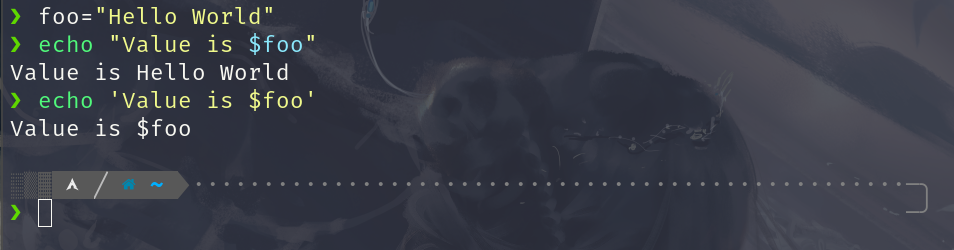
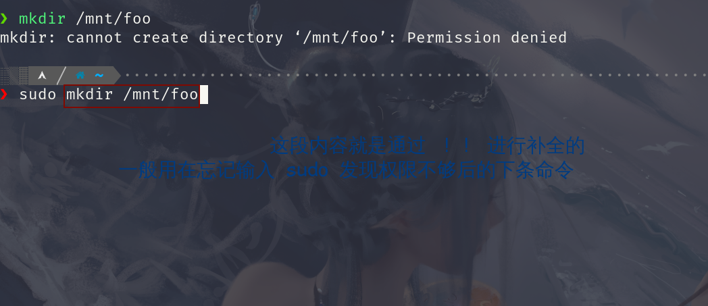
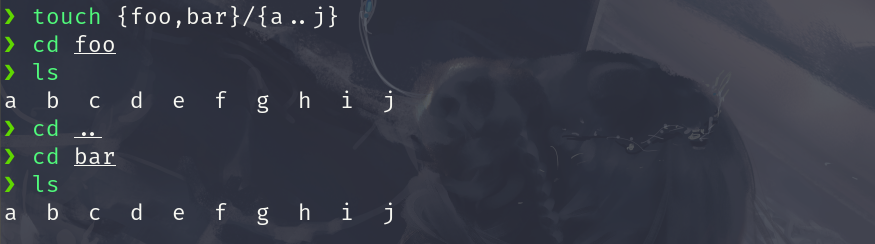
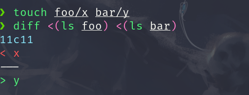

## 安装并配置环境

> 我这个博客仅仅只是对自己的学习过程进行一个简单的记录,肯定会存在一定的问题,如果想系统学习相关知识请务必查看一下以下链接

+ [JYY 实验指导书](https://nju-projectn.github.io/ics-pa-gitbook/ics2021/index.html) 
+ [JYY 计算机系统基础课视频](https://www.bilibili.com/video/BV1qa4y1j7xk?spm_id_from=333.999.header_right.history_list.click)
+ [JYY WIKI](http://jyywiki.cn/)
+ [The Missing Semester of Your CS Education](https://missing.csail.mit.edu/)

下载 Ubuntu 镜像文件:
[Ubuntu 21.04 官方镜像文件](https://old-releases.ubuntu.com/releases/21.04/) 
https://composingprograms.com/


```bash
bash -c 'echo "deb http://mirrors.tuna.tsinghua.edu.cn/ubuntu/ hirsute main restricted universe multiverse" > /etc/apt/sources.list'
```

```bash
# build-essential packages, include binary utilities, gcc and so on
sudo apt-get install -y build-essential    
sudo apt-get install -y man                # on-line reference manual
sudo apt-get install -y gcc-doc            # on-line reference manual for gcc
sudo apt-get install -y gdb                # GNU debugger
sudo apt-get install -y git                # revision control system
sudo apt-get install -y libreadline-dev    # a library used later
sudo apt-get install -y libsdl2-dev        # a library used later
sudo apt-get install -y llvm 
sudo apt-get install -y make 
sudo apt-get install -y bison
sudo apt-get install -y flex
```


## Linux 基础

系统内核存放信息路径 `/sys/class/`

如关于屏幕亮度的 `backlight`
关于电池容量的 `powercap`

```bash
echo 500 | sudo tee /sys/class/backlight/intel_backlight/brightness
```


### Shell 编程

变量赋值左右两边不能有空格,取变量值时应在变量前加 `$` 符号


```bash
foo=bar # correct way
foo = bar # error way
echo $foo 
```
定义字符类型我们有两种方式

```bash
echo "Hello World" # 双引号
echo 'Hello World' # 单引号
```
双引号定义的字符串里面可以包含变量
而单引号则不行



+ `$0` : 代表当前脚本的名字
+ `$1` `$2` `$3` `...` `$n` : 代表第n个参数
+ `$_` : 代表上一个命令的最后一个参数
+ `$?` : 代表上一个命令的错误码 <font color="red" face=Monaco size=3>  一般来讲 0  表示执行正确</font>
+ `$@` : 会将所有的参数都展开来

```bash
# mcd.sh
mcd () {
	mkdir -p "$1";
	cd "$1";
}
```
我们可以将其进行加载 

```bash
~ $ source mcd.sh
~ $ mcd test
~/test $ 
```

<font color="red" face=Monaco size=3> 我们在终端里输入 `!!` 后按一下tab 键会将上一条命令替换掉 `!!`  </font>


我们还可以将命令的结果赋值给变量
```bash
/sys/class >>> foo_path=$(pwd)
/sys/class >>> cd
~ >>> echo $foo_path
/sys/class
```

```
cat <(ls) <(ls ..)
```
相当于将`ls` 操作得到的结果放到一个零时文件里 然后 `ls ..` 操作的结果也放到这个零时文件里,然后将两种结果连接在一起

```bash

#! /bin/bash
echo "Starting program at $(date)" # Date will be subtituted
echo "Running program $0 with $# arguments with pid $$"

for file in "$@"; do
	grep foobar "$file" > /dev/null 2> /dev/null
	# when pattern is not found , grep has exit status 1
	# We redirect STDOUT and STDERR to a null register since we do not care about them
	if [[ "$?" -ne 0 ]]; then
		echo "File $file does not have any foobar adding one"
		echo "# foobar" >> "$file"
	fi
done
```
`[[ "$?" -ne 0 ]]` 如果你看不懂这个语法或许你可以 `man test`

`?` 代表单个字符

```bash
ls progect?
```

```bash
touch project{1,2}/src/test/test{1,2,3}.py
```
如果这时候我们按一下 <kbd class="keybord"> tab </kbd>&ensp;键的话，`zsh` 会将这些参数进行展开

```bash
touch project1/src/test/test1.py project1/src/test/test2.py \
project1/src/test/test3.py project2/src/test/test1.py \
project2/src/test/test2.py project2/src/test/test3.py
```
`{a..e}` 将会展开成 `a b c d e` 
`{1..4}` 将会展开成 `1 2 3 4`

```bash
touch {foo,bar}/{a..j}
```



```bash
diff <(ls foo) <(ls bar)
```



`#!/usr/bin/env python` : 在环境变量里面找到 `python` 这个解释器

可能你的目标系统上并没有内置这个工具,这时你就需要根据直接的系统来安装

`Arch Linux` 安装 `shellcheck` 的命令如下
```bash
sudo pacman -S shellcheck
```


获得命令的大量常用命令示例，帮助我们敲命令
```bash
tldr command  # tldr ffmpeg
curl cheat.sh/command # curl cheat.sh/ffmpeg
```


**我们可以使用 `shellcheck` 命令来检查我们shell脚本编写的规范和正确性**

`find` 命令的使用

`find . -name src -type d`

`find . -path '**/luck/*.py' -type f`

`find . -name '*.tmp' -exec rm {} \;`

`fd` 

`locate` 我们可以使用 `sudo updatedb` 来更新文件索引

`type`

`grep -R foobar .`

`rg "import requests" -t py ~/scratch`
`rg "import requests" -t py -C 5 --stats ~/scratch`
`--stats` 显示匹配的总体相关信息

`rg -u --files-without-match "^#\!" -t sh`
`ag`
`-u` 表示不要忽略文件 
`shebang` -> `#!`

<kbd class="keybord"> Ctrl </kbd> + <kbd class="keybord"> R </kbd>&ensp; 回溯搜索 `backward search`


`[ -f ~/.fzf.zsh ] && source ~/.fzf.zsh`

<kbd class="keybord"> Alt </kbd> + <kbd class="keybord"> F </kbd>&ensp; 在shell 里将光标往前移动一个单词

<kbd class="keybord"> Alt </kbd> + <kbd class="keybord"> B </kbd>&ensp; 在shell 里将光标往前移动一个单词

+ `ls -R`
+ `tree`
+ `broot`
+ `nnn`
## C语言基础

[Linux C Programming](https://docs.huihoo.com/c/linux-c-programming/)

### 编译，链接


