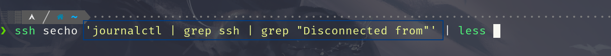
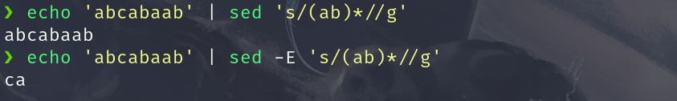

## 安装并配置环境

> 我这个博客仅仅只是对自己的学习过程进行一个简单的记录,肯定会存在一定的问题,如果想系统学习相关知识请务必查看一下以下链接

+ [JYY 实验指导书](https://nju-projectn.github.io/ics-pa-gitbook/ics2021/index.html) 
+ [JYY 计算机系统基础课视频](https://www.bilibili.com/video/BV1qa4y1j7xk?spm_id_from=333.999.header_right.history_list.click)
+ [JYY WIKI](http://jyywiki.cn/)
+ [The Missing Semester of Your CS Education](https://missing.csail.mit.edu/)
+ [PA 实验指南](https://nju-projectn.github.io/ics-pa-gitbook/ics2021/PA0.html)

下载 Ubuntu 镜像文件:
[Ubuntu 21.04 官方镜像文件](https://old-releases.ubuntu.com/releases/21.04/) 
https://composingprograms.com/


```bash
sudo bash -c 'echo "deb http://mirrors.tuna.tsinghua.edu.cn/ubuntu/ hirsute main restricted universe multiverse" > /etc/apt/sources.list'
```

```bash
# update the source
sudo apt-get update
# build-essential packages, include binary utilities, gcc and so on
sudo apt-get install -y build-essential    
sudo apt-get install -y man                # on-line reference manual
sudo apt-get install -y gcc-doc            # on-line reference manual for gcc
sudo apt-get install -y gdb                # GNU debugger
sudo apt-get install -y git                # revision control system
sudo apt-get install -y libreadline-dev    # a library used later
sudo apt-get install -y libsdl2-dev        # a library used later
sudo apt-get install -y llvm 
sudo apt-get install -y make 
sudo apt-get install -y bison
sudo apt-get install -y flex
```
```bash
# use git to download the source code (ics2021)
git clone -b 2021 https://github.com/NJU-ProjectN/ics-pa.git ics2021
```
设置 `git` 相关信息
```bash
git config --global user.name "secho" # your student ID and name
git config --global user.email "zhouhaobusy@163.com"   # your email
git config --global core.editor vim                 # your favorite editor
git config --global color.ui true
```
当我们下载好后 我们进入到 `ics2021` 的目录 

```bash
git branch -m master
bash init.sh nemu
bash init.sh abstract-machine
bash init.sh 
```


```bash
git commit --allow-empty -am "before starting pa1"
git checkout master
git merge pa0
git checkout -b pa1
```

关闭 git 跟踪
```diff
diff --git a/nemu/scripts/git.mk b/nemu/scripts/git.mk
index c9b1708..b7b2e02 100644
--- a/nemu/scripts/git.mk
+++ b/nemu/scripts/git.mk
@@ -9,6 +9,6 @@
 define git_commit
-  -@git add .. -A --ignore-errors
-  -@while (test -e .git/index.lock); do sleep 0.1; done
-  -@(echo "> $(1)" && echo $(STUID) && hostnamectl && uptime) | git commit -F - $(GITFLAGS)
-  -@sync
+# -@git add .. -A --ignore-errors
+# -@while (test -e .git/index.lock); do sleep 0.1; done
+# -@(echo "> $(1)" && echo $(STUID) && hostnamectl && uptime) | git commit -F - $(GITFLAGS)
+# -@sync
 endef
```


## Linux 基础

系统内核存放信息路径 `/sys/class/`

如关于屏幕亮度的 `backlight`
关于电池容量的 `powercap`

```bash
echo 500 | sudo tee /sys/class/backlight/intel_backlight/brightness
```


### Shell 编程

变量赋值左右两边不能有空格,取变量值时应在变量前加 `$` 符号


```bash
foo=bar # correct way
foo = bar # error way
echo $foo 
```
定义字符类型我们有两种方式

```bash
echo "Hello World" # 双引号
echo 'Hello World' # 单引号
```
双引号定义的字符串里面可以包含变量
而单引号则不行


+ `$0` : 代表当前脚本的名字
+ `$1` `$2` `$3` `...` `$n` : 代表第n个参数
+ `$_` : 代表上一个命令的最后一个参数
+ `$?` : 代表上一个命令的错误码 <font color="red" face=Monaco size=3>  一般来讲 0  表示执行正确</font>
+ `$@` : 会将所有的参数都展开来

```bash
# mcd.sh
mcd () {
	mkdir -p "$1";
	cd "$1";
}
```
我们可以将其进行加载 

```bash
~ $ source mcd.sh
~ $ mcd test
~/test $ 
```

<font color="red" face=Monaco size=3> 我们在终端里输入 `!!` 后按一下tab 键会将上一条命令替换掉 `!!`  </font>


我们还可以将命令的结果赋值给变量
```bash
/sys/class >>> foo_path=$(pwd)
/sys/class >>> cd
~ >>> echo $foo_path
/sys/class
```

```
cat <(ls) <(ls ..)
```
相当于将`ls` 操作得到的结果放到一个零时文件里 然后 `ls ..` 操作的结果也放到这个零时文件里,然后将两种结果连接在一起

```bash

#! /bin/bash
echo "Starting program at $(date)" # Date will be subtituted
echo "Running program $0 with $# arguments with pid $$"

for file in "$@"; do
	grep foobar "$file" > /dev/null 2> /dev/null
	# when pattern is not found , grep has exit status 1
	# We redirect STDOUT and STDERR to a null register since we do not care about them
	if [[ "$?" -ne 0 ]]; then
		echo "File $file does not have any foobar adding one"
		echo "# foobar" >> "$file"
	fi
done
```
`[[ "$?" -ne 0 ]]` 如果你看不懂这个语法或许你可以 `man test`

`?` 代表单个字符

```bash
ls progect?
```

```bash
touch project{1,2}/src/test/test{1,2,3}.py
```
如果这时候我们按一下 <kbd class="keybord"> tab </kbd>&ensp;键的话，`zsh` 会将这些参数进行展开

```bash
touch project1/src/test/test1.py project1/src/test/test2.py \
project1/src/test/test3.py project2/src/test/test1.py \
project2/src/test/test2.py project2/src/test/test3.py
```
`{a..e}` 将会展开成 `a b c d e` 
`{1..4}` 将会展开成 `1 2 3 4`

```bash
touch {foo,bar}/{a..j}
```


```bash
diff <(ls foo) <(ls bar)
```


`#!/usr/bin/env python` : 在环境变量里面找到 `python` 这个解释器

可能你的目标系统上并没有内置这个工具,这时你就需要根据直接的系统来安装

`Arch Linux` 安装 `shellcheck` 的命令如下
```bash
sudo pacman -S shellcheck
```


获得命令的大量常用命令示例，帮助我们敲命令
```bash
tldr command  # tldr ffmpeg
curl cheat.sh/command # curl cheat.sh/ffmpeg
```


**我们可以使用 `shellcheck` 命令来检查我们shell脚本编写的规范和正确性**

`find` 命令的使用

`find . -name src -type d`

`find . -path '**/luck/*.py' -type f`

`find . -name '*.tmp' -exec rm {} \;`

`fd` 

`locate` 我们可以使用 `sudo updatedb` 来更新文件索引

`type`

`grep -R foobar .`

`rg "import requests" -t py ~/scratch`
`rg "import requests" -t py -C 5 --stats ~/scratch`
`--stats` 显示匹配的总体相关信息

`rg -u --files-without-match "^#\!" -t sh`
`ag`
`-u` 表示不要忽略文件 
`shebang` -> `#!`

<kbd class="keybord"> Ctrl </kbd> + <kbd class="keybord"> R </kbd>&ensp; 回溯搜索 `backward search`


`[ -f ~/.fzf.zsh ] && source ~/.fzf.zsh`

<kbd class="keybord"> Alt </kbd> + <kbd class="keybord"> F </kbd>&ensp; 在shell 里将光标往前移动一个单词

<kbd class="keybord"> Alt </kbd> + <kbd class="keybord"> B </kbd>&ensp; 在shell 里将光标往前移动一个单词

+ `ls -R`
+ `tree`
+ `broot`
+ `nnn`


## 数据处理 `(Data Wrangling)`


在使用 SSH 连接服务器时我们经常要使用这种方式
而重复次数比较多时就会比较麻烦(有时IP地址忘记了)


我们想使用下面这种方式进行远程主机的连接

```bash
ssh server
```
我们只需要将下面的配置保存到 `~/.ssh/config`
文件即可

```
Host server
Hostname actualServerNameOrIp
User yourUserName
```
不过一下信息你得根据你自己的情况进行相应的更改

+ `server` : 服务名(使用ssh连接时想用的名字)
+ `actualServerNameOrIp` : 真实的服务器名称或者其 IP 地址
+ `yourUserName`: 想要以什么用户去连接该服务器如 `root`

[SSH Essentials:Working with SSH Servers Clients and Keys](https://www.digitalocean.com/community/tutorials/ssh-essentials-working-with-ssh-servers-clients-and-keys) 


我们可以使用以下方式 **( 使用`''` 引号将要运行的命令包裹起来)** 让命令在远程服务器上运行对应的命令然后返回给我们本地


 

我们可以使用 `sed` 命令来过滤我们想要的信息

**而 sed 会将我们不想要的东西根据我们的正则表达式来替换或去除**
相当于vim 里面 `command line` 模式下的替换

```vim
:%s/old_pattern/new_pattern/
```
而且默认也和 vim 一样为一行只替换一次但我们在后面添加 `g` `global` 之后就会全部替换 (只要遇见满足条件的字符串就会替换掉)


我们可以使用 `-E` 来使用扩展正则

```bash
echo 'abcabaab' | sed 's/\(ab\)*//g'
```
```bash
echo 'abcabaab' | sed -E 's/(ab)*//g'
```
```bash
echo 'abacabcabbc' | sed -E 's/(ab|bc)*//g'

```
`(ab)` 里的 `()` 这个括号将 `ab` 字符变成了一个整体,只有 `ab` 这种形式的才会被替换掉




```bash
cat ./secho_log.log | sed 's/.*Disconnected from//'
```
### 命令行环境 `(command line environment)`

我们可以使用这种方式 **`vim $(fzf)`** 来模糊编辑我们的文件

`git rev-parse --abbrev-ref HEAD` 获得当前`git` 分支的名字

`basename $(realpath .)`


`indent` 工具来进行代码格式化

```bash
# indent 格式化输出
# pygmentize 高亮代码
gcc -E ./Demo.c | indent - | pygmentize
```
我们可以使用 `-Wl` 给链接器 `ld` 传参数如 `--verbose`

```bash
gcc -Wl, --verbose ./Demo.c
```
`-n` 打印出所有 make 将运行的命令 `-B` 无条件 make 所有目标
```bash
make -nB
```

## C语言基础

+ [Linux C Programming](https://docs.huihoo.com/c/linux-c-programming/)
+ [JYY's Slide](http://jyywiki.cn/ICS/2020/slides/2.slides#/) 

+ [The Art of Readable Code](https://mcusoft.files.wordpress.com/2015/04/the-art-of-readable-code.pdf) 


### 编译，链接
在 IDE 里，为什么按一个键，就能编译运行？

+ **编译、链接:**
`.c → 预编译 → .i → 编译 → .s → 汇编 → .o → 链接 → a.out`
+ **加载执行:** `./a.out`

背后是通过调用命令行工具完成的

`RTFM: gcc --help; man gcc`
控制行为的三个选项：`-E, -S, -c`


#### 预编译

> 以 `#` `##` 开头的操作符参与预编译

`C` 语言不像现代语言如 `python` 的 `import` 一样会解析 `moudle` 然后将类似于符号表之类的东西导入进来因为在 C 语言那个时代 编译是一个非常宝贵的资源，它会占用非常多的时间，尤其是一个非常大的项目

所以在 C 语言里 `#include` 其实就是将其包含的内容原样包含进来 (复制粘贴)

```c
// the file a.c content
int main()
{
  printf(
    #include "a.inc"
  );
}

// the file a.inc content
#include "b"

// the file b content
"Hello World!"
```


`#include <> 指令`


以下代码有什么区别？

```c
#include <stdio.h>
#include "stdio.h"
```

`#include <SDL2/SDL2.h>`
为什么在没有安装库时会发生错误？

`gcc --verbose` 我们可以使用 `--verbose` 来查看详细的编译日志

我们可以在日志里看见如下信息。也就解释了当我们 `#include<stdio.h>` 系统会以什么方式去查找到这个文件

这时如果我们把 上面的 `a.c`的 `#include "a.inc"` 改成 `#include <a.inc>` 再进行编译发现编译错误,如下：


所有尖括号 `<>` 都会去系统路径上去寻找

当当我们使用 `-I` 选项时我们就能添加指定路径,即使这个路径并不存在 `-I` 和路径之间不能有空格 这是历史遗留问题


这时我们在查看其 `verbose` 信息我们可以发现 在`<..>` 路径里多了当前路径 `.` 所以我们刚刚的编译成功通过了


你可能在书/阅读材料上了解过一些相关的知识
但更好的办法是阅读命令的日志
`gcc --verbose a.c`

有趣的预编译
以下代码会输出什么？

为什么？
```c
#include <stdio.h>

int main() {
#if aa == bb
  printf("Yes\n");
#else
  printf("No\n");
#endif
}
```
+ [ ] 为什么我们每次写 `C` 代码时都要 `#include<stdio.h>` ?

其实我们每次引入 `#include<stdio.h>` 是因为我们需要使用里面的函数 如 `printf` 如果你不需要使用这些函数时，也就不需要`#include` 了

我们将下面这段代码进行编译，发现并没有报错，能成功运行

	

宏定义与展开
宏展开：通过复制/粘贴改变代码的形态

我们发现有预处理的宏是可有可无的,如在 32 位环境下 `__x86_64__` 这个宏就没有被定义而在 64 位下 `__x86_64__` 就被定义了  所以 `aa` 和 `bb`  在一开始就有一定的含义 ( 空的含义 ) 


所以空 `aa` 等于空 `bb` 故编译后运行这段代码将会输出 `Yes`

```c
extern int printf(const char *__restrict __format, ...);
int main() {

#if aa == bb
  printf("Yes\n");
#else
  printf("No\n");
#endif
}
```

+ `#include → 粘贴文件`
+ `aa, bb → 粘贴符号`

因为 C 语言的预处理仅仅只是文本的替换
所以在 C 语言里能使用一下方式进行字符串的拼接

```c
#define ARCH "Arch Linux"
int main()
{
    printf("The arch is " ARCH "\n");
}

// the output is: The arch is Arch Linux
```


```c
#define A "aaaaaaaaaa"
#define TEN(A) A A A A A A A A A A
#define B TEN(A)
#define C TEN(B)
#define D TEN(C)
#define E TEN(D)
#define F TEN(E)
#define G TEN(F)
int main() { puts(G); }

```


如何躲过 Online Judge 的关键字过滤？

**`##` 这个符号其实就是将左边和右边的字符拼接起来**

`#define SYSTEM sys ## tem`


```c
#define foo sys ## tem
int main(){
    foo("echo Hello");
}
```

如何毁掉一个身边的同学？

`#define true (__LINE__ % 16 != 0)`

```c
#define s (((((((((((((((( 0
#define _ * 2)
#define X * 2 + 1)
static unsigned short stopwatch[] = {
  s _ _ _ _ _ X X X X X _ _ _ X X _ ,
  s _ _ _ X X X X X X X X X _ X X X ,
  s _ _ X X X _ _ _ _ _ X X X _ X X ,
  s _ X X _ _ _ _ _ _ _ _ _ X X _ _ ,
  s X X _ _ _ _ _ _ _ _ _ _ _ X X _ ,
  s X X _ X X X X X _ _ _ _ _ X X _ ,
  s X X _ _ _ _ _ X _ _ _ _ _ X X _ ,
  s X X _ _ _ _ _ X _ _ _ _ _ X X _ ,
  s _ X X _ _ _ _ X _ _ _ _ X X _ _ ,
  s _ _ X X X _ _ _ _ _ X X X _ _ _ ,
  s _ _ _ X X X X X X X X X _ _ _ _ ,
  s _ _ _ _ _ X X X X X _ _ _ _ _ _ , };

```

`X-Macros`
宏展开：通过复制/粘贴改变代码的形态

反复粘贴，直到没有宏可以展开为止
例子：X-macro
```c
#define NAMES(X) \
  X(Tom) X(Jerry) X(Tyke) X(Spike)

int main() {
  #define PRINT(x) puts("Hello, " #x "!");
  // # 代表将 # 后面的内容 (x) 作为字符串
  NAMES(PRINT)
}
```

发生在实际编译之前

也称为元编程 (meta-programming)
gcc 的预处理器同样可以处理汇编代码
C++ 中的模板元编程; Rust 的 macros; ...
Pros

提供灵活的用法 (X-macros)
接近自然语言的写法
Cons

破坏可读性 IOCCC、程序分析 (补全)、……
[IOCCC](https://www.ioccc.org/) 
```c
#define L (
int main L ) { puts L "Hello, World" ); }
```


### 编译
一个不带优化的简易 (理想) 编译器

C 代码的连续一段总能找到对应的一段连续的机器指令
这就是为什么大家会觉得 C 是高级的汇编语言！

```c
int foo(int n) {
  int sum = 0;
  for (int i = 1; i <= n; i++) {
    sum += i;
  }
  return sum;
}
```


链接
将多个二进制目标代码拼接在一起

C 中称为编译单元 `(compilation unit)`

甚至可以链接 `C++, rust, ...`代码

当我们编译下面的代码 查看其汇编代码时

我们发现被我们声明成 `C` 代码的函数正确生成对应的 `C` 的汇编 而没被声明成 `C` 代码的函数它的汇编代码 为 C++ 格式 

它有着它特殊的含义 `Z` 代表 返回值为`int` 
`3` 代表函数名字符长度 `bar` 为函数名 `v` 代表 `void` 代表参数为空


```c
extern "C" {
  int foo() { return 0; }
}
int bar() { return 0; }
```


我们可
C 程序执行的两个视角
静态：C 代码的连续一段总能对应到一段连续的机器指令

动态：C 代码执行的状态总能对应到机器的状态

源代码视角
函数、变量、指针……
机器指令视角
寄存器、内存、地址……
两个视角的共同之处：内存

代码、变量 (源代码视角) = 地址 + 长度 (机器指令视角)
(不太严谨地) 内存 = 代码 + 数据 + 堆栈
因此理解 C 程序执行最重要的就是内存模型
从 main 函数开始执行
标准规定 C 程序从 main 开始执行

(思考题：谁调用的 main？进程执行的第一条指令是什么？)
int main(int argc, char *argv[]);
argc (argument count): 参数个数
argv (argument vector): 参数列表 (NULL结束)
上次课已经演示过

`ls -al (argc = 2, argv = ["ls", "-al", NULL])`
main, argc 和 argv
一切皆可取地址！
```c
void printptr(void *p) {
  printf("p = %p;  *p = %016lx\n", p, *(long *)p);
}
int x;
int main(int argc, char *argv[]) {
  printptr(main);  // 代码
  printptr(&main);
  printptr(&x);    // 数据
  printptr(&argc); // 堆栈
  printptr(argv);
  printptr(&argv);
  printptr(argv[0]);
}
```

类型：对一段内存的解读方式

非常 “汇编”——没有 class, polymorphism, type traits, ...
C 里所有的数据都可以理解成是地址 (指针) + 类型 (对地址的解读)
例子 (是不是感到学了假的 C 语言)
```c
int main(int argc, char *argv[]) {
  int (*f)(int, char *[]) = main;
  if (argc != 0) {
    char ***a = &argv, *first = argv[0], ch = argv[0][0];
    printf("arg = \"%s\";  ch = '%c'\n", first, ch);
    assert(***a == ch);
    f(argc - 1, argv + 1);
  }
}
```

C 语言简单 (在可控时间成本里可以精通)

C 语言通用 (大量系统是用 C 语言编写的)
C 语言实现对底层机器的精确控制 (鸿蒙)

### 编写可读代码

我们可以使用 `x-macros` 来对需要大量大体重复的代码进行替换

`find . -name "*.c" -o -name "*.h" | xargs cat | wc -l`
`find . -name "*.c" | xargs grep --color -nse '\<main\>'`

`-n` 添加行号
`-s` 不显示因为文件不存在或者文件无法访问出现的错误信息
`-e` 使用正则表达式
`<...>` 代表以单词为单位

`grep -n main $(find . -name "*.c")`

`globing` : `**`
`vim **/target_file`

我们可以使用 ctags 和 vim 里的跳转来进行代码定位
```bash
# Generate tags for all files in the current directory and all subdirectories:
ctags --recurse 
```
在vim 里我们可以使用 
```vim
set tags=../tags " set the tags file path
tjump tagname " jump to the specific tag
tag tagname " same as the tjump 
```
但是tjump 命令在 tagname 处按 <kbd class="keybord"> tab </kbd>&ensp;键会对其产生相应的提示

[How do i automatically load a tag file from directory when changing directory](https://stackoverflow.com/questions/19330843/how-do-i-automatically-load-a-tag-file-from-a-directory-when-changing-to-that-di) 

如果我们默认使用下面这种方式在终端上并不会显示 ASNI_ESCAPE_CODE 
```bash
ls --color=auto | less
```

而如果我们使用下面命令,则会在终端上显示 ASNI_ESCAPE_CODE

```bash
ls --color | less
```

<font color="red" face=Monaco size=3> 原理: 其实 ls 会检测其标准输出流是否为终端,如果为终端则自适应不输出ASNI_ESCAPE_CODE </font>

```c
#define println(...) \
  do {
	printf(__VA_ARGS__); \
	printf("\n"); \
  } while(0)
```


VSCode: 现代工具来一套？
刚拿到手，VSCode 的体验并不是非常好

满屏的红线/蓝线
因为 Code 并知道 NEMU 是怎么编译的
IDE “编译运行” 背后没有魔法
另一方面，这些东西一定是可以配置的
配置解析选项: c_cpp_properties.json
解锁正确的代码解析
配置构建选项: tasks.json
解锁 make (可跟命令行参数)
配置运行选项: launch.json
解锁单步调试 (我们并不非常推荐单步调试)
插入福利：调试 Segmentation Fault
听说你的程序又 Segmentation Fault 了？

百度 Segmentation Fault 得到的首个回答的解释是完全错误的
正确的解释
指令越权访问内存 (r/w/x)
原因很多，数组越界、memory corruption, ...
指令未被执行，进程收到 SIGSEGV 信号
默认的信号处理程序会 core dump 退出
好的编辑器：也许不是万能的
exec.c 也太难读了吧 (元编程，害死人)

```c
static inline def_EHelper(gp1) { // ???
  ...
  EMPTY(0) 
    // EMPTY(idx)  =>  EX(idx, inv)
    // EX(idx, inv)  =>  EXW(idx, inv, 0)
    // !@%#&%^!#@&%!^@%#$%*^!#@*
}
```
<++>
产生 “这是什么操作” 的困惑：
办法 1: RTFM + RTFSC + 写小程序尝试
办法 2: 预编译以后的代码应该好理解！
还记得我们对 Makefile 的导读吗？
(说的容易做得难。直接 gcc -E 不是编译错误吗……)
总结
怎样读代码？
读代码 ≠ “读” 代码

用正确的工具，使自己感到舒适
但这个过程本身可能是不太舒适的 (走出你的舒适区)
我们看到太多的同学，到最后都没有学会使用编辑器/IDE
要相信一切不爽都有办法解决
信息来源

在 /etc/hosts 中屏蔽百度
去开源社区找 tutorials
例子：vim-galore, awesome-c

