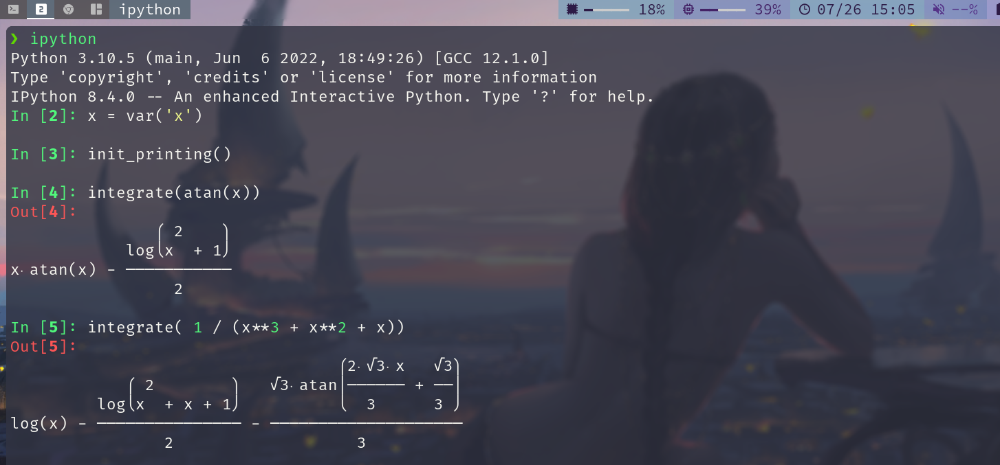

# 操作系统学习


+ [视频链接](https://space.bilibili.com/202224425/video)
+ [课件链接](http://jyywiki.cn/OS/2022/)
+ [Lab链接](https://nju-projectn.github.io/ics-pa-gitbook/ics2021/PA0.html)

## 操作系统概述
- [X] 为什么要学操作系统呢？
+ 为什么要学微积分/离散数学/XXXX/……？
+ 长辈/学长：~~擦干泪不要问为什么~~


微积分 “被混起来” 的几件事

+ Newton 时代的微积分 (启蒙与应用)
	+ 现代方法：Mathematica, sympy, sage
		+ 这也是为什么我主张第一门语言学 Python
+ Cauchy 时代的微积分 (严格化与公理化)
	+ 以及之后各种卡出的 bug (Weierstrass 函数、Peano 曲线……)
+ 微积分的现代应用
优化、有限元、PID……

```python
from sympy import *
x = var('x')
atan(x)
init_printing()
integrate(atan(x))
diff(atan(x))
integrate( 1 / (x**3 + x**2 + x))

```

<font color="red" face=Monaco size=3> 你体内的 “编程力量” 尚未完全觉醒 </font> 

+ 每天都在用的东西，你还没搞明白
	+ 窗口是怎么创建的？为什么 Ctrl-C 有时不能退出程序？
+ 组里的服务器有 128 个处理器，但你的程序却只能用一个 😂
+ 你每天都在用的东西，你却实现不出来
	+ 浏览器、编译器、IDE、游戏/外挂、任务管理器、杀毒软件、病毒……

<font color="red" face=Monaco size=3> 《操作系统》给你有关 “编程” 的全部 </font>

+ 悟性好：学完课程就在系统方向 “毕业”
	+ 具有编写一切 “能写出来” 程序的能力 (具备阅读论文的能力)
+ 悟性差：内力大增
	+ 可能工作中的某一天想起上课提及的内容


## 操作系统上的程序


## 多处理器编程


## 理解并发程序执行


## 并发控制

### 互斥

### 同步

> 如何在多处理器上协同多个线程完成任务？

+ 典型的同步问题：生产者-消费者；哲学家吃饭
+ 同步的实现方法：信号量、条件变量

**概念: 同步(Synchronization)**

<font color=green>两个或两个以上随时间变化的量在变化过程中保持一定的相对关系</font>

+ iPhone/iCloud 同步 (手机 vs 电脑 vs 云端)
+ 变速箱同步器 (合并快慢速齿轮)
+ 同步电机 (转子与磁场速度一致)
+ 同步电路 (所有触发器在边沿同时触发)

<font color="green" face=Consolas> 异步 (Asynchronous) = 不同步 </font>

上述很多例子都有异步版本 (异步电机、异步电路、异步线程)

并发程序中的同步

并发程序的步调很难保持 “完全一致”

线程同步: <font color="red" face=Monaco size=3> 在某个时间点共同达到互相已知的状态 </font> 


## 真实世界的并发编程


## 并发 BUG 与应对


## 操作系统的状态机模型

+ 软件和硬件的桥梁
+ 操作系统的加载和初始化
+ AbstractMachine 代码导读

> OSLabs

+ <font color="red" face=Monaco size=3> Lab0 (amgame): 熟悉代码框架 </font>
+ **Lab1 (pmm):** `Physical memory management`
	+ 多处理器 (bare-metal) 上的 kalloc/free
+ **Lab2 (kmt):** `Kernel multi-threading`
	+ 中断和异常驱动的上下文 (线程) 切换
+ **Lab3 (uproc):** `User processes`
	+ 虚拟地址空间、用户态进程和系统调用
+ **Lab4 (vfs):** `Virtual file system`
	+ devfs, procfs, 简单的文件系统；ELF 加载器

### 硬件和软件的桥梁

我们已经知道如何写一个 “最小” 的 C 程序了：
minimal.S

不需要链接任何库，就能在操作系统上运行

“程序 = 状态机” 没问题

带来更多的疑问

但谁创建的这个状态机？？？

当然是操作系统了……呃……

<font color="red" face=Monaco size=3>  这个程序可以在没有操作系统的硬件上运行吗？
 </font>

“启动” 状态机是由 “加载器” 完成的

加载器也是一段程序 (状态机)

这个程序由是由谁加载的？


## 状态机模型的应用


`strace -T a.out &| nvim -`

## 操作系统上的进程


## 进程的地址空间


## 系统调用和 Shell


## C 标准库的实现


## fork的应用


## 什么是可执行文件

## 动态链接和加载


## xv6 代码导读

### 环境搭建


1. 下载源码
ARCH 环境

```bash
sudo pacman -S riscv64-linux-gnu-gcc

```

```
make qemu

```

 

```bash

make -nB qemu | nvim -
# :set nowrap
# :%s/ /\r /g
<kbd class="keybord"> Ctrl </kbd> + <kbd class="keybord"> A </kbd> + <kbd class="keybord"> X </kbd>&ensp; 退出 QEMU

<kbd class="keybord"> Ctrl </kbd> + <kbd class="keybord"> A </kbd> + <kbd class="keybord"> C </kbd>&ensp; 启动 QEMU 的模拟器


```


我们可以将多处理器改为 1 `-smp 1`


2. 配置 VScode
> 生成一个 compile_commands.json

+ `bear`

```
bear make qemu
```

+ `compiledb`

 


调试 xv6
运行 `gdb`

```
.gdbinit:2: Error in sourced command file:
Undefined item: "riscv:rv64".
```

如果在运行 gdb 时遇见上面的错误我们可以使用
`gdb-multiarch` 

在 linux 里我们可以安装 `riscv64-linux-gnu-gdb`

然后再开一个终端我们运行 `make qemu-gdb`

这时候我们成功在第一条指令上停下来了


## Xv6 上下文切换


## 处理器调度


## 操作系统设计

### 输入输出模型

查看 系统中总线上的设备

`lspci -tv` `lsusb -tv`


`/dev/` 中的对象

+ `/dev/pts/[x] - pseudo terminal`
+ `/dev/null - 'Null' 设备`
+ `/dev/zero - '零' 设备`
+ `/dev/random /dev/urandom - 随机数生成器`

`yes` 

`cat /dev/urandom | head -c 512 | xxd`
`cat /dev/zero | head -c 512 | xxd`

`stty -a`

`man termios`


GPU 编程


gcc -> nvcc

binutils -> cuobjdump

gdb -> cuda-gdb


perf -> nvprof

