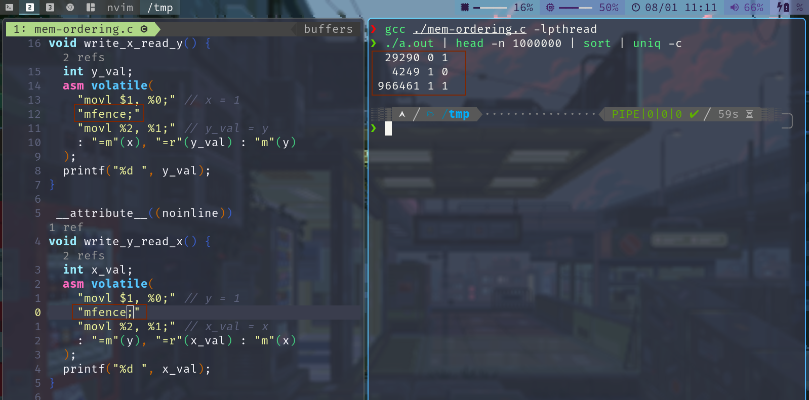

# 操作系统学习


+ [视频链接](https://space.bilibili.com/202224425/video)
+ [课件链接](http://jyywiki.cn/OS/2022/)
+ [阅读材料链接](http://jyywiki.cn/OS/OS_References)

## 操作系统概述
> 阅读材料链接
+ [JYY's read link](http://jyywiki.cn/OS/2022/notes/1)

- [X] 为什么要学操作系统呢？
+ 为什么要学微积分/离散数学/XXXX/……？
+ 长辈/学长：~~擦干泪不要问为什么~~


微积分 “被混起来” 的几件事

+ Newton 时代的微积分 (启蒙与应用)
	+ 现代方法：Mathematica, sympy, sage
		+ 这也是为什么我主张第一门语言学 Python
+ Cauchy 时代的微积分 (严格化与公理化)
	+ 以及之后各种卡出的 bug (Weierstrass 函数、Peano 曲线……)
+ 微积分的现代应用
优化、有限元、PID……

```python
from sympy import *
x = var('x')
atan(x)
init_printing()
integrate(atan(x))
diff(atan(x))
integrate( 1 / (x**3 + x**2 + x))

```

<font color="red" face=Monaco size=3> 你体内的 “编程力量” 尚未完全觉醒 </font> 

+ 每天都在用的东西，你还没搞明白
	+ 窗口是怎么创建的？[为什么 Ctrl-C 有时不能退出程序？](https://stackoverflow.blog/2017/05/23/stack-overflow-helping-one-million-developers-exit-vim/)
+ 组里的服务器有 128 个处理器，但你的程序却只能用一个 😂
+ 你每天都在用的东西，你却实现不出来
	+ 浏览器、编译器、IDE、游戏/外挂、任务管理器、杀毒软件、病毒……

<font color="red" face=Monaco size=3> 《操作系统》给你有关 “编程” 的全部 </font>

+ 悟性好：学完课程就在系统方向 “毕业”
	+ 具有编写一切 “能写出来” 程序的能力 (具备阅读论文的能力)
+ 悟性差：内力大增
	+ 可能工作中的某一天想起上课提及的内容

<div style="border-radius:15px;display:block;background-color:#a8dadc;border:2px solid #aaa;margin:15px;padding:10px;">
充满热情而且相当聪明的学生...早就听说过物理学如何有趣...相对论、量子力学……<br>但是，当他们学完两年以前那种课程后，许多人就泄气了……学的还是斜面、静电这样的内容<br>
<div style="text-align:right;padding:0 15px;">
——《The Feynman Lectures on Physics, 1963》
</div>
</div>


我学《操作系统》的时候 (2009)，大家都说操作系统很难教
- 使用豆瓣评分高达 5.7/10 的 “全国优秀教材
	+ 没有正经的实验 (写一些 16-bit code)
	+ 完全错误的 toolchain，调试全靠蛮力和猜
	+ 为了一点微不足道的分数内卷、沾沾自喜、失去 integrity

+ 这么玩，脖子都要被美国人掐断了
	+ 这门课的另一个意义：告诉你可以去变得更强、真正的强

什么是操作系统?
	
<details>
  <summary style="color:darkcyan">
   What is Operating System ?
  </summary>
  <p>
  Operating System: A body of software, in fact, that is responsible for making it easy to run programs (even allowing you to seemingly run many at the same time), allowing programs to share memory, enabling programs to interact with devices, and other fun stuff like that. (OSTEP)
  </p>
</details>
很多疑点：

+ “programs” 就完了？那么多复杂的程序呢！
+ “shared memory, interact with devices, ...”？


**“管理软/硬件资源、为程序提供服务” 的程序？**


“精准” 的定义毫无意义
问出正确的问题：操作系统如何从一开始变成现在这样的？
+ 三个重要的线索
	+ 计算机 (硬件)
	+ 程序 (软件)
	+ 操作系统 (管理软件的软件)


> 本课程讨论狭义的操作系统
- 对单一计算机硬件系统作出抽象、支撑程序执行的软件系统
- 学术界谈论 “操作系统” 是更广义的 “System” (例子：OSDI/SOSP)

跨时代、非凡的天才设计，但很简单 (还不如我们数电实验课做的 CPU 复杂呢)：

计算机系统 = 状态机 (ICS 课程的 takeaway message)
标准的 Mealy 型数字电路
ENIAC (1946.2.14；请在这个特殊的节日多陪陪你的电脑)

<div align="center">

</div>

---
**电子计算机实现**
- 逻辑门：真空电子管
- 存储器：延迟线 (delay lines)
- 输入/输出：打孔纸带/指示灯
<table>
<tr>
	<td></td>
	<td></td>
	<td></td>
</tr>
<tr>
	<td>逻辑门：真空电子管</td>
	<td>存储器：延迟线 (delay lines)</td>
	<td>输入/输出：打孔纸带/指示灯</td>
</tr>

</table>

ENIAC 程序是用物理线路 “hard-wire” 的

+ 重编程需要重新接线
	+ [ENIAC Simulator](https://www.cs.drexel.edu/~bls96/eniac/); [sieve.e](./OS.Demo/sieve.e)

最早成功运行的一系列程序：打印平方数、素数表、计算弹道……
- 大家还在和真正的 “bugs” 战斗


### 1940s 的操作系统
<div align="center">
<div style="border-radius:10px;display:block;background-color:#a8dadc;border:2px solid #aaa;margin:15px;padding:10px;width:550px;">
没有操作系统！
</div>

</div>

能把程序放上去就很了不起了!
+ 程序直接用指令操作硬件
+ 不需要画蛇添足的程序来管理它
---
### 1950s 的计算机
更快更小的逻辑门 (晶体管)、更大的内存 (磁芯)、丰富的 I/O 设备
+ I/<br>O 设备的速度已经严重低于处理器的速度，中断机制出现 (1953)
<div align='center'>
  
</div>

#### 1950s 的程序
可以执行更复杂的任务，包括通用的计算任务


希望使用计算机的人越来越多；希望调用 API 而不是直接访问设备
Fortran 诞生 (1957)

```fortran
C---- THIS PROGRAM READS INPUT FROM THE CARD READER,
C---- 3 INTEGERS IN EACH CARD, CALCULATE AND OUTPUT
C---- THE SUM OF THEM.
  100 READ(5,10) I1, I2, I3
   10 FORMAT(3I5)
      IF (I1.EQ.0 .AND. I2.EQ.0 .AND. I3.EQ.0) GOTO 200
      ISUM = I1 + I2 + I3
      WRITE(6,20) I1, I2, I3, ISUM
   20 FORMAT(7HSUM OF , I5, 2H, , I5, 5H AND , I5,
     *   4H IS , I6)
      GOTO 100
  200 STOP
      END
---
```

#### 1950s 的程序 (cont'd)
一行代码，一张卡片

看到上面 1, 2, ... 80 的标号了吧！
7-72 列才是真正的语句 (这就是为什么谭浩强要教你要画流程图)

<div align="center">

</div>

#### 1950s 的操作系统


<div align="center">
<div style="border-radius:10px;display:block;background-color:#a8dadc;border:2px solid #aaa;margin:15px;padding:10px;width:550px;">
管理多个程序依次排队运行的库函数和调度器。
</div>

</div>

写程序、跑程序都是非常费事的 (比如你写了个死循环……)
+ 计算机非常贵 ($50,000-$1,000,000)，一个学校只有一台
+ 产生了集中管理计算机的需求： <font color="red" face=Monaco size=3>  多用户排队共享计算机 </font> 

**操作系统的概念开始形成**
+ 操作 (operate) 任务 (jobs) 的系统 (system)
	+ “批处理系统” = 程序的自动切换 (换卡) + 库函数 API
	+ Disk Operating Systems (DOS)
		+ 操作系统中开始出现 “设备”、“文件”、“任务” 等对象和 API

### 1960s 的计算机

<font color="red" face=Monaco size=3> 集成电路、总线出现 </font>
+ 更快的处理器
+ 更快、更大的内存；虚拟存储出现
	+ 可以同时载入多个程序而不用 “换卡” 了
+ 更丰富的 I/O 设备；完善的中断/异常机制
<div align="center">

</div>

#### 1960s 的程序
> 更多的高级语言和编译器出现

+ COBOL (1960), APL (1962), BASIC (1965)
	+ Bill Gates 和 Paul Allen 在 1975 年实现了 Altair 8800 上的 BASIC 解释器
+ 计算机科学家们已经在今天难以想象的计算力下开发惊奇的程序

<div align="center">

</div>

#### 1960s 的操作系统

<div align="center">
<div style="border-radius:10px;display:block;background-color:#a8dadc;border:2px solid #aaa;margin:10px;padding:15px;width:600px;">
能载入多个程序到内存且灵活调度它们的管理程序，包括程序可以调用的 API。
</div>

</div>


<font color="red" face=Monaco size=3> 同时将多个程序载入内存 </font>是一项巨大的能力

+ 有了进程 (process) 的概念
+ 进程在执行 I/O 时，可以将 CPU 让给另一个进程
	+ 在多个地址空间隔离的程序之间切换
	+ 虚拟存储使一个程序出 bug 不会 crash 整个系统

> **操作系统中自然地增加进程管理 API**

#### 1960s 的操作系统 (cont'd)
<font color="red" face=Monaco size=4> 既然操作系统已经可以在程序之间切换，为什么不让它们定时切换呢？ </font>

**基于中断 (例如时钟) 机制**
+ 时钟中断：使程序在执行时，异步地插入函数调用
+ 由操作系统 (调度策略) 决定是否要切换到另一个程序执行
+ Multics (MIT, 1965)
	+ 现代操作系统诞生


### 1970s+ 的计算机
**集成电路空前发展，个人电脑兴起，“计算机” 已与今日无大异**
+ CISC 指令集；中断、I/O、异常、MMU、网络
+ 个人计算机 (PC 机)、超级计算机……
<div align="center">

</div>

#### 1970s+ 的程序
PASCAL (1970), C (1972), …
+ 今天能办到的，那个时代已经都能办到了——上天入地、图像声音视频、人工智能……
+ 个人开发者 (Geek Network) 走上舞台
<div align="center">
<table>


<tr>
	<td></td>
</tr>

<tr>
	<td>Wordstar (1979)</td>
</tr>

</table>
</div>

#### 1970s+ 的操作系统
<div align="center">
<div style="border-radius:10px;display:block;background-color:#a8dadc;border:2px solid #aaa;margin:10px;padding:15px;width:600px;">
分时系统走向成熟，UNIX 诞生并走向完善，奠定了现代操作系统的形态。
</div>

</div>


+ 1973: 信号 API、管道 (对象)、grep (应用程序)
+ 1983: BSD socket (对象)
+ 1984: procfs (对象)……
+ UNIX 衍生出的大家族
	+ `1BSD (1977), GNU (1983), MacOS (1984), AIX (1986), Minix (1987), Windows (1985), Linux 0.01 (1991), Windows NT (1993), Debian (1996), Windows XP (2002), Ubuntu (2004), iOS (2007), Android (2008), Windows 10 (2015), ……`

### 今天的操作系统
<div align="center">
<div style="border-radius:10px;display:block;background-color:#a8dadc;border:2px solid #aaa;margin:15px;padding:15px;width:600px;">
通过 “虚拟化” 硬件资源为程序运行提供服务的软件。
</div>
</div>


**空前复杂的系统之一**
+ 更复杂的处理器和内存
	+ 非对称多处理器 (ARM big.LITTLE; Intel P/E-cores)
	+ Non-uniform Memory Access (NUMA)
	+ 更多的硬件机制 Intel-VT/AMD-V, TrustZone/SGX, TSX, ...
+ 更多的设备和资源
	+ 网卡、SSD、GPU、FPGA...
+ 复杂的应用需求和应用环境
	+ 服务器、个人电脑、智能手机、手表、手环、IoT/微控制器……

**理解操作系统：三个根本问题**

> 操作系统服务谁？

+ <font color="red" face=Monaco size=3> 程序 = 状态机 </font>
+ 课程涉及：多线程 Linux 应用程序
	
> (设计/应用视角) 操作系统为程序提供什么服务？

+ <font color="red" face=Monaco size=3> 操作系统 = 对象 + API </font>
+ 课程涉及：POSIX + 部分 Linux 特性

> j(实现/硬件视角) 如何实现操作系统提供的服务？
+ <font color="red" face=Monaco size=3> 操作系统 = C 程序 </font>
	+ 完成初始化后就成为 interrupt/trap/fault handler
+ 课程涉及：xv6, 自制迷你操作系统

<font color="red" face=Monaco size=3> 计算机专业学生必须具备的核心素质。 </font>

1. 是一个合格的操作系统用户
	+ 会 STFW/RTFM 自己动手解决问题
	+ 不怕使用任何命令行工具
	+ `vim`, `tmux`, `grep`, `gcc`, `binutils`, `...`
2. 不惧怕写代码
	+ 能管理一定规模 (数千行) 的代码
	+ 能在出 bug 时默念 “机器永远是对的、我肯定能调出来的”
		+ 然后开始用正确的工具/方法调试
> 给 “学渣” 们的贴心提示：补基础、补基础、补基础


### 如何学好操作系统

## 操作系统上的程序
复习：操作系统
+ 应用视角 (设计): 一组对象 (进程/文件/...) + API
+ 硬件视角 (实现): 一个 C 程序
本次课回答的问题
---

+ [x] : 到底什么是 “程序”？
	+ 程序的状态机模型 (和编译器)
	+ 操作系统上的 {最小/一般/图形} 程序

### 数字电路与状态机

**数字逻辑电路**

+ 状态 = 寄存器保存的值 (flip-flop)
+ 初始状态 = RESET (implementation dependent)
+ 迁移 = 组合逻辑电路计算寄存器下一周期的值

例子：

1. $X^{\prime} = \neg X \wedge Y$ 
2. $Y^{\prime} = \neg X \wedge  \neg Y$ 


```c
#define REGS_FOREACH(_)  _(X) _(Y)
#define RUN_LOGIC        X1 = !X && Y; \
                         Y1 = !X && !Y;
#define DEFINE(X)        static int X, X##1;
#define UPDATE(X)        X = X##1;
#define PRINT(X)         printf(#X " = %d; ", X);

int main() {
  REGS_FOREACH(DEFINE);
  while (1) { // clock
    RUN_LOGIC;
    REGS_FOREACH(PRINT);
    REGS_FOREACH(UPDATE);
    putchar('\n'); sleep(1);
  }
}
```
> 更完整的实现：数码管显示

输出数码管的配置信号
+ [logisim.c](./OS.Demo/logisim.c)
+ 会编程，你就拥有全世界！
	+ [seven-seg.py](./OS.Demo/seven-seg.py)
	+ 同样的方式可以模拟任何数字系统
		+ 当然，也包括计算机系统
你还体验了 UNIX 哲学

<div style='border-radius:15px;display:block;background-color:#a8dadc;border:2px solid #aaa;margin:15px;padding:10px; font-family:"Source Code Pro";font-size:16px'>
 Make each program do one thing well<br>
Expect the output of every program to become the input to another
Hmm....
 
  <div style='text-align:right;padding:0 15px;'>
  -- Unix philosophy
	
  </div>
</div>

### 什么是程序?(源代码)

你可能需要<font color='red' face=Monaco size=3>《程序设计语言的形式语义》</font> 


程序就是状态机 (你在 gdb 里看到的)
+ 试试程序吧 [hanoi-r.c](./OS.Demo/hanoi-r.c)

```c
#include <stdio.h>
#include "hanoi-r.c"

int main(){
	hanoi(3,'A','B','C');
}
```

`gcc -g main.c`
`gdb a.out`
`layout src`
`start`
`step`
`info frame`

#### C 程序的状态机模型 (语义，semantics)
+ 状态 = 堆 + 栈
+ 初始状态 = main 的第一条语句
+ 迁移 = 执行一条简单语句
	+ 任何 C 程序都可以改写成 “非复合语句” 的 C 代码
	+ [真的有这种工具](https://cil-project.github.io/cil/) (C Intermediate Language) 和[解释器](https://gitlab.com/zsaleeba/picoc)

(这还只是 “粗浅” 的理解)<br>
`Talk is cheap. Show me the code. (Linus Torvalds):`
 任何真正的理解都应该落到可以执行的代码

#### C 程序的语义
C 程序的状态机模型 (语义，semantics)
+ 状态 = stack frame 的列表 (每个 frame 有 PC) + 全局变量
+ 初始状态 = main(argc, argv), 全局变量初始化
+ 迁移 = 执行 top stack frame PC 的语句; PC++
	+ 函数调用 = push frame (frame.PC = 入口)
	+ 函数返回 = pop frame
> 应用：将任何递归程序就地转为非递归

汉诺塔难不倒你 [hanoi-nr.c](./OS.Demo/hanoi-nr.c)

`A → B, B → A `的也难不倒你

+ 还是一样的 call()，但放入不同的 Frame


### 什么是程序？(二进制)
还是状态机

+ 状态 = 内存  + 寄存器 
+ 初始状态 = (稍后回答)
+ 迁移 = 执行一条指令
	+ 我们花了一整个《计算机系统基础》解释这件事
	+ gdb 同样可以观察状态和执行

操作系统上的程序
+ 所有的指令都只能计算
	+ deterministic: mov, add, sub, call, ...
	+ non-deterministic: rdrand, ...
	+ 但这些指令甚至都无法使程序停下来 (NEMU: 加条 trap 指令)

我们的程序有一个初始状态,我们假设程序没有输入，那么程序永远都是从内存取指令执行 `M[R[PC]]` `(M : Memory , R : register)` 那么我们的程序执行过程就是一条直线。

其实并不是这样的，我们有很多指令并不是确定的.
如生成随机数

```C
#inlcude <stdio.h>
#inlucde <unistd.h>
int main(){
	while(1){
		asm volatile("rdrand %rax");
	}
}
```
我们可以调试这个程序 下 `watchpoint` `watch $rax`

当指令为不确定指令时这时候我们的状态机就产生了分叉，然后一直执行并始终有可能回到过去的状态,这时候我们的状态机就进入	了死循环。我们发现这个状态机停都停不下来，会一直执行下去.


<font color='red' face=Monaco size=3>一条特殊的指令 </font> 

>  调用操作系统 syscall

+ 把 $(M,R)$ 完全交给操作系统，任其修改
	+ 一个有趣的问题：如果程序不打算完全信任操作系统？
+ 实现与操作系统中的其他对象交互
	+ 读写文件/操作系统状态 (例如把文件内容写入$M$)
	+ 改变进程 (运行中状态机) 的状态，例如创建进程/销毁自己

程序 = 计算 + syscall
+ [X] 问题：怎么构造一个最小的 Hello, World？

**构造最小的 Hello, World**

```c
int main() {
  printf("Hello, World\n");
}
```
gcc 编译出来的文件不满足 “最小”
+ `--verbose` 可以查看所有编译选项 (真不少)
	+ `printf` 变成了 `puts@plt`
+ `-static` 会复制 `libc` 

<font color='red' face=Monaco size=3>直接硬来？</font><br> 
当我们只对该文件进行编译时，发现这个文件确实挺小


这时候我们能不能直接进行链接呢?<br>
首先ld 给了我们一个警告 说找不到 `_start` 函数，这个我们可以把main函数的名称改成 `_start` 来绕过这个报错,即使是这样还是链接失败，提示找不到 `puts`


这时候我们把 `printf` 给注释掉的话，发现能成功编译并链接，但当我们运行这个编译链接后的程序之后，我们获得了 `Segmentation Fault`


当我们在函数体里加一条 `while(1);` 语句再编译链接，发现程序能正常运行！

那为什么当 `_start` 函数体为空时会出现错误?

我们可以使用 `gdb` 来观察这个程序究竟做了什么

---
**强行编译 + 链接：gcc -c + ld**
+ 直接用 ld 链接失败
	ld 不知道怎么链接库函数……
+ 空的 main 函数倒是可以
	+ 链接时得到奇怪的警告 (可以定义成 _start 避免警告)
	+ 但 Segmentation Fault 了……
+ [x] 问题：为什么会 Segmentation Fault？

+ <font color='red' face=Monaco size=3>当然是观察程序 (状态机) 的执行了</font> 
	+ 初学者必须克服的恐惧：<font color='red' face=Monaco size=3> STFW/RTFM</font> ([Menu 非常有用](https://sourceware.org/gdb/documentation/))
	+ starti 可以帮助我们从第一条指令开始执行程序
		+ gdb 可以在两种状态机视角之间切换 (layout)


**解决异常退出**

有办法让状态机 “停下来” 吗？

+ 纯 “计算” 的状态机：不行
+ 要么死循环，要么 undefined behavior

> 解决办法：syscall
```c
#include <sys/syscall.h>

int main() {
  syscall(SYS_exit, 42);
}
```
调试代码：syscall 的实现在哪里？
+ 坏消息：在 libc 里，不方便直接链接
+ 好消息：代码很短，而且似乎看懂了

Hello, World 的汇编实现

[minimal.S](./OS.Demo/minimal.S)

```armasm
movq $SYS_exit,  %rax   # exit(
movq $1,         %rdi   #   status=1
syscall                 # );
```
Note: gcc 支持对汇编代码的预编译 (还会定义 `__ASSEMBLER__` 宏)

~~我是从哪里获得这些黑科技代码的？？？~~

+ syscall (2), syscalls (2)
	+ The Friendly Manual 才是最靠谱的信息来源

回顾：状态机视角的程序
+ 程序 = 计算 → syscall → 计算 → ...


**彩蛋：ANSI Escape Code**
为什么 Hello World 有颜色？？

特殊编码的字符实现终端控制

+ [vi.c](https://git.busybox.net/busybox/tree/editors/vi.c) from busybox
+ telnet towel.blinkenlights.nl (电影；Ctrl-] and q 退出)
+ dialog --msgbox 'Hello, OS World!' 8 32
+ ssh sshtron.zachlatta.com (网络游戏)
	+ 所以编程可以从一开始就不那么枯燥
	+ 看似复杂，实际简单明了
### 如何在程序的两个视角之间切换

如何在程序的两个视角之间切换？
“状态机” 顺便解决了一个非常重要的基本问题：


什么是编译器？？？

编译器：源代码  (状态机) → 二进制代码  (状态机)

$$
\color{darkcyan}
C = compile(S)
$$

编译 (优化) 的正确性 (Soundness):

+ <font color='red' face=Monaco size=3>S 与 C 的可观测行为严格一致</font> 
	+ system calls; volatile variable loads/stores; termination
+ Trivially 正确 (但低效) 的实现
	+ 解释执行/直接翻译 $S$ 的语义


现代 (与未来的) 编译优化
在保证观测一致性 (sound) 的前提下改写代码 (rewriting)

+ [Inline assembly](http://www.ibiblio.org/gferg/ldp/GCC-Inline-Assembly-HOWTO.html) 也可以参与优化
	+ 其他优化可能会跨过不带 barrier 的 asm volatile
+ Eventual memory consistency
+ Call to external CU = write back visible memory
	+ talk is cheap, show me the code!

这给了我们很多想象的空间
+ Semantic-based compilation (synthesis)
+ AI-based rewriting
+ Fine-grained semantics & system call fusion

<table>
  <tr>
	<td>optimized</td>
	<td>compile barrier</td>
	<td>memory barrier</td>
  </tr>
  <tr>
	<td></td>
	<td></td>
	<td></td>
  </tr>
</table>

<font color='red' face=Monaco size=3>进入 PL 的领域</font> 


> PL 领域 (的很多人) 有一种倾向：用数学化的语言定义和理解一切 (all about semantics)

~~所以你看一眼 paper 就觉得自己瞎了~~
+ 但背后的直觉依然是 system/software 的
	+ (我们是人，不是无情的数学机器 😂)
	+ 溜了溜了，回到 system 的世界

**Further readings**
+ [An executable formal semantics of C with applications](https://dl.acm.org/doi/10.1145/2103621.2103719) (POPL'12) 
  + [Download Paper PDF](./OS.assets/compcert-backend.pdf)
+ [CompCert C verified compiler](https://compcert.org/motivations.html) and a [paper](https://xavierleroy.org/publi/compcert-backend.pdf)(POPL'06, Most Influential Paper Award 🏅)
+ [Copy-and-patch compilation](https://dl.acm.org/doi/10.1145/3485513) (OOPSLA'21, Distinguished Paper 🏅)
  + [Download Paper PDF](./OS.assets/3485513.pdf)

**操作系统中的一般程序**
<div style='border-radius:15px;display:block;background-color:#a8dadc;border:2px solid #aaa;margin:15px;padding:10px;'>
 和 minimal.S 没有本质区别：程序 = 计算 → syscall → ... 
</div>


操作系统收编了所有的硬件/软件资源
+ 只能用操作系统允许的方式访问操作系统中的对象
	+ 从而实现操作系统的 “霸主” 地位
	+ 例子：[tryopen.c](./OS.Demo/tryopen.c)
+ 这是为 “管理多个状态机” 所必须的
	+ 不能打架，谁有权限就给他

**(二进制) 程序也是操作系统中的对象**<br>
可执行文件
+ <font color='red' face=Monaco size=3>与大家日常使用的文件 (a.c, README.txt) 没有本质区别</font> 
+ 操作系统提供 API 打开、读取、改写 (都需要相应的权限)
 
查看可执行文件
+ vim, cat, xxd 都可以直接查看可执行文件
	+ vim 中二进制的部分无法 “阅读”，但可以看到字符串常量
	+ 使用 xxd 可以看到文件以 "\x7f" "ELF" 开头
	+ vscode 有 Hex editor 插件

**系统中常见的应用程序**

1. Core Utilities (coreutils)
+ standard programs for text and file manipulation
+ 系统中安装的是 [GNU Coreutils](https://www.gnu.org/software/coreutils/)
	+ 有较小的替代品 [busybox](https://www.busybox.net/)

2. 系统/工具程序
+ bash, [binutils](https://www.gnu.org/software/binutils/), apt, ip, ssh, vim, tmux, jdk, python, ...
	+ 这些工具的原理都不复杂 (例如 apt 其实只是 dpkg 的壳)
	+ [Ubuntu Packages](https://packages.ubuntu.com/) (和 apt-file 工具) 支持文件名检索
		+ 例子：找不到 SDL2/SDL.h 时...

3. 其他各种应用程序
+ 浏览器、音乐播放器……

操作系统中的程序：Dark Side<br>
> 杀人的面试题 (1)：一个普通的、人畜无害的 Hello World C 程序执行的第一条指令在哪里？

等价问法

+ “二进制程序状态机的初始状态是什么？”
	+ main 的第一条指令 ❌
	+ libc 的 _start ❌

<font color='red' face=Monaco size=3>问 gdb 吧</font> 
  + `info proc {mappings,...}` - 打印进程内存


main() 之前发生了什么？
`ld-linux-x86-64.so` 加载了 `libc`

+ 之后 libc 完成了自己的初始化
	+ RTFM: [libc startup on Hurd](https://www.gnu.org/software/hurd/glibc/startup.html)
	+ main() 的开始/结束并不是整个程序的开始/结束
	+ 例子：[hello-goodbye.c](./OS.Demo/hello-goodbye.c)

谁规定是 ld-linux-x86-64.so，而不是 rtfm.so？
+ readelf 告诉你答案
+ (计算机系统不存在玄学；一切都建立在确定的机制上)
	回顾 gcc --verbose

我们其实完全可以修改 `ld-linux-x86-64.so`
我们先使用vim的替换模式将 `ld-linux-x86-64.so` 替换成我们想替换的路径. 然后在 vim 里 `:%!xxd` 将刚刚多余的替换成 0
替换完之后 `:%!xxd -r` 还原文件.

<table>
  <tr>
	<td>替换目标</td>
	<td>将多余部分填充0</td>
	<td>还原成二进制格式</td>
  </tr>
  <tr>
	<td></td>
	<td></td>
	<td></td>
  </tr>
</table>

操作系统中的程序：Dark Side<br>
> 杀人的面试题 (2)：main 执行之前、执行中、执行后，发生了哪些操作系统 API 调用？

+ (计算机系统不存在玄学；一切都建立在确定的机制上)
+ 所以你应该有一个强烈的信念：这个问题是可以回答的


<span style='color:blue'>
</span>
<details>
  <summary style='color:darkcyan'>
  What is Trace ?
  </summary>
  <p style="color:darkcyan">
  In general, trace refers to the process of following anything from the beginning to the end. For example, the traceroute command follows each of the network hops as your computer connects to another computer.
  </p>
</details>

**打开程序的执行：Trace (踪迹)**

> 这门课中很重要的工具：strace

+ system call trace
+ 理解程序运行时使用的系统调用
	+ demo: strace ./hello-goodbye
	+ **`strace -f gcc ./logisim.c |& vim -`**
	+ 在这门课中，你能理解 strace 的输出并在你自己的操作系统里实现相当一部分系统调用 (mmap, execve, ...)


<font color='red' face=Monaco size=4>本质上，所有的程序和 Hello World 类似</font> 

程序 = 状态机 = 计算 → syscall → 计算 →

+ 被操作系统加载
	+ 通过另一个进程执行 execve 设置为初始状态
+ 状态机执行
	 进程管理：fork, execve, exit, ...
	+ 文件/设备管理：open, close, read, write, ...
	+ 存储管理：mmap, brk, ...
+ 直到 _exit (exit_group) 退出

(初学者对这一点会感到有一点惊讶)
+ 说好的浏览器、游戏、杀毒软件、病毒呢？都是这些 API 吗？

Yes! - 这些 API 就是操作系统的全部
编译器 (gcc)，代表其他工具程序

+ 主要的系统调用：execve, read, write
+ strace -f gcc a.c (gcc 会启动其他进程)
	+ 可以管道给编辑器 vim -
	+ 编辑器里还可以 %!grep (细节/技巧)

图形界面程序 (xedit)，代表其他图形界面程序 (例如 vscode)

+ 主要的系统调用：poll, recvmsg, writev
+ strace xedit
	+ 图形界面程序和 X-Window 服务器按照 X11 协议通信
	+ 虚拟机中的 xedit 将 X11 命令通过 ssh (X11 forwarding) 转发到 Host

**各式各样的应用程序**<br>
都在 <font color='red' face=Monaco size=3>操作系统 API (syscall)</font>  和 <font color='red' face=Monaco size=3>操作系统中的对象</font> 上构建

**1. 窗口管理器**
+ 管理设备和屏幕 (read/write/mmap)
+ 进程间通信 (send, recv)

**2. 任务管理器**
+ 访问操作系统提供的进程对象 (readdir/read)
+ 参考 gdb 里的 info proc *

**3. 杀毒软件**
+ 文件静态扫描 (read)
+ 主动防御 (ptrace)
+ 其他更复杂的安全机制……

## 多处理器编程
Three Easy Pieces: 并发
<span style='color:blue'>
</span>
<details>
  <summary style='color:darkcyan'>
  什么是并发
  </summary>
  <p style='color:darkcyan'>
Concurrent: existing, happening, or done at the same time.
  </p>
</details>

<div style='border-radius:15px;display:block;background-color:#a8dadc;border:2px solid #aaa;margin:15px;padding:10px; font-family:"Source Code Pro"; font-size:14px'>
 In computer science, concurrency refers to the ability of different parts or units of a program, algorithm, or problem to be executed out-of-order or in partial order, without affecting the final outcome.
  <div style='text-align:right;padding:0 15px;'> --( Wikipedia )
  </div>
</div>

> 为什么在这门课 (先) 讲并发？

+ 讲并发
	+ 操作系统是最早的并发程序之一
	+ 今天遍地都是多处理器系统 (为什么？)
+ 先讲并发
	+ 实验是 `bottom-up` 的 (L1: 多处理器上的 `	malloc/free)`


并发的基本单位：线程
共享内存的多个执行流
执行流拥有独立的堆栈/寄存器
共享全部的内存 (指针可以互相引用)
用状态机的视角就很容易理解了！

### 入门： 简化的线程 API

我们为大家封装了超级好用的线程 API **( [thread.h](OS.Demo/thread.h) )**

+ **`create(fn)`**
	+ 创建一个入口函数是 fn 的线程，并立即开始执行
		+  `void fn(int tid) { ... }`
		+ 参数 tid 从 1 开始编号
	+ 语义：在状态中新增 stack frame 列表并初始化为 fn(tid)
+ **`join()`**
	+ 等待所有运行线程的 fn 返回
	+ 在 main 返回时会自动等待所有线程结束
	+ 语义：在有其他线程未执行完时死循环，否则返回
+ 编译时需要增加 `-lpthread`


入门 (cont'd)

> Hello, Multi-threaded World!

```c
#include "thread.h"

void Ta() { while (1) { printf("a"); } }
void Tb() { while (1) { printf("b"); } }

int main() {
  create(Ta);
  create(Tb);
}
```
利用 thread.h 就可以写出利用多处理器的程序！

操作系统会自动把线程放置在不同的处理器上
在后台运行，可以看到 CPU 使用率超过了 100%
入门 (cont'd)
会编程，你就拥有全世界！

如何证明线程确实共享内存？
+ [shm-test.c](./OS.Demo/shm-test.c)

如何证明线程具有独立堆栈 (以及确定它们的范围)？
+ [stack-probe.c](./OS.Demo/stack-probe.c)
	+ (输出有点乱？我们还有 sort!)

更多的习题
+ 创建线程使用的是哪个系统调用？
+ 能不能用 gdb 调试？
+ 基本原则：有需求，就能做到 ( [RTFM](https://sourceware.org/gdb/onlinedocs/gdb/Threads.html))

> thread.h 背后：POSIX Threads

想进一步配置线程？

+ 设置更大的线程栈
+ 设置 detach 运行 (不在进程结束后被杀死，也不能 join)
+ ……

POSIX 为我们提供了线程库 (pthreads)
+ man 7 pthreads
+ 练习：改写 thread.h，使得线程拥有更大的栈
	+ 可以用 stack-probe.c 验证

然而，可怕的事情正在悄悄逼近……
+ 多处理器系统中线程的代码可能同时执行
	+ 两个线程同时执行 x++，结果会是什么呢？
### 放弃 : 原子性

例子：山寨多线程支付宝
```c
unsigned int balance = 100;
int Alipay_withdraw(int amt) {
  if (balance >= amt) {
    balance -= amt;
    return SUCCESS;
  } else {
    return FAIL;
  }
} 
// 2**64 -100
```
两个线程并发支付 ¥100 会发生什么？[alipay.c](./OS.Demo/alipay.c)

账户里会多出用不完的钱！
Bug/漏洞不跟你开玩笑：Mt. Gox Hack 损失 650,000
今天价值 $28,000,000,000

例子：求和
分两个线程，计算$1+1+1\cdots+1$ ( 共计 $2n$ 个 )

```c
#define N 100000000
long sum = 0;

void Tsum() { for (int i = 0; i < N; i++) sum++; }

int main() {
  create(Tsum);
  create(Tsum);
  join();
  printf("sum = %ld\n", sum);
}
```


[sum.c](./OS.Demo/sum.c) 运行结果

119790390, 99872322 (结果可以比 N 还要小), ...

Inline assembly 也不行

只有加了lock `asm volatile("lock add $1,%0": "+m"(sum));`
在 fish 里 `while true; ./a.out; end` 来循环运行程序

当然我们可以将这个程序限制在一个CPU内将会得到正确的答案

```bash
taskset -c 0 mycommand --option  # start a command with the given affinity
taskset -c -pa 0 1234            # set the affinity of a running process
```
使用下面这个命令就能将运行 `a.out` 时将该程序限制在一个 CPU 内
```bash
taskset -c 0 ./a.out --option
```


**原子性的丧失**

<div style='border-radius:15px;display:block;background-color:#a8dadc;border:2px solid #aaa;margin:15px;padding:10px;'>
 “程序 (甚至是一条指令) 独占处理器执行” 的基本假设在现代多处理器系统上不再成立。 
</div>


原子性：一段代码执行 (例如 pay()) 独占整个计算机系统

单处理器多线程
线程在运行时可能被中断，切换到另一个线程执行
多处理器多线程
线程根本就是并行执行的
(历史) 1960s，大家争先在共享内存上实现原子性 (互斥)

但几乎所有的实现都是错的，直到 [Dekker's Algorithm](https://en.wikipedia.org/wiki/Dekker%27s_algorithm)，还只能保证两个线程的互斥


原子性的丧失：有没有感到后怕？
printf 还能在多线程程序里调用吗？

void thread1() { while (1) { printf("a"); } }
void thread2() { while (1) { printf("b"); } }
我们都知道 printf 是有缓冲区的 (为什么？)

如果执行 `buf[pos++] = ch` (pos 共享) 不就 💥 了吗？
RTFM!

实现原子性
互斥和原子性是本学期的重要主题

+ lock(&lk)
+ unlock(&lk)
	+ 实现临界区 (critical section) 之间的绝对串行化
	+ 程序的其他部分依然可以并行执行

**99% 的并发问题都可以用一个队列解决**

+ 把大任务切分成可以并行的小任务
+ worker thread 去锁保护的队列里取任务
+ 除去不可并行的部分，剩下的部分可以获得线性的加速
Thm.$T_n \lt T_{\infty} + \frac{T_1}{n}$ ([PDC](https://web.mit.edu/dimitrib/www/pdc.html), Chap. 1)

### 放弃 ： 顺序
例子：求和 (再次出现)

分两个线程，计算$1+1+1\cdots+1$ ( 共计 $2n$ 个 )

```c
#define N 100000000
long sum = 0;

void Tsum() { for (int i = 0; i < N; i++) sum++; }

int main() {
  create(Tsum);
  create(Tsum);
  join();
  printf("sum = %ld\n", sum);
}
```
我们好像忘记给 [sum.c](OS.Demo/sum.c) 添加编译优化了？

+ -O1: 100000000 😱😱
+ -O2: 200000000 😱😱😱


<font color='red' face=Monaco size=3>顺序的丧失</font> 
<div style='border-radius:15px;display:block;background-color:#a8dadc;border:2px solid #aaa;margin:15px;padding:10px;'>
 编译器对内存访问 “eventually consistent” 的处理导致共享内存作为线程同步工具的失效。
</div>


刚才的例子

+ -O1: `R[eax] = sum; R[eax] += N; sum = R[eax]`	
+ -O2: `sum += N;`
(你的编译器也许是不同的结果)
另一个例子

```c
while (!done);
// would be optimized to
if (!done) while (1);
```

实现源代码的按顺序翻译<br>
在代码中插入 “优化不能穿越” 的 barrier
+ `asm volatile ("" ::: "memory");`
	+ Barrier 的含义是 “可以读写任何内存”
+ 使用 volatile 变量
	+ 保持 C 语义和汇编语义一致
```c
extern int volatile done;
while (!done) ;
```

### 放弃 (3)：可见性

例子
```c
int x = 0, y = 0;

void T1() {
  x = 1;
  asm volatile("" : : : "memory"); // compiler barrier
  printf("y = %d\n", y);
}

void T2() {
  y = 1;
  asm volatile("" : : : "memory"); // compiler barrier
  printf("x = %d\n", x);
}
```
问题：我们最终能看到哪些结果？

+ [mem-ordering.c](OS.Demo/mem-ordering.c)
	+ 输出不好读？ `pipe to head -n 1000000 | sort | uniq -c`

我们会发现出现了一个我们意想不到的结果 `0 0`
根据我们状态机，程序不可能会输出 `0 0`


当我们加了 `mfence;` 指令后程序输出了 "正确的结果"


> 现代处理器：处理器也是 (动态) 编译器！

单个处理器把汇编代码 (用电路) “编译” 成更小的 $\mu ops$

+ RF[9] = load(RF[7] + 400)
+ store(RF[12], RF[13])
+ RF[3] = RF[4] + RF[5]
	+ 每个 $\mu op$ 都有 Fetch, Issue, Execute, Commit 四个阶段


在任何时刻，处理器都维护一个 $\mu op$ 的 “池子”

+ 每一周期向池子补充尽可能多的 $\mu op$
	+ “多发射”
+ 每一周期 (在不违反编译正确性的前提下) 执行尽可能多的 $\mu op$
	+ “乱序执行”、“按序提交”
+ 这就是《计算机体系结构》 (剩下就是木桶效应，哪里短板补哪里)


多处理器间即时可见性的丧失
<div style='border-radius:15px;display:block;background-color:#a8dadc;border:2px solid #aaa;margin:15px;padding:10px;'>
满足单处理器 eventual memory consistency 的执行，在多处理器上可能无法序列化！
</div>

当 $x \neq y$  时，对 $x$ , $y$ 的内存读写可以交换顺序

+ 它们甚至可以在同一个周期里完成 (只要 load/store unit 支持)
+ 如果写 $x$ 发生 cache miss，可以让读 $y$ 先执行
	+ 满足 “ 尽可能执行 $\mu op$ ” 的原则，最大化处理器性能

```armasm
     # <-----------+
movl $1, (x)   #   |
movl (y), %eax # --+
```
+ 在多处理器上的表现
	+ 两个处理器分别看到 $y = 0$ 和 $x = 0$

**宽松内存模型 (Relaxed/Weak Memory Model)**
<div style='border-radius:15px;display:block;background-color:#a8dadc;border:2px solid #aaa;margin:15px;padding:10px;'>
宽松内存模型的目的是使单处理器的执行更高效。
</div>

x86 已经是市面上能买到的 “最强” 的内存模型了 😂

+ 这也是 Intel 自己给自己加的包袱
+ 看看 [ARM/RISC-V](https://research.swtch.com/mem-weak@2x.png) 吧，根本就是个分布式系统

<div align='center'>
  
  <div>
  </div>
( x86-TSO in  <a href="https://research.swtch.com/hwmm">Hardware memory models</a> by Russ Cox )<br>
<a href="./OS.assets/hwmm.pdf">Download PDF Link</a>
</div>

**实现顺序一致性**

<div align='center'>
  
</div>

软件做不到，硬件来帮忙

+ Memory barrier: `__sync_synchronize()` ( [RTFM](https://gcc.gnu.org/onlinedocs/gcc/_005f_005fsync-Builtins.html) )
	+ Compiler barrier + fence 指令
	+ 插入 fence 指令后，将阻止 $x = y = 0$
+ 原子指令 (lock prefix, lr/sc, ...)
	+ `stdatomic.h`

### 总结

本次课回答的问题
+ [x] Q: 如何理解多处理器系统？

> Take-away message

+ 多处理器编程：入门
	+ 多处理器程序 = 状态机 (共享内存；非确定选择线程执行)
	+ thread.h = create + join
+ 多处理器编程：放弃你对 “程序” 的旧理解
	+ 不原子、能乱序、不立即可见
		+ 来自于编译优化 (处理器也是编译器)
		+ [Ad hoc synchronization considered harmful (OSDI'10)](https://www.usenix.org/legacy/events/osdi10/tech/full_papers/Xiong.pdf) 
			+ [Download PDF Link](./OS.assets/Xiong.pdf)


## 理解并发程序执行

### 画状态机

**一个互斥算法**
<div style='border-radius:15px;display:block;background-color:#a8dadc;border:2px solid #aaa;margin:15px;padding:10px;'>
互斥：保证两个线程不能同时执行一段代码。
</div>

插入 “神秘代码”，使得 sum.c (或者任意其他代码) 能够正常工作

```c
void Tsum() {
  // 神秘代码
  sum++;
  // 神秘代码
}
```

假设一个内存的读/写可以保证顺序、原子完成

```c
__sync_synchronize();
x = 1; // 或 int t = x;
__sync_synchronize();
```

失败的尝试

```c
int locked = UNLOCK;

void critical_section() {
retry:
  if (locked != UNLOCK) {
    goto retry;
  }
  locked = LOCK;

  // critical section

  locked = UNLOCK;
}
```

和山寨 [alipay.c](./OS.Demo/alipay.c) 完全一样的错误
+ 处理器默认不保证 `load + store` 的原子性

#### `Peterson 算法`

正确性不明的奇怪尝试 (Peterson 算法)
A 和 B 争用厕所的包厢

+ 想进入包厢之前，A/B 都要先举起自己的旗子
	+ A 确认旗子举好以后，往厕所门上贴上 “B 正在使用” 的标签
	+ B 确认旗子举好以后，往厕所门上贴上 “A 正在使用” 的标签
+ 然后，如果对方的旗子举起来，且门上的名字不是自己，等待
	+ 否则可以进入包厢
+ 出包厢后，放下自己的旗子

**Prove by Brute-force!**<br>
枚举状态机的全部状态 (假设没有乱序、每步执行一行)
+ $PC_1 , PC_2,x,y,turn$; [peterson-simple.c](./OS.Demo/peterson-simple.c)

```c
void TA() {
    while (1) {
/* PC=1 */  x = 1;
/* PC=2 */  turn = B;
/* PC=3 */  while (y && turn == B) ;
            critical_section();
/* PC=4 */  x = 0; } }
void TB() {
  while (1) {
/* PC=1 */  y = 1;
/* PC=2 */  turn = A;
/* PC=3 */  while (x && turn == A) ;
            critical_section();
/* PC=4 */  y = 0; } }
```


Peterson's Protocol Verified 🎖

<div style='border-radius:15px;display:block;background-color:#a8dadc;border:2px solid #aaa;margin:15px;padding:10px;'>
我们 (在完全不理解算法的前提下) 证明了 Sequential 内存模型下 Peterson's Protocol 的 Safety。它能够实现互斥。
</div>


并发编程比大家想象得困难

+ 感受一下 [dekker.py](OS.Demo/dekker.py)

+ "[Myths about the mutual exclusion problem](https://zoo.cs.yale.edu/classes/cs323/doc/Peterson.pdf)" (IPL, 1981)


和一些现状
+ 今天有非常坚 (内) 实 (卷) 的理论体系
+ 小心编译器和多处理器硬件
	+ [peterson-barrier.c](./OS.Demo/peterson-barrier.c) (哪些 barrier 是多余的吗？)
+ [The Art of multiprogramming](./OS.assets/Theartofmulticore.pdf)


画状态机实在太累了
并发算法的设计困境

不敢不画：谁知道有什么奇怪情况会发生？
不敢乱画：画错了就都完了
解决困境 💡

能不能让电脑帮我们画？
我们有程序的形式语义 (数学定义)，就能写解释器模拟执行
说起来容易，但需要写多少代码呢……

年轻人的第一个 Model Checker


选择正确的语言
+ 当然是 Python 啦
+ 容易 hack 的动态语言
+ 丰富的库函数

选正确的语言机制
+ **[model-checker.py](./OS.Demo/model-checker.py) **
	+ ~~代码量达到了惊人的 150 行！~~
	+ UNIX Philosophy: 写能合作的程序
		+ Model checker 只负责输出 “状态图”
+ 试试威力：[mutex-bad.py](./OS.Demo/mutex-bad.py), [peterson-flag.py](./OS.Demo/peterson-flag.py), [dekker.py](./OS.Demo/dekker.py)
	+ 我们的输出格式有什么特别的用意吗？

[visualize.py](./OS.Demo/visualize.py)


代码导读：Python Generator
死循环也能返回？

```python

def numbers(init=0, step=1):
    n = init
    while True:
        n += step
        yield n
```

```shell
>>> g = numbers()
>>> g
<generator object numbers at 0x107f873c0>
>>> g.__next__()
1
>>> g.__next__()
2
```
这个生成器对象其实就是一个状态机，而当我们生成了多个生成器对象时，各自执行 `__next__` 其实就相当于并发执行

```python
T1 = numbers()
T2 = numbers()
T1.__next__() # 相当于 T1 线程执行了一步
T2.__next__() # 相当于 T2 线程执行了一步
```
我们可以使用 pdb 在终端对python程序进行调试 断点处加 `breakpoint()`

> Generator: 也是状态机

g = numbers() 是一个状态机 (类似是线程，但不并发执行)
+ `g.__next__()` 会切换到状态机执行，直到 yield
+ 状态机返回会触发 StopIteration 异常

在 C 语言里同样可以实现 (MiniLab 2)
+ 只要为状态机分配栈空间和寄存器即可
+ yield() 切换到另外的状态机/线程执行


Model Checker: 实现
```python
class Mutex:
    locked = ''

    def T1(self):
        yield checkpoint()
        while True:
            yield checkpoint()
            while self.locked == '🔒':
                yield checkpoint()
                pass
            yield checkpoint()
            self.locked = '🔒'
            ...
```

```python
thread_state = mutex_obj().T1()
thread_state.__next__() # 单步执行一行; see: execute()
```

Model Checker: 实现 (cont'd)
什么是状态空间？

所有可能的状态机执行序列
BFS 生成，合并重复状态
```text
[0]      T1
[1]      T2
[0,0]    T1 -> T1
[0,1]    T1 -> T2
[0,0,0]  T1 -> T1 -> T1
[0,0,1]  T1 -> T1 -> T2
[0,1,0]  T1 -> T2 -> T1
...      ...
```

### Model Checking

Model Checker
<div style='border-radius:15px;display:block;background-color:#a8dadc;border:2px solid #aaa;margin:15px;padding:10px;font-family:"Source Code Pro"'>
Model checking is a method for formally verifying finite-state systems——只要能为系统建立模型，就能用 prove by brute-force 证明正确/找到错误。
</div>

Model checker 的一切就是状态机！

+ Safety: 红色的状态不可到达
	+ $G(V,E)$ 上的可达性问题
+ (Strong) Liveness: 从任意状态出发，都能到达绿/蓝色状态
	+ $G(V,E)$ 上的什么问题？
+ 如何展示这个状态机？
+ 如何能避免无效的探索？

更多的 Model Checker
真实程序的状态空间太大？

+ **[Model checking for programming languages using VeriSoft](https://dl.acm.org/doi/abs/10.1145/263699.263717)** (POPL'97, 第一个 “software model checker”)
	+  [Download Link](./OS.assets/263699.263717.pdf)
+ **[Finding and reproducing Heisenbugs in concurrent programs ](https://dl.acm.org/doi/10.5555/1855741.1855760)**(OSDI'08, Small Scope Hypothesis 🪳🪳🪳) 
	+ [Download Link](./OS.assets/musuvathi.pdf)
+ **[Using model checking to find serious file system errors](https://dl.acm.org/doi/10.1145/1189256.1189259)** (OSDI'04, Best Paper 🏅，可以用在不并发的系统上) 
	+ [Download Liink](./OS.assets/yang.pdf)

不满足于简单的内存模型？
+ **[VSync: Push-button verification and optimization for synchronization primitives on weak memory models](https://dl.acm.org/doi/abs/10.1145/3445814.3446748)** (ASPLOS'21, Distinguished Paper 🏅) [Download Link](./OS.assets/3445814.3446748.pdf)

工具的故事
<div style='border-radius:15px;display:block;background-color:#a8dadc;border:2px solid #aaa;margin:15px;padding:10px;'>
没有人能阻止程序员写 bug，但工具可以。
</div>

至今为止我们用过的自动化工具 (他们拯救了你无数次)

+ Type safety check
+ -Wall -Werror
+ Differential testing
+ Model checker
+ ……

这门课的另一个 take-away
+ 操作系统是一个巨大的工程
+ 没有工具 (编程、测试、调试……)，不做系统

## 并发控制

### 共享内存上的互斥
**回顾：并发编程**

> 理解并发的工具
+ 线程 = 人 (大脑能完成局部存储和计算)
+ 共享内存 = 物理世界 (物理世界天生并行)
+ 一切都是状态机

<div align='center'>
  
  <div>
  “躲进厕所锁上门，我就把全世界人锁在了厕所外”
  </div>
</div>

<br>

**回顾：互斥算法**

互斥 (mutual exclusion)，“互相排斥”
+ 实现 lock_t 数据结构和 lock/unlock API:

```c
typedef struct {
  ...
} lock_t;
void lock(lock_t *lk);
void unlock(lock_t *lk);
```

一把 “排他性” 的锁——对于锁对象 lk
+ 如果某个线程持有锁，则其他线程的 lock <font color='red' face=Monaco size=3>不能返回</font>

在共享内存上实现互斥

失败的尝试
+ [mutex-bad.py](./OS.Demo/mutex-bad.py)

(部分) 成功的尝试
+ [peterson-barrier.c](./OS.Demo/peterson-barrier.c)

实现互斥的根本困难：<font color='red' face=Monaco size=3>不能同时读/写共享内存</font> 
+ load (环顾四周) 的时候不能写，只能 “看一眼就把眼睛闭上”
	+ 看到的东西马上就过时了
+ store (改变物理世界状态) 的时候不能读，只能 “闭着眼睛动手”
	+ 也不知道把什么改成了什么
+ 这是~~简单、粗暴 (稳定)、有效的~~《操作系统》课


### 互斥
#### 自旋锁 （Spin Lock）
解决问题的两种方法
<div style='border-radius:15px;display:block;background-color:#a8dadc;border:2px solid #aaa;margin:15px;padding:10px;'>
  提出算法、解决问题 (Dekker/Peterson/...'s Protocols)
</div>
或者……

<div style='border-radius:15px;display:block;background-color:#a8dadc;border:2px solid #aaa;margin:15px;padding:10px;'>
改变假设 (软件不够，硬件来凑)
</div>

假设硬件能为我们提供一条 “瞬间完成” 的读 + 写指令
+ 请所有人闭上眼睛，看一眼 (load)，然后贴上标签 (store)
	+ 如果多人同时请求，硬件选出一个 “胜者”
	+ “败者” 要等 “胜者” 完成后才能继续执行

### 同步

> 如何在多处理器上协同多个线程完成任务？

+ 典型的同步问题：生产者-消费者；哲学家吃饭
+ 同步的实现方法：信号量、条件变量

x86 原子操作：LOCK 指令前缀
例子：[sum-atomic.c](./OS.Demo/sum-atomic.c)

```c
sum = 200000000
Atomic exchange (load + store)

int xchg(volatile int *addr, int newval) {
  int result;
  asm volatile ("lock xchg %0, %1"
    : "+m"(*addr), "=a"(result) : "1"(newval));
  return result;
}
```
更多的原子指令：[stdatomic.h](https://en.cppreference.com/w/cpp/header/stdatomic.h) (C11)

> 用 xchg 实现互斥

如何协调宿舍若干位同学上厕所问题？
+ 在厕所门口放一个桌子 (共享变量)
	+ 初始时，桌上是 🔑

实现互斥的协议
+ 想上厕所的同学 (一条 xchg 指令)
	+ 天黑请闭眼
	+ 看一眼桌子上有什么 (🔑 或 🔞)
	+ 把 🔞 放到桌上 (覆盖之前有的任何东西)
	+ 天亮请睁眼；看到 🔑 才可以进厕所哦
+ 出厕所的同学
	+ 把 🔑 放到桌上

实现互斥：自旋锁
```c
int table = YES;

void lock() {
retry:
  int got = xchg(&table, NOPE);
  if (got == NOPE)
    goto retry;
  assert(got == YES);
}

void unlock() {
  xchg(&table, YES)
}
```

```c
int locked = 0;
void lock() { while (xchg(&locked, 1)) ; }
void unlock() { xchg(&locked, 0); }
```

实现互斥：自旋锁 (cont'd)
并发编程：千万小心

+ 做详尽的测试 (在此省略，你们做 Labs 就知道了)
+ 尽可能地证明 ([model-checker.py](./OS.Demo/model-checker.py) 和 [spinlock.py](./OS.Demo/spinlock.py))

原子指令的模型
+ 保证之前的 store 都写入内存
+ 保证 load/store 不与原子指令乱序

原子指令的诞生：Bus Lock (80486)
486 (20-50MHz) 就支持 dual-socket 了
<div align='center'>
  
</div>

> Lock 指令的现代实现

在 L1 cache 层保持一致性 (ring/mesh bus)
+ 相当于每个 cache line 有分别的锁
+ store(x) 进入 L1 缓存即保证对其他处理器可见
	+ 但要小心 store buffer 和乱序执行

L1 cache line 根据状态进行协调
+ M (Modified), 脏值
+ E (Exclusive), 独占访问
+ S (Shared), 只读共享
+ I (Invalid), 不拥有 cache line


RISC-V: 另一种原子操作的设计<br>
考虑常见的原子操作：
+ atomic test-and-set
	+ `reg = load(x); if (reg == XX) { store(x, YY); }`
+ lock xchg
	+ `reg = load(x); store(x, XX);`
+ lock add
	+ `t = load(x); t++; store(x, t);`

它们的本质都是：

1. load
2. exec (处理器本地寄存器的运算)
3. store

Load-Reserved/Store-Conditional (LR/SC)

LR: 在内存上标记 reserved (盯上你了)，中断、其他处理器写入都会导致标记消除
```
lr.w rd, (rs1)
  rd = M[rs1]
  reserve M[rs1]
```
SC: 如果 “盯上” 未被解除，则写入

```
sc.w rd, rs2, (rs1)
  if still reserved:
    M[rs1] = rs2
    rd = 0
  else:
    rd = nonzero
```


Compare-and-Swap 的 LR/SC 实现
```c
int cas(int *addr, int cmp_val, int new_val) {
  int old_val = *addr;
  if (old_val == cmp_val) {
    *addr = new_val; return 0;
  } else { return 1; }
}
```

```asm
cas:
  lr.w  t0, (a0)       # Load original value.
  bne   t0, a1, fail   # Doesn’t match, so fail.
  sc.w  t0, a2, (a0)   # Try to update.
  bnez  t0, cas        # Retry if store-conditional failed.
  li a0, 0             # Set return to success.
  jr ra                # Return.
fail:
  li a0, 1             # Set return to failure.
  jr ra                # Return
```

LR/SC 的硬件实现


BOOM (Berkeley Out-of-Order Processor)

+ [riscv-boom](https://github.com/riscv-boom/riscv-boom)
	+ [lsu/dcache.scala](https://github.com/riscv-boom/riscv-boom/blob/master/src/main/scala/lsu/dcache.scala#L655)
	+ 留意 s2_sc_fail 的条件
		+ s2 是流水线 Stage 2
+ (yzh 扒出的代码)
<div align='center'>
  
</div>

#### 互斥锁 (Mutex Lock)
自旋锁的缺陷

性能问题 (0)
+ 自旋 (共享变量) 会触发处理器间的缓存同步，延迟增加

性能问题 (1)
+ 除了进入临界区的线程，其他处理器上的线程都在 <font color='red' face=Monaco size=3>空转</font>
争抢锁的处理器越多，利用率越低

性能问题 (2)

+ 获得自旋锁的线程 <font color='red' face=Monaco size=3>可能被操作系统切换出去</font>
+ 操作系统不 “感知” 线程在做什么
+ (但为什么不能呢？)
+ 实现 100% 的资源浪费


Scalability: 性能的新维度
<div style='border-radius:15px;display:block;background-color:#a8dadc;border:2px solid #aaa;margin:15px;padding:10px;'>
同一份计算任务，时间 (CPU cycles) 和空间 (mapped memory) 会随处理器数量的增长而变化。
</div>


<div>
<div style="width:60%;float:left;font-size:17px">
<ul>
  <li>
  <a href='./OS.Demo/sum-scalability.c'>sum-scalability.c</a>
  </li>
  <li>
  <a href='./OS.Demo/thread-sync.h'>thread-sync.h</a>
  </li>
  <ul>
	<li>
	严谨的统计很难
	</li>
	<ul>
		<li>
		CPU 动态功耗
		</li>
		<li>
		系统其它进程
		</li>
		<li>
		......
		</li>
	</ul>
	  <li>
	  <a href='https://www.cse.unsw.edu.au/~gernot/benchmarking-crimes.html'>Benchmarking crimes</a>
	  </li>
  </ul>
</ul>
</div>

<div style="width:40%;display:block;float:right">
  
</div>

</div>
<div style="clear:both"></div>
<br>

自旋锁的使用场景
+ 临界区几乎不 “拥堵”
+ 持有自旋锁时禁止执行流切换

使用场景： <font color='red' face=Monaco size=3> 操作系统内核的并发数据结构 (短临界区)</font>
+ 操作系统可以关闭中断和抢占
	+ 保证锁的持有者在很短的时间内可以释放锁
+ (如果是虚拟机呢...😂)
	+ PAUSE 指令会触发 VM Exit
+ 但依旧很难做好
	+ [An analysis of Linux scalability to many cores](https://www.usenix.org/conference/osdi10/analysis-linux-scalability-many-cores) (OSDI'10)
		+ [Download PDF Link](./OS.assets/Boyd-Wickizer.pdf)

实现线程 + 长临界区的互斥
<div style='border-radius:15px;display:block;background-color:#a8dadc;border:2px solid #aaa;margin:15px;padding:10px;'>
作业那么多，与其干等 Online Judge 发布，不如把自己 (CPU) 让给其他作业 (线程) 执行？
</div>

“让” 不是 C 语言代码可以做到的 (C 代码只能计算)
+ 把锁的实现放到操作系统里就好啦！
	+ syscall(SYSCALL_lock, &lk);
		+ 试图获得 lk，但如果失败，就切换到其他线程
	+ syscall(SYSCALL_unlock, &lk);
		+ 释放 lk，如果有等待锁的线程就唤醒

实现线程 + 长临界区的互斥 (cont'd)


操作系统 = 更衣室管理员

+ 先到的人 (线程)
	+ 成功获得手环，进入游泳馆
	+ *lk = 🔒，系统调用直接返回
+ 后到的人 (线程)
	+ 不能进入游泳馆，排队等待
	+ 线程放入等待队列，执行线程切换 (yield)
+ 洗完澡出来的人 (线程)
	+ 交还手环给管理员；管理员把手环再交给排队的人
	+ 如果等待队列不空，从等待队列中取出一个线程允许执行
	+ 如果等待队列为空，*lk = ✅
+ <font color='red' face=Monaco size=3> 管理员 (OS) 使用自旋锁确保自己处理手环的过程是原子的</font>

#### Futex = Spin + Mutex

关于互斥的一些分析
自旋锁 (线程直接共享 locked)

+ 更快的 fast path
	+ xchg 成功 → 立即进入临界区，开销很小
+ 更慢的 slow path
	+ xchg 失败 → 浪费 CPU 自旋等待

睡眠锁 (通过系统调用访问 locked)
+ 更快的 slow path
	+ 上锁失败线程不再占用 CPU
+ 更慢的 fast path
	+ 即便上锁成功也需要进出内核 (syscall)

Futex: Fast Userspace muTexes
<div style='border-radius:15px;display:block;background-color:#a8dadc;border:2px solid #aaa;margin:15px;padding:10px;'>
小孩子才做选择。我当然是全都要啦！
</div>

+ Fast path: 一条原子指令，上锁成功立即返回
+ Slow path: 上锁失败，执行系统调用睡眠
	+ 性能优化的最常见技巧
		+ 看 average (frequent) case 而不是 worst case

POSIX 线程库中的互斥锁 (pthread_mutex)

+ [sum-scalability.c](./OS.Demo/sum-scalability.c)，换成 mutex
	+ 观察系统调用 (strace)
	+ gdb 调试
		+ set scheduler-locking on, info threads, thread X

Futex: Fast Userspace muTexes (cont'd)
先在用户空间自旋
+ 如果获得锁，直接进入
+ 未能获得锁，系统调用
+ 解锁以后也需要系统调用
	+ [futex.py](./OS.Demo/futex.py)
	+ 更好的设计可以在 fast-path 不进行系统调用

RTFM (劝退)
+ futex (7), futex (2)
+ [A futex overview and update](https://lwn.net/Articles/360699/) (LWN)
+ [Futexes are tricky](http://jyywiki.cn/pages/OS/manuals/futexes-are-tricky.pdf) (论 model checker 的重要性)
	+ [Download PDF link](./OS.assets/futexes-are-tricky.pdf)
+ (我们不讲并发算法)

---

本次课回答的问题

Q: 如何在多处理器系统上实现互斥？
Take-away message

软件不够，硬件来凑 (自旋锁)
用户不够，内核来凑 (互斥锁)
找到你依赖的假设，并大胆地打破它
Fast/slow paths: 性能优化的重要途径

**概念: 同步(Synchronization)**

<font color=green>两个或两个以上随时间变化的量在变化过程中保持一定的相对关系</font>

+ iPhone/iCloud 同步 (手机 vs 电脑 vs 云端)
+ 变速箱同步器 (合并快慢速齿轮)
+ 同步电机 (转子与磁场速度一致)
+ 同步电路 (所有触发器在边沿同时触发)

<font color="green" face=Consolas> 异步 (Asynchronous) = 不同步 </font>

上述很多例子都有异步版本 (异步电机、异步电路、异步线程)

并发程序中的同步

并发程序的步调很难保持 “完全一致”

线程同步: <font color="red" face=Monaco size=3> 在某个时间点共同达到互相已知的状态 </font> 


## 真实世界的并发编程


## 并发 BUG 与应对


## 操作系统的状态机模型

+ 软件和硬件的桥梁
+ 操作系统的加载和初始化
+ AbstractMachine 代码导读

> OSLabs

+ <font color="red" face=Monaco size=3> Lab0 (amgame): 熟悉代码框架 </font>
+ **Lab1 (pmm):** `Physical memory management`
	+ 多处理器 (bare-metal) 上的 kalloc/free
+ **Lab2 (kmt):** `Kernel multi-threading`
	+ 中断和异常驱动的上下文 (线程) 切换
+ **Lab3 (uproc):** `User processes`
	+ 虚拟地址空间、用户态进程和系统调用
+ **Lab4 (vfs):** `Virtual file system`
	+ devfs, procfs, 简单的文件系统；ELF 加载器

### 硬件和软件的桥梁

我们已经知道如何写一个 “最小” 的 C 程序了：
minimal.S

不需要链接任何库，就能在操作系统上运行

“程序 = 状态机” 没问题

带来更多的疑问

但谁创建的这个状态机？？？

当然是操作系统了……呃……

<font color="red" face=Monaco size=3>  这个程序可以在没有操作系统的硬件上运行吗？
 </font>

“启动” 状态机是由 “加载器” 完成的

加载器也是一段程序 (状态机)

这个程序由是由谁加载的？


## 状态机模型的应用


`strace -T a.out &| nvim -`

## 操作系统上的进程


## 进程的地址空间


## 系统调用和 Shell


## C 标准库的实现


## fork的应用


## 什么是可执行文件

## 动态链接和加载


## xv6 代码导读

### 环境搭建


1. 下载源码
ARCH 环境

```bash
sudo pacman -S riscv64-linux-gnu-gcc

```

```
make qemu

```

 

```bash

make -nB qemu | nvim -
# :set nowrap
# :%s/ /\r /g
<kbd class="keybord"> Ctrl </kbd> + <kbd class="keybord"> A </kbd> + <kbd class="keybord"> X </kbd>&ensp; 退出 QEMU

<kbd class="keybord"> Ctrl </kbd> + <kbd class="keybord"> A </kbd> + <kbd class="keybord"> C </kbd>&ensp; 启动 QEMU 的模拟器


```


我们可以将多处理器改为 1 `-smp 1`


2. 配置 VScode
> 生成一个 compile_commands.json

+ `bear`

```
bear make qemu
```

+ `compiledb`

 


调试 xv6
运行 `gdb`

```
.gdbinit:2: Error in sourced command file:
Undefined item: "riscv:rv64".
```

如果在运行 gdb 时遇见上面的错误我们可以使用
`gdb-multiarch` 

在 linux 里我们可以安装 `riscv64-linux-gnu-gdb`

然后再开一个终端我们运行 `make qemu-gdb`

这时候我们成功在第一条指令上停下来了


## Xv6 上下文切换


## 处理器调度


## 操作系统设计

### 输入输出模型

查看 系统中总线上的设备

`lspci -tv` `lsusb -tv`


`/dev/` 中的对象

+ `/dev/pts/[x] - pseudo terminal`
+ `/dev/null - 'Null' 设备`
+ `/dev/zero - '零' 设备`
+ `/dev/random /dev/urandom - 随机数生成器`

`yes` 

`cat /dev/urandom | head -c 512 | xxd`
`cat /dev/zero | head -c 512 | xxd`

`stty -a`

`man termios`


GPU 编程


gcc -> nvcc

binutils -> cuobjdump

gdb -> cuda-gdb


perf -> nvprof

