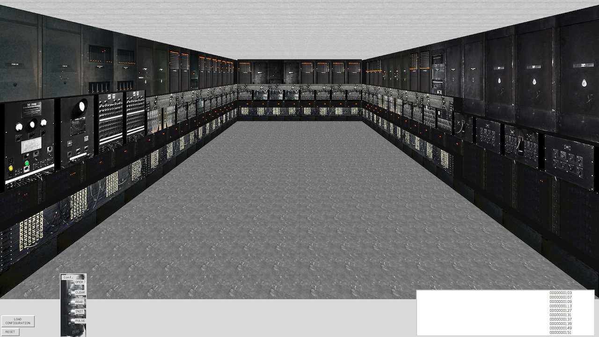

# 操作系统学习


+ [视频链接](https://space.bilibili.com/202224425/video)
+ [课件链接](http://jyywiki.cn/OS/2022/)
+ [Lab链接](https://nju-projectn.github.io/ics-pa-gitbook/ics2021/PA0.html)
+ [阅读材料链接](http://jyywiki.cn/OS/OS_References)

## 操作系统概述
> 阅读材料链接
+ [JYY's read link](http://jyywiki.cn/OS/2022/notes/1)

- [X] 为什么要学操作系统呢？
+ 为什么要学微积分/离散数学/XXXX/……？
+ 长辈/学长：~~擦干泪不要问为什么~~


微积分 “被混起来” 的几件事

+ Newton 时代的微积分 (启蒙与应用)
	+ 现代方法：Mathematica, sympy, sage
		+ 这也是为什么我主张第一门语言学 Python
+ Cauchy 时代的微积分 (严格化与公理化)
	+ 以及之后各种卡出的 bug (Weierstrass 函数、Peano 曲线……)
+ 微积分的现代应用
优化、有限元、PID……

```python
from sympy import *
x = var('x')
atan(x)
init_printing()
integrate(atan(x))
diff(atan(x))
integrate( 1 / (x**3 + x**2 + x))

```

<font color="red" face=Monaco size=3> 你体内的 “编程力量” 尚未完全觉醒 </font> 

+ 每天都在用的东西，你还没搞明白
	+ 窗口是怎么创建的？[为什么 Ctrl-C 有时不能退出程序？](https://stackoverflow.blog/2017/05/23/stack-overflow-helping-one-million-developers-exit-vim/)
+ 组里的服务器有 128 个处理器，但你的程序却只能用一个 😂
+ 你每天都在用的东西，你却实现不出来
	+ 浏览器、编译器、IDE、游戏/外挂、任务管理器、杀毒软件、病毒……

<font color="red" face=Monaco size=3> 《操作系统》给你有关 “编程” 的全部 </font>

+ 悟性好：学完课程就在系统方向 “毕业”
	+ 具有编写一切 “能写出来” 程序的能力 (具备阅读论文的能力)
+ 悟性差：内力大增
	+ 可能工作中的某一天想起上课提及的内容

<div style="border-radius:15px;display:block;background-color:#a8dadc;border:2px solid #aaa;margin:15px;padding:10px;">
充满热情而且相当聪明的学生...早就听说过物理学如何有趣...相对论、量子力学……<br>但是，当他们学完两年以前那种课程后，许多人就泄气了……学的还是斜面、静电这样的内容<br>
<div style="text-align:right;padding:0 15px;">
——《The Feynman Lectures on Physics, 1963》
</div>
</div>


我学《操作系统》的时候 (2009)，大家都说操作系统很难教

- 使用豆瓣评分高达 5.7/10 的 “全国优秀教材
	+ 没有正经的实验 (写一些 16-bit code)
	+ 完全错误的 toolchain，调试全靠蛮力和猜
	+ 为了一点微不足道的分数内卷、沾沾自喜、失去 integrity

+ 这么玩，脖子都要被美国人掐断了
	+ 这门课的另一个意义：告诉你可以去变得更强、真正的强

什么是操作系统?
	
<details>
  <summary style="color:darkcyan">
   What is Operating System ?
  </summary>
  <p>
  Operating System: A body of software, in fact, that is responsible for making it easy to run programs (even allowing you to seemingly run many at the same time), allowing programs to share memory, enabling programs to interact with devices, and other fun stuff like that. (OSTEP)
  </p>
</details>
很多疑点：

+ “programs” 就完了？那么多复杂的程序呢！
+ “shared memory, interact with devices, ...”？


**“管理软/硬件资源、为程序提供服务” 的程序？**


“精准” 的定义毫无意义
问出正确的问题：操作系统如何从一开始变成现在这样的？
+ 三个重要的线索
	+ 计算机 (硬件)
	+ 程序 (软件)
	+ 操作系统 (管理软件的软件)


> 本课程讨论狭义的操作系统
- 对单一计算机硬件系统作出抽象、支撑程序执行的软件系统
- 学术界谈论 “操作系统” 是更广义的 “System” (例子：OSDI/SOSP)

跨时代、非凡的天才设计，但很简单 (还不如我们数电实验课做的 CPU 复杂呢)：

计算机系统 = 状态机 (ICS 课程的 takeaway message)
标准的 Mealy 型数字电路
ENIAC (1946.2.14；请在这个特殊的节日多陪陪你的电脑)

<div align="center">

</div>

---
**电子计算机实现**
- 逻辑门：真空电子管
- 存储器：延迟线 (delay lines)
- 输入/输出：打孔纸带/指示灯
<table>
<tr>
	<td></td>
	<td></td>
	<td></td>
</tr>
<tr>
	<td>逻辑门：真空电子管</td>
	<td>存储器：延迟线 (delay lines)</td>
	<td>输入/输出：打孔纸带/指示灯</td>
</tr>

</table>

ENIAC 程序是用物理线路 “hard-wire” 的

+ 重编程需要重新接线
	+ [ENIAC Simulator](https://www.cs.drexel.edu/~bls96/eniac/); [sieve.e](./OS.Demo/sieve.e)

最早成功运行的一系列程序：打印平方数、素数表、计算弹道……
- 大家还在和真正的 “bugs” 战斗

<div align="center">

</div>

---
### 1940s 的操作系统
<div align="center">
<div style="border-radius:10px;display:block;background-color:#a8dadc;border:2px solid #aaa;margin:15px;padding:10px;width:550px;">
没有操作系统！
</div>

</div>

能把程序放上去就很了不起了!
+ 程序直接用指令操作硬件
+ 不需要画蛇添足的程序来管理它
---
### 1950s 的计算机
更快更小的逻辑门 (晶体管)、更大的内存 (磁芯)、丰富的 I/O 设备
+ I/O 设备的速度已经严重低于处理器的速度，中断机制出现 (1953)
**1950s 的程序**<br>
可以执行更复杂的任务，包括通用的计算任务

希望使用计算机的人越来越多；希望调用 API 而不是直接访问设备
Fortran 诞生 (1957)

```fortran
C---- THIS PROGRAM READS INPUT FROM THE CARD READER,
C---- 3 INTEGERS IN EACH CARD, CALCULATE AND OUTPUT
C---- THE SUM OF THEM.
  100 READ(5,10) I1, I2, I3
   10 FORMAT(3I5)
      IF (I1.EQ.0 .AND. I2.EQ.0 .AND. I3.EQ.0) GOTO 200
      ISUM = I1 + I2 + I3
      WRITE(6,20) I1, I2, I3, ISUM
   20 FORMAT(7HSUM OF , I5, 2H, , I5, 5H AND , I5,
     *   4H IS , I6)
      GOTO 100
  200 STOP
      END
---
```

#### 1950s 的程序 (cont'd)
一行代码，一张卡片

看到上面 1, 2, ... 80 的标号了吧！
7-72 列才是真正的语句 (这就是为什么谭浩强要教你要画流程图)

<div align="center">

</div>

#### 1950s 的操作系统


<div align="center">
<div style="border-radius:10px;display:block;background-color:#a8dadc;border:2px solid #aaa;margin:15px;padding:10px;width:550px;">
管理多个程序依次排队运行的库函数和调度器。
</div>

</div>

写程序、跑程序都是非常费事的 (比如你写了个死循环……)
+ 计算机非常贵 ($50,000-$1,000,000)，一个学校只有一台
+ 产生了集中管理计算机的需求： <font color="red" face=Monaco size=3>  多用户排队共享计算机 </font> 

**操作系统的概念开始形成**
+ 操作 (operate) 任务 (jobs) 的系统 (system)
	+ “批处理系统” = 程序的自动切换 (换卡) + 库函数 API
	+ Disk Operating Systems (DOS)
		+ 操作系统中开始出现 “设备”、“文件”、“任务” 等对象和 API

### 1960s 的计算机

<font color="red" face=Monaco size=3> 集成电路、总线出现 </font>
+ 更快的处理器
+ 更快、更大的内存；虚拟存储出现
	+ 可以同时载入多个程序而不用 “换卡” 了
+ 更丰富的 I/O 设备；完善的中断/异常机制
<div align="center">

</div>

#### 1960s 的程序
**更多的高级语言和编译器出现**

+ COBOL (1960), APL (1962), BASIC (1965)
	+ Bill Gates 和 Paul Allen 在 1975 年实现了 Altair 8800 上的 BASIC 解释器
+ 计算机科学家们已经在今天难以想象的计算力下开发惊奇的程序

<div align="center">

</div>

#### 1960s 的操作系统

<div align="center">
<div style="border-radius:10px;display:block;background-color:#a8dadc;border:2px solid #aaa;margin:10px;padding:15px;width:600px;">
能载入多个程序到内存且灵活调度它们的管理程序，包括程序可以调用的 API。
</div>

</div>


<font color="red" face=Monaco size=3> 同时将多个程序载入内存 </font>是一项巨大的能力

+ 有了进程 (process) 的概念
+ 进程在执行 I/O 时，可以将 CPU 让给另一个进程
	+ 在多个地址空间隔离的程序之间切换
	+ 虚拟存储使一个程序出 bug 不会 crash 整个系统

> **操作系统中自然地增加进程管理 API**

#### 1960s 的操作系统 (cont'd)
<font color="red" face=Monaco size=4> 既然操作系统已经可以在程序之间切换，为什么不让它们定时切换呢？ </font>

**基于中断 (例如时钟) 机制**
+ 时钟中断：使程序在执行时，异步地插入函数调用
+ 由操作系统 (调度策略) 决定是否要切换到另一个程序执行
+ Multics (MIT, 1965)
	+ 现代操作系统诞生


### 1970s+ 的计算机
**集成电路空前发展，个人电脑兴起，“计算机” 已与今日无大异**
+ CISC 指令集；中断、I/O、异常、MMU、网络
+ 个人计算机 (PC 机)、超级计算机……
<div align="center">

</div>

#### 1970s+ 的程序
PASCAL (1970), C (1972), …
+ 今天能办到的，那个时代已经都能办到了——上天入地、图像声音视频、人工智能……
+ 个人开发者 (Geek Network) 走上舞台
<div align="center">
<table>


<tr>
	<td></td>
</tr>

<tr>
	<td>Wordstar (1979)</td>
</tr>

</table>
</div>

#### 1970s+ 的操作系统
<div align="center">
<div style="border-radius:10px;display:block;background-color:#a8dadc;border:2px solid #aaa;margin:10px;padding:15px;width:600px;">
分时系统走向成熟，UNIX 诞生并走向完善，奠定了现代操作系统的形态。
</div>

</div>


+ 1973: 信号 API、管道 (对象)、grep (应用程序)
+ 1983: BSD socket (对象)
+ 1984: procfs (对象)……
+ UNIX 衍生出的大家族
	+ `1BSD (1977), GNU (1983), MacOS (1984), AIX (1986), Minix (1987), Windows (1985), Linux 0.01 (1991), Windows NT (1993), Debian (1996), Windows XP (2002), Ubuntu (2004), iOS (2007), Android (2008), Windows 10 (2015), ……`

### 今天的操作系统
<div align="center">
<div style="border-radius:10px;display:block;background-color:#a8dadc;border:2px solid #aaa;margin:15px;padding:15px;width:600px;">
通过 “虚拟化” 硬件资源为程序运行提供服务的软件。
</div>
</div>


**空前复杂的系统之一**
+ 更复杂的处理器和内存
	+ 非对称多处理器 (ARM big.LITTLE; Intel P/E-cores)
	+ Non-uniform Memory Access (NUMA)
	+ 更多的硬件机制 Intel-VT/AMD-V, TrustZone/SGX, TSX, ...
+ 更多的设备和资源
	+ 网卡、SSD、GPU、FPGA...
+ 复杂的应用需求和应用环境
	+ 服务器、个人电脑、智能手机、手表、手环、IoT/微控制器……

**理解操作系统：三个根本问题**

> 操作系统服务谁？

+ <font color="red" face=Monaco size=3> 程序 = 状态机 </font>
+ 课程涉及：多线程 Linux 应用程序
	
> (设计/应用视角) 操作系统为程序提供什么服务？

+ <font color="red" face=Monaco size=3> 操作系统 = 对象 + API </font>
+ 课程涉及：POSIX + 部分 Linux 特性

> j(实现/硬件视角) 如何实现操作系统提供的服务？
+ <font color="red" face=Monaco size=3> 操作系统 = C 程序 </font>
	+ 完成初始化后就成为 interrupt/trap/fault handler
+ 课程涉及：xv6, 自制迷你操作系统

<font color="red" face=Monaco size=3> 计算机专业学生必须具备的核心素质。 </font>

1. 是一个合格的操作系统用户
	+ 会 STFW/RTFM 自己动手解决问题
	+ 不怕使用任何命令行工具
	+ vim, tmux, grep, gcc, binutils, ...
2. 不惧怕写代码
	+ 能管理一定规模 (数千行) 的代码
	+ 能在出 bug 时默念 “机器永远是对的、我肯定能调出来的”
		+ 然后开始用正确的工具/方法调试
> 给 “学渣” 们的贴心提示：补基础、补基础、补基础


### 如何学好操作系统

## 操作系统上的程序
复习：操作系统

应用视角 (设计): 一组对象 (进程/文件/...) + API
硬件视角 (实现): 一个 C 程序
本次课回答的问题

Q: 到底什么是 “程序”？
本次课主要内容

程序的状态机模型 (和编译器)
操作系统上的 {最小/一般/图形} 程序


数字逻辑电路

状态 = 寄存器保存的值 (flip-flop)
初始状态 = RESET (implementation dependent)
迁移 = 组合逻辑电路计算寄存器下一周期的值
例子：
+ $X^{\prime} = \neg X \wedge Y$ 
+ $Y^{\prime} = \neg X \wedge  \neg Y$ 

```c
#define REGS_FOREACH(_)  _(X) _(Y)
#define RUN_LOGIC        X1 = !X && Y; \
                         Y1 = !X && !Y;
#define DEFINE(X)        static int X, X##1;
#define UPDATE(X)        X = X##1;
#define PRINT(X)         printf(#X " = %d; ", X);

int main() {
  REGS_FOREACH(DEFINE);
  while (1) { // clock
    RUN_LOGIC;
    REGS_FOREACH(PRINT);
    REGS_FOREACH(UPDATE);
    putchar('\n'); sleep(1);
  }
}
```


## 多处理器编程


## 理解并发程序执行


## 并发控制

### 互斥

### 同步

> 如何在多处理器上协同多个线程完成任务？

+ 典型的同步问题：生产者-消费者；哲学家吃饭
+ 同步的实现方法：信号量、条件变量

**概念: 同步(Synchronization)**

<font color=green>两个或两个以上随时间变化的量在变化过程中保持一定的相对关系</font>

+ iPhone/iCloud 同步 (手机 vs 电脑 vs 云端)
+ 变速箱同步器 (合并快慢速齿轮)
+ 同步电机 (转子与磁场速度一致)
+ 同步电路 (所有触发器在边沿同时触发)

<font color="green" face=Consolas> 异步 (Asynchronous) = 不同步 </font>

上述很多例子都有异步版本 (异步电机、异步电路、异步线程)

并发程序中的同步

并发程序的步调很难保持 “完全一致”

线程同步: <font color="red" face=Monaco size=3> 在某个时间点共同达到互相已知的状态 </font> 


## 真实世界的并发编程


## 并发 BUG 与应对


## 操作系统的状态机模型

+ 软件和硬件的桥梁
+ 操作系统的加载和初始化
+ AbstractMachine 代码导读

> OSLabs

+ <font color="red" face=Monaco size=3> Lab0 (amgame): 熟悉代码框架 </font>
+ **Lab1 (pmm):** `Physical memory management`
	+ 多处理器 (bare-metal) 上的 kalloc/free
+ **Lab2 (kmt):** `Kernel multi-threading`
	+ 中断和异常驱动的上下文 (线程) 切换
+ **Lab3 (uproc):** `User processes`
	+ 虚拟地址空间、用户态进程和系统调用
+ **Lab4 (vfs):** `Virtual file system`
	+ devfs, procfs, 简单的文件系统；ELF 加载器

### 硬件和软件的桥梁

我们已经知道如何写一个 “最小” 的 C 程序了：
minimal.S

不需要链接任何库，就能在操作系统上运行

“程序 = 状态机” 没问题

带来更多的疑问

但谁创建的这个状态机？？？

当然是操作系统了……呃……

<font color="red" face=Monaco size=3>  这个程序可以在没有操作系统的硬件上运行吗？
 </font>

“启动” 状态机是由 “加载器” 完成的

加载器也是一段程序 (状态机)

这个程序由是由谁加载的？


## 状态机模型的应用


`strace -T a.out &| nvim -`

## 操作系统上的进程


## 进程的地址空间


## 系统调用和 Shell


## C 标准库的实现


## fork的应用


## 什么是可执行文件

## 动态链接和加载


## xv6 代码导读

### 环境搭建


1. 下载源码
ARCH 环境

```bash
sudo pacman -S riscv64-linux-gnu-gcc

```

```
make qemu

```

 

```bash

make -nB qemu | nvim -
# :set nowrap
# :%s/ /\r /g
<kbd class="keybord"> Ctrl </kbd> + <kbd class="keybord"> A </kbd> + <kbd class="keybord"> X </kbd>&ensp; 退出 QEMU

<kbd class="keybord"> Ctrl </kbd> + <kbd class="keybord"> A </kbd> + <kbd class="keybord"> C </kbd>&ensp; 启动 QEMU 的模拟器


```


我们可以将多处理器改为 1 `-smp 1`


2. 配置 VScode
> 生成一个 compile_commands.json

+ `bear`

```
bear make qemu
```

+ `compiledb`

 


调试 xv6
运行 `gdb`

```
.gdbinit:2: Error in sourced command file:
Undefined item: "riscv:rv64".
```

如果在运行 gdb 时遇见上面的错误我们可以使用
`gdb-multiarch` 

在 linux 里我们可以安装 `riscv64-linux-gnu-gdb`

然后再开一个终端我们运行 `make qemu-gdb`

这时候我们成功在第一条指令上停下来了


## Xv6 上下文切换


## 处理器调度


## 操作系统设计

### 输入输出模型

查看 系统中总线上的设备

`lspci -tv` `lsusb -tv`


`/dev/` 中的对象

+ `/dev/pts/[x] - pseudo terminal`
+ `/dev/null - 'Null' 设备`
+ `/dev/zero - '零' 设备`
+ `/dev/random /dev/urandom - 随机数生成器`

`yes` 

`cat /dev/urandom | head -c 512 | xxd`
`cat /dev/zero | head -c 512 | xxd`

`stty -a`

`man termios`


GPU 编程


gcc -> nvcc

binutils -> cuobjdump

gdb -> cuda-gdb


perf -> nvprof

