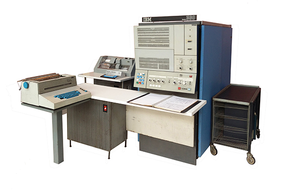

return address -> x1
alternate link register  -> x5
stack pointer -> x2

+ [RISC-V specification Volume 1](https://github.com/riscv/riscv-isa-manual/releases/download/draft-20190328-b8e008d/riscv-spec.pdf)
+ [RISC-V privileged Volume 2](https://github.com/riscv/riscv-isa-manual/releases/download/draft-20190328-b8e008d/riscv-privileged.pdf) 
+ [中文版](http://riscvbook.com/chinese/) 
## ISA 的基本介绍
ISA `(Instruction Set Architecture)` 指令集架构：是底层硬件电路面向上层软件程序提供的一层**接口规范**
> 它其实相当于一套标准类似与 `POSIX` 标准

ISA 定义了：
+ 基本数据类型 `Byte,Word,HalfWord...`
+ 寄存器 `(Register)`
+ 指令
+ 寻址方式
+ 异常或者中断的处理方式
+ 等等...

为什么要设计 ISA ？
为上层软件提供一层抽象，制定规则和约束，让编程人员不用担心具体电路结构
IBM 360 是第一个将 ISA 与其分离实现的计算机

[IBM 360 major components](http://www.ibmsystem3.nl/System360/index.html) 

+ CISC: 复杂指令集 (Complex Instruction Set Computing)
**针对特定的功能实现特定的指令** 导致指令数目比较多，但生成的程序长度相对较短。

+ RISC 精简指令集 (Reduced Instruction Set Computing)
**只定义常用指令，对复杂的功能采用常用指令组合实现**，这导致指令数目比较精简，但生成的程序长度相对较长.

> 现如今，RISC 和 CISC 也逐渐有相互融合的趋势

ISA (处理器) 的宽度指的是 CPU 中 **通用寄存器** 的宽度 (二进制的位数)，这决定了寻址范围的大小，以及数据运算的能力。

 注意一个问题：ISA的宽度和指令编码长度无关 

`X86` `SPARC` `Power` `ARM` `MIPS` `RISC-V`

## RISC-V ISA 基本介绍

| 领域 | 开放标准 | 开源实现 | 闭源实现 |
|:-:|:-:|:-:|:-:|
| 操作系统 | POSIX | Linux，FreeBSD | Windows |
| 编译器 | C | Gcc，LLVM... | Intel icc, ARMcc... |
| 数据库 | SQL | MySQL... | Oracle,DB2... |
| ISA | ??? | .... | X86,ARM |

RISC-V 读做 `risk-five` 代表着 Berkeley 第5代精简指令集

该项目 2010 年始于加州大学伯克利（Berkeley）分校，希望选择一款 ISA 用于科研和教学。经过前期多年的研究和选型，最终决定放弃使用现成的 X86 和 ARM 等 ISA，而是自己从头研发一款

+ X86：太复杂，IP 问题 
+ ARM：一样的复杂，而且在 2010 年之前还不支持 64 位，以及同样的 IP 问题。

RISC-V 的特点
+ 简单
+ 清晰的分层设计
+ 模块化
+ 稳定
+ 社区化

ISA 命名格式：**`RV[###][abc…..xyz]`**
+ RV：用于标识 RISC-V 体系架构的前缀，即 RISC-V 的缩写。
+ `[###]`：`{32, 64, 128}` 用于标识处理器的字宽，也就是 处理器的寄存器的宽度（单位为 bit）
+ `[abc…xyz]`：标识该处理器支持的指令集模块集合。 

例子：RV32IMA，RV64GC
	
| 基本指令集 | 描述  |
|:-:|:-: |
|`RV32I (Integer)` | 32 位整数指令集  |
| `RV32E (Embeded)`| RV32I 的子集，用于小型的嵌入场景  |
| `RV64I` | 64位整数指令集，兼容 RV32I  |
| `RV128I` | 128位整数指令集，兼容RV64I和RV32I|

| 扩展指令集 | 描述  |
|:-:|:-: |
| M | 整数乘法 `(Multiplication)` 与除法指令集 |
| A | 存储原子 `(Automic)` 指令集  |
| F | 单精度 `(32bit)` 浮点 `(Float)` 指令集  |
| D | 双精度 `(64bit)` 浮点 `(Double)` 指令集  |
| C | 压缩 `(Compressed)` 指令集  |
| ... | 其它标准化和未标准化的指令集  |

例子:
+ RV32I: 最基本的 RISC-V 实现 
+ RV32IMAC: 32 位实现，支持 Integer + Multiply + Atomic + Compressed 
+ RV64GC: 64 位实现，支持 IMAFDC 

通用寄存器 `（General Purpose Registers）`
+ RISC-V 的 Unprivileged Specification 定义了 32 个通用寄存器 以及一个 PC
+ 对 RV32I/RV64I/RV128I 都一样 
+ 如果实现支持 F/D 扩展则需要额外支持 32 个 浮点（Float Point）寄存器
+ RV32E 将 32 个通用寄存器缩减为 16 个。
+ 寄存器的宽度由 ISA 指定
+ RV32 的寄存器宽度为 32 位
+ RV64 的寄存器宽度为 64 位，依次 类推。
+ 每个寄存器具体编程时有特定的用途以及 各自的别名。由 `RISC-V Application Binary Interface (ABI)` 定义。

RISC-V 的 Privileged Specification 定义了三个特权级 别（privilege level） Ø Machine 级别是最高的级别，所 有的实现都需要支持。 Ø 可选的 Debug 级别

Control and Status Registers (CSR) Ø 不同的特权级别下时分别对应各自的一套 Registers (CSR)，用于控制（Control）控 制和获取相应 Level 下的处理器工作状态。 Ø 高级别的特权级别下可以访问低级别的 CSR， 譬如 Machine Level 下可以访问 Supervisor/User Level 的 CSR，以此类推； 但反之不可以。 Ø RISC-V 定义了专门用于操作 CSR 的指令 （【参考1】中定义的“Zicsr”扩展）。 Ø RISC-V 定义了特定的指令可以用于在不同 特权级别之间进行切换（【参考1】中定义 的 ECALL/EBREAK）。

内存管理与保护 Ø 虚拟内存（Virtual Memory） • 需要支持 Supervisor Level • 用于实现高级的操作系统特性 （Unix/Linux） • 多种映射方式 Sv32/Sv39/Sv48 Ø 物理内存保护（Physical Memory Protection，PMP） • 允许 M 模式指定 U 模式可以访 问的内存地址。 • 支持 R/W/X，以及 Lock

异常（Exception）：“an unusual condition occurring at run time associated with an instruction in the current RISC-V hart” Ø 中断（Interrupt）：“an external asynchronous event that may cause a RISC-V hart to experience an unexpected transfer of control”
