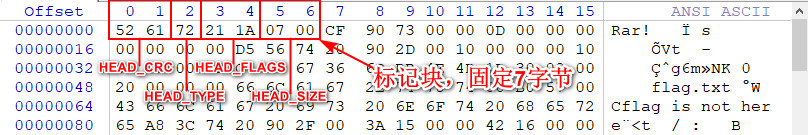
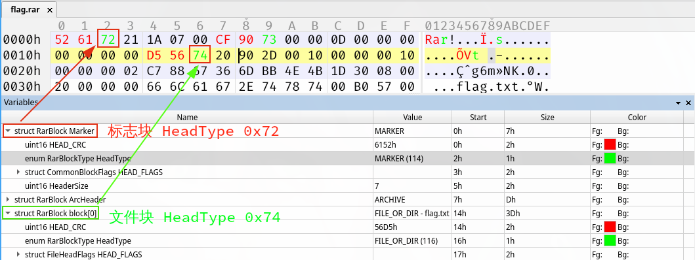
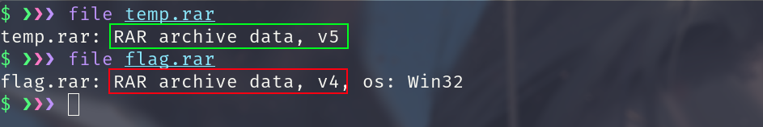
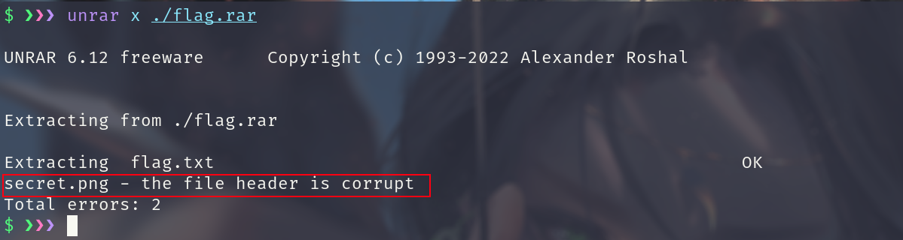
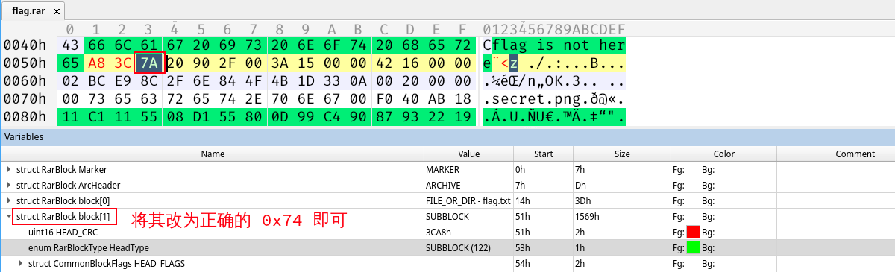
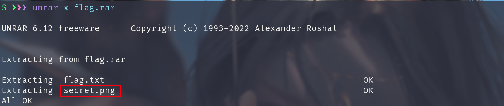
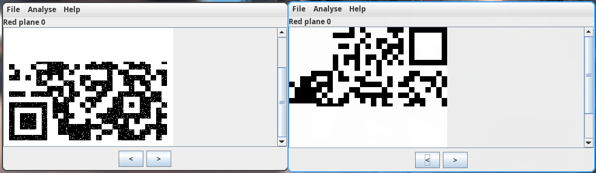

# 压缩包隐写

+ 了解 ZIP和RAR 文件的格式
+ 掌握压缩包常见的考题
+ 掌握解决压缩包类型问题的思路和工具的使用方式
+ 需要准备的工具
	+ ARCHPR
	+ fcrackzip
	+ Ziperello

## 压缩文件格式

### RAR

RAR 文件格式

[RAR 5.0 file format details](https://www.rarlab.com/technote.htm)

RAR 是一种文件压缩与归档的私有文件格式，用于数据压缩与归档打包，简单的说就是将原有的文件数据经过压缩处理之后保存为 RAR 文件格式后缀，通常 Windows 用户比较常见的压缩软件 WinRAR,通过使用 WinRAR 对文件数据进行压缩后默认保存的文件格式就是 RAR格式。

RAR 文件主要由标记块，压缩文件头块，文件头块，结尾块组成。其每一块大致分为以下几个字段

| 组成部分 | 大小 | 功能  |
|:-:|:-:|:-: |
| `HEAD_CRC` | 2 字节 | 全部块或块部分的 CRC  |
| `HEAD_TYPE` | 1 字节 | 块类型  |
| `HEAD_FLAGS`| 2 字节 | 阻止标志  |
| `HEAD_SIZE`| 2 字节 | 块大小  |
| `ADD_SIZE`| 4 字节 | 可选字段 - 添加块大小  |

RAR 的块头部

`0x526172211A0701` 为 RARv5 的文件头 

RAR 压缩包的文件头为 `0x52 61 72 21 1A 07 00`,紧跟着文件头 (`0x526172211A0700`) 的是标志块 (`MARK_HEAD`) 其后还有文件头 (`File Header`), 每个块的头部如下表所示:

| 组成部分 | 标志块 | 归档头部 | 文件块 | 结束块  |
|:-:|:-:|:-:|:-:|:-: |
| `HEAD_CRC` | 0x6152 | 全部块或块部分的 CRC | 文件名从 type 到 fileattr 的 CRC | 0x3DC4  |
| `HEAD_TYPE` | 0x72 | 块类型 | 0x74 | 0x7B  |
| `HEAD_FLAGS`| 0x1A21 | 阻止标志 | 位标志 (伪加密) | 0x4000  |
| `HEAD_SIZE`| 0x0007 | 块大小 | 文件块大小包括文件名 | 0x0007  |

 文件块这边需要注意一下 HEAD_FLAGS 这个头部，其中 HEAD_FLAGS 的低三位代表加密标志，此位若被置为一，则文件使用了基于密钥的加密。 

## ZIP

ZIP 文件格式

ZIP 文件格式是一种数据压缩和文档存储的文件格式原名 `Deflate`，发明者为 菲尔卡茨 (Phil Katz) 他于 1989 年 1 月公布了该格式的资料。ZIP 通常使用后缀名 zip,当前，ZIP 格式属于几种主流的压缩格式之一，其竞争者包括 RAR 格式以及开放源码的 7z 格式，通常情况下，我们用到的 ZIP 文件格式:  压缩源文件数据区| 文件头 + 文件数据 + 数据描述符(此处可重复多次) + 核心目录 + 目录结束符 

当压缩包中有多个文件时，就会有多个  ( 文件头 + 文件数据 + 数据描述符)  

| 名称 | 功能  |
|:-:|:-: |
| 压缩源文件数据区 |记录着压缩的所有文件的内容信息，每个压缩文件都由文件头，文件数据，数据描述符三部分组成，在这个数据区中没一个压缩的源文件/目录都是一条记录,ZIP的文件头标志固定为 `0x504B0304`,文件数据记录了相应压缩文件的数据，数据描述符仅在文件头中通用标记字段的第3Bit 设为1时才会出现   |
| 核心目录区 | 记录了压缩文件的目录信息，在这个数据区中每一条记录对应在压缩源文件数据区中的一条数据，核心目录区的标志为 `0x504B0102`,其中若通用位标记 (General purpose bit flag) 置为1 则表示该文件加密，如有多个文件就会有多个通用位标记 |
| 目录结束标识 | 存在于整个归档的结尾，用于标记压缩的目录数据的结束，核心目录结束标记 `0x504B0506`  |

## 压缩包考点

+ 压缩包类题目主要有以下几类考点
	+ 考察压缩包格式等基础知识
	+ 伪加密
	+ 暴力破解
	+ 明文攻击
	+ CRC 32 爆破

### 考察压缩包格式

出题人修改压缩包重要结构使关键文件无法提取出来，比如 zip 文件头和文件尾，rar 文件HeadType 字段等。

+ 解决方法
	+ 使用 010 editor 手动修复
	+ 使用压缩包修复工具

**题目例子**

[攻防世界 SimpleRAR](./compress_misc.assets/simpleRAR.rar)

### 伪加密

伪加密就是在对应的加密标志位做修改，进而再打开文件时被识别为加密压缩包。上面在讲到文件格式的时候，提到 RAR 文件块的 HEAD_FLAGS 和 ZIP 的核心目录区的通用位标记，这两个就是伪加密的切入点，当拿到文件时，如果压缩文件是加密的，或文件头正常但却无法正常解压，可先考虑伪加密，通过将标志位修改为 0 便可解压

修改伪加密的方法：
+ 16 进制下修改通用位标记
+ `binwalk -e` 无视伪加密
+ 在 Mac OS 及部分 Linux(如 Kali ) 系统中，可以直接打开伪加密的 ZIP 压缩包
+ 检测伪加密的小工具 `ZipCenOp.jar`
+ 或者使用 `7z` 进行解压缩
+ 有时候用 `WinRar` 的修复功能（此方法有时有奇效，不仅针对伪加密）

### 暴力破解

当压缩包密码长度较短，一般小于 6 位时，可以选择爆破密码这种方式

+ 解决方式
	+ 使用 `Ziperello` 爆破zip压缩包
	+ 使用 `ARCHPR` 爆破压缩包

### 明文攻击

原理
一个加密的压缩文件
压缩文件的压缩工具，比如 2345 好压， WinRAR ， 7z 。 zip 版本号等，可以通过文件属性了解。如果是 Linux 平台，用 zipinfo -v 可以查看一个 zip 包的详细信息，包括加密算法等
知道压缩包里某个文件的部分连续内容 (至少 12 字节)

如果你已经知道加密文件的部分内容，比如在某个网站上发现了它的 readme.txt 文件，你就可以开始尝试破解了。

<code>AES256-Deflate/AES256-Store</code> 加密的文件不适用于明文攻击。

windows下可以使用AZPR，linux下可以使用pkcrack。 

首先，将这个明文文件打包成 zip 包，比如将 readme.txt 打包成 readme.zip 。

打包完成后，需要确认二者采用的压缩算法相同。一个简单的判断方法是用 WinRAR 打开文件，同一个文件压缩后的体积是否相同。如果相同，基本可以说明你用的压缩算法是正确的。如果不同，就尝试另一种压缩算法。

+ 解决方法
	+ 使用 ARCHPR 进行明文攻击

### CRC32 爆破

基于CRC32 的攻击手法的攻击特征
	+ 文件内内容很少，(一般比赛中大多为 4 字节左右)
	+ 加密的密码很长
我们不去爆破压缩包的密码，而是直接去爆破源文件的内容 (一般都是可见的字符串) 从而获取想要的信息

+ 解决方法
	+ 使用 python 脚本爆破 crc32
	+ https://github.com/theonlypwner/crc32

**题目例子**

