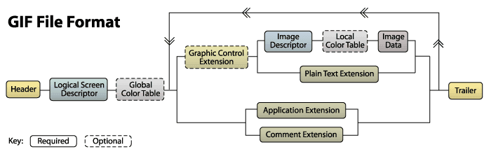

# 图片隐写

常见图片文件头

|文件类型|	文件头|	文件尾|
|-------|-------|------|
|JPEG/JPG|	`FF D8`	|`FF D9`|
|PNG	|`89 50 4E 47 0D 0A 1A 0A`|`AE 42 60 82`|
|GIF	|`47 49 46 38 39(37) 61`	|`00 3B`|
|BMP|`42 4D`| |

## JPG 

1. 了解 `jpg` 文件结构
2. 掌握常见的 `jpg` 图片隐写方式
3. 使用工具脚本独立解决问题

JPG MISC 相关工具列表
+ Windows下:
  + [jphs windows gui](./image_misc.assets/jphs_05.zip)
  + [steghide](./image_misc.assets/steghide-0.5.1-win32.zip)
  + [silenteye](./image_misc.assets/silenteye.exe)
  + [stegdetect](./image_misc.assets/Stegdetect.zip)
  + [JPEGsnoop](https://github.com/ImpulseAdventure/JPEGsnoop) 只有这个软件不支持 Linux, 上面这些都能在 Linux下使用
+ Linux 下:
  + [outguess](https://github.com/crorvick/outguess)
  + [f5](./image_misc.assets/f5.jar)
  + [steghide](https://github.com/StefanoDeVuono/steghide)
  + [jphs](https://github.com/h3xx/jphs)
  + [silenteye](./image_misc.assets/silenteye.exe)
  + [stegdetect](https://github.com/abeluck/stegdetect)

> JPEGsnoop 这个工具能通过图像里面的一些特征，去判断我们的图片有没有被一些常用的工具被编辑过

如下图，我们可以发现该图片被某些工具编辑过。


### JPG文件结构

以一副24位彩色图像为例，JPEG 的压缩分为四个步骤：
1. **颜色转换：** 在将彩色图像进行压缩之前，必须先对颜色模式进行数据转换。转换完成之后还需要进行数据采样
2. <font color='red' face=Monaco >**DCT变换：** 是将图像信号在频率域上进行变换，分离出高频和低频信息的处理过程，然后再对图像的高频部分 (即图像细节) 进行压缩</font> 
3. **量化：** 由于下面第四部编码过程中使用的码本都是整数，因此要对频率系数进行量化,将之转换成整数看。数据量化之后，矩阵中的数据都是近似值，和原始图像数据之间有了差异，这一差异是造成图像压缩后失真的主要原因。
4. **编码：** 编码是基于统计特性的方法

四个步骤都完成后的 JPEG 文件，其基本数据结构为两大类型： <font color='red' face=Monaco>段</font> 和 <font color='red' face=Monaco>经过压缩编码的图像数据</font> 


+ 有些段没有长度描述也没有内容，只有段标识和段类型。文件头和文件尾均属于这种段
+ <font color=red>段与段之间无论有多少个 FF 都是合法的</font>，这些 FF 称为 [ 填充字节 ],必须被忽略掉。

JPEG 文件使用的数据存储方式有多种。最常见的格式为 `JPEG` 文件交换格式 ` ( JPEG file Interchange Format, JFIF ) `，文件后缀名为 jpg 或 jpeg。
+ JPEG 是有损压缩格式，将像素信息用 JPEG 保存成文件再读取出来，其中某些像素值会有少许变化。
  + 在保存时有个质量参数可在 0 至 100 之间选择，参数越大图片就越保真
  + 但图片的体积也就越大。一般情况下选择 70 或 80 就足够了
+ JPEG 没有透明度信息

### 常见的隐写方式

JPG 文件隐写题目主要有一下几类考点:
+ exif 信息隐藏 ( 一般用来给参赛者一些提示 )
+ 字符追加 ( 同上 )
+ 文件结合 ( 常考 )
+ <font color='red' face=Monaco >基于 DCT 域的 JPG 图片隐写</font> ( 如果考察这一部分，一般为主要考点，或重点)
+ SilentEye 工具隐写 ( 出现得较少，但是不排除不出 )

#### EXIF 信息隐藏

<font color='red' face=Monaco >可交换图像文件格式 ( Exchangeable image file format 官方简称 Exif)</font>， 是专门为数码相机的照片设定的，可以记录数码照片的属性信息和拍摄数据。

> jpg 图片拥有exif信息，所以可以通过填充 exif 信息来隐藏信息。

解决方法
+ 在 Windows 右键点击图片，选择属性，可以查看部分的 exif 信息
+ 在 Linux 使用 exiftool/exif 可以看到所有的 exif 信息
  + `exif 文件名/exiftool 文件名`

**题目例子**

**安装 exiftool**

+ [exiftool-12.45.tar.gz 源码下载地址](https://exiftool.org/Image-ExifTool-12.45.tar.gz)
+ [Linux install exiftool Guide](https://exiftool.org/install.html#Unix)

```bash
# 下载源码
cd <your download directory>
gzip -dc Image-ExifTool-12.45.tar.gz | tar -xf -
cd Image-ExifTool-12.45
# 安装 exiftool
perl Makefile.PL
make test
sudo make install
```
> 使用exiftool 修改图片的 exif 信息

```bash
exiftool -P -overwrite_original -AllDates="2015:11:26 12:00:00" \
-GPSLongitudeRef=E -GPSLongitude=-111.123456 \
-GPSLatitudeRef=N -GPSLatitude=33.23456 \
-GPSAltitudeRef=Above -GPSAltitude=357 -Artist="secho" \
-Copyright="All Rights Reserved by secho" \
-OwnerName="secho" res.jpg
```
其中，各参数含义如下。

```
-P：表示不改变原照片的拍摄时间
-E：表示HTML（或Unicode）编码的转义值
-overwrite_original：覆盖源文件
-AllDates：照片时间，包括DateTimeOriginal、CreateDate和ModifyDate三项
-GPSLongitudeRef：东经(E)或西经(W)
-GPSLatitudeRef：北纬(N)或南纬(S)
-GPSAltitudeRef：指定高程起点。0=”Above Sea Level”，1=”Blow Sea Level”。-GPSAltitudeRef#=0或者-GPSAltitudeRef=”A”
-GPSLongitude：指定经度
-GPSLatitude：指定纬度
-GPSAltitude：指定海拔高度
-Artist：指定艺术家，即拍照人
-Copyright：指定版权信息
-OwnerName：指定相机所有人
-ImageDescription：指定照片的描述文字，字符型，可存储大量文字
-UserComment：指定用户注释
```

我们可以使用 exiftool 来对图片的 exif 信息进行修改和查看


Windows和Linux 两种方式查看 jpg 文件的 Exif 信息

<table><tr>
    <td>Windows 查看exif信息</td>
    <td>使用 exif 查看图片的 exif 信息</td>
  </tr>
  <tr>
    <td></td>
    <td></td>
  </tr></table>


#### 字符附加

​    在附加式的图片隐写术中，<font color='red' face=Monaco >我们通常是用某种程序或者某种方式在载体文件中直接附加上需要被隐写的字符串或其它信息</font>，由于写入的位置对于图片来说无关紧要，所以不会影响图片的正常打开和识别

解决方法
+ 用 16 进制编辑器，查找和 flag 有关的字符( base64... )，出现在文件末尾的可能性更大
+ 在 linux 下，使用 strings 命令，可以将文件中所有字符串打印出来，strings 命令在对象文件或二进制文件中查找可打印的字符串。字符串是4个或更多可打印字符的任意序列，以换行符，或空字符结束。strings 命令对识别随机对象文件很有用   
  + `strings 文件名`


**题目例子**

[ZJCTF 2022 决赛 ( MISC 签到题 )](./image_misc.assets/91.jpg)

> 这边介绍一个 Linux 里面很好用的16进制工具 ( `xxd` )

```bash
# 将 16 进制模式输出到 temp 文件内
xxd ./res.png > temp
# 将16进制模式文本还原成二进制模式
# xxd -r ./temp > res.png
nvim temp
```
在两张图片的中间发现了一段看着很像 base64 编码的字符。


将这段字符放到 Cyber Chef 这个加解码神器里面,我们先尝试了 base64 解码发现解码失败，然后我们使用其 Magic 模块进行尝试解码，发现成功获得 flag

> ( 这边编码解码相关内容将会在后续文章里总结 )


单独考字符附加的题目,一般来讲比较少， <font color='red' face=Monaco >一般会以压缩包密码，提示信息，编码加密等结合考察.</font> 


#### 文件结合

​    一种采用特殊方式将图片文件 (如 JPG 格式) 与其它文件结合起来的文件。该文件一般保存为 JPG 格式，可以正常显示图片

当有人获取类似文件结合的图片后，可以修改文件的后缀名，比如结合的是zip文件，将图片改为 zip 压缩文件，在文件无损情况下就可以以zip文件格式直接打开。

>  图种是一种以图片文件为载体，然后将zip等压缩包文件附加在图片后面。

因为操作系统识别的过程是，<font color=red>从文件头标志，到文件的结束标志位，当系统识别到图片的结束标志位后，默认是不再继续识别的</font>，所以我们在通常情况下只能看到它只是一张图片。

解决方法
+ 在 Windows 下修改后缀名或者 16进制编辑器手工分离
+ 在 Linux 下使用 `binwalk` , `foremost` , `dd` 工具分离文件


**题目例子**

[Buuctf BJDCTF2020 藏藏藏](https://buuoj.cn/challenges#[BJDCTF2020]藏藏藏)

​    我们使用binwalk对其进行分离,发现分离失败，但看其输出有一个 zip 的文件尾，所以这个图片一定是包含了某些文件,我们尝试使用 foremost 进行分离

发现成功分离出来


进入到 zip 文件夹内，发现有一个 福利.docx 文件,打开之后有一个二维码，我们使用截图工具将其保存下来。


使用 `zbarimg` 查看二维码内的信息，成功获得 flag


---

<font color='red' face=Monaco >在遇到图片里面包含文件的题目，别盲目进行分离 (尤其是遇到 `binwalk`分离不出的情况)</font>

如下图，我们将 flag 藏在两张图片之间，如果我们使用 foremost 硬分离，我们会发现 flag 信息会没了。而你又会陷入一个定式 ( 考点一定在这两张图里 ) 这就会导致你写不出来这道简单的题目.


**题目例子**

[ZJCTF 2022 决赛 ( MISC 签到题 )](./image_misc.assets/91.jpg)

比赛时，我们队写这道签到题就陷入了这种定式,导致用了很久才写出来.

#### 基于DCT域的JPG图片隐写

​     因为 DCT 是一种有损压缩 ( Loss Compression ) 技术，但一般不会影响图像的视觉效果，可以通过这个特性来隐藏信息。在这个隐写类型中，常用的隐写方法有 `JSteg,JPhide,Outguess,F5` 等等

解决方法
1. 使用 Stegdetect 检测隐写方式，并且还可以基于字典暴力破解密码方法提取通过 JPhide，outguess 等方式嵌入的隐藏信息。
2. 根据 Stegdetect 的判断结果，使用 `JSteg,JPHide,OutGuess,Invisible Secrets,F5` 等工具完成解密


<div style='border-radius:15px;display:block;background-color:pink;border:2px solid #aaa;margin:15px;padding:10px;'>
使用 Stegdetect 检测可能会给我们错误的结果，所以这个结果我们只能用来参考，做题时实在做不出，也没什么提示时，最好就是将所有工具都试一遍.</div>

使用命令进行检测
`.\stegdetect.exe -tjopi -s 10.0 2.jpg`


> 不知道为什么，我 Linux 自己编译的 stegdetect 始终检测不出正确结果 (如下图)


在 Windows 里还有其图形化界面 `xsteg.exe`,我们只要双击这个可执行程序即可。

<font color='red' face=Monaco>`Sensitivity` 记得调成 10.0,旁边 `Scan options` 不要进行点击。</font>


我们再使用 Stegdetect 检测 outguess 工具进行操作过后的图片，发现并没有检测出来。


##### Jphs

Jphs 里面包含 `jphide jpseek` 这两个主要工具

```bash
wget ftp://ftp.gwdg.de/pub/linux/misc/ppdd/jphs_05.zip
```

其工具在 Windows 内也有图形化界面工具 

想要使用图形化界面来进行加解密我们可以使用 jphs 文件夹里的 `Jphswin.exe`

<font color='red' face=Monaco>运行工具，将要进行提取数据的图片拖入工具内，点击 Seek 然后输入密码即可提取出来。</font> 


加密过程也和上面的步骤差不多，只是按钮改成了 `Hide`


##### Outguess

**题目例子**

[Buuctf : ACTF新生赛2020 outguess](https://buuoj.cn/challenges#[ACTF新生赛2020]outguess)

我们先查看了一下 flag.txt 提示我们  Guess 一下，那很明显就是提示我们使用 Outguess 了。


由于 Outguess 需要提供一个密码，所以我们要去寻找 outguess 的密码

我们先查看一下其 exif 信息，发现注释字段有 公正民主文明 构成的一串字符。这个就是核心价值观编码 (在编码这一节会提到)


然后我们对其进行解码，得到 abc,盲猜一波，这就是outguess的密码


我们使用一下命令尝试提取 outguess 隐藏的信息。

```bash
outguess -k 123456 -r outguess.jpg flag.txt
```
发现成功提权出一些内容，查看一下，获得flag


如果我们想要进行outguess 隐藏我们可以使用以下命令

```bash
outguess -k "password" -d hidden.txt src.jpg ouput.jpg
```


##### F5 

[f5.jar Download Link](https://code.google.com/archive/p/f5-steganography/downloads)

**题目例子**

打开题目，我们发现题目描述为如下

[刷新过的图片](https://buuoj.cn/challenges#刷新过的图片)

而我们又知道刷新键为 <kbd> F5 </kbd> 所以这道题目很有可能就是考 F5 隐写


下载附件之后，解压获得一张 jpg 格式的图片,更加印证了我们的猜想。

我们使用以下命令进行提取隐藏文件

我们使用 `f5.jar`

```bash
java -jar f5.jar x -p 123456 -e flag.txt encode.jpg
```
成功获得一个文件，使用 `file` 查看之后发现是一个zip格式的文件

我们尝试使用 zip 进行解压，发现解压失败，然后我们就尝试使用 john 进行暴力破解

但是 `zip2john` 命令给我们的提示是 `flag.txt is not encrypted` 说明这个zip很有可能是伪加密

我们知道使用 `binwalk` 能直接提取出伪加密zip内的文件。


发现提取出 flag.txt 查看该文件获得 flag

##### steghide


查看图片关于 steghide 的信息

```bash
steghide info encode.jpg
```

将使用steghide 隐藏的信息提取出来，<font color='red' face=Monaco>运行之后默认会提示我们输入密码。</font> 

```bash
steghide extract -sf encode.jpg
```
**题目例子**

[BUUCTF 九连环](https://buuoj.cn/challenges#九连环)

前面文件分离，伪加密，这边就不在赘述了,(不会的可以看我前面的讲解)。

分离出来两个文件 `good-已合并.jpg` 和 `qwe.zip` 尝试对 qwe.zip 进行解压，发现需要密码，那不用说了，密码信息一定存在在 `good-已合并.jpg` 这个图片里面。

我们尝试使用 `steghide info good-已合并.jpg` 去查看是否被 steghide 这个工具合并了某些信息。

发现真的隐藏了一个  `ko.txt`


使用以下命令进行提取，我们并不知道密码，直接回车即可。

```bash
steghide extract -sf good-已合并.jpg
```
成功提权出 `ko.txt` 查看一下该文件，可打印字符即为压缩包密码.


解压之后成功获得 flag


#### SilentEye 工具隐写


使用 SilentEye 进行信息隐藏，SilentEye 是一款免费图片，音频信息隐藏工具，可以对图片的音频等文件类型进行信息隐藏

**题目例子**

[BUUCTF NewStarCTF公开赛 Look my eyes](./image_misc.assets/Eye.jpg)

下载之后查看其后缀为 jpg 并且文件名为 Eye 而且题目名称也为 Look my eyes 说明这个题目大概率和眼睛有关。

然后我们就想到了 Silenteye 我们使用 silenteye 工具进行进行提取信息。

(密码啥的都使用默认的 `SilentEye` 因为我们并不知道密码.)


发现成功获取到 flag

## PNG

+ 可能用到的工具工具

  + [PCRT](https://github.com/sherlly/PCRT.git)

  + [BlindWaterMark](https://github.com/chishaxie/BlindWaterMark)

  + [Macromedia Fireworks 8](https://macromedia-fireworks.en.uptodown.com/windows/download)

  + [BCompare](https://www.scootersoftware.com/download.php)


### PNG 的文件格式

PNG 是一种无损压缩的位图片形式，其设计目的是试图代替 GIF 和 TIFF 文件格式，同时增加一些 GIF 文件格式所不具备的特性。

> PNG 图像格式文件 ( 或者称为数据流 ) 由一个8字节的 PNG 文件署名 (PNG file signature) 域和按照特定结构组织的3个以上的数据块 (chunk) 组成

PNG 定义了两种类型的数据块， <font color='red' face=Monaco>一种是称为关键数据块 (Critical Chunk)，这是必需的数据块，另一种叫做辅助数据块 (Ancillary Chunks) ，这是可选数据块。</font> 关键数据块定义了4个标准数据块，每个 PNG 文件都必须包含它们，PNG 读写软件也都必须要支持这些数据块

| 数据块名称 | 允许多个数据块 | 位置                                        | 作用           |
| ---------- | -------------- | ------------------------------------------- | -------------- |
| `IHDR`     | 不允许         | 第一个数据块                                | 文件头数据块   |
| `PLTE`     | 不允许         | 第二个数据块                                | 调色板数据块   |
| `IDAT`     | 允许           | 如果有调色板数据块`(PLTE)`,则是第三个数据块 | 图像数据块     |
| `IEND`     | 不允许         | 最后一个数据块                              | 图像结束数据块 |


PNG 图像文件中每一块数据块格式都是相同的，分别由4个部分组成


|名称	|字节数	|说明|
|----|------|----|
|Length（长度）|	4 字节|	指定数据块中数据域的长度，其长度不超过（231－1）字节|
|Chunk Type Code（数据块类型码）|	4 字节| 数据块类型码由 ASCII 字母（A - Z 和 a - z）组成|
|Chunk Data（数据块数据）|	可变长度|	存储按照 Chunk Type Code 指定的数据|
|CRC（循环冗余检测）|	4 字节|	存储用来检测是否有错误的循环冗余码|

CRC（Cyclic Redundancy Check）域中的值是对 Chunk Type Code 域和 Chunk Data 域中的数据进行计算得到的。

这边以第一个数据块 (IHDR)做演示 
+ 前面的八个字节就是 PNG 的文件署名( PNG file signature )了。
  + `89 50 4E 47 0D 0A 1A 0A`
+ PNG 文件署名后面四字节就是数据块数据的长度了 ( Length )
  + `00 00 00 0D`
+ 再后四字节就是数据块类型了 ( Chunk Type Code)
  + `49 4B 44 52` 对应 ASCII `IHDR` 也就是第一个数据块
+ 这段是不固定的,要看文件署名后面的四字节,(长度)这边为 `0D` ( Chunk Data )
  + `00 00 02 9C 00 00 01 DD 08 06 00 00 00`
+ 最后四字节为 CRC 校验和
  + `FE 1A 5A B6`


#### IHDR

文件头数据块 IHDR（Header Chunk）

+ 它包含有 PNG 文件中存储的图像数据的基本信息 
+ <font color='red' face=Monaco>( 在该段的 `Chunck Data` 内 )，由 13 字节组成，并要作为第一个数据块出现在 PNG 数据流中,包含有宽高等重要信息</font>
+ 一个 PNG 数据流中只能有一个文件头数据块

其中我们关注的是前 8 字节的内容

|域的名称|	字节数	|说明|
|------|--------|-------|
|Width	|4 bytes	|图像宽度，以像素为单位|
|Height	|4 bytes	|图像高度，以像素为单位|


我们经常会去更改一张图片的高度或者宽度使得一张图片显示不完整从而达到隐藏信息的目的。

不过修改宽高后没有修改成正确的 CRC 在 Linux 内将无法正常显示.


#### PLTE

调色板数据块 PLTE（palette chunk）
+ 它包含有与索引彩色图像（indexed-color image）相关的彩色变换数据，它仅与索引彩色图像有关
+ 而且要放在图像数据块（image data chunk）之前。真彩色的 PNG 数据流也可以有调色板数据块
+ 目的是便于非真彩色显示程序用它来量化图像数据，从而显示该图像。

#### IDAT

图像数据块 IDAT（image data chunk）：它存储实际的数据，在数据流中可包含多个连续顺序的图像数据块。

+ 储存图像像数数据
+ 在数据流中可包含多个连续顺序的图像数据块
+ 采用 LZ77 算法的派生算法进行压缩
+ 可以用 zlib 解压缩

<font color='red' face=Monaco >值得注意的是，IDAT 块只有当上一个块充满时，才会继续一个新的块。</font> 

#### IEND

图像结束数据 IEND（image trailer chunk）：它用来标记 PNG 文件或者数据流已经结束，并且必须要放在文件的尾部。

```hex
00 00 00 00 49 45 4E 44 AE 42 60 82
```

IEND 数据块的长度总是 `00 00 00 00`，数据标识总是 IEND `49 45 4E 44`，因此，CRC 码也总是 `AE 42 60 82`。<font color='red' face=Monaco>所以其hex 内容就被固定了,如果打开一个 png 文件其文件结束数据 IEND 不是这些内容，就说明该图片的 IEND 被修改了</font>

> 出题人可能修改该结构，导致文件无法正常打开,或无法正常分离.


#### 其余辅助数据块 

+ 背景颜色数据块 bKGD（background color）
+ 基色和白色度数据块 cHRM（primary chromaticities and white point），所谓白色度是指当 R＝G＝B＝最大值 时在显示器上产生的白色度
+ 图像 γ 数据块 gAMA（image gamma）
+ 图像直方图数据块 hIST（image histogram）
+ 物理像素尺寸数据块 pHYs（physical pixel dimensions）
+ 样本有效位数据块 sBIT（significant bits）
+ 文本信息数据块 tEXt（textual data）
+ 图像最后修改时间数据块 tIME （image last-modification time）
+ 图像透明数据块 tRNS （transparency）
+ 压缩文本数据块 zTXt （compressed textual data）


### 常见的隐写方式

+ 字符附加和文件结合
+ 基于PNG 文件格式的隐写
+ 基于LSB的图片隐写
+ 图片容差隐写
+ 图层叠加
+ 数字水印隐写

#### 字符附加和文件结合

这边的出题方式,和前面讲到的 JPG 图片的字符附加,和文件结合,基本没有区别。

还是使用前面一样的工具和方法( ` binwalk ,foremost ,dd ...` )。

<font color='red' face=Monaco>这边就不再赘述了。</font>

#### 基于PNG 文件格式的隐写

##### 修改图片宽高

在 CTF 中， <font color='red' face=Monaco>经常通过改变宽高使图片显示不完整或者无法显示从而达到隐藏信息的目的。</font>
<div style='border-radius:15px;display:block;background-color:#a8dadc;border:2px solid #aaa;margin:15px;padding:10px;'>
 对于这种情况，我们不能轻易修改图片的宽或高的值，应该通过 CRC  的值推算出宽或高的值后，使用 CRC 计算工具，计算得出新的 CRC 值替换原本的值，以防图片报错打不开。
</div>

**题目例子**

[半边二维码？](./image_misc.assets/flag.png)

我们首先尝试使用图片预览器打开该图片，发现打开失败。

在 Linux 内如果不能正常打开，很大可能就是被修改了宽高

我们可以使用 pngcheck 和 PCRT 来检测图片的 CRC 是否正确

<font color='red' face=Monaco>当然我们也可以直接编写 python 脚本来实现这些操作。</font>在非比赛时期，这是我非常推荐大家使用的方式,因为它能提高我们对原理的理解，和代码编辑能力.


发现 CRC 值确实不正确。

使用 PCRT 来进行检查，我们还能修复该图片的 CRC ,当然这个 CRC 是使用已经修改宽高后的数据块,计算出来的 crc。

<font color='red' face=Monaco>如果想要爆破宽高不能修复原图的 CRC,</font> 因为爆破时使用的就是原图的 CRC,如果改成新计算的 CRC 将爆破不出。

> 但是在 Linux 内复原其 CRC 有利于我们在 Linux 内预览修改宽高之后的图片的样子.因为在 Linux 内不支持查看 CRC 错误的图片，但是在 Windows 下可以.

所以我们使用以下命令来检测图片的 CRC 是否正确,并修复图片，然后进行图片预览。

```bash
python2 PCRT.py -v -i flag.png
```


我们成功在 Linux 内预览出这张被改宽高的图片,发现只有半边二维码,那肯定就是被修改了宽高。


这时候我们就可以使用 python 脚本爆破该图片的正确的宽高

[pngcrc.py download link](./image_misc.assets/pngcrc.py)

使用 pngcrc.py 成功爆破出宽高


其主要核心代码就如下，<font color='red' face=Monaco>其实我们就是一直不断尝试修改图片内 IHDR Chunk Data 内的宽高 从 （0x0000,0x0000） 到 （0x0fff,0x0fff）</font> 一直到存在一个宽高使得算出来的 CRC 和图片内的 CRC 一致。

>所以我们很容易发现，如果出题人把图片内 CRC 的值也修改为改完宽高后正确的 CRC 值，那么我们也就不能通过这种方式进行爆破正确的宽高了。

```python
def crack(IHDR_ChunkData, crc32key):
    try_data = IHDR_ChunkData
    max_num = 0xfff #理论上0xffffffff,但考虑到屏幕实际，0x0fff就差不多了
    for width in range(max_num): # 高和宽一起爆破
        width_data = bytearray(struct.pack('>i', width)) # q为8字节，i为4字节，h为2字节
        for height in range(max_num):
            height_data = bytearray(struct.pack('>i', height))
            try_data[4:8] = width_data
            try_data[8:12] = height_data
            crc32result = zlib.crc32(try_data)
            if crc32result == int(crc32key, 16):
                c_width = codecs.encode(width_data, "hex").decode("ascii")
                c_height = codecs.encode(height_data, "hex").decode("ascii")
                print("\33[34m" + "[+] Currect Width: {} Height: {}".format(
                    c_width, c_height) + "\33[0m")
                return width_data, height_data
```

发现成功还原出该二维码,扫描二维码即可获得 flag


##### IDAT 块异常

除修改宽高以外，IDAT 块也可以末尾的块内隐藏信息，并且不会影响图片的正常显示

我们可以使用 `Stegsolve` 检查 IDAT 块是否正常排列，或使用 `pngcheck`


**題目例子**

[题目例子图片下载](./image_misc.assets/sctf.png)

我们使用 `stegsolve` 查看图片的详细信息
发现其后面几块 IDAT 块并没有填满 ( 65524 字节) 就开始下一块了。


我们使用 `pngcheck -v ./sctf.png` 来查看也得到同样的结果


然后我们就可以通过 010 editor 或者别的方式提取出该图片内最后一个 IDAT 块内的数据。如下图：


然后我们使用 python 编写解压代码 


```python
import zlib
import codecs
import binascii
IDAT = codecs.decode(
    "789C5D91011280400802BF04FFFF5C75294B5537738A21A27D1E49CFD17DB3937A92E7E603880A6D485100901FB0410153350DE83112EA2D51C54CE2E585B15A2FC78E8872F51C6FC1881882F93D372DEF78E665B0C36C529622A0A45588138833A170A2071DDCD18219DB8C0D465D8B6989719645ED9C11C36AE3ABDAEFCFC0ACF023E77C17C7897667",
    "hex")
result = binascii.hexlify(zlib.decompress(IDAT))
res = str(codecs.decode(result, "hex"), encoding="utf-8")
print(res)
```

获得图片最后一个 IDAT 块内的数据为一大串 `01` 构成,很有可能为一个图片(1 为黑色像素点,0 为白色像素点)

我们编写绘图的 python 代码

```python
import sys
from PIL import Image
import math

assert (len(sys.argv) == 2)
with open(sys.argv[1], "r") as reader:
    bin_data = reader.read().strip()
MAX = int(math.sqrt(len(bin_data)))
if MAX * MAX != len(bin_data):
    print("Data error!")
    exit(1)
pic = Image.new('RGB', (MAX, MAX))
i = 0
for y in range(0, MAX):
    for x in range(0, MAX):
        if (bin_data[i] == '1'):
            pic.putpixel((x, y), (0, 0, 0))
        else:
            pic.putpixel((x, y), (255, 255, 255))
        i = i + 1
pic.show()
pic.save("flag.png")
```


#### 基于 LSB 的图片隐写

LSB 全称 Least Significant Bit，最低有效位。PNG 文件中的图像像数一般是由 RGB 三原色（红绿蓝）组成，每一种颜色占用 8 位，取值范围为 0x00 至 0xFF，即有 256 种颜色，一共包含了 256 的 3 次方的颜色，即 16777216 种颜色。

而人类的眼睛可以区分约 1000 万种不同的颜色，意味着人类的眼睛无法区分余下的颜色大约有 6777216 种。

LSB 隐写就是修改 RGB 颜色分量的最低二进制位（LSB），每个颜色会有 8 bit，LSB 隐写就是修改了像数中的最低的 1 bit，而人类的眼睛不会注意到这前后的变化，每个像素可以携带 3 比特的信息。


如果是要寻找这种 LSB 隐藏痕迹的话，有一个工具 Stegsolve 是个神器，可以来辅助我们进行分析。

通过下方的按钮可以观察每个通道的信息，例如查看 R 通道的最低位第 8 位平面的信息。

[图片下载链接](./image_misc.assets/lsb.png)


如果信息隐藏在 RGB 三个通道的最低位中， 借助 `Stegsolve -> Analyse -> Data extract`

[更多关于 LSB 的研究](https://zhuanlan.zhihu.com/p/23890677)


**题目例子**

[BUUCTF FLAG](https://buuoj.cn/challenges#FLAG)

在 Linux 里面我们可以使用 `zsteg` 来查看 lsb 内的信息。


发现在 lsb 内隐藏了一个 zip 压缩包.所以我们现在知道，lsb不只能隐藏文本，还能隐藏二进制文件，压缩包等形式的文件。

这时候我们就要通过文件头来判断了。

然后我们使用 `stegsolve` 提取出 lsb 内的压缩包 (保存为 steg.zip)。


我们尝试使用 unzip 进行解压，发现解压失败。

<font color='red' face=Monaco>如果在 Windows 内应该可以成功进行解压。在 Linux 内文件不完整是不能被成功提取的，和 CRC 不正确,图片不能预览一样</font> 

在 Linux 内我们可以使用以下命令对 zip 压缩包进行修复。

`zip -FF ProblemZip.zip --out RepairedZip.zip`

修复之后成功解压，并获得一个文件，我们使用file 查看一下该文件，发现是个 ELF 文件 ( Linux 下的可执行程序 )。


我们运行该程序，成功获得 flag


#### 图片容差隐写

容差，在选取颜色时所设置的选取范围，容差越大，选取的范围也越大，其数值是在 0-255 之间，有时候题目有两张或多张图片，就可以考虑有可能是图片容差隐写或者盲水印等隐写方式

解决方法：
+ 使用 beyond compare,bc 是一款很适合用来对图片进行比较的工具，就图片而言，它支持容差，范围，混合等模式
+ 使用 Photoshop,对图片进行重合，并降低对比度，这个操作对没有ps基础的同学可能有点难度，PS 功能强大，如果掌握，可以轻松秒杀一般的图片隐写类题目。

**题目例子**

[题目下载链接](./image_misc.assets/pub.zip)


#### 图层叠加

图像由图层叠加而成，图层由像素组成，每一张图层可以理解为一层透明的 "玻璃"，它们各自包含独立的内容，可以理解为将各个图层从上到下依次重叠，然后俯视观测第一张图层，各个图层显示的叠加效果为图像最后的显示效果.

**题目例子**

+ [实验吧：我就是flag](http://ctf5.shiyanbar.com/stega/IHDR.png)
+ [题目备份](./image_misc.assets/IHDR.png)
+ [修复版图片](./image_misc.assets/fixed.png)

> 这道题目使用我上面的crc爆破脚本直接就出flag了，可能是作者忘记隐藏图层了.

我们使用16进制编辑器查看改文件发现 `tEXt` 块内存在以下信息:
`Adobe Fireworks CS5` 说明这个文件被 `Adobe Fireworks CS5` 编辑过.


我们查看一下该图片，只有一句话叫。


这时候我们使用 `Adobe Fireworks CS5` 打开该图片，发现有一个图层被隐藏了。


<font color='red' face=Monaco>如果使用 `Adobe Fireworks CS5` 打开图片时，提示 无法打开文件，未知文件类型。我们可以尝试使用 Windows 内的画图工具将其另存为一张图片，再打开即可。</font>


#### 数字水印隐写

数字水印 (digital watermark) 技术，<font color='red' face=Monaco>是指在数字化的数据内容中嵌入不明显的记号</font> 特征是被将嵌入的记号通常是不可见或不可观察的，但是可以通过计算操作检查或提权。

> 在 CTF 中一般以基于傅里叶变换的盲水印隐写作为考点

使用  https://github.com/chishaxie/BlindWaterMark.git

使用方法 `python bwm.py decode 原图.png 添加水印图.png 水印图.png`

```bash
python2 bwm.py decode day1.png day2.png flag.png
python bwmforpy3.py decode day1.png day2.png flag.png --oldseed
```
使用 python3 版本记得加 `--oldseed` 这个参数不然分离出来的图片完全看不清，如下图所示


**题目例子**

[攻防世界 4-1](https://adworld.xctf.org.cn/challenges/details?hash=33750c6f-150a-4495-82af-321a6d52cd7e_2&task_category_id=1)

下载之后，前面的步骤就和之前一样，分离文件，解压。。。

发现里面有一个 tips.txt 提示我们 day2 里面多了一些秘密信息。

所以我们就将前面的隐藏内容的方式都尝试了一遍发现并没有提取出扫描内容。


我们尝试使用一下盲水印来提取

<font color='red' face=Monaco>使用盲水印一般要指定原图和加水印后的图片，一般文件大小比较小的图片为原图</font> 


成功提取出flag。


## GIF 

### GIF 文件格式

GIF图像文件以数据块 (Block) 为单位来存储图像的相关信息。
一个 GIF 文件由表示图像、图形的数据块/数据子块以及显示图形/图像的控制信息块组成，称为 GIF 数据流 （Data Stream）。数据流中的所有控制信息块和数据块都必须在文件头 （Header） 和文件结束块之间。

<font color=red>GIF 文件格式采用了 LZW （Lempel-ZivWalch） 压缩算法来存储图像数据</font>，定义了允许用户为图像设置背景的透明 (Transparency) 属性。此外 GIF 文件格式可在一个文件中存放多幅彩色图像/图形。如果在 GIF 文件中存放有多幅图，它们可以像演幻灯片那样显示或者像动画那样演示。

**GIF文件结构**

> [GIF 文件格式详解](https://www.jianshu.com/p/df52f1511cf8)

一个 GIF 文件的结构可分为
+ 文件头（File Header）
  + GIF 文件署名（Signature）
  + 版本号（Version）
+ GIF 数据流（GIF Data Stream）
  + 控制标识符
  + 图象块（Image Block）
  + 其他的一些扩展块
  + 文件终结器（Trailer）

下表显示了一个 GIF 文件的组成结构：



**GIF 文件内部是按块划分的，包括控制块 (Control Block) 和数据块 (Data Sub-Blocks) 两种。**

+ 控制块是控制数据块行为的，根据不同的控制块包含一些一些不同的控制参数；
+ 数据块只包含一些 `8-bit` 的字符流，由它前面的控制块来决定它的功能，每个数据块大小从 0 到 255 个字节，
  + 数据块的第一个字节指出这个数据块大小 (字节数),
  + 计算数据块的大小时不包括这个字节，所以一个空的数据块有一个字节，那就是数据块的大小 `0x00`

#### 文件头部分(Header)

GIF 署名(Signature)和版本号
+ GIF 署名用来确认一个文件是否是 GIF 格式的文件，这一部分有三个字符组成 ` GIF`; 
+ 文件版本号也是由三个字节组成，可以为 `87a` 或 `89a`

](./image_misc.assets/Snipaste_2022-09-29_14-50-41.png)

#### GIF 数据流部分 (GIF Data Stream)

**逻辑屏幕标识符 (Logical Screen Descriptor)**

这一部分由 7 个字节组成，定义了 GIF 图像的大小 (Logical Screen Width & Height),颜色深度 (Color Bits) ，背景色(Blackground Color Index) 以及有无全局颜色列表 (Global Color Table) 和颜色列表的索引数 (Index Count) 具体详细见下表:


+ `m` 全局颜色列表标志 (Global Color Table Flag)，当置位时表示有全局颜色列表，pixel有意义
+ `cr` 颜色深度 (Color ResoluTion) `cr+1` 确定颜色深度
+ `s` 分类标志 (Sort Flag) 如果置位表示全局颜色列表分类排列
+ `pixel` 全局颜色列表大小 , `pixel + 1` 确定颜色列表的索引数 (2的pixel + 1 次方)


**全局颜色列表 (Global Color Table)**

全局颜色列表必须紧跟在逻辑屏幕标识后面，每个颜色列表索引条目由三个字节组成 按 `R,G,B` 顺序排列

**图形控制扩展 (Graphic Control Extension)**

这一部分是可选的 (需要 89a 版本),可以放在一个图像块 (图像标识符) 或文本扩展块的前面，用来控制跟在它后面的第一个图像 (或文本) 的渲染 (Render)，组成结构如下:


处置方法(Disposal Method) 指出处理图形的方法。
+ 0 不使用处理方法
+ 1 不处理图形，把图形从当前位置移去
+ 2 回复到背景色
+ 3 回复到先前状态

#### 文件结尾部分

文件结尾器 (Trailer)
这一部分只有一个值为 0 的字节，标识一个 GIF 文件结束。


### 常见的隐写方式

GIF 文件隐写题目主要有以下几类考点：

+ 元数据提取
+ 修补文件头部
+ 空间轴隐藏信息
+ 时间轴隐藏信息

#### 元数据提取

**题目例子**


`-format` 用来指定显示的信息，灵活使用它的 `-format` 参数可以给解题带来不少方便。[format各个参数具体意义](https://www.imagemagick.org/script/escape.php)

[Break In 2017 - Mysterious GIF](./image_misc.assets/Question.gif)

这题的一个难点是发现并提取 GIF 中的元数据，首先 strings 是可以观察到异常点的。


这里的一串 16 进制其实是藏在 GIF 的元数据区

接下来就是提取，你可以选择 Python，但是利用 identify 显得更加便捷

`identify` 这个命令是用来获取一个或多个图像文件的格式和特性。这个命令的获取是在安装了 `Imagemagick` 这个包以后获取的。

`identify -format "%s %c \n" Question.gif`

```python
# -*- coding: utf-8 -*- 
import os
import binascii
os.system('identify -format "%c \n" Question.gif > key')
temp=open('key','rb')
f = open('key1', 'wb+')
for i in temp:
  i = i.decode('utf-8')
  i=int(i,16) i=hex(i)
  i = binascii.unhexlify(i[2:])
  i = i.decode('utf-8') + '\n'
  i = bytes(i, 'utf-8')
  f.write(i)
temp.close()
f.close()
os.system('rm -f key')
os.rename('key1','key')
```
发现可能是一个私钥


> 前面的文件合并，字符附加,也能用在 GIF 文件里.

然后我们对 `Question.gif` 尝试提取文件,发现成功提取出 `temp.zip` 这个文件.


然后我们再对 `temp.zip` 使用 `binwalk` 发现分离出来好多文件

`openssl rsautl -decrypt -inkey ../key -in ./partaa.enc -out file1`


如果进行解密时，发生以上错误,只需要将私钥加上头和尾，即可 (如下图)


查看一下解密之后的内容，发现是 JFIF ,说明解密之后是个图片文件，所以我们要编写脚本将所有内容进行解密，并一个个追加进去。


> 使用 shell 脚本这边推荐使用 fish (语法简单，功能强大)

```bash
#!/bin/fish
set enc_files (ls *.enc)

for file in $enc_files
	openssl rsautl -decrypt -inkey ../key  -in $file >> flag.jpg
end
```
我们先测试一下 `enc_files` 的排序方式，看看是不是我们预想的排序方式 `abcd...`


发现符合我们的预期，我们运行脚本，成功获得 flag


#### 修补文件头部

CTF 中有的时候会需要我们去修复图片，这时我们对于图片的文件结构要有了解，找到GIF的文件格式，然后对照这个破损的文件对其进行修复。

+ 解决方法：
  + 使用 16 进制编辑器修复 GIF 文件头部，然后保存

**题目例子**

[题目下载链接](./image_misc.assets/100.gif)

我们使用 file 查看该文件类型发现没有识别出来

而这个文件的后缀为 gif 


我们查看该文件的 16 进制发现该文件并没有 GIF 的文件头，然后我们查看该文件的文件尾，发现是 `003B` 符合 GIF 的文件尾。

所以我们有理由怀疑该文件的文件头被删了。

所以我们尝试使用 16 进制编辑器填充 GIF 的文件头


保存之后，发现成功修复图片.


#### 空间轴隐藏信息

由于GIF 的动态特性，由一帧帧的图片构成，所以每一帧的图片，多帧图片间的结合，都成了隐藏信息的一种载体。

+ 解决方法：
  + 使用 Stegsolve 打开图片， `Stegsolve -> Analyse -> Frame Browser` 进行分帧
  + 可以使用 `convert` 命令将 GIF 图片的每一帧分割开来
    + `convert hehe.gif hehe.png`
  + 也可以使用 `gm` 命令来进行分割
    + `gm convert foo.gif -coalesce +adjoin GIF_Frame%3d.png`
  + `convert persistant.gif -transparent white result.gif`


**题目例子**

[WDCTF-2017:3-2 Cake](./image_misc.assets/cake.gif)

打开题目之后，思路很清晰，就是将这四帧合并成一张二维码

我们可以先使用 `convert cake.gif cake.png` 来分离出每一帧

下面我们使用 PS 将这四张图合并在一起

我们先将这四张图片加载进 PS 内,然后将这四张图片的背景加载到一个文档内


剩下就是将这四张图片的白色背景改成透明的，我们可以使用以下方式来将图片的白色背景变成透明的。
点击 `选择 -> 色彩范围（选取要变透明的背景颜色）-> 将颜色容差调成最大（200）` 点击确定即可。

在 PS 内确定操作的快捷键是 <kbd>Ctrl + D</kbd>


然后我们就获得了一个完整的二维码


扫码后得到一串16进制字符串


`03f30d0ab8c1aa5....74080006030908`

对于合并图片这边有好几种方式

开头 `03f3` 为pyc文件的头，恢复为python脚本后直接运行得到flag

反编译网站：https://tool.lu/pyc/


**题目例子二**

[Evlz CTF 2019 – Don't Blink](./image_misc.assets/persistant.gif)

对于很多张图片，我们还使用 ps 一张一张进行p图，会死人的。

我们可以使用以下命令来将白色的背景变为透明的。
```bash
convert persistant.gif -transparent white result.gif
```
然后在使用 convert 分离出每一帧。


再合并图层，获得flag


#### 时间轴隐藏信息

GIF 文件每一帧间的时间间隔也可以作为信息隐藏的载体


按照 `1/100 s` 的时间算的

+ 解决方法：
  + 通过工具或者脚本获取gif图每一帧的时间间隔
  + 通过 identify 命令清晰的打印出每一帧的时间间隔 
    + `identify -format "%T\n" 100.gif`
  + 根据时间间隔的规律解决题目


**题目例子**

[XMAN-2017:100.gif](./image_misc.assets/100.gif)
  + [修复之后的 GIF](./image_misc.assets/100-fixed.gif)

我们使用 `identify` 提取出没一帧的时间间隔，发现间隔时间 `10，20`
我们假设 10 是 0 ,20 是 1 编写对应的 python 脚本


我们也可以写类似以下的数据处理 bash 脚本

```bash
identify -format "%T\n" 100-fixed.gif \
|cut -d ' ' -f 2|tr -d '66'| \
tr -d '\n'|tr -d '0'|tr '2' '0'
```


Python 代码

```python
raw_data = [20,10,20,10,10,20,20,20,20,10,20,20,10,10,20,10,20,10,20,20,20,20,20,10,20,10,20,20,10,10,10,20,20,10,10,10,10,20,10,10,20,20,10,10,10,20,20,10,20,20,10,10,20,10,10,20,20,20,10,10,20,10,20,10,20,20,10,10,20,10,10,10,20,20,10,10,20,10,20,10,20,10,10,20,20,20,10,20,20,10,10,20,20,10,20,10,20,10,10,20,20,10,20,10,20,10,10,20,20,10,20,20,20,20,10,10,20,10,20,20,20,10,10,20,20,10,20,20,20,10,10,20,20,10,20,10,20,10,10,20,20,20,20,10,20,20,10,10,20,20,20,10,20,20,10,10,10,20,20,20,20,10,10,20,20,10,20,20,20,10,10,20,20,10,20,10,20,10,10,20,20,10,20,20,20,20,10,10,20,10,20,20,20,20,10,10,20,10,10,10,20,20,10,10,20,20,10,10,20,20,10,10,20,10,20,10,20,20,10,10,20,10,10,20,20,20,10,10,20,10,20,20,20,20,10,10,20,20,10,10,20,10,10,20,20,20,20,10,20,10,10,20,20,10,20,10,20,10,10,20,20,20,10,10,20,10,10,20,20,10,10,20,20,10,10,20,20,20,20,10,20,20,10,10,20,20,10,10,20,20,10,10,20,10,20,10,20,10,10,10,10,10,20,10]

bin_data = []
for i in raw_data:
    if i == 20:
        bin_data.append('0')
    elif i == 10:
        bin_data.append('1')
    else:
        print("Error!")
        exit(1)
str_bin_data = "".join(bin_data)
byte_data = [chr(int(str_bin_data[i:i+8],2)) for i in range(0,len(str_bin_data),8)]
print("".join(byte_data))

```


---

## BMP


> BMP(Bitmap-File)图形文件是Windows采用的图形文件格式，在Windows环境下运行的所有图象处理软件都支持BMP图象文件格式。Windows系统内部各图像绘制操作都是以BMP为基础的。

**简介**

BMP ( Bitmap-File ) 图形文件是 Windows 采用的图形文件格式，在 Windows 环境下运行的所有图象处理软件都支持BMP图象文件格式。

Windows 系统内部各图像绘制操作都是以 BMP 为基础的。

+ Windows 3.0 以前的BMP图文件格式与显示设备有关，因此把这种BMP图象文件格式称为设备相关位图 DDB ( device-dependent bitmap ) 文件格式。
+ Windows 3.0 以后的BMP图象文件与显示设备无关，因此把这种BMP图象文件格式称为设备无关位图DIB(device-independent bitmap)格式
+ <font color=red>BMP位图文件默认的文件扩展名是BMP或者bmp（有时它也会以.DIB或.RLE作扩展名）。</font>

注：Windows 3.0 以后，在系统中仍然存在DDB位图，像 BitBlt() 这种函数就是基于 DDB 位图的，只不过如果你想将图像以 BMP 格式保存到磁盘文件中时，微软极力推荐你以 DIB 格式保存），目的是为了让Windows能够在任何类型的显示设备上显示所存储的图象。

### BMP 文件格式

BMP文件的数据按照从文件头开始的先后顺序分为四个部分：
+ 位图文件头(bmp file header)：  提供文件的格式、大小等信息
+ 位图信息头(bitmap information)：提供图像数据的尺寸、位平面数、压缩方式、颜色索引等信息
+ 调色板(color palette)：可选，如使用索引来表示图像，调色板就是索引与其对应的颜色的映射表
+ 位图数据(bitmap data)：图像数据区


BMP图片文件数据表如下：

| 数据段名称                            | 大小（byte）       | 开始地址 | 结束地址 |
| ------------------------------------- | ------------------ | -------- | -------- |
| 位图文件头(bitmap-file header)        | 14                 | 0000h    | 000Dh    |
| 位图信息头(bitmap-information header) | 40                 | 000Eh    | 0035h    |
| 调色板(color table)                   | 由biBitCount决定   | 0036h    | 未知     |
| 图片点阵数据(bitmap data)             | 由图片大小和颜色定 | 未知     | 未知     |

位图文件头：

位图文件头分为 4部分，共14字节，提供文件的格式，大小等信息


位图信息图

位图信息头共 40 个字节，提供图像数据的尺寸，位平面数，压缩方式，颜色索引等信息。


彩色表/调色板
彩色表/调色板 (Color Table) 是 1 色，16 色 和 256 色图像文件所特有的，相对应的调色板大小是 2，16，256.调色板以4字节为单位，每4字节存放一个颜色值，图像的数据是指向调色板的索引。


图像数据阵列字节

这部分的内容因位图实际像素位数和编码格式而不同，在真彩位图中直接使用 RGB 真彩色值；而有调色板的位图则使用调色板中颜色索引值。


当位图为单色位图时，有2个彩色块
当位图为4位位图时，有16个彩色块
当位图为8位位图时，有256个彩色块
当位图为24位位图时，没有彩色块

### BMP 图片隐写方式

+ 基于 LSB 的图像隐写
+ 立体图隐藏信息

#### 基于 LSB 的图像隐写

RGB 色彩模式是工业界的一种颜色标准，通过红（R）、绿（G）、蓝（B）三原色的相互叠加得到各种颜色。

24 比特模式是当前最主流的表示方法，即使用三个 8 比特无符号整数分别代表红色、绿色和蓝色，每个像素点用 24 比特表示，可以产生 `2的24次方`  种颜色组合。

LSB 隐写是指将信息隐藏在每个颜色通道的最低有效位（Least Significant Bit）。由于改变的是每个颜色通道的最低位，对颜色改变的影响极小，因此用肉眼是无法察觉出来的。

显然，每个像素的三个通道可以隐藏 3 比特信息；每个 ASCII 字符有 8 比特，至少需要三个像素点，若只隐藏在某一个颜色通道，则需要八个像素点。

下面以连续八个像素点的红色通道隐藏字符 a 为例进行讲解：


字符 a 的二进制 ASCII 码是 01100001，每个比特分别隐写在每个像素点红色通道的最低有效位。无论隐写前该颜色通道的值或奇或偶，若隐写信息为 0 比特，则隐写后值为偶数；若隐写信息为 1 比特，则隐写后值为奇数。


解决方式：
+ 使用 Stegsolve 观察图片的 RGB 通道有无异常
+ 使用 `Stegsolve -> Data Extract` 提取数据
+ 使用 `zsteg` 来提取信息
  + 命令： `zsteg image_name --all`

或者自己编写代码来提取。

```python
from PIL import Image

im = Image.open("LSB.bmp")
pix = im.load()
width, height = im.size
extracted_bits = []
im = im.convert("RGB") # change to RBG object

for y in range(height):
    for x in range(width):
        r, g, b = im.getpixel((x, y))
        extracted_bits.append(r & 1)
        extracted_bits.append(g & 1)
        extracted_bits.append(b & 1)
extracted_byte_bits = [
    extracted_bits[i:i + 8] for i in range(0, len(extracted_bits), 8)
]
with open("extracted.bmp", "wb") as out:
    for byte_bits in extracted_byte_bits:
        byte_str = "".join(str(x) for x in byte_bits)
        byte = chr(int(byte_str, 2))
        out.write(byte)
```
**题目例子**

[非常详细的 WP](https://ciphersaw.me/2018/07/29/peak-geek-2018-misc-warmup/)


然后我们对每一位单独提取。


切换至图片 warmup.bmp 所在目录下，分别输入以下命令：

zsteg 是俄罗斯黑客开发的一款开源工具，专用于检测 PNG 与 BMP 格式图片中的隐写信息，用 Ruby 语言开发，主要用法如下所示：

```bash
zsteg warmup.bmp --bits 1 --channel r --lsb --order xy --limit 2048
zsteg warmup.bmp --bits 1 --channel g --lsb --order xy --limit 2048
zsteg warmup.bmp --bits 1 --channel b --lsb --order xy --limit 2048
```
+ --bits 1：每次只摘取颜色通道中的第 1 个比特。
+ --channel r：只摘取红色通道的比特位。
+ --lsb：按最低有效位优先的顺序进行摘取。
+ --order xy：按照从左至右、从上至下的顺序对图像素点进行摘取。
+ --limit 2048：最多摘取输出 2048 字节。

即可自动摘取出隐写在图片内的信息：
仔细的读者还会发现，有一个懒人专属的选项 --all，可将所有可能的摘取方法都尝试一遍：

`zsteg warmup.bmp --all`

最终在结果中挑选出可能的隐写信息：


#### 立体图隐藏信息

使用立体图来隐藏信息，一般特点就是没有规律的很杂乱的色块图片


+ 解决方法：
  + 使用 Stegsolve 打开图片， `Stegsolve -> Analyse -> Stereogram Solver` 修改 `offset`

当然，不止 bmp 文件格式存在这种隐写方式，别的图片也存在这种隐写方式，比赛的时候遇见这种杂乱的色块时，一定要想到这种隐写方式。

**题目例子**

[The adventures of Boris Ivanov. Part 1.](./image_misc.assets/Boris_Ivanov_1.jpg)

下载该图片之后，发现最下面有一块颜色比较杂的色块，我们使用 stegsolve 一直调 offset 一直到 102 成功获得 flag


flag : `flag{d0nt_m3s5_w1th_th3_KGB}`

## 非常规图片题目

### 通过 RGB 转换为图片

得到一 RGB 值的 txt文件，需解决 RGB 值转换成图片

+ 解决方法:

  + 通过总行数计算出图片的宽高

  + 使用 Python 的 PIL 库编写脚本


**题目例子**

+ [Bugku 好多数值](https://ctf.bugku.com/challenges/detail/id/32.html)

+ [文件备份下载](./image_misc.assets/file.zip) 

解压后打开该文件，发现全都是三个在 `0-255` 为一组的数。

总共有 `61366` 行 可以分为 宽 `503` 高 `122`

当然这个值可以因式分解，进行爆破。对所有可能的值进行爆破


```python
from PIL import Image
import re

x = 503
y = 122
im = Image.new("RGB", (x, y))
file = open("1.txt")

for i in range(0, x):
    for j in range(0, y):
        line = file.readline()
        rgb = line.split(",")
        im.putpixel((i, j), (int(rgb[0]), int(rgb[1]), int(rgb[2])))
im.show()
```
查看我们生成的图片，成功获得 flag


而如果反过来的话，从一张图片提取 RGB 值，再对 RGB 值去进行一些对比，从而得到最终的 flag。

这类题目大部分都是一些像素块组成的图片，如下图
<table><tr>
     <td>黑白像素块</td>
     <td>彩色像素块</td>
   </tr>
   <tr>
     <td></td>
     <td></td>
</tr></table>


+ [CSAW-2016-quals:Forensic/Barinfun](https://github.com/ctfs/write-ups-2016/tree/master/csaw-ctf-2016-quals/forensics/brainfun-50)
  + [备份文件下载链接](./image_misc.assets/brainfun.png)
+ [breakin-ctf-2017:A-dance-partner](https://github.com/ctfs/write-ups-2017/tree/master/breakin-ctf-2017/misc/A-dance-partner)
  + [备份文件下载链接](./image_misc.assets/Question.jpg)

```python
# -*- coding: utf-8 -*- 
from PIL import Image
from pybrainfuck import BrainFck
# Read image and get pixel data as list
pixels = list(Image.open('brainfun.png').getdata()) # Extract just get the blocks. Fun fact: PIL's resize with PIL.Image.NEAREST
 # for nearest neighbor messes with the values, but mtPaint does it correctly. 
pixels = [pixels[r*512 + c] for r in range(0, 512, 16) for c in range(0, 512, 16)] 
# Sort the pixels by RGB value
pixels.sort(key=lambda p: (p[0] << 8) + (p[1] << 4) + p[2])
# Run the alpha values as Brainfuck 
print("".join([chr(p[3]) for p in pixels])) 
BrainFck().run("".join([chr(p[3]) for p in pixels]))
```

### 异或加密图片

得到的文件被按位异或，无法直接打开

+ 解决方法：

  + 异或是可逆运算

  + 使用 python 编写脚本复原图像


```python
#!/usr/bin/python3
 
img = bytearray(open('matrix_modified.bmp', 'rb').read())
 
key = "matrix"
 
new_f = []
for i, x in enumerate(img):
    new_f.append(hex(ord(key[i%6]) ^ x))
 
result = bytes([int(x,0) for x in new_f])
 
with open("image.bmp", "wb") as newFile:
    newFile.write(result)
```

因为 异或为互逆运算，所以加密算法和解密算法其实是可以使用同一个脚本的，只是输入文件，和输出文件改一下即可。

### 像素点隐藏信息

在图片显示上隐藏信息

+ 解决方式:
  + 使用 python 编写脚本提取像素点，然后组成一张新的图片


**题目例子**
+ [题目附件下载](./image_misc.assets/planet.png.zip)

解压之后，查看其 16 进制，尝试文件分离，lsb提取等操作都无果后。

而且看这张图片上好像也没有给我们一些提示信息.但是其实仔细观察之后，我们还是可以看见一些像素点在上面


尤其是当我们放大之后，我们能看见类似矩阵排列的像素点，这些像素点比较明显，而且排列规律，宽高都一样，看着间隔好像也一致.

<font color='red' face=Monaco>当遇到这种情况，我们就一定要考虑像素点拼接.</font>也就是将图片上所有排列一致的像素点合在一起，组成一张新的图片，新的图片很有可能就是 flag


这种情况我们只能使用 python 脚本了。对于像素点的间隔我们可以使用 PS 来量取。

```python
from PIL import Image

original = Image.open("./planet.png")
p_orig = original.load()
width, height = original.size
new_image = Image.new("RGBA", (width, height))
p_flag = new_image.load()
cord_x, cord_y = 0, 0

# Collect the pixels and add them to the new image
for j in range(0, height, 24):
    for i in range(0, width, 24):
        p_flag[cord_x, cord_y] = p_orig[i, j]
        cord_x += 1
    cord_y += 1
    cord_x = 0

new_image.save('flag.png', 'PNG')
```
打开保存后的图片，成功获得 flag


---

[使用 PS 来解决杂项题](https://forum.90sec.com/t/topic/257)
[类似总结](https://www.cnblogs.com/Hardworking666/p/15866125.html#_14)


[参考一](https://wooyun.js.org/drops/%E9%9A%90%E5%86%99%E6%9C%AF%E6%80%BB%E7%BB%93.html) [参考二](https://www.tr0y.wang/2017/06/07/CtfMiscStega/) [参考三](http://hexo.iyzyi.com/2019/12/02/%E7%9F%BF%E5%A4%A7MISC/) [参考四](https://gksec.com/BrainFuck-CTF.html) [参考五](https://blog.creativecc.cn/posts/ctf-misc.html)