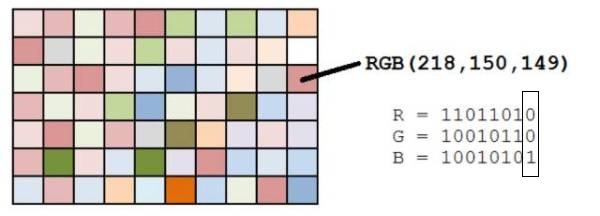

# 图片隐写

## JPG 

1. 了解jpg 文件结构
2. 掌握常见的jpg图片隐写方式
3. 使用工具脚本独立解决问题

JPG MISC 相关工具列表
+ Windows下:
  + [jphs windows gui](./image_misc.assets/jphs_05.zip)
  + [steghide](./image_misc.assets/steghide-0.5.1-win32.zip)
  + [silenteye](./image_misc.assets/silenteye.exe)
  + [stegdetect](./image_misc.assets/Stegdetect.zip)
  + [JPEGsnoop](https://github.com/ImpulseAdventure/JPEGsnoop) 只有这个软件不支持 Linux, 上面这些都能在 Linux下使用
+ Linux 下:
  + [outguess](https://github.com/crorvick/outguess)
  + [f5](./image_misc.assets/f5.jar)
  + [steghide](https://github.com/StefanoDeVuono/steghide)
  + [jphs](https://github.com/h3xx/jphs)
  + [silenteye](./image_misc.assets/silenteye.exe)
  + [stegdetect](https://github.com/abeluck/stegdetect)

> JPEGsnoop 这个工具能通过图像里面的一些特征，去判断我们的图片有没有被一些常用的工具被编辑过

如下图，我们可以发现该图片被某些工具编辑过。


### JPG文件结构

以一副24位彩色图像为例，JPEG 的压缩分为四个步骤：
1. **颜色转换：** 在将彩色图像进行压缩之前，必须先对颜色模式进行数据转换。转换完成之后还需要进行数据采样
2. <font color='red' face=Monaco >**DCT变换：** 是将图像信号在频率域上进行变换，分离出高频和低频信息的处理过程，然后再对图像的高频部分 (即图像细节) 进行压缩</font> 
3. **量化：** 由于下面第四部编码过程中使用的码本都是整数，因此要对频率系数进行量化,将之转换成整数看。数据量化之后，矩阵中的数据都是近似值，和原始图像数据之间有了差异，这一差异是造成图像压缩后失真的主要原因。
4. **编码：** 编码是基于统计特性的方法

四个步骤都完成后的 JPEG 文件，其基本数据结构为两大类型： <font color='red' face=Monaco>段</font> 和 <font color='red' face=Monaco>经过压缩编码的图像数据</font> 


+ 有些段没有长度描述也没有内容，只有段标识和段类型。文件头和文件尾均属于这种段
+ <font color=red>段与段之间无论有多少个 FF 都是合法的</font>，这些 FF 称为 [ 填充字节 ],必须被忽略掉。

JPEG 文件使用的数据存储方式有多种。最常见的格式为 `JPEG` 文件交换格式 ` ( JPEG file Interchange Format, JFIF ) `，文件后缀名为 jpg 或 jpeg。
+ JPEG 是有损压缩格式，将像素信息用 JPEG 保存成文件再读取出来，其中某些像素值会有少许变化。
  + 在保存时有个质量参数可在 0 至 100 之间选择，参数越大图片就越保真
  + 但图片的体积也就越大。一般情况下选择 70 或 80 就足够了
+ JPEG 没有透明度信息

### 常见的隐写方式

JPG 文件隐写题目主要有一下几类考点:
+ exif 信息隐藏 ( 一般用来给参赛者一些提示 )
+ 字符追加 ( 同上 )
+ 文件结合 ( 常考 )
+ <font color='red' face=Monaco >基于 DCT 域的 JPG 图片隐写</font> ( 如果考察这一部分，一般为主要考点，或重点)
+ SilentEye 工具隐写 ( 出现得较少，但是不排除不出 )

#### EXIF 信息隐藏

<font color='red' face=Monaco >可交换图像文件格式 ( Exchangeable image file format 官方简称 Exif)</font>， 是专门为数码相机的照片设定的，可以记录数码照片的属性信息和拍摄数据。

> jpg 图片拥有exif信息，所以可以通过填充 exif 信息来隐藏信息。

解决方法
+ 在 Windows 右键点击图片，选择属性，可以查看部分的 exif 信息
+ 在 Linux 使用 exiftool/exif 可以看到所有的 exif 信息
  + `exif 文件名/exiftool 文件名`

**题目例子**

**安装 exiftool**

+ [exiftool-12.45.tar.gz 源码下载地址](https://exiftool.org/Image-ExifTool-12.45.tar.gz)
+ [Linux install exiftool Guide](https://exiftool.org/install.html#Unix)

```bash
# 下载源码
cd <your download directory>
gzip -dc Image-ExifTool-12.45.tar.gz | tar -xf -
cd Image-ExifTool-12.45
# 安装 exiftool
perl Makefile.PL
make test
sudo make install
```
> 使用exiftool 修改图片的 exif 信息

```bash
exiftool -P -overwrite_original -AllDates="2015:11:26 12:00:00" \
-GPSLongitudeRef=E -GPSLongitude=-111.123456 \
-GPSLatitudeRef=N -GPSLatitude=33.23456 \
-GPSAltitudeRef=Above -GPSAltitude=357 -Artist="secho" \
-Copyright="All Rights Reserved by secho" \
-OwnerName="secho" res.jpg
```
其中，各参数含义如下。

```
-P：表示不改变原照片的拍摄时间
-E：表示HTML（或Unicode）编码的转义值
-overwrite_original：覆盖源文件
-AllDates：照片时间，包括DateTimeOriginal、CreateDate和ModifyDate三项
-GPSLongitudeRef：东经(E)或西经(W)
-GPSLatitudeRef：北纬(N)或南纬(S)
-GPSAltitudeRef：指定高程起点。0=”Above Sea Level”，1=”Blow Sea Level”。-GPSAltitudeRef#=0或者-GPSAltitudeRef=”A”
-GPSLongitude：指定经度
-GPSLatitude：指定纬度
-GPSAltitude：指定海拔高度
-Artist：指定艺术家，即拍照人
-Copyright：指定版权信息
-OwnerName：指定相机所有人
-ImageDescription：指定照片的描述文字，字符型，可存储大量文字
-UserComment：指定用户注释
```

我们可以使用 exiftool 来对图片的 exif 信息进行修改和查看


Windows和Linux 两种方式查看 jpg 文件的 Exif 信息

<table><tr>
    <td>Windows 查看exif信息</td>
    <td>使用 exif 查看图片的 exif 信息</td>
  </tr>
  <tr>
    <td></td>
    <td></td>
  </tr></table>


#### 字符附加

​    在附加式的图片隐写术中，<font color='red' face=Monaco >我们通常是用某种程序或者某种方式在载体文件中直接附加上需要被隐写的字符串或其它信息</font>，由于写入的位置对于图片来说无关紧要，所以不会影响图片的正常打开和识别

解决方法
+ 用 16 进制编辑器，查找和 flag 有关的字符( base64... )，出现在文件末尾的可能性更大
+ 在 linux 下，使用 strings 命令，可以将文件中所有字符串打印出来，strings 命令在对象文件或二进制文件中查找可打印的字符串。字符串是4个或更多可打印字符的任意序列，以换行符，或空字符结束。strings 命令对识别随机对象文件很有用   
  + `strings 文件名`


**题目例子**

[ZJCTF 2022 决赛 ( MISC 签到题 )](./image_misc.assets/91.jpg)

> 这边介绍一个 Linux 里面很好用的16进制工具 ( `xxd` )

```bash
# 将 16 进制模式输出到 temp 文件内
xxd ./res.png > temp
# 将16进制模式文本还原成二进制模式
# xxd -r ./temp > res.png
nvim temp
```
在两张图片的中间发现了一段看着很像 base64 编码的字符。


将这段字符放到 Cyber Chef 这个加解码神器里面,我们先尝试了 base64 解码发现解码失败，然后我们使用其 Magic 模块进行尝试解码，发现成功获得 flag

> ( 这边编码解码相关内容将会在后续文章里总结 )


单独考字符附加的题目,一般来讲比较少， <font color='red' face=Monaco >一般会以压缩包密码，提示信息，编码加密等结合考察.</font> 


#### 文件结合

​    一种采用特殊方式将图片文件 (如 JPG 格式) 与其它文件结合起来的文件。该文件一般保存为 JPG 格式，可以正常显示图片

当有人获取类似文件结合的图片后，可以修改文件的后缀名，比如结合的是zip文件，将图片改为 zip 压缩文件，在文件无损情况下就可以以zip文件格式直接打开。

>  图种是一种以图片文件为载体，然后将zip等压缩包文件附加在图片后面。

因为操作系统识别的过程是，<font color=red>从文件头标志，到文件的结束标志位，当系统识别到图片的结束标志位后，默认是不再继续识别的</font>，所以我们在通常情况下只能看到它只是一张图片。

解决方法
+ 在 Windows 下修改后缀名或者 16进制编辑器手工分离
+ 在 Linux 下使用 `binwalk` , `foremost` , `dd` 工具分离文件


**题目例子**

[Buuctf BJDCTF2020 藏藏藏](https://buuoj.cn/challenges#[BJDCTF2020]藏藏藏)

​    我们使用binwalk对其进行分离,发现分离失败，但看其输出有一个 zip 的文件尾，所以这个图片一定是包含了某些文件,我们尝试使用 foremost 进行分离

发现成功分离出来


进入到 zip 文件夹内，发现有一个 福利.docx 文件,打开之后有一个二维码，我们使用截图工具将其保存下来。


使用 `zbarimg` 查看二维码内的信息，成功获得 flag


---

<font color='red' face=Monaco >在遇到图片里面包含文件的题目，别盲目进行分离 (尤其是遇到 `binwalk`分离不出的情况)</font>

如下图，我们将 flag 藏在两张图片之间，如果我们使用 foremost 硬分离，我们会发现 flag 信息会没了。而你又会陷入一个定式 ( 考点一定在这两张图里 ) 这就会导致你写不出来这道简单的题目.


**题目例子**

[ZJCTF 2022 决赛 ( MISC 签到题 )](./image_misc.assets/91.jpg)

比赛时，我们队写这道签到题就陷入了这种定式,导致用了很久才写出来.

#### 基于DCT域的JPG图片隐写

​     因为 DCT 是一种有损压缩 ( Loss Compression ) 技术，但一般不会影响图像的视觉效果，可以通过这个特性来隐藏信息。在这个隐写类型中，常用的隐写方法有 `JSteg,JPhide,Outguess,F5` 等等

解决方法
1. 使用 Stegdetect 检测隐写方式，并且还可以基于字典暴力破解密码方法提取通过 JPhide，outguess 等方式嵌入的隐藏信息。
2. 根据 Stegdetect 的判断结果，使用 `JSteg,JPHide,OutGuess,Invisible Secrets,F5` 等工具完成解密


<div style='border-radius:15px;display:block;background-color:pink;border:2px solid #aaa;margin:15px;padding:10px;'>
使用 Stegdetect 检测可能会给我们错误的结果，所以这个结果我们只能用来参考，做题时实在做不出，也没什么提示时，最好就是将所有工具都试一遍.</div>

使用命令进行检测
`.\stegdetect.exe -tjopi -s 10.0 2.jpg`


> 不知道为什么，我 Linux 自己编译的 stegdetect 始终检测不出正确结果 (如下图)


在 Windows 里还有其图形化界面 `xsteg.exe`,我们只要双击这个可执行程序即可。

<font color='red' face=Monaco>`Sensitivity` 记得调成 10.0,旁边 `Scan options` 不要进行点击。</font>


我们再使用 Stegdetect 检测 outguess 工具进行操作过后的图片，发现并没有检测出来。


##### Jphs

Jphs 里面包含 `jphide jpseek` 这两个主要工具

```bash
wget ftp://ftp.gwdg.de/pub/linux/misc/ppdd/jphs_05.zip
```

其工具在 Windows 内也有图形化界面工具 

想要使用图形化界面来进行加解密我们可以使用 jphs 文件夹里的 `Jphswin.exe`

<font color='red' face=Monaco>运行工具，将要进行提取数据的图片拖入工具内，点击 Seek 然后输入密码即可提取出来。</font> 


加密过程也和上面的步骤差不多，只是按钮改成了 `Hide`


##### Outguess

**题目例子**

[Buuctf : ACTF新生赛2020 outguess](https://buuoj.cn/challenges#[ACTF新生赛2020]outguess)

我们先查看了一下 flag.txt 提示我们  Guess 一下，那很明显就是提示我们使用 Outguess 了。


由于 Outguess 需要提供一个密码，所以我们要去寻找 outguess 的密码

我们先查看一下其 exif 信息，发现注释字段有 公正民主文明 构成的一串字符。这个就是核心价值观编码 (在编码这一节会提到)


然后我们对其进行解码，得到 abc,盲猜一波，这就是outguess的密码


我们使用一下命令尝试提取 outguess 隐藏的信息。

```bash
outguess -k 123456 -r outguess.jpg flag.txt
```
发现成功提权出一些内容，查看一下，获得flag


如果我们想要进行outguess 隐藏我们可以使用以下命令

```bash
outguess -k "password" -d hidden.txt src.jpg ouput.jpg
```


##### F5 

[f5.jar Download Link](https://code.google.com/archive/p/f5-steganography/downloads)

**题目例子**

打开题目，我们发现题目描述为如下

[刷新过的图片](https://buuoj.cn/challenges#刷新过的图片)

而我们又知道刷新键为 <kbd> F5 </kbd> 所以这道题目很有可能就是考 F5 隐写


下载附件之后，解压获得一张 jpg 格式的图片,更加印证了我们的猜想。

我们使用以下命令进行提取隐藏文件

我们使用 `f5.jar`

```bash
java -jar f5.jar x -p 123456 -e flag.txt encode.jpg
```
成功获得一个文件，使用 `file` 查看之后发现是一个zip格式的文件

我们尝试使用 zip 进行解压，发现解压失败，然后我们就尝试使用 john 进行暴力破解

但是 `zip2john` 命令给我们的提示是 `flag.txt is not encrypted` 说明这个zip很有可能是伪加密

我们知道使用 `binwalk` 能直接提取出伪加密zip内的文件。


发现提取出 flag.txt 查看该文件获得 flag

##### steghide

查看图片关于 steghide 的信息

```bash
steghide info encode.jpg
```

将使用steghide 隐藏的信息提取出来，<font color='red' face=Monaco>运行之后默认会提示我们输入密码。</font> 

```bash
steghide extract -sf encode.jpg
```

前面文件分离，伪加密，这边就不在赘述了,(不会的可以看我前面的讲解)。

分离出来两个文件 `good-已合并.jpg` 和 `qwe.zip` 尝试对 qwe.zip 进行解压，发现需要密码，那不用说了，密码信息一定存在在 `good-已合并.jpg` 这个图片里面。

我们尝试使用 `steghide info good-已合并.jpg` 去查看是否被 steghide 这个工具合并了某些信息。

发现真的隐藏了一个  `ko.txt`


使用以下命令进行提取，我们并不知道密码，直接回车即可。

```bash
steghide extract -sf good-已合并.jpg
```
成功提权出 `ko.txt` 查看一下该文件，可打印字符即为压缩包密码.


解压之后成功获得 flag

**题目例子**

[BUUCTF 九连环](https://buuoj.cn/challenges#九连环)


#### SilentEye 工具隐写


使用 SilentEye 进行信息隐藏，SilentEye 是一款免费图片，音频信息隐藏工具，可以对图片的音频等文件类型进行信息隐藏

**题目例子**

[BUUCTF NewStarCTF公开赛 Look my eyes](./image_misc.assets/Eye.jpg)

下载之后查看其后缀为 jpg 并且文件名为 Eye 而且题目名称也为 Look my eyes 说明这个题目大概率和眼睛有关。

然后我们就想到了 Silenteye 我们使用 silenteye 工具进行进行提取信息。

(密码啥的都使用默认的 `SilentEye` 因为我们并不知道密码.)


发现成功获取到 flag

## PNG

工具
+ [PCRT](https://github.com/sherlly/PCRT.git)
+ [BlindWaterMark](https://github.com/chishaxie/BlindWaterMark)
+ [Macromedia Fireworks 8](https://macromedia-fireworks.en.uptodown.com/windows/download)
+ [BCompare](https://www.scootersoftware.com/download.php)


### PNG 的文件格式

PNG 是一种无损压缩的位图片形式，其设计目的是试图代替 GIF 和 TIFF 文件格式，同时增加一些 GIF 文件格式所不具备的特性。

> PNG 图像格式文件 ( 或者称为数据流 ) 由一个8字节的 PNG 文件署名 (PNG file signature) 域和按照特定结构组织的3个以上的数据块 (chunk) 组成

PNG 定义了两种类型的数据块， <font color='red' face=Monaco>一种是称为关键数据块 (Critical Chunk)，这是必需的数据块，另一种叫做辅助数据块 (Ancillary Chunks) ，这是可选数据块。</font> 关键数据块定义了4个标准数据块，每个 PNG 文件都必须包含它们，PNG 读写软件也都必须要支持这些数据块

| 数据块名称 | 允许多个数据块 | 位置                                        | 作用           |
| ---------- | -------------- | ------------------------------------------- | -------------- |
| `IHDR`     | 不允许         | 第一个数据块                                | 文件头数据块   |
| `PLTE`     | 不允许         | 第二个数据块                                | 调色板数据块   |
| `IDAT`     | 允许           | 如果有调色板数据块`(PLTE)`,则是第三个数据块 | 图像数据块     |
| `IEND`     | 不允许         | 最后一个数据块                              | 图像结束数据块 |


PNG 图像文件中每一块数据块格式都是相同的，分别由4个部分组成


|名称	|字节数	|说明|
|----|------|----|
|Length（长度）|	4 字节|	指定数据块中数据域的长度，其长度不超过（231－1）字节|
|Chunk Type Code（数据块类型码）|	4 字节| 数据块类型码由 ASCII 字母（A - Z 和 a - z）组成|
|Chunk Data（数据块数据）|	可变长度|	存储按照 Chunk Type Code 指定的数据|
|CRC（循环冗余检测）|	4 字节|	存储用来检测是否有错误的循环冗余码|

CRC（Cyclic Redundancy Check）域中的值是对 Chunk Type Code 域和 Chunk Data 域中的数据进行计算得到的。

这边以第一个数据块 (IHDR)做演示 
+ 前面的八个字节就是 PNG 的文件署名( PNG file signature )了。
  + `89 50 4E 47 0D 0A 1A 0A`
+ PNG 文件署名后面四字节就是数据块数据的长度了 ( Length )
  + `00 00 00 0D`
+ 再后四字节就是数据块类型了 ( Chunk Type Code)
  + `49 4B 44 52` 对应 ASCII `IHDR` 也就是第一个数据块
+ 这段是不固定的,要看文件署名后面的四字节,(长度)这边为 `0D` ( Chunk Data )
  + `00 00 02 9C 00 00 01 DD 08 06 00 00 00`
+ 最后四字节为 CRC 校验和
  + `FE 1A 5A B6`


#### IHDR

文件头数据块 IHDR（Header Chunk）

+ 它包含有 PNG 文件中存储的图像数据的基本信息 
+ <font color='red' face=Monaco>( 在该段的 `Chunck Data` 内 )，由 13 字节组成，并要作为第一个数据块出现在 PNG 数据流中,包含有宽高等重要信息</font>
+ 一个 PNG 数据流中只能有一个文件头数据块

其中我们关注的是前 8 字节的内容

|域的名称|	字节数	|说明|
|------|--------|-------|
|Width	|4 bytes	|图像宽度，以像素为单位|
|Height	|4 bytes	|图像高度，以像素为单位|


我们经常会去更改一张图片的高度或者宽度使得一张图片显示不完整从而达到隐藏信息的目的。

不过修改宽高后没有修改成正确的 CRC 在 Linux 内将无法正常显示.


#### PLTE

调色板数据块 PLTE（palette chunk）
+ 它包含有与索引彩色图像（indexed-color image）相关的彩色变换数据，它仅与索引彩色图像有关
+ 而且要放在图像数据块（image data chunk）之前。真彩色的 PNG 数据流也可以有调色板数据块
+ 目的是便于非真彩色显示程序用它来量化图像数据，从而显示该图像。

#### IDAT

图像数据块 IDAT（image data chunk）：它存储实际的数据，在数据流中可包含多个连续顺序的图像数据块。

+ 储存图像像数数据
+ 在数据流中可包含多个连续顺序的图像数据块
+ 采用 LZ77 算法的派生算法进行压缩
+ 可以用 zlib 解压缩

<font color='red' face=Monaco >值得注意的是，IDAT 块只有当上一个块充满时，才会继续一个新的块。</font> 

#### IEND

图像结束数据 IEND（image trailer chunk）：它用来标记 PNG 文件或者数据流已经结束，并且必须要放在文件的尾部。

```hex
00 00 00 00 49 45 4E 44 AE 42 60 82
```

IEND 数据块的长度总是 `00 00 00 00`，数据标识总是 IEND `49 45 4E 44`，因此，CRC 码也总是 `AE 42 60 82`。<font color='red' face=Monaco>所以其hex 内容就被固定了,如果打开一个 png 文件其文件结束数据 IEND 不是这些内容，就说明该图片的 IEND 被修改了</font>

> 出题人可能修改该结构，导致文件无法正常打开,或无法正常分离.


#### 其余辅助数据块 

+ 背景颜色数据块 bKGD（background color）
+ 基色和白色度数据块 cHRM（primary chromaticities and white point），所谓白色度是指当 R＝G＝B＝最大值 时在显示器上产生的白色度
+ 图像 γ 数据块 gAMA（image gamma）
+ 图像直方图数据块 hIST（image histogram）
+ 物理像素尺寸数据块 pHYs（physical pixel dimensions）
+ 样本有效位数据块 sBIT（significant bits）
+ 文本信息数据块 tEXt（textual data）
+ 图像最后修改时间数据块 tIME （image last-modification time）
+ 图像透明数据块 tRNS （transparency）
+ 压缩文本数据块 zTXt （compressed textual data）


### 常见的隐写方式

+ 字符附加和文件结合
+ 基于PNG 文件格式的隐写
+ 基于LSB的图片隐写
+ 图片容差隐写
+ 图层叠加
+ 数字水印隐写

#### 字符附加和文件结合

这边的出题方式,和前面讲到的 JPG 图片的字符附加,和文件结合,基本没有区别。

还是使用前面一样的工具和方法( ` binwalk ,foremost ,dd ...` )。

<font color='red' face=Monaco>这边就不再赘述了。</font>

#### 基于PNG 文件格式的隐写

##### 修改图片宽高

在 CTF 中， <font color='red' face=Monaco>经常通过改变宽高使图片显示不完整或者无法显示从而达到隐藏信息的目的。</font>
<div style='border-radius:15px;display:block;background-color:#a8dadc;border:2px solid #aaa;margin:15px;padding:10px;'>
 对于这种情况，我们不能轻易修改图片的宽或高的值，应该通过 CRC  的值推算出宽或高的值后，使用 CRC 计算工具，计算得出新的 CRC 值替换原本的值，以防图片报错打不开。
</div>

**题目例子**

[半边二维码？](./image_misc.assets/flag.png)

我们首先尝试使用图片预览器打开该图片，发现打开失败。

在 Linux 内如果不能正常打开，很大可能就是被修改了宽高

我们可以使用 pngcheck 和 PCRT 来检测图片的 CRC 是否正确

<font color='red' face=Monaco>当然我们也可以直接编写 python 脚本来实现这些操作。</font>在非比赛时期，这是我非常推荐大家使用的方式,因为它能提高我们对原理的理解，和代码编辑能力.


发现 CRC 值确实不正确。

使用 PCRT 来进行检查，我们还能修复该图片的 CRC ,当然这个 CRC 是使用已经修改宽高后的数据块,计算出来的 crc。

<font color='red' face=Monaco>如果想要爆破宽高不能修复原图的 CRC,</font> 因为爆破时使用的就是原图的 CRC,如果改成新计算的 CRC 将爆破不出。

> 但是在 Linux 内复原其 CRC 有利于我们在 Linux 内预览修改宽高之后的图片的样子.因为在 Linux 内不支持查看 CRC 错误的图片，但是在 Windows 下可以.

所以我们使用以下命令来检测图片的 CRC 是否正确,并修复图片，然后进行图片预览。

```bash
python2 PCRT.py -v -i flag.png
```


我们成功在 Linux 内预览出这张被改宽高的图片,发现只有半边二维码,那肯定就是被修改了宽高。


这时候我们就可以使用 python 脚本爆破该图片的正确的宽高

[pngcrc.py download link](./image_misc.assets/pngcrc.py)

使用 pngcrc.py 成功爆破出宽高


其主要核心代码就如下，<font color='red' face=Monaco>其实我们就是一直不断尝试修改图片内 IHDR Chunk Data 内的宽高 从 （0x0000,0x0000） 到 （0x0fff,0x0fff）</font> 一直到存在一个宽高使得算出来的 CRC 和图片内的 CRC 一致。

>所以我们很容易发现，如果出题人把图片内 CRC 的值也修改为改完宽高后正确的 CRC 值，那么我们也就不能通过这种方式进行爆破正确的宽高了。

```python
def crack(IHDR_ChunkData, crc32key):
    try_data = IHDR_ChunkData
    max_num = 0xfff #理论上0xffffffff,但考虑到屏幕实际，0x0fff就差不多了
    for width in range(max_num): # 高和宽一起爆破
        width_data = bytearray(struct.pack('>i', width)) # q为8字节，i为4字节，h为2字节
        for height in range(max_num):
            height_data = bytearray(struct.pack('>i', height))
            try_data[4:8] = width_data
            try_data[8:12] = height_data
            crc32result = zlib.crc32(try_data)
            if crc32result == int(crc32key, 16):
                c_width = codecs.encode(width_data, "hex").decode("ascii")
                c_height = codecs.encode(height_data, "hex").decode("ascii")
                print("\33[34m" + "[+] Currect Width: {} Height: {}".format(
                    c_width, c_height) + "\33[0m")
                return width_data, height_data
```

发现成功还原出该二维码,扫描二维码即可获得 flag


##### IDAT 块异常

除修改宽高以外，IDAT 块也可以末尾的块内隐藏信息，并且不会影响图片的正常显示

我们可以使用 `Stegsolve` 检查 IDAT 块是否正常排列，或使用 `pngcheck`


**題目例子**

[题目例子图片下载](./image_misc.assets/sctf.png)

我们使用 `stegsolve` 查看图片的详细信息
发现其后面几块 IDAT 块并没有填满 ( 65524 字节) 就开始下一块了。


我们使用 `pngcheck -v ./sctf.png` 来查看也得到同样的结果


然后我们就可以通过 010 editor 或者别的方式提取出该图片内最后一个 IDAT 块内的数据。如下图：


然后我们使用 python 编写解压代码 


```python
import zlib
import codecs
import binascii
IDAT = codecs.decode(
    "789C5D91011280400802BF04FFFF5C75294B5537738A21A27D1E49CFD17DB3937A92E7E603880A6D485100901FB0410153350DE83112EA2D51C54CE2E585B15A2FC78E8872F51C6FC1881882F93D372DEF78E665B0C36C529622A0A45588138833A170A2071DDCD18219DB8C0D465D8B6989719645ED9C11C36AE3ABDAEFCFC0ACF023E77C17C7897667",
    "hex")
result = binascii.hexlify(zlib.decompress(IDAT))
res = str(codecs.decode(result, "hex"), encoding="utf-8")
print(res)
```

获得图片最后一个 IDAT 块内的数据为一大串 `01` 构成,很有可能为一个图片(1 为黑色像素点,0 为白色像素点)

我们编写绘图的 python 代码

```python
import sys
from PIL import Image
import math

assert (len(sys.argv) == 2)
with open(sys.argv[1], "r") as reader:
    bin_data = reader.read().strip()
MAX = int(math.sqrt(len(bin_data)))
if MAX * MAX != len(bin_data):
    print("Data error!")
    exit(1)
pic = Image.new('RGB', (MAX, MAX))
i = 0
for y in range(0, MAX):
    for x in range(0, MAX):
        if (bin_data[i] == '1'):
            pic.putpixel((x, y), (0, 0, 0))
        else:
            pic.putpixel((x, y), (255, 255, 255))
        i = i + 1
pic.show()
pic.save("flag.png")
```


#### 基于 LSB 的图片隐写

LSB 全称 Least Significant Bit，最低有效位。PNG 文件中的图像像数一般是由 RGB 三原色（红绿蓝）组成，每一种颜色占用 8 位，取值范围为 0x00 至 0xFF，即有 256 种颜色，一共包含了 256 的 3 次方的颜色，即 16777216 种颜色。

而人类的眼睛可以区分约 1000 万种不同的颜色，意味着人类的眼睛无法区分余下的颜色大约有 6777216 种。

LSB 隐写就是修改 RGB 颜色分量的最低二进制位（LSB），每个颜色会有 8 bit，LSB 隐写就是修改了像数中的最低的 1 bit，而人类的眼睛不会注意到这前后的变化，每个像素可以携带 3 比特的信息。



如果是要寻找这种 LSB 隐藏痕迹的话，有一个工具 Stegsolve 是个神器，可以来辅助我们进行分析。

通过下方的按钮可以观察每个通道的信息，例如查看 R 通道的最低位第 8 位平面的信息。

[图片下载链接](./image_misc.assets/lsb.png)


如果信息隐藏在 RGB 三个通道的最低位中， 借助 `Stegsolve -> Analyse -> Data extract`


**题目例子**

[BUUCTF FLAG](https://buuoj.cn/challenges#FLAG)

在 Linux 里面我们可以使用 `zsteg` 来查看 lsb 内的信息。


发现在 lsb 内隐藏了一个 zip 压缩包.所以我们现在知道，lsb不只能隐藏文本，还能隐藏二进制文件，压缩包等形式的文件。

这时候我们就要通过文件头来判断了。

然后我们使用 `stegsolve` 提取出 lsb 内的压缩包 (保存为 steg.zip)。


我们尝试使用 unzip 进行解压，发现解压失败。

<font color='red' face=Monaco>如果在 Windows 内应该可以成功进行解压。在 Linux 内文件不完整是不能被成功提取的，和 CRC 不正确,图片不能预览一样</font> 

在 Linux 内我们可以使用以下命令对 zip 压缩包进行修复。

`zip -FF ProblemZip.zip --out RepairedZip.zip`

修复之后成功解压，并获得一个文件，我们使用file 查看一下该文件，发现是个 ELF 文件 ( Linux 下的可执行程序 )。


我们运行该程序，成功获得 flag


#### 图片容差隐写

容差，在选取颜色时所设置的选取范围，容差越大，选取的范围也越大，其数值是在 0-255 之间，有时候题目有两张或多张图片，就可以考虑有可能是图片容差隐写或者盲水印等隐写方式

解决方法：
+ 使用 beyond compare,bc 是一款很适合用来对图片进行比较的工具，就图片而言，它支持容差，范围，混合等模式
+ 使用 Photoshop,对图片进行重合，并降低对比度，这个操作对没有ps基础的同学可能有点难度，PS 功能强大，如果掌握，可以轻松秒杀一般的图片隐写类题目。

**题目例子**

[](./image_misc.assets/pub.zip)


#### 图层叠加

图像由图层叠加而成，图层由像素组成，每一张图层可以理解为一层透明的 "玻璃"，它们各自包含独立的内容，可以理解为将各个图层从上到下依次重叠，然后俯视观测第一张图层，各个图层显示的叠加效果为图像最后的显示效果.

**题目例子**

+ [实验吧：我就是flag](http://ctf5.shiyanbar.com/stega/IHDR.png)
+ [题目备份](./image_misc.assets/IHDR.png)
+ [修复版图片](./image_misc.assets/fixed.png)

> 这道题目使用我上面的crc爆破脚本直接就出flag了，可能是作者忘记隐藏图层了.

我们使用16进制编辑器查看改文件发现 `tEXt` 块内存在以下信息:
`Adobe Fireworks CS5` 说明这个文件被 `Adobe Fireworks CS5` 编辑过.


我们查看一下该图片，只有一句话叫。


这时候我们使用 `Adobe Fireworks CS5` 打开该图片，发现有一个图层被隐藏了。


<font color='red' face=Monaco>如果使用 `Adobe Fireworks CS5` 打开图片时，提示 无法打开文件，未知文件类型。我们可以尝试使用 Windows 内的画图工具将其另存为一张图片，再打开即可。</font>


#### 数字水印隐写

数字水印 (digital watermark) 技术，<font color='red' face=Monaco>是指在数字化的数据内容中嵌入不明显的记号</font> 特征是被将嵌入的记号通常是不可见或不可观察的，但是可以通过计算操作检查或提权。

> 在 CTF 中一般以基于傅里叶变换的盲水印隐写作为考点

使用  https://github.com/chishaxie/BlindWaterMark.git

使用方法 `python bwm.py decode 原图.png 添加水印图.png 水印图.png`

```bash
python2 bwm.py decode day1.png day2.png flag.png
python bwmforpy3.py decode day1.png day2.png flag.png --oldseed
```
使用 python3 版本记得加 `--oldseed` 这个参数不然分离出来的


**题目例子**

[攻防世界 4-1](https://adworld.xctf.org.cn/challenges/details?hash=33750c6f-150a-4495-82af-321a6d52cd7e_2&task_category_id=1)

下载之后，前面的步骤就和之前一样，分离文件，解压。。。


一般文件大小比较小的图片为原图


## GIF 

### GIF 文件格式

### 常见的隐写方式

[QrazyBox Online](https://merricx.github.io/qrazybox/)

[使用 PS 来解决杂项题](https://forum.90sec.com/t/topic/257)

[类似总结](https://www.cnblogs.com/Hardworking666/p/15866125.html#_14)
[参考](https://wooyun.js.org/drops/%E9%9A%90%E5%86%99%E6%9C%AF%E6%80%BB%E7%BB%93.html)