# 音频文件隐写

+ 需要准备的工具：
    + [用来解决 wav 的 lsb隐写问题](https://github.com/ragibson/Steganography)
    + [MP3Stego](https://github.com/fabienpe/MP3Stego)
    + [Audacity](https://www.audacityteam.org/download/)

## MP3

### MP3 文件格式

> MP3 全称为 MPEG Audio Layer 3 它是一种高效的计算机音频编码方案，它以较大的压缩比将音频文件转换成较小的扩展名为 `.mp3`  的文件

MP3 音频压缩包含编码和解码两部分，编码是将原始信号转换成电平信息的过程，解码即为逆过程

+ MP3 失真主要原因：
  + MP3 采用了感知音频编码 (PerceptualAudio Coding) 这一失真算法。
  + 人耳感受声音的频率范围是 20HZ - 20KHZ， MP3 截掉了大量冗余信号和无关信息

<div style='border-radius:15px;display:block;background-color:#a8dadc;border:2px solid #aaa;margin:15px;padding:10px;'>
编码器通过混合滤波将原始声音变换到频率域，利用心理声学模型，估算刚好能被察觉到的噪声水平，在经过量化，转换成 Huffman 编码，形成 MP3 位流，解码器要简单得多，它的任务是从编码后的谱线成分中，经过分量化和逆变换，提取出声音信号
</div> 


| 组成部分 |                        功能                         |
| :------: | :-------------------------------------------------: |
|  ID3V2   | 位于MP3头部，包含作者，作曲，专辑等信息，长度不固定 |
| 音频数据 |                      音频数据                       |
|  ID3V1   |   MP3 文件末尾固定的 128 字节，包含作者作曲专辑等   |
| 说明信息 |         某些 MP3 文件可能会有额外的说明信息         |

**MP3 音频数据解析**

<font color='red' face=Monaco>每个帧都有一个帧头，长度是四个字节，帧后面可能有两个字节的 CRC 校验</font> 取决于帧头的第 16 位，为0则无校验，为1则为校验，后面是可变长度的附加信息，对于标准的 MP3 文件来说，其长度是 32 字节，紧接其后的是压缩的声音数据，当解码器解读到此处时就进行解码了。

|   名称   | 占用空间 |    属性    |
| :------: | :------: | :--------: |
|   帧头   |  4 字节  |   必存在   |
|   CRC    |  2 字节  | 可能不存在 |
| 通道信息 | 32 字节  |   必存在   |
| 声音信息 |  N 字节  |   必存在   |


## WAV

WAV 文件格式

> WAVE 文件是非常简单的一种 RIFF 文件 (资源互换文件格式) 它的格式类型为 `WAVE` .

+ RIFF 块包含两个子块，这两个子块的 ID 分别是 `fmt` 和 `data`
  + 其中 `fmt` 子块由结构 `PCMWAVEFORMAT` 所组成，其子块的大小就是 `sizeof(PCMWAVEFORMAT)` ,数据组成就是 `PCMWAVEFORMAT` 结构中的数据。

+ WAV 是最接近无损的音乐格式，所以文件大小相对也比较大


**Format Chunk**

以 `fmt` 为标识， Size 表示该区块数据的长度 (不包含 ID 和 Size 的长度)

| 名称          | 偏移地址 | 字节数 | 端序 | 内容               |
| ------------- | -------- | ------ | ---- | ------------------ |
| ID            | 0x00     | 4 Byte | 大端 | 'fmt' (0x666D7420) |
| Size          | 0x04     | 4 Byte | 小端 | 16                 |
| AudioFormat   | 0x8      | 2 Byte | 小端 | 音频格式           |
| NumChannels   | 0x0A     | 2 Byte | 小端 | 声道数             |
| SampleRate    | 0x0C     | 4 Byte | 小端 | 采样率             |
| ByteRate      | 0x10     | 4 Byte | 小端 | 每秒数据字节数     |
| BlockAlign    | 0x14     | 2 Byte | 小端 | 数据块对齐         |
| BitsPerSample | 0x16     | 2 Byte | 小端 | 采样位数           |

**Data Chunk**

Data 块中存放的是音频的采样数据。每个 sample 按照采样的时间顺序写入

+ **对于使用多个字节的 sample，使用小端模式存放** ( 低位字节存放在低地址 ， 高位字节存放在高地址 )。
+  **对于多声道的 sample 采用交叉存放的方式**
   + 例如 立体双声道的 sample 存储顺序为 声道1的第一个 sample 声道2的第一个 sample ; 声道1的第二个 sample  声道2的第二个 sample；以此类推...

| 名称 | 偏移地址 | 字节数 | 端序 | 内容                |
| ---- | -------- | ------ | ---- | ------------------- |
| ID   | 0x00     | 4 Byte | 大端 | ‘data’ (0x64617461) |
| Size | 0x04     | 4 Byte | 小端 | N                   |
| Data | 0x08     | N Byte | 小端 | 音频数据            |

## 常见音频隐写方式


音频隐写题目主要有以下几类考点

+ 摩斯电码
+ MP3stego隐写
+ 频谱隐写
+ 波形隐写
+ 基于 LSB 的音频隐写

### 摩斯电码

摩斯电码 (又译为 摩斯密码， Morse Code) 是一种时通时断的信号代码，通过不同的排列顺序来表达不同的英文字母，数字和标点符号。

题目通过将摩斯电码的长短声音放入音频，从而达到隐写效果

+ 解决方法
  + 使用 Audacity 观察音频的图像
  + 通过手动或在线网站解密 [推荐网站](https://morsecode.world/international/decoder/audio-decoder-adaptive.html)

**题目例子**

[Buuctf 来首歌吧](https://buuoj.cn/challenges#来首歌吧)

我们使用 `Audacity` 这个音频分析神器打开该文件。

发现为短长的块交替出现，对着这个图，我们手撸其对应的摩斯码

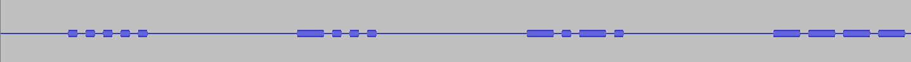

得到以下结果

```
..... -... -.-. ----. ..--- ..... -.... ....- ----. -.-. -... ----- .---- ---.. ---.. ..-. ..... ..--- . -.... .---- --... -.. --... ----- ----. ..--- ----. .---- ----. .---- -.-.
```
我们可以使用 `Cyber chef` 的 `from morse` 来进行解码

我们也可以使用别的工具如 CTFcrack 
+ [CTFcrack.jar 下载](./video_misc.assets/CTFcrack.rar)

解码之后成功获得 flag

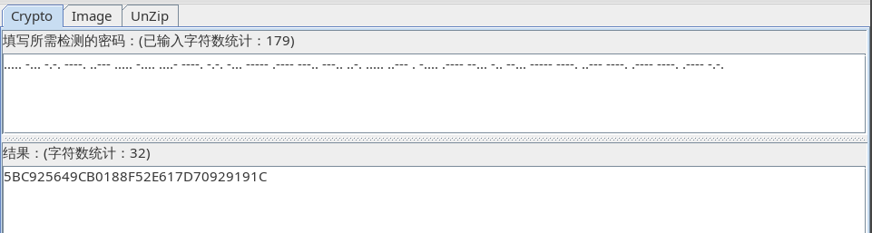

### MP3Stego 隐写


使用 MP3stego 工具来隐藏信息 （这个工具好像只有 Windows 版本的）

+ 解决方式：
  + 使用 MP3stego 工具操作文件
  + 常用解密命令 `MP3StegoDecode -X -P password flag.mp3`

**题目例子**

[女神又和大家见面了](./video_misc.assets/3.jpg)

获得了一张图片，就进行图片隐写这一块的操作，这边就不在详解了。
我们只需要使用 `binwalk / foremost` 就能提取出里面的 zip 文件

压缩包里面存在中文，我们可以使用 `zip -O cp936` 来进行提取

`描述.txt` 文件里面也存在中文,我们可以使用 `iconv`这个命令来进行转换编码格式
+ `cat 描述.txt | iconv -f GBK -t UTF-8` 

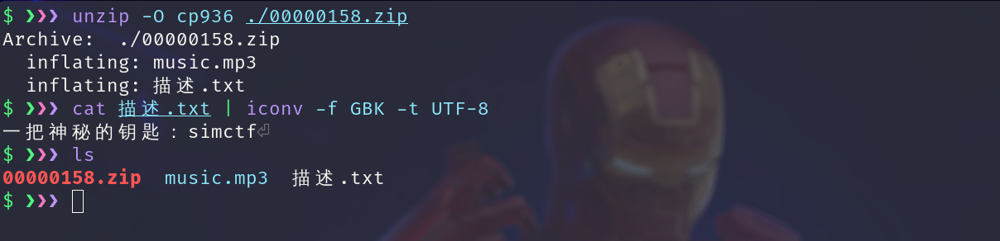

获得了 key 我们就尝试使用 MP3stego 来进行提取，因为 MP3stego 需要我们使用密码才能提取信息

我们先查看这个工具的用法

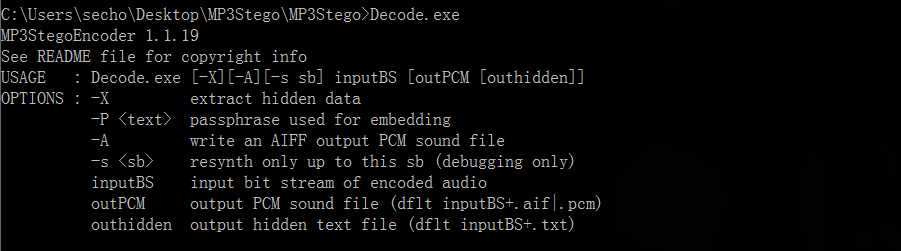

然后我们将文件放入到工具文件夹内,并使用我们刚刚获得的密码进行尝试提取

`Decode.exe -X -P password flag.mp3`

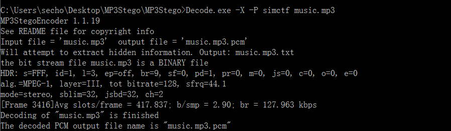
提取成功之后，文件夹内将多出两个文件(`music.mp3.pcm , music.mp3.txt`)来,提取出来的信息将会存放在 `music.mp3.txt` 这个 txt 文档内.

提取出来发现是 base64 编码，对其进行解码后获得 flag

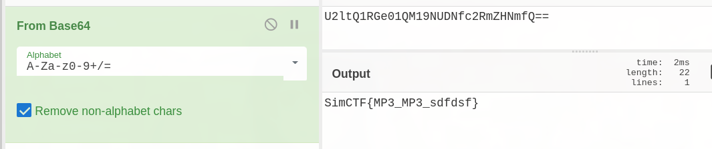

**题目例子二**

[ISCC-2016: Music Never Sleep](./video_misc.assets/ISCC2016.mp3)

还是使用 MP3stego 这个工具,但是这个工具还存在图形化界面。
+ [下载链接](./video_misc.assets/mp3stego-gui.zip)

使用方式如下。

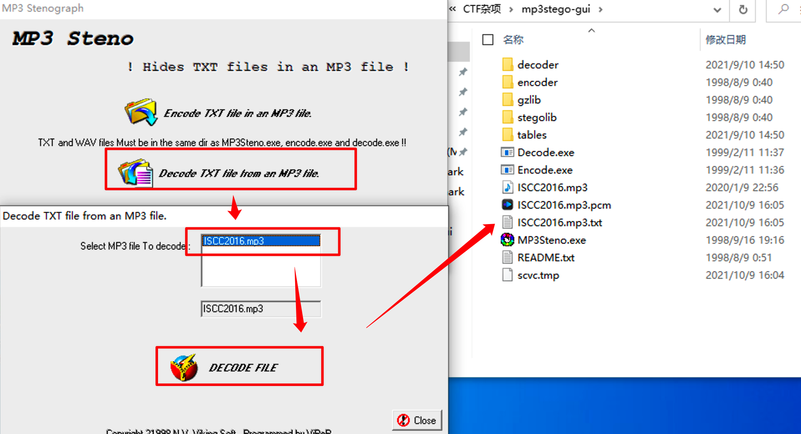

### 频谱隐写

音频文件的频谱可以嵌入信息

+ 解决方式
  + 使用 Audacity 观察音频的频谱

**题目例子**

[Su-ctf-quals-2014:hear_with_your_eyes](https://github.com/ctfs/write-ups-2014/tree/master/su-ctf-quals-2014/hear_with_your_eyes)
+ [备份文件下载](./video_misc.assets/sound.wav.tar.gz)

我们使用`Audacity`打开该文件，并将其改为频谱模式,如下图:


成功获得 flag

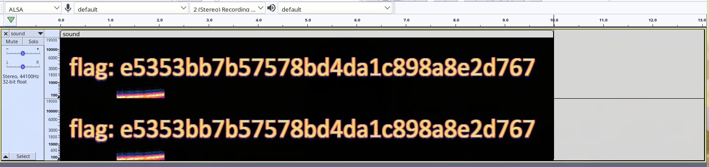

### 波形隐写

音频文件的波形可以嵌入信息 ( 高位代表 1 低位代表 0 )

+ 解决方式
  + 使用 Audacity 观察音频的波形图

**题目例子**
[很普通的Disco](./video_misc.assets/sound.wav.tar.gz)

我们还是使用 `Audacity` 打开该音频文件，发现该波形图密密麻麻

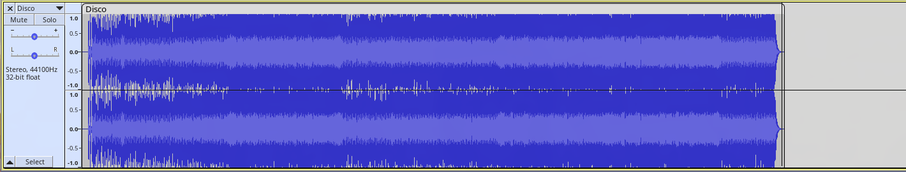

然后我们将该波形图放大,操作如下图：

然后全程查看该音频波形图。

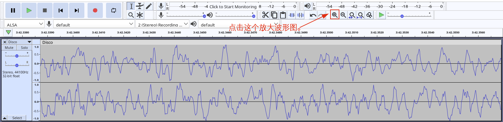

发现该波形图，在开头这一部分的波形存在异常。

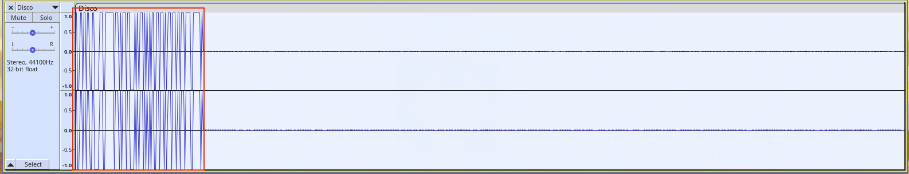

我们再对其进行放大.


然后高位为 1 低位为 0 手撸波形对应的值，获得如下值

```bash
110011011011001100001110011111110111010111011000010101110101010110011011101011101110110111011110011111101
```
我们发现直接使用 8 个为一个 Byte 解码失败

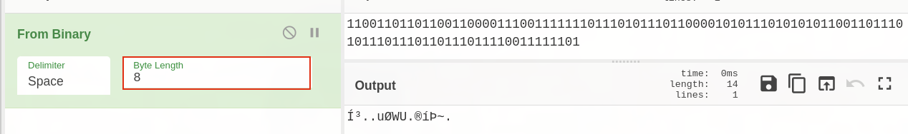

遇到这种情况，我们可以尝试将 `flag` 的二进制打印出来和我们的值进行对比,发现刚好就是 7 位与我们上面的数据对应，说明我们的方向没错，只是位数弄错了。

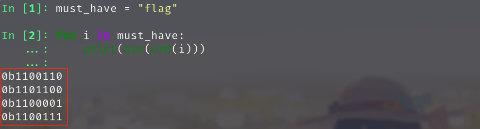

当我们将位数改成 7 位时，成功获得 flag

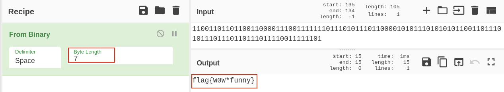

我们也可以编写 python 代码来解决这些问题 （平时写题推荐）

```python
bin_data = str(read()).strip()
temp_list = ['0'+bin_data[i:i+7] for i in range(0,len(bin_data),7)]
flag=''
for i in temp_list:
  flag+=chr(int(i,2))
print(flag)
```

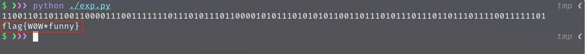


### 基于LSB的音频隐写

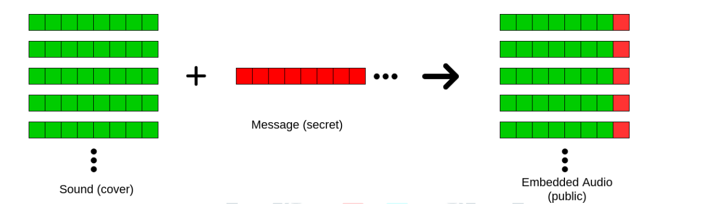

[相关文章](https://www.jetir.org/papers/JETIR2006438.pdf)

+ 解决方法:
  + 使用 WAV Steganography 来提权最低位有效字节
  + 使用 Silent Eye

使用 `stegolsb` 进行音频隐藏

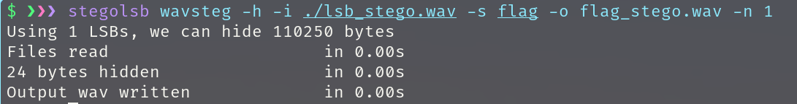

**题目例子**

[例题下载](./video_misc.assets/flag_stego.wav)

我们使用以下命令成功提取出 flag

`stegolsb wavsteg -r -i flag_stego.wav -o output.txt -n 1 -b 1000`
  + 当然 `-n 1` 如果没提取出来，我们可以多尝试几个如 `-n 2/3/4...`
  + `-b` 代表我们要提取多少个字节，我们可以往大了写,一般 1000 也够了。

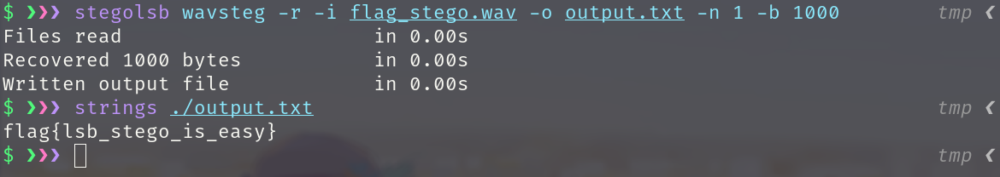


**题目例子**

[2015 广东省强网杯 - Little Apple](./video_misc.assets/Little_apple.wav)

音频的 SilentEye 隐写,

<font color='red' face=Monaco>下载完 SilentEye 一定要安装 wav 相关插件，才能进行音频的加密与解密</font> 

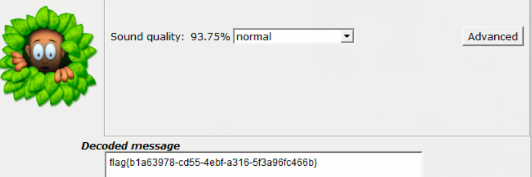

---

[参考博客](https://secgxx.com/ctf/wiki/ctf-misc-video/)