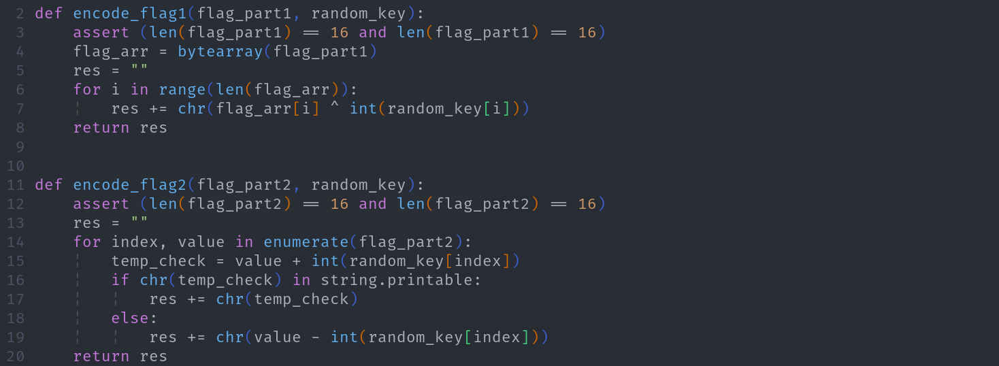

# `ezCrypt` Writeup

[题目下载链接](./w2.assets/ezCrypt.zip)

## 获得随机种子

我们首先解压这个题目发现里面有两个文件 `readme crypt.py`

既然为 `readme` 这么明显的提示文件,所以我们先查看一下这个文件.

我们查看一下这个文件发现我们需要先知道第 29 个素数,然后对该数进行科拉茨猜想得到的数字然后 <font color='red' face=Monaco size=3> 获得所有可打印的字符作为一个 `secret_seed` (似乎是一个比较重要的东西)</font>


所以我们很明显要先将这个 `secret_seed` 的内容给弄出来。


对于第 29 个素数，我们可以编写以下简单的脚本来获得
+ [prime.py](./w2.assets/prime.py)

```python
count = 0
max_num = 1000
for i in range(max_num):
    if i < 2:
        continue
    limit = int(i / 2) + 1
    for j in range(2, limit):
        if i % j == 0:
            break
    else:
        count += 1
        if (count == 29):
            print(count, ":", i)
            break
```
运行完之后，我们可以发现其数字为 `109`


+ [Collatz conjecture](https://en.wikipedia.org/wiki/Collatz_conjecture)

所以我们也可以编写以下程序来获得所有的科拉茨数。

```python
num = 109
contain = [num]
while num != 1:
    if num % 2 == 1:
        num = num * 3 + 1
    else:
        num = num // 2
    if chr(num).isascii():
        contain.append(num)

print(contain)
```
我们运行完之后，我们就获得了所有的数字


然后我们再次使用 `CyberChef` 来转换成可打印的字符


> 这边使用了三个 `CyberChef` 里的模块

+ `From Decimal` : 将数字转换成 ASCII
    + 记得将分隔符替换成 `, (Comma)`
+ `Strings` : 只显示可打印字符
    + 对每个字符进行匹配 (All printable chars)
+ `Find | Replace` : 将换行替换成空

<font color='red' face=Monaco size=3> 最后得到我们的结果 ：`mR)|>^/Gky[gz=\.F#j5P(`</font>

---

<font color='red' face=Monaco size=3>当然我们还可以直接使用程序一次性进行上面的一系列操作</font> 


<div style='border-radius:15px;display:block;background-color:#a8dadc;border:2px solid #aaa;margin:15px;padding:10px;'><code>import string</code> <code>string.printable</code> 将会返回一个所有能打印的字符串，我们可以使用这个字符串来进行判断我们数字列表里的每个元素是否可打印</div>

我们使用 [collatz.py](./w2.assets/collatz.py) 来获得 `secret_seed`


## 代码审计

既然获得了 `secret_seed`,然后 `readme` 这个文件似乎也没什么重要的信息了。

> 这时候我们就可以去看 `crypt.py` 这个文件了。

名字为 `crypt.py` 我们可以大胆地猜测其为一个加密算法,我们要做的就是破解，逆向这个算法。

我们首先查看其主函数的内容，了解一下其主要逻辑。


+ `flag` 和 `gen_random_key()`的参数都被填成了 `?????` 说明这两个内容是进行加密的原内容。
    + 类似 `flag` 为明文，由 `gen_random_key()` 函数生成的 `key` 为密钥
+ 然后经过了两个加密函数之后得到加密后的密文 `alin|]^edk7neYCkR2xrbHap3r~#@,&~`.
    + 先将 flag 的前16位和第一个key进行加密 （`encode_flag1()`）
    + 先将 flag 的后16位和第二个key进行加密 （`encode_flag2()`）

### 伪随机数

所以我们可以先查看密钥生成的算法。发现其函数的返回值就是使用 python 里的 random 函数循环10次生成的随机数,取第一次和最后一次的结果，然后去除前两位 (也就是小数点后面的内容)。


<font color='red' face=Monaco size=3>而我们又知道 `python` 里的 `random` 函数生成的随机数为伪函数，而且有注释也提醒了。</font>


我们可以发现 python 中的 `random` 这个函数, <font color='red' face=Monaco size=3>如果其 `seed` 相同，那么其使用 `random.random()` 输出了结果都是一样的。</font> 

所以只要 `seed` 的值每次都相同，那么每次运行这个函数，它的返回值必定相同。

而之前通过 readme 这个文件我们知道了 secret_seed 也就是 seed 的值。

所以我们就能获得两次加密的密钥。

### 简单ASCII运算

然后我们再查看这两个加密算法,发现这两个算法的操作逻辑非常简单。

+ 第一个加密算法就是将flag的前16位与key的每一位进行异或操作。
+ 第二个加密算法就是将 flag 加上 key 的值，如果结果为不可打印字符则进行减法操作。



所以我们只需要对这两步进行逆运算即可。


## 编写解密算法

编写对应的代码，如下
+ [decode.py](./w2.assets/decode.py)


运行解密代码，即可获得flag


