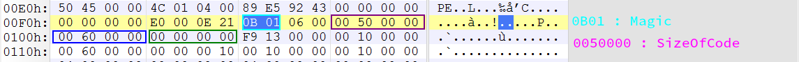
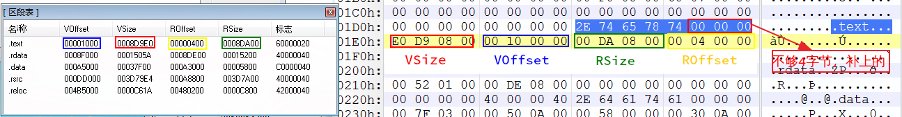

## PE 结构

<font color='red' face=Monaco size=3>如何查看头部信息? ( 对应的结构体和变量 )</font>

我们只需要在 visual studio code 里面输入这几行代码,然后对我们想查看的结构体 <font color='red' face=Monaco size=3>按住 <kbd>Ctrl</kbd> 键不松,然后点击你想要看的头部信息即可</font>

```c++
#include <windows.h>
_IMAGE_DOS_HEADER;
_IMAGE_NT_HEADERS;
_IMAGE_SECTION_HEADER;
```
在 Windows 系统内的变量大多数都是用 `DWORD,WORD,BYTE` 所以我们要对其大小非常熟练。

我们知道一个字节占8位,而一位16进制数占4位,所以我们可以使用 `位置` 来计数

+ `DWORD` 类型占四个字节
  + 一个 `DWORD` 就是占8个位置  `ffffffff`
+ `WORD` 类型占两个字节 
  + 一个 `WORD` 类型就是占4个位置 `ffff`
+ `BYTE` 类型占一个字节
  + 一个 `BYTE` 类型就是占2个位置 `ff`

### DOS 头部信息

<font color='red' face=Monaco size=3>Dos 头部信息大部分都已经被废弃了</font>

[DOS MZ executable](https://en.wikipedia.org/wiki/DOS_MZ_executable)

下面是 DOS 头部的结构体。

```C++
typedef struct _IMAGE_DOS_HEADER {      // DOS .EXE header
    WORD   e_magic;                     // Magic number
    WORD   e_cblp;                      // Bytes on last page of file
    WORD   e_cp;                        // Pages in file
    WORD   e_crlc;                      // Relocations
    WORD   e_cparhdr;                   // Size of header in paragraphs
    WORD   e_minalloc;                  // Minimum extra paragraphs needed
    WORD   e_maxalloc;                  // Maximum extra paragraphs needed
    WORD   e_ss;                        // Initial (relative) SS value
    WORD   e_sp;                        // Initial SP value
    WORD   e_csum;                      // Checksum
    WORD   e_ip;                        // Initial IP value
    WORD   e_cs;                        // Initial (relative) CS value
    WORD   e_lfarlc;                    // File address of relocation table
    WORD   e_ovno;                      // Overlay number
    WORD   e_res[4];                    // Reserved words
    WORD   e_oemid;                     // OEM identifier (for e_oeminfo)
    WORD   e_oeminfo;                   // OEM information; e_oemid specific
    WORD   e_res2[10];                  // Reserved words
    LONG   e_lfanew;                    // File address of new exe header
  } IMAGE_DOS_HEADER, *PIMAGE_DOS_HEADER;
```

**而我们做恶意代码分析的,只需要了解这两个头部信息字段即可**

+ `WORD e_magic;`  Magic number 标志位 (MZ 4d5a 只占4字节)
  + MZ 是 `Mark Zbikowski` 的缩写,他是 `MS-DOS` 主要开发者之一,所以以它的名字缩写作为Windows可执行程序的前四个字节
  + 不管是 `dll,exe` 还是什么类型的,只要是 PE 结构的文件,都有这个标志位
+ `LONG e_lfanew;` File address of new exe header 偏移位置 ( 一般接下来就是文件签名 )
  + 也就是  NT 头的第一个字段 : 文件签名

如下图所示，前两个字节为 `4D 5A` 说明这个文件为 PE 结构。


然后确定 `LONG e_lfanew` 呢? 第一种方式当然就是直接对照上面的表数到对应的字节。

<font color='red' face=Monaco size=3>第二种方式就是，通过找 NT 头部签名的方式，因为这个字段的下一个就是 NT 头的签名。</font>

所以我们只需要找 `PE` 然后前面的即为该字段，其为 <font color='red' face=Monaco size=3> 注意： long 类型在 64 位机器上占 8个字节，在32位上占 4个字节。</font>


### NT 头部信息

查看 NT 头部信息发现里面有三个成员 `Signature,FileHeader,OptionalHeader`

```C++
typedef struct _IMAGE_NT_HEADERS {
    DWORD Signature;
    IMAGE_FILE_HEADER FileHeader;
    IMAGE_OPTIONAL_HEADER32 OptionalHeader;
} IMAGE_NT_HEADERS32, *PIMAGE_NT_HEADERS32;
```

其签名一般为 `PE..` 其二进制为 `00004550H` 如下图 


所以我们找 NS 头的起始位置就可以通过找 `PE..` 这种方式来查找.

#### FileHeader

```C++
typedef struct _IMAGE_FILE_HEADER {
    WORD    Machine;
    WORD    NumberOfSections;
    DWORD   TimeDateStamp;
    DWORD   PointerToSymbolTable;
    DWORD   NumberOfSymbols;
    WORD    SizeOfOptionalHeader;
    WORD    Characteristics;
} IMAGE_FILE_HEADER, *PIMAGE_FILE_HEADER;
```


<font color='red' face=Monaco size=3>Machine 这个成员在恶意代码分析里面非常重要,因为它能识别出文件的架构</font>

我们可以看见我们这个样本 ( 如上图 ) 的 Mechine 值为 `4c10` 因 Windows 二进制格式存储为小端序，<font color='red' face=Monaco size=3>所以为 `0x014c` 对照下面的表就能知道这个样本是 `I386` 架构的。</font> 

##### Mechine 对照表

```c++
#define IMAGE_FILE_MACHINE_UNKNOWN           0
#define IMAGE_FILE_MACHINE_TARGET_HOST       0x0001  // Useful for indicating we want to interact with the host and not a WoW guest.
#define IMAGE_FILE_MACHINE_I386              0x014c  // Intel 386.
#define IMAGE_FILE_MACHINE_R3000             0x0162  // MIPS little-endian, 0x160 big-endian
#define IMAGE_FILE_MACHINE_R4000             0x0166  // MIPS little-endian
#define IMAGE_FILE_MACHINE_R10000            0x0168  // MIPS little-endian
#define IMAGE_FILE_MACHINE_WCEMIPSV2         0x0169  // MIPS little-endian WCE v2
#define IMAGE_FILE_MACHINE_ALPHA             0x0184  // Alpha_AXP
#define IMAGE_FILE_MACHINE_SH3               0x01a2  // SH3 little-endian
#define IMAGE_FILE_MACHINE_SH3DSP            0x01a3
#define IMAGE_FILE_MACHINE_SH3E              0x01a4  // SH3E little-endian
#define IMAGE_FILE_MACHINE_SH4               0x01a6  // SH4 little-endian
#define IMAGE_FILE_MACHINE_SH5               0x01a8  // SH5
#define IMAGE_FILE_MACHINE_ARM               0x01c0  // ARM Little-Endian
#define IMAGE_FILE_MACHINE_THUMB             0x01c2  // ARM Thumb/Thumb-2 Little-Endian
#define IMAGE_FILE_MACHINE_ARMNT             0x01c4  // ARM Thumb-2 Little-Endian
#define IMAGE_FILE_MACHINE_AM33              0x01d3
#define IMAGE_FILE_MACHINE_POWERPC           0x01F0  // IBM PowerPC Little-Endian
#define IMAGE_FILE_MACHINE_POWERPCFP         0x01f1
#define IMAGE_FILE_MACHINE_IA64              0x0200  // Intel 64
#define IMAGE_FILE_MACHINE_MIPS16            0x0266  // MIPS
#define IMAGE_FILE_MACHINE_ALPHA64           0x0284  // ALPHA64
#define IMAGE_FILE_MACHINE_MIPSFPU           0x0366  // MIPS
#define IMAGE_FILE_MACHINE_MIPSFPU16         0x0466  // MIPS
#define IMAGE_FILE_MACHINE_AXP64             IMAGE_FILE_MACHINE_ALPHA64
#define IMAGE_FILE_MACHINE_TRICORE           0x0520  // Infineon
#define IMAGE_FILE_MACHINE_CEF               0x0CEF
#define IMAGE_FILE_MACHINE_EBC               0x0EBC  // EFI Byte Code
#define IMAGE_FILE_MACHINE_AMD64             0x8664  // AMD64 (K8)
#define IMAGE_FILE_MACHINE_M32R              0x9041  // M32R little-endian
#define IMAGE_FILE_MACHINE_ARM64             0xAA64  // ARM64 Little-Endian
#define IMAGE_FILE_MACHINE_CEE               0xC0EE

```

`WORD NumberOfSections`  存在多少个节数 ( 最大支持 96 ) 

<font color='red' face=Monaco size=3>我们上面的样本值为 `0400` 也就是 `0004` 也就是存在 4 个节数</font> 

##### Windows 节段对照表

下面是一些较为常用节的有关描述 

| 名称     | 描述                                                         |
| -------- | ------------------------------------------------------------ |
| `.text`  | 默认的代码区块,它的内容全是指令代码.PE 文件运行在 32 位方式下,不受 16 位段的约束,所以没有理由把代码放到不同的区块中.链接器把所有目标文件的 `.text` 块链接成一个大的 `.text` 块.如果使用 `Bodand C++`,其编译器将产生的代码存储于名为 `code` 的区域,其链接其链接的结果是使代码块的名称不是 `.text`,而是 `code` |
| `.data`  | 默认的读/写数据区块.全局变量,静态变量一般存放在这            |
| `.rdata` | `.rdata` 即为 `read only data` 默认的只读数据库,但程序较少使用到该块中的数据,至少有两种情况要用到 `.rdata` 块,一是在 `Microsoft` 链接器产生的 EXE 文件中,用于存放调试目录;二是用于存放说明字符.如果程序的 DEF 文件中指定了 `DESCRIPTION`,字符串就会出现在 `.rdata` 中 |
| `.idata` | 包含其他外来 DLL 的函数及数据信息,即输入表.将 `.idata` 区块合并到另一个区块已成为惯例,典型的是 `.rdata` 区块.链接器默认仅在创建一个 Release 模式的可执行文件时才将 `.idata` 区块合并到另一个区块中. |
| `.edata` | 输出表,当创建一个输出 API 或数据的可执行文件时,链接器会创建一个 `.EXP` 文件,这个 `.EXP` 文件包含一个 `.edata` 区块,它会被加入最后的可执行文件中.与 `.idata` 区块一样,`.edata` 区块也经常被发现合并到了 `.text` 或 `.rdata` 区块中 |
|          |                                                              |


|            |                                                              |
| ---------- | ------------------------------------------------------------ |
| `.rsrc`    | 资源.包含模块的全部资源.例如图标,菜单,位图等.这个区块是只读的,无论如何都不应该命名为 `.rsrc` 以外的名字,也不能被合并到其他区块里. |
| `.bss`     | 未初始化数据,很少使用.取而代之的是执行文件的 `.data` 区块的 `VirtualSize` 被扩展到足够大以存放未初始化的数据 |
| `.crt`     | 用于支持 C++ 运行时 ( CRT ) 所添加的数据                     |
| `.tls`     | TLS 的意思是 线程局部存储器,用于支持通过 `__deelspec ( thread )` 声明的线程局部存储变量的数据,即包括数据的初始化值,也包括运行时所需的额外变量 |
| `.reloc`   | 可执行文件的基址重定位.基址重定位一般只是 DLL 需要,而不是 EXE 需要. 在 Release 模式下,链接器不会给 EXE 文件加上基址重定位,重定位可以在链接时通过 `/FIXED` 开关关闭 |
| `.sdata`   | 相对于全局指针的可被定位的 "短的" 读/写数据,用于 IA-64 和其他使用一个全局指针寄存器的体系结构.IA-64 上常规大小的全局变量放在这个区块 |
| `.srdata`  | 相对于全局指针的可被定位的 "短的" 只读数据,用于 IA-64 和其他使用一个全局指针寄存器的体系结构 |
| `.pdata`   | 异常表,包含一个 CPU 特定的 `IMAGE_RUNTIME_FUNCTION_ENTRY` 结构体数组, DataDirectory 中的 `IMAGE_DIRECTORY_ENTRY_EXCEPTION` 指向它.它用于异常处理,是基于表的体系结构,就像 IA-64.唯一不使用基于表的异常处理的架构体系是 `X86` |
| `.debug$S` | obj文件中CodeView格式的符号。这是一个可变长的CodeView格式符号记录流。 |
| `.debug$T` | obj文件中CodeView格式的类型记录。这是一个可变长的CodeView格式类型记录流。 |
| `.debug$P` | 当使用预编译头时会出现在obj文件中。                          |
| `.drectve` | 只用于obj文件，包含一些链接器指令。这些指令是一些能被传递到链接器命令行的ASCII字符串。例如：-defaultlib:LIBC　多个指令之间用空格隔开。 |
| `.didat`   | 延迟装入输入数据，只能在非Release模式下的可执行文件中找到.在 Release 模式下,延迟载人的数据会被合并到另一个区块中. |

在VC++中可以命名我们的区块，用 `#pragma` 来声明，告诉编译器插入数据到一个区块内，格式如下：

```c++
　#pragma data_msg("FC_data")
```

以上语句告诉编译器将数据都放进一个名为 `"FC_data"` 的区块内。


+ `DWORD TimeDataStamp` 时间戳 ( 创建时间,以utc做标准)
+ ~~`DWARD PointerToSymbolTable` 标准表指针 ( 已被被废除)~~
+ ~~`DWARD NumberOfSymbols` 标准表数量 ( 已被被废除)~~
+ `WORD    SizeOfOptionalHeader;` 可选头大小 ( 对于32位文件来说,它是224;对于64位文件来说,它是240.) 
+ <font color='red' face=Monaco size=3>**`WORD    Characteristics;` 文件特征**</font>

我们可以发现其 `TimeDateStamp` 的值为 `0x4392E589` 所以我们可以使用一些小工具将其进行转换成字符串形式的时间格式。


同理 `SizeOfOptionalHeader` 的值为  `0x00E0` 对应10进制也就是 224 可以说明其为 32 位的文件。


<font color='red' face=Monaco size=3>`WORD    Characteristics`这个成员变量很重要，因为这两个字节决定了这个文件是什么类型的。</font>

上面那个样本的值为： `0x210E`  我们对照下面的表就可以知道其值为 `0x2000` + `0x0100`  + `0x0008` + `0x0004` + `0x0002` 所以再对照下面的表我们就知道 **这是一个可执行的运行在32位机器上的DLL**

##### 文件特征详细表

```c++
#define IMAGE_FILE_RELOCS_STRIPPED           0x0001  // Relocation info stripped from file.
#define IMAGE_FILE_EXECUTABLE_IMAGE          0x0002  // File is executable  (i.e. no unresolved external references).
#define IMAGE_FILE_LINE_NUMS_STRIPPED        0x0004  // Line nunbers stripped from file.
#define IMAGE_FILE_LOCAL_SYMS_STRIPPED       0x0008  // Local symbols stripped from file.
#define IMAGE_FILE_AGGRESIVE_WS_TRIM         0x0010  // Aggressively trim working set
#define IMAGE_FILE_LARGE_ADDRESS_AWARE       0x0020  // App can handle >2gb addresses
#define IMAGE_FILE_BYTES_REVERSED_LO         0x0080  // Bytes of machine word are reversed.
#define IMAGE_FILE_32BIT_MACHINE             0x0100  // 32 bit word machine.
#define IMAGE_FILE_DEBUG_STRIPPED            0x0200  // Debugging info stripped from file in .DBG file
#define IMAGE_FILE_REMOVABLE_RUN_FROM_SWAP   0x0400  // If Image is on removable media, copy and run from the swap file.
#define IMAGE_FILE_NET_RUN_FROM_SWAP         0x0800  // If Image is on Net, copy and run from the swap file.
#define IMAGE_FILE_SYSTEM                    0x1000  // System File.
#define IMAGE_FILE_DLL                       0x2000  // File is a DLL.
#define IMAGE_FILE_UP_SYSTEM_ONLY            0x4000  // File should only be run on a UP machine
#define IMAGE_FILE_BYTES_REVERSED_HI         0x8000  // Bytes of machine word are reversed.
```

---


### 可选 NT 头

事实上，虽然名字叫可选 NT 头，( 可选 ) <font color='red' face=Monaco size=3> 但是里面的字段大多数都被填充了。</font>所以还是有很多有用的信息在里面的。

```c++
typedef struct _IMAGE_OPTIONAL_HEADER {
    //
    // Standard fields.
    //

    WORD    Magic;
    BYTE    MajorLinkerVersion;
    BYTE    MinorLinkerVersion;
    DWORD   SizeOfCode;
    DWORD   SizeOfInitializedData;
    DWORD   SizeOfUninitializedData;
    DWORD   AddressOfEntryPoint;
    DWORD   BaseOfCode;
    DWORD   BaseOfData;

    //
    // NT additional fields.
    //

    DWORD   ImageBase;
    DWORD   SectionAlignment;
    DWORD   FileAlignment;
    WORD    MajorOperatingSystemVersion;
    WORD    MinorOperatingSystemVersion;
    WORD    MajorImageVersion;
    WORD    MinorImageVersion;
    WORD    MajorSubsystemVersion;
    WORD    MinorSubsystemVersion;
    DWORD   Win32VersionValue;
    DWORD   SizeOfImage;
    DWORD   SizeOfHeaders;
    DWORD   CheckSum;
    WORD    Subsystem;
    WORD    DllCharacteristics;
    DWORD   SizeOfStackReserve;
    DWORD   SizeOfStackCommit;
    DWORD   SizeOfHeapReserve;
    DWORD   SizeOfHeapCommit;
    DWORD   LoaderFlags;
    DWORD   NumberOfRvaAndSizes;
    IMAGE_DATA_DIRECTORY DataDirectory[IMAGE_NUMBEROF_DIRECTORY_ENTRIES];
} IMAGE_OPTIONAL_HEADER32, *PIMAGE_OPTIONAL_HEADER32;
```

+ <font color='red' face=Monaco size=3>`WORD Magic` 文件类型标识</font>
  + `0x10B` 表明这是一个 32 位镜像文件
  + `0x107` 表明这是一个 ROM 位镜像文件
  + `0x20B` 表明这是一个 64 位镜像文件
+ `BYTE MajorLinkerVersion` 链接器主版本号
+ `BYTE MinorLinkerVersion` 链接器副版本号
+ `DWORD SizeOfCode` `.text` 总大小
+ `DWORD SizeOfInitializedData` `.data` 总大小
+ `DWORD SizeOfUninitializedData` `.bss` 总大小

`bss`: BSS 段通常是指用来存放程序中未初始化或者初始化为 0 的全局变量和静态变量的一块内存区域.特点是可读写的,在程序执行之前的 BSS 段会自动清0

下面以如下样本的二进制为例：


+ **`Magic` 为 `0x010B` 说明其为 32 位文件**
+ `0x06` 这个字节就是其连接器的主版本号
+ `0x00` 为其链接器的副版本号
+ `0x00500000` 位 `.text` 的总大小，换算成十进制为 83886080
+ 下面也同理

---

> <font color='red' face=Monaco size=3>下面三个都是偏移量,非常重要</font>


+ `DWORD AddressOfEntryPoint` 程序的虚拟入口地址 程序执行的第一条语句的地址
+ `DWORD BaseOfCode` 代码基址 程序的第一条语句的地址
+ `DWORD BaseOfData` 数据基址


<font color='red' face=Monaco size=3>总而言之，`DWORD AddressOfEntryPoint` 就是运行第一条的地址， OD打开时的第一条指令的位置。</font> 一般都是看后四位，前四位如果开了地址随机化的话，是不固定的。

我们知道，我们写 C 语言时在主函数 main 之前也会有一些代码，而这个文件的第一条代码则由 `DWORD BaseOfCode` 指定，所以我们使用 OD 打开一个可执行文件时，默认会停在 `DWORD AddressOfEntryPoint` 的位置，而如果我们往上翻时，还会发现有一大堆代码，<font color='red' face=hack size=3> 一直拖到最前面(OD 第一行指令)，而这个指令对应的地址就是 `DWORD BaseOfCode`</font>

+ `DWORD ImageBase` 镜像基址,可以把它理解为一个固定的值。
  + 当加载进内存时镜像的第一个字节的首选地址.它必须是 64K 的倍数. DLL 默认值为 10000000H. Windows CE 的EXE 默认值为 00010000H. <font color='red' face=Monaco size=3>Windows 系统的EXE默认是 00400000H.</font>

我们知道 Wind7 没有 ALSR 地址随机化，所有我们可以很直观的看到效果


我们可以看见的截图第一条运行的代码地址为 `0x0045DD37` 而我们知道后四位为 `AddressOfEntryPoint` 程序的入口地址，而前面的 `0x00400000` 就是 `ImageBase` 镜像基址


---

<div style='border-radius:15px;display:block;background-color:#a8dadc;border:2px solid #aaa;margin:15px;padding:10px;'>
下面查看的方式，也和上面一样，所有的字段都是连在一起的，所以这边就不再演示了。
</div>

+ `DWORD   SectionAlignment` 当加载进内存时节的对齐值 ( 以字节计 ) ( 内存 )
+ `DWORD   FileAlignment` 用来对齐镜像文件的节中的原始数据 ( 以字节计) ( 磁盘 )


**对齐相关的小知识:**

<font color='red' face=Monaco size=3> 一个pe文件无论如何在磁盘和内存中存放都会进行对齐,但他们的对其值会不相同.</font>

PE 文件头里边的 FileAligment 定义了磁盘区块的对齐值.每一个区块从对齐值的倍数的偏移位置开始存放.而区块的实际代码或数据的大小不一定刚好是这么多,所以在多余的地方一般以 00h 来填充,这就是区块间的间隙.

PE文件头里边的 SectionAligment 定义了内存中区块的对齐值.PE 文件被映射到内存中时,区块总是至少从一个页边界开始.


```c++
WORD    MajorOperatingSystemVersion;
WORD    MinorOperatingSystemVersion;
WORD    MajorImageVersion;
WORD    MinorImageVersion;
WORD    MajorSubsystemVersion;
WORD    MinorSubsystemVersion;
```

以上字段全是版本号,所以也就没上面好说的。

+ `DWORD Win32VersionValue ` win32 版本 ( 必须为 0 )
+ `DWORD SizeOfImage` 总大小
+ `DWORD SizeOfHeaders` 头的总大小
+ `DWORD CheckSum` 校验和 ( 用来检查文件是否被修改 )
  + 内容的长度和内容本身去做运算
+ `WORD Subsystem` 子系统


#### 子系统表

| 值    | 描述                                           |
| ----- | ---------------------------------------------- |
| 0     | 未知子系统                                     |
| **1** | **设备驱动和 Native Windows进程**              |
| **2** | **Windows 图形用户界面 (GUI) 子系统 (一般)**   |
| **3** | **Windows 字符模式 (CUI) 子系统 (从命令提示)** |
| 7     | Posix 字符模式子系统                           |
| 9     | Windows CE                                     |
| 10    | 可扩展固件接口 (EFI) 应用程序                  |
| 11    | 带引导服务的 EFI 驱动程序                      |
| 12    | 带运行时服务的 EFI 驱动程序                    |
| 13    | EFI ROM 镜像                                   |
| 14    | XBOX                                           |


`WORD  DllCharacteristics`

```c++
#define IMAGE_DLLCHARACTERISTICS_HIGH_ENTROPY_VA    0x0020  // Image can handle a high entropy 64-bit virtual address space.
#define IMAGE_DLLCHARACTERISTICS_DYNAMIC_BASE 0x0040     // DLL can move. alsr 随机地址关闭
#define IMAGE_DLLCHARACTERISTICS_FORCE_INTEGRITY    0x0080     // Code Integrity Image
#define IMAGE_DLLCHARACTERISTICS_NX_COMPAT    0x0100     // Image is NX compatible
#define IMAGE_DLLCHARACTERISTICS_NO_ISOLATION 0x0200     // Image understands isolation and doesn't want it
#define IMAGE_DLLCHARACTERISTICS_NO_SEH       0x0400     // Image does not use SEH.  No SE handler may reside in this image
														 // SEH的保护机制 防止缓存区溢出
#define IMAGE_DLLCHARACTERISTICS_NO_BIND      0x0800     // Do not bind this image.
#define IMAGE_DLLCHARACTERISTICS_APPCONTAINER 0x1000     // Image should execute in an AppContainer
#define IMAGE_DLLCHARACTERISTICS_WDM_DRIVER   0x2000     // Driver uses WDM model
														 // 大部分DLL 都有这个
#define IMAGE_DLLCHARACTERISTICS_GUARD_CF     0x4000     // Image supports Control Flow Guard.
#define IMAGE_DLLCHARACTERISTICS_TERMINAL_SERVER_AWARE     0x8000
```

+ `DWORD SizeOfStackReserve` 栈的保留大小
+ `DWORD SizeOfStackCommit` 栈的申请大小
+ `DWORD SizeOfHeapReserve` 堆的保留大小
+ `DWORD SizeOfHeapCommit` 堆的申请大小

> 上面这几个字段没什么好管的,都是编译器帮我们填充进去的.

+ `DWORD LoaderFlags` 标志位 ( 必须为0 )
+ `DWORD NumberOfRvaAndSizes` 数据目录 ( 16 )

### 节头

<font color='green' face=Monaco size=3> 从上面内容到节头部分，我们会发现里面还有一部分内容</font>，其实可能就是页对齐由编译器填充进去的。(下图中蓝色的部分，应该就是填充的内容，反正我不知道有啥用 : ) )


```c++

typedef struct _IMAGE_SECTION_HEADER {
    BYTE    Name[IMAGE_SIZEOF_SHORT_NAME];
    union {
            DWORD   PhysicalAddress;
            DWORD   VirtualSize;
    } Misc;
    DWORD   VirtualAddress;
    DWORD   SizeOfRawData;
    DWORD   PointerToRawData;
    DWORD   PointerToRelocations;
    DWORD   PointerToLinenumbers;
    WORD    NumberOfRelocations;
    WORD    NumberOfLinenumbers;
    DWORD   Characteristics;
} IMAGE_SECTION_HEADER, *PIMAGE_SECTION_HEADER;
```

我们也可以使用 `LoadPE` 来查看相关节的信息


+ `BYTE Name[IMAGE_SIZEOF_SHORT_NAME]`  本节的名字
<font color='red' face=Monaco size=3>如果节的名字不是 4字节的倍数，将会被补全成 4字节的倍数</font>
如下图，`.text` 一共5个字节`0x2E74657874` 不是4字节的倍数，所以被补成 8 字节的空间: `0x2E74657874000000`



<font color='red' face=Monaco size=3>根据这个我们就可以通过寻找这个名字来快速查找到对应的节，如 `.text,.bss ...` </font>


```c++
    union {
            DWORD   PhysicalAddress; // 本节的物理地址
            DWORD   VirtualSize;     // 本节的实际大小
    } Misc;
```

为什么有 union大括号 二选一, 通常选择后面这个,因为不知道具体的物理地址

+ `DWORD VirtualAddress` 本节的 RVA 也就是第一条代码 OD 打开的第一行代码.

> **RVA** (Relative Virtual Address) 相对虚拟地址。RVA是当PE文件被装载到内存中后，某个数据位置相对于文件头的偏移量。

比如Windows装载器将一个PE文件装入到 00400000h (虚拟地址)处的内存中，而某个区块中得某个数据被装入到 0040xxxx 处，那么这个数据的RVA就是 0040xxxxh-00400000h=xxxxh，反过来说，将RVA的值加上文件被装载的基地址，就可以找到数据在内存中的实际地址。

+ `DWORD SizeOfRawData` 本节在磁盘中的大小
+ `DWORD PointerToRawData` 本节在磁盘中的偏移
+ `DWORD PointerToRelocations` 文件无意义
+ `DWORD PointerToLinenumbers ` 行号表的位置 ( 调试用, 不过基本没用 )
+ `WORD NumberOfRelocations` 重定位表数量
+ `WORD NumberOfLinenumbers` 行号表数量 
+ `DWORD Characteristics` 特征

| 值                                            | 含义                                                         |
| --------------------------------------------- | ------------------------------------------------------------ |
| `IMAGE_SCN_CNT_CODE 0x00000020`               | 包含代码,常与 0x10000000 一起设置                            |
| `IMAGE_SCN_CNT_INITIALIZED_DATA 0x00000040`   | 该区块包含已初始化的数据                                     |
| `IMAGE_SCN_CNT_UNINITIALIZED_DATA 0x00000080` | 该区块包含未初始化的数据                                     |
| `IMAGE_SCN_MEM_DISCARDABLE 0x02000000`        | 该区块可被丢弃,因为当它一旦被装入后,进程就不在需要它了,典型的如定位区块如 `( .reloc )` |
| `IMAGE_SCN_MEM_SHARED 0x10000000`             | 该区块为共享区块.                                            |
| `IMAGE_SCN_MEM_EXECUTE 0x20000000`            | 该区块可以执行,通常当 0x00000020 被设置的时候,该标志也被设置 |
| `IMAGE_SCN_MEM_READ 0x40000000`               | 该区块可读,可执行文件中的区块总是设置该标志.                 |
| `IMAGE_SCN_MEM_WRITE 0x80000000`              | 该区块可写.该标志没有设置,装载程序就会将内存映像也标记为可读或可执行 |


```c++
//
// Section characteristics.
//
//      IMAGE_SCN_TYPE_REG                   0x00000000  // Reserved.
//      IMAGE_SCN_TYPE_DSECT                 0x00000001  // Reserved.
//      IMAGE_SCN_TYPE_NOLOAD                0x00000002  // Reserved.
//      IMAGE_SCN_TYPE_GROUP                 0x00000004  // Reserved.
#define IMAGE_SCN_TYPE_NO_PAD                0x00000008  // Reserved.
//      IMAGE_SCN_TYPE_COPY                  0x00000010  // Reserved.

#define IMAGE_SCN_CNT_CODE                   0x00000020  // Section contains code.
#define IMAGE_SCN_CNT_INITIALIZED_DATA       0x00000040  // Section contains initialized data.
#define IMAGE_SCN_CNT_UNINITIALIZED_DATA     0x00000080  // Section contains uninitialized data.

#define IMAGE_SCN_LNK_OTHER                  0x00000100  // Reserved.
#define IMAGE_SCN_LNK_INFO                   0x00000200  // Section contains comments or some other type of information.
//      IMAGE_SCN_TYPE_OVER                  0x00000400  // Reserved.
#define IMAGE_SCN_LNK_REMOVE                 0x00000800  // Section contents will not become part of image.
#define IMAGE_SCN_LNK_COMDAT                 0x00001000  // Section contents comdat.
//                                           0x00002000  // Reserved.
//      IMAGE_SCN_MEM_PROTECTED - Obsolete   0x00004000
#define IMAGE_SCN_NO_DEFER_SPEC_EXC          0x00004000  // Reset speculative exceptions handling bits in the TLB entries for this section.
#define IMAGE_SCN_GPREL                      0x00008000  // Section content can be accessed relative to GP
#define IMAGE_SCN_MEM_FARDATA                0x00008000
//      IMAGE_SCN_MEM_SYSHEAP  - Obsolete    0x00010000
#define IMAGE_SCN_MEM_PURGEABLE              0x00020000
#define IMAGE_SCN_MEM_16BIT                  0x00020000
#define IMAGE_SCN_MEM_LOCKED                 0x00040000
#define IMAGE_SCN_MEM_PRELOAD                0x00080000

#define IMAGE_SCN_ALIGN_1BYTES               0x00100000  //
#define IMAGE_SCN_ALIGN_2BYTES               0x00200000  //
#define IMAGE_SCN_ALIGN_4BYTES               0x00300000  //
#define IMAGE_SCN_ALIGN_8BYTES               0x00400000  //
#define IMAGE_SCN_ALIGN_16BYTES              0x00500000  // Default alignment if no others are specified.
#define IMAGE_SCN_ALIGN_32BYTES              0x00600000  //
#define IMAGE_SCN_ALIGN_64BYTES              0x00700000  //
#define IMAGE_SCN_ALIGN_128BYTES             0x00800000  //
#define IMAGE_SCN_ALIGN_256BYTES             0x00900000  //
#define IMAGE_SCN_ALIGN_512BYTES             0x00A00000  //
#define IMAGE_SCN_ALIGN_1024BYTES            0x00B00000  //
#define IMAGE_SCN_ALIGN_2048BYTES            0x00C00000  //
#define IMAGE_SCN_ALIGN_4096BYTES            0x00D00000  //
#define IMAGE_SCN_ALIGN_8192BYTES            0x00E00000  //
// Unused                                    0x00F00000
#define IMAGE_SCN_ALIGN_MASK                 0x00F00000

#define IMAGE_SCN_LNK_NRELOC_OVFL            0x01000000  // Section contains extended relocations.
#define IMAGE_SCN_MEM_DISCARDABLE            0x02000000  // Section can be discarded.
#define IMAGE_SCN_MEM_NOT_CACHED             0x04000000  // Section is not cachable.
#define IMAGE_SCN_MEM_NOT_PAGED              0x08000000  // Section is not pageable.
#define IMAGE_SCN_MEM_SHARED                 0x10000000  // Section is shareable.
#define IMAGE_SCN_MEM_EXECUTE                0x20000000  // Section is executable.
#define IMAGE_SCN_MEM_READ                   0x40000000  // Section is readable.
#define IMAGE_SCN_MEM_WRITE                  0x80000000  // Section is writeable.
```

实际用处: 当我们遇到一些代码会释放文件这种操作的时候很重要,如果释放的位置是内存,我们不太好对其进行直接分析,<font color='red' face=Monaco size=3>这时候就需要用到我们这些 PE 有关的知识来判断是否为 PE .</font> 如果是,那么就下载这段内存重命名 ( 判断是 exe 还是 dll ) ,如果不是,就当是 shellcode 处理

### 使用工具来分析 PE 结构

我们发现上面的手工分析确实能分析全部的内容，但是我们发现这个过程完全是枯燥无味，而且是唯一的，我们很自然的想到，是否有工具帮我们实现这一步，答案是有的。

我们可以使用 `peinfo` `loadpe` 等这一类图形化工具，我们只需要将要分析的文件拖入其中，就能获得我们常用的字段内容。如入口点...
<font color='red' face=Monaco size=3>但是我们发现这几个工具都不能获取 PE 文件的所有信息。</font>

<font color='red' face=Monaco size=3>下面介绍一个非常强的工具,它能将我们上面的过程全部分析提取出来</font>

> 我们可以使用 python 里的 `pefile` 库来对 PE 文件的各个字段进行分析和查看。

默认是没有这个库的，我们需要使用一下命令进行安装。
```bash
pip install -i \ # -i 表示我们要使用指定的镜像源进行下载
https://mirrors.aliyun.com/pypi/simple \  # 阿里镜像
pefile # 包名
```


```python
import pefile
pe = pefile.PE("Demo.exe")
print(pe)
```
我们可以看见它将其 PE 结构从头到尾都提取并分析出来了。

我们只需要对照相关字段代表啥意思就能完全搞清楚这个文件的 PE 结构了。


