## IDA的使用
> IDA 是一款非常强大的静态代码分析工具。下面将介绍其基本使用。

### 基础使用

#### 加载一个二进制文件。

<font color='red' face=Monaco size=3>在使用 IDA 进行静态分析时，我们要先确定这个二进制的位数。（32/64位）</font>

因为 IDA这个工具有两个类型，一个就是 IDA 用来分析 32 位程序的，还有一个就是 IDA64 用来分析64位程序的。 

我们可以使用 PE相关的知识，自己查看其二进制获得其文件的位数，或者使用 `PEinfo` `LoadPE` 这类的工具进行查看。

当我们选择对应类型的 IDA 之后，双击 IDA 就会弹出 下面这个框


一般来讲我们会选择 `Go` 然后将自己要进行反汇编的二进制文件拖入其中即可。

然后就会弹出下面这个框，如果自己确定了这个文件就是 PE 结构，那么就选第一个，如果是 DOS 文件，就选择第二个，如果是类似shellcode 的文件，那么选择第三个即可。

一般来讲 IDA 会自动识别其类型。

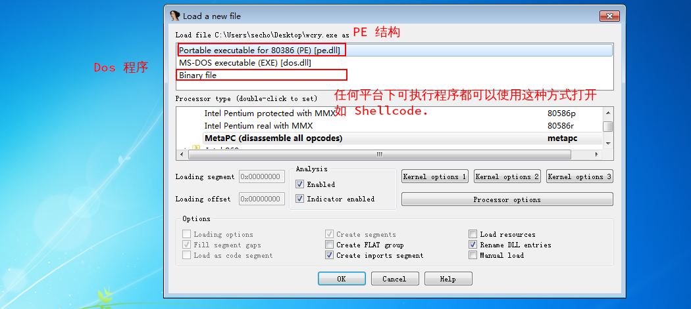    


下面这栏，显示的是整个文件的文件结构.
<font color='red' face=Monaco size=3>如果看见某个程序，这条栏五颜六色 （比较花）的时候，很有可能做了一些跳转指令的混淆。</font>

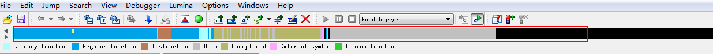

例如恶意攻击者可以使用 backdoorfactory ,它可以在一个正常文件的空白部分，填充 shellcode,这种情况也会出现上面所说的情况


### 功能结构

在使用 IDA 前我们可以将地址和，IDA 的注释信息都开启，因为这些信息比较重要

+ 开启显示地址的方式
  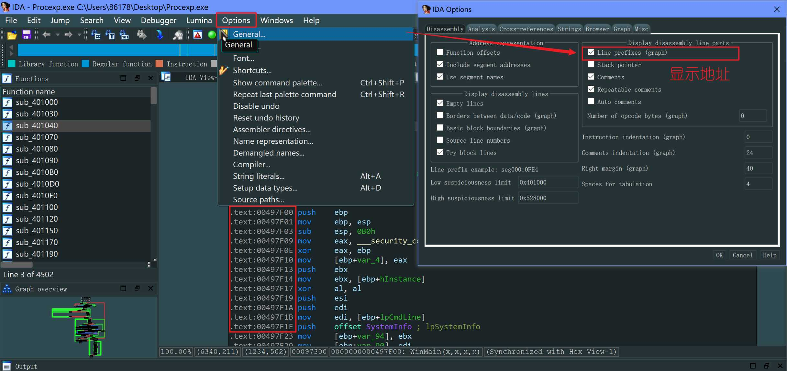
+ 开启显示注释的方式
  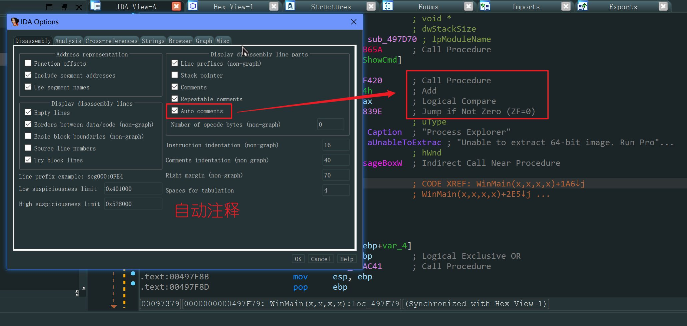


#### 窗口切换

我们可以按 <kbd> Space/空格 </kbd> 键切换汇编窗口和结构窗口

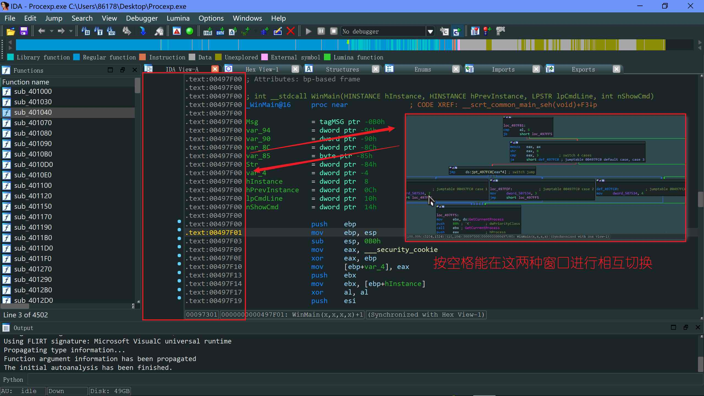

我们还可以按 <kbd>tab</kbd> 键来切换窗口

####  快速定位地址

快速定位地址: 按 <kbd>G</kbd> 键就能进行跳转


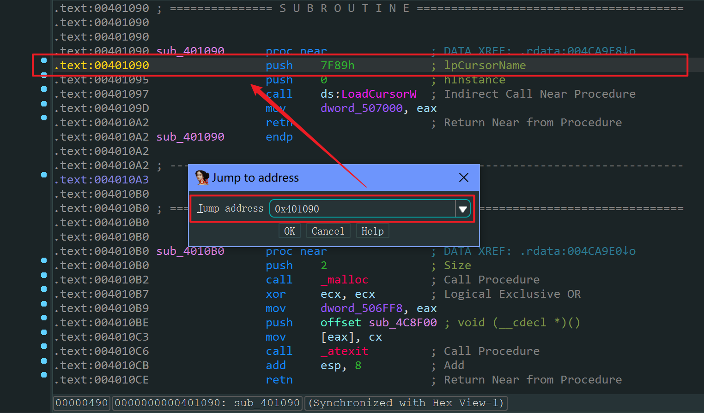

#### 查看交叉引用图

交叉引用的图模式:查看某个函数下还调用了哪些函数,调用关系(一定要选中要查看的函数)

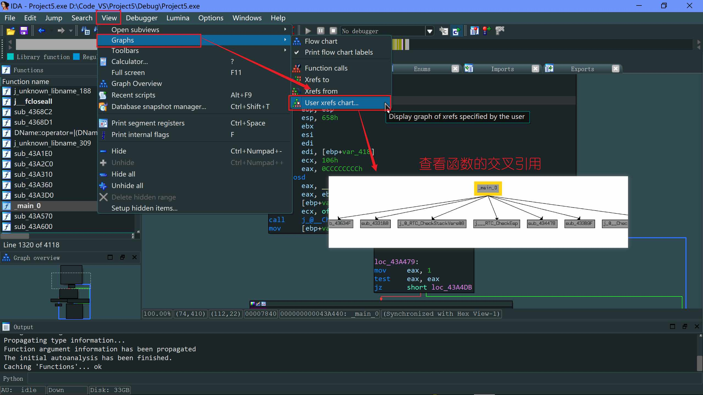

#### 查看函数的交叉引用

查看某个 函数/字符串 的交叉引用: 按 <kbd>Ctrl</kbd> + <kbd>X</kbd> 键查看函数的交叉引用
> 字符串等,也可以使用 <kbd>Ctrl</kbd> + <kbd>X</kbd> 来进行交叉引用跳转

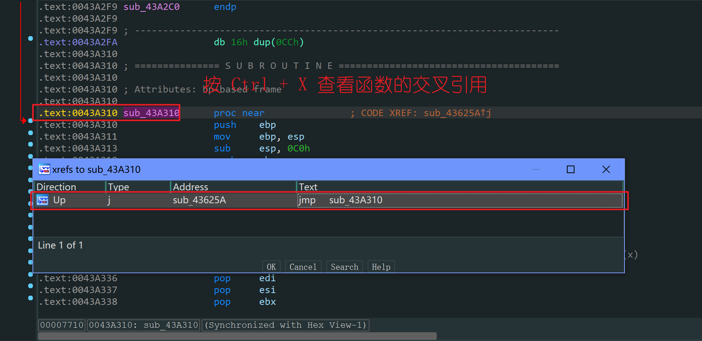

#### 查看字符串的交叉引用

<kbd>Shift</kbd> + <kbd>F12</kbd> 打开IDA的字符串窗口,双击对应的字符串就可以进入到如下界面,然后可以按 <kbd>Ctrl</kbd> + <kbd>X</kbd> 查看该字符串的引用,并跳转

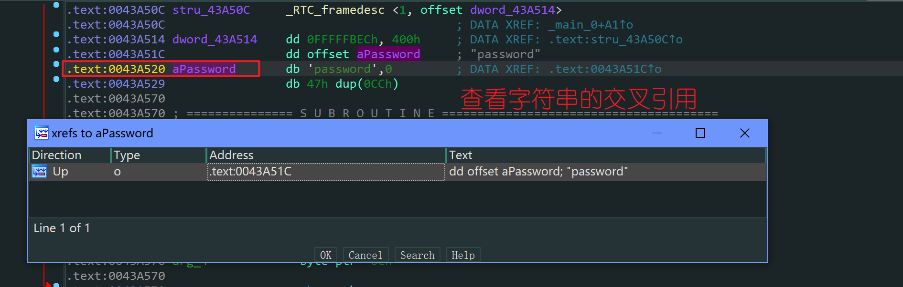


#### 更改变量名称

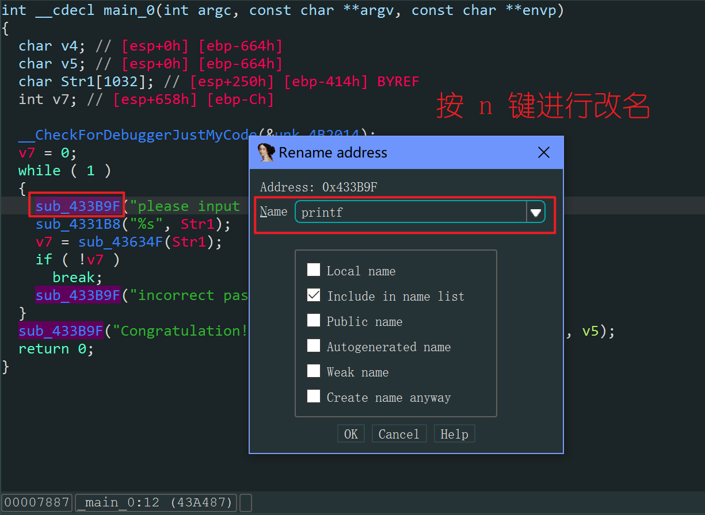

#### 更改函数名字

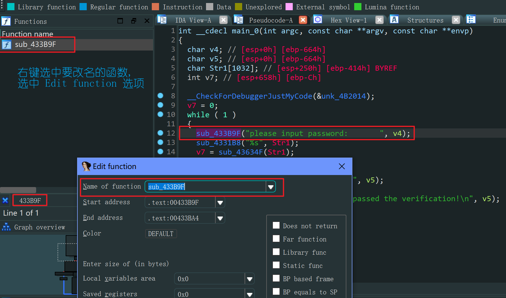

<font color='red' face=Monaco size=3>在 IDA 里函数颜色为粉红色,尤其是函数尾有类似 `A,W,EX` 这种字母的,这种函数一般来说 ( 一定 ) 是 API 函数 </font> 

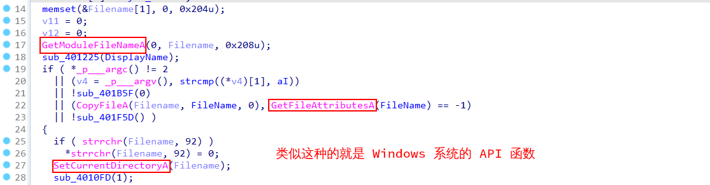
我们可以点开该函数，看看该函数是否在 `.idata` 段里，因为库函数，API 一般都在 `.idata` 段内。

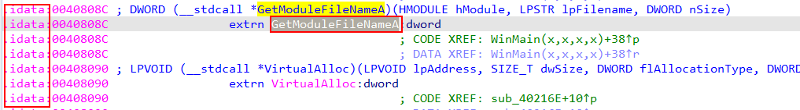

当我们知道 API 的名称之后，我们就可以上网查找该函数名称。
<font color='red' face=Monaco size=3>一般来讲都是 Windows 官方的库函数，所以我们可以直接在 [MSDN Win32 API](https://docs.microsoft.com/en-us/windows/win32/api/) 搜索即可。</font>

我们就能获得每个函数的功能和用法。

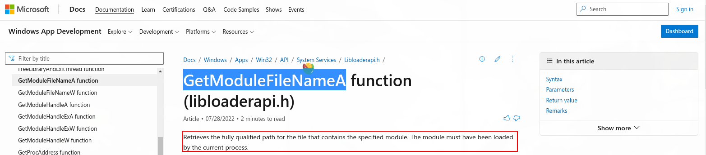


### IDA插件编写

[IDC 插件编写](https://www.cnblogs.com/gwind/p/8250842.html)

+ `ScreenEA` 代表当前光标所在位置
+ `PatchByte` 将内容显示在屏幕上

```python
ea = ScreenEA()
for i in range(0x00,0x50):
    b= Byte(ea+i)
    decode_byte = b ^ 0x55
    PatchByte(ea+i,decode_byte)
	
```

<font color='red' face=Monaco size=3>如果要使用 python 语言来写插件，需要在主机上安装 Python 环境。</font>

```C++
#include <idc.idc>
static main(){
  auto ea = ScreenEA(),i,b,decode_byte;
  for(i=0x00;i<0x50;i++){
    b = Byte(ea+i);
    decode_byte = b ^ 0x50;
    PatchByte(ea+i,decode_byte);
  }
}

```

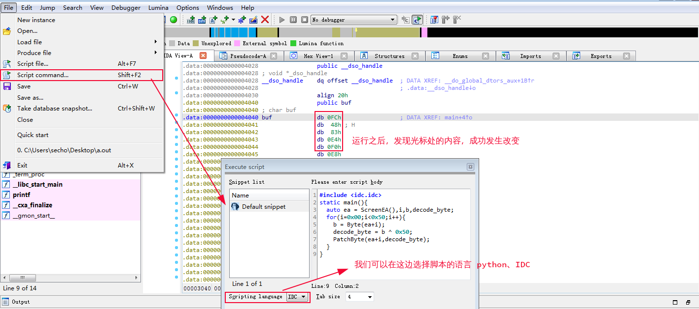

我们可以使用 IDA 脚本来实现更复杂的功能，如下面的查询对应函数的交叉引用。

```c++
#include <idc.idc>

static list_callers(bad_func)
{
  auto func,addr,xref,source;
  func = LocByName(bad_func); // 根据函数名在ida中寻找到相应的函数地址
  if( func == BADADDR ) // BADADDR 是 IDC 里的一个保留字,
  {                     // 用来表示找到的地址不合法，或者超出了程序的范围。。。
  
    Warning("Not found: %s",bad_func);	
  }
  // 获得该函数的交叉引用
  else
  {
    // 遍历该函数的所有交叉引用
    for(addr = RfirstB(func); addr != BADADDR; addr = RnextB(func,addr) )
    {
      xref = XrefType(); 
      // 筛选出近调用和远调用的引用
      if( xref == fl_CN || xref == fl_CF)
      {
        source = GetFunctionName(addr);
        Message("%s is called from 0x%x in %s\n",bad_func,addr,source);
      }
    }
  }
}
static main()
{
  list_callers("func_name"); // 传我们要查找的函数名
}
```

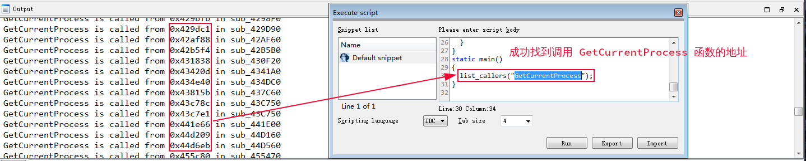

想要了解更多关于 IDA 插件的知识,我们可以 STFW 去搜索 IDC

> IDA 用户手册 :在 IDA 里按 <kbd>F1</kbd> 键即可