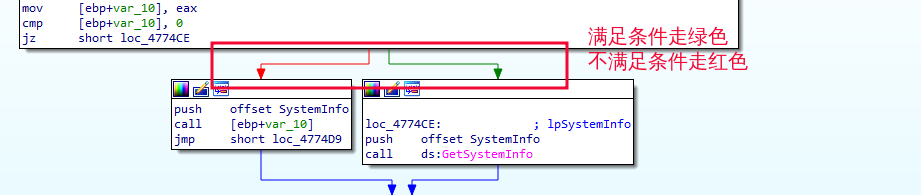
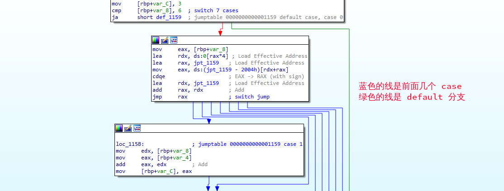
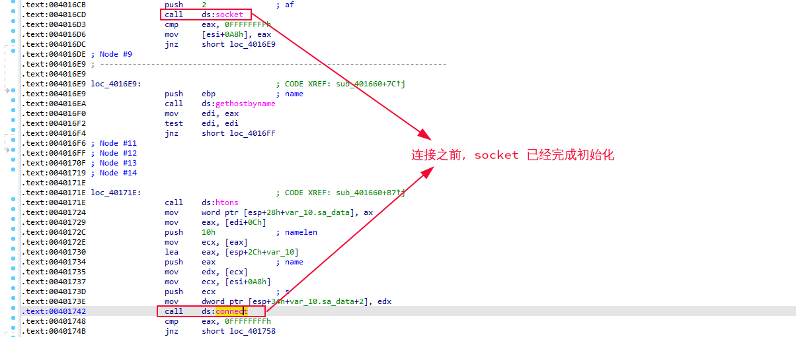
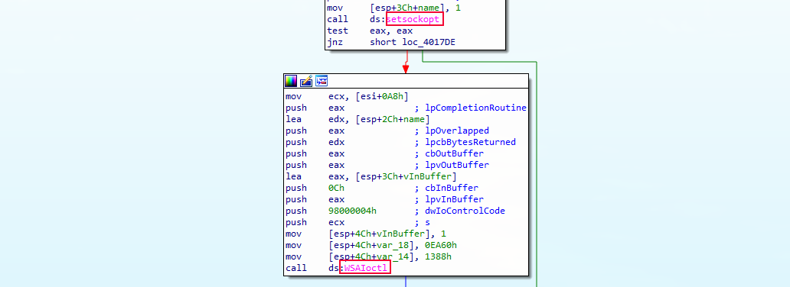
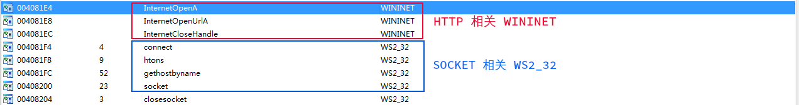
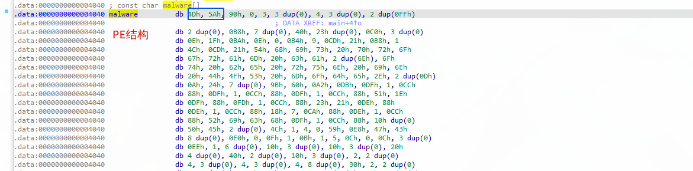
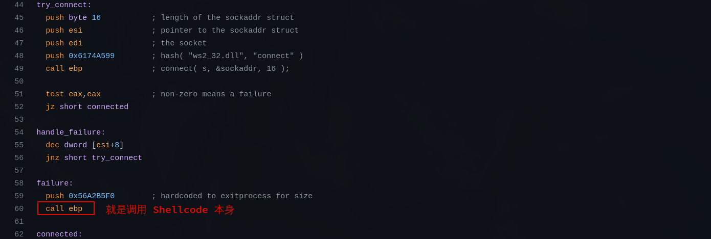
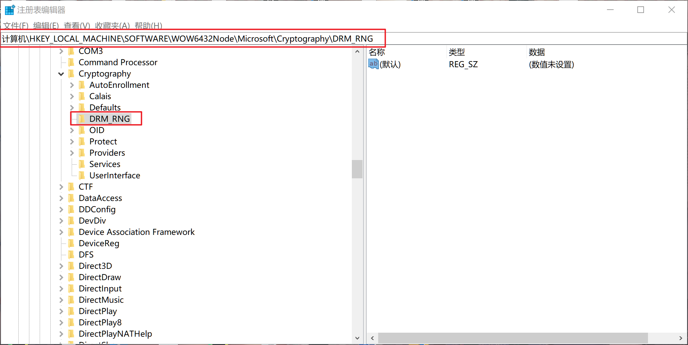

## 静态分析的结构与经验

### 分支结构
+ 满足条件走绿色
+ 不满足条件走红色

switch
cmp [地址+偏移量] 里面装的是前面几个的跳转条件(一般大于6个才会使用这种方式)
蓝色的线是前面几个 case
绿色的线是 default 条件


情况与场景：
如果遇到分支结构，尤其是函数中存在关键变量的分支结构
通常在 apt 样本中的场景：
1. 沙箱识别：
分支结构中有和操作系统相关的 api 函数
识别内存大小

```python
if memory < 2G # 如果内存小于 2G 退出
	exit

if process_num < 20: # 如果进程数量小于20 退出
	exit
```
2. 语言的识别
识别语言以针对性攻击

3. 命令的选择：
常见在木马中,在木马程序内一般会有一下的分支结构，这样我们就能传 `foobar` 从而让 远程主机执行 `ipconfig` 从而绕过可能存在的防火墙敏感命令字符的检测。

```python
if send_str == "foobar":
	system("ipconfig")
	...

```

每一个分支下都有很大的代码块或者函数调用，尤其是在这之前存在网络通信特征。

### 网络结构
常见的分为两类：
1. tcp和udp 这一类的通常直接调用 socket
2. http(s) 这一类网络请求相关的
+ TCP: SOCK_STREAM
+ UDP: SOCK_DGRAM
socket 流程
SOCKET: WS2_32

<font color='red' face=Monaco size=3>调用 `socket`,有一个前提条件,就是使用 wsa ( windows socket 对象)l</font> 

例如: `sadata` `wsaData` `WsaStartUp`
socket 流程
1. wsa 相关的
2. socket
3. connect
4. recv / send
5. closesocket
6. wsacleanup




> 在恶意代码分析中,只要存在 GetTickCount , 80%的概率都是确定目标的 uid

遇到勒索软件怎么提高解密的成功几率?
- 记录下被勒索的具体时间 (至少要精确到秒)
  - 原因: 很多的勒索软件的密钥由于需要一对一, 就会使用 GetTickCount 或者是能唯一识别的东西来做密钥的基础.



HTTP: `wininet.h`
恶意代码 http 使用场景:

+ <font color='red' face=Monaco size=3>攻防对抗环境下:</font> 
	+ http 协议下命令和结果传输
+ APT 环境下:
	+ 勒索文本的存放
	+ 公有环境下存放一些敏感信息
		+ 尤其是遇到 [pastebin](https://pastebin.com/) 类似的网站
		+ 密钥,或者是某个函数的某个参数,某个变量的值
	+ 结果存放在网站上


### 文件结构

文件结构一般都会去释放文件，一般有以下几种方式来释放文件。

**1. 从资源节中 `.rsrc` 释放文件:**
+ `LoadResource`: 从资源文件中找到位置
+ `CreateFile`: 创建文件
+ 我们可以使用 [Resource Hacker](https://resource-hacker.en.softonic.com/?ex=DINS-162.0) 来获取 PE结构里面资源节里面的资源 （文件）

**2. 从变量里直接创建文件**
+ 看变量的 HEX 是否存在 PE 相关的东西



**3. 从网络去释放文件**
+ 创建结构,下载内容
+ 先会创建一个 PE 结构,但是没有内容,并保存这个指针
+ recv 之后 (接收过来的其实就是 meterpreter 的文件结构,以 [msf shellcode](https://github.com/rapid7/metasploit-framework/blob/master/external/source/shellcode/windows/x86/src/block/block_reverse_tcp.asm) 举例) 指向刚才的指针
+ 就可以选择是创建文件,还是直接在内存运行

`call ebp` 其实就是 shellcode  本身.调用 shellcode




### 加解密结构

**1. 使用微软自带的加解密工具**
+ Microsoft Base Cryptographic Provider

**2. 自己写的加解密算法,但是有随机数的情况**
+ 注册表操作 + 带 RNG 这种字样
	
```shell
计算机\HKEY_LOCAL_MACHINE\SOFTWARE\WOW6432Node\Microsoft\Cryptography\DRM_RNG
```



**3. 自己写的加解密,自己的密钥**
+ <kbd>F5</kbd> 后看到很多循环语句,循环里面有很多异或操作,位移等运算操作

> 密钥的选择: 比较能够唯一识别 如 MAC地址 GetTickCount 网卡信息...


密码体系
明文 ----- 加密的密钥 ----- 密文 : 对称密钥体系
明文 ----- 公钥 -- 私钥 --  密文  : 非对称密钥体系


