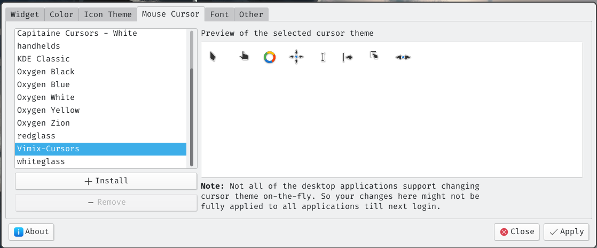

# 打造属于自己的 <font color=bluesky>Arch</font>


## 准备工作

在安装前,我认为非常有必要将下面的安装文档准备在身边.

Arch 官方安装文档 : [Arch WiKi  Installation Guide](https://wiki.archlinux.org/title/Installation_guide)

Arch Linux 简明指南 : [Arch Linux 安装指南](https://arch.icekylin.online/)


### 准备镜像

+ [官方下载网站](https://archlinux.org/download/)

+ [阿里云镜像源](http://mirrors.aliyun.com/archlinux/iso/2022.03.01/)


### 烧录镜像

+ [烧录镜像 Arch Wiki 官方文档](https://wiki.archlinux.org/title/USB_flash_installation_medium)

+ [rufus 下载网站](https://rufus.ie/en/)

这边使用 rufus 进行演示


> 如果使用默认的ISO镜像模式不能正确引导USB驱动器，则应该使用DD镜像模式进行烧录。


<font color=red>Arch Wiki</font >

1. 首先下载Arch的镜像文件


## 配置前准备

### 设置字体

```zsh
# 如果决定默认的tty终端的字体比较小的话,可以使用 setfont 来设置字体
# 默认字体路径 : /usr/share/kbd/consolefonts/
setfont /usr/share/kbd/consolefonts/LatGrkCyr-12x22.psfu.gz
```

### 设置键盘布局

```bash
# 如果你是使用 colemak 键盘布局的用户,可以使用这条命令来设置键盘布局
loadkeys colemak 
```

**切换键位**

+ <kbd>Caps_Lock</kbd> 与 <kbd>Ctrl</kbd> 互换

```bash
# 将 Caps_Lock 键 和 Ctrl键互换
vim keys.conf

# keys.conf --------------
keycode 1  = Caps_Lock
keycode 58 = Escape
# ------------------------

loadkeys keys.conf # 让配置文件生效
```

+ <kbd>Caps_Lock</kbd> 与 <kbd>Esc</kbd> 互换

```bash
# 将 Caps_Lock 键 和 Esc键互换

# keys.conf --------------
keycode 1  = Caps_Lock
keycode 58 = Escape
# ------------------------

loadkeys keys.conf # 让配置文件生效
```

 配置一下 vim 配置文件 让自己有一个好的编辑器的使用体验

```vim
syntax on 
noremap L $
noremap H 0
noremap J 5j
noremap K 5k
noremap ; :
noremap Q :q<CR>
```


```bash
/usr/share/X11/xkb/keycodes/evdev
```
我们可以使用 xev 来捕获键盘的输入来获得对应的 keycode


### 设置网络

>  如果有网线的话,直接将网线接入电脑即可

**使用 WIFI** 

1. 确认网卡,并扫描 WIFI

```bash
# 这边以 wlan0 网卡做演示.
# 查看网卡设备
ip link

# 开启对应网卡设备 如:
ip link set wlan0 up

# 扫描附近的 WIFI 信号
iwlist wlan0 scan | grep ESSID # 扫描出附近的 WIFI 名

```

2. 使用镜像内的 wifi 工具对生成对应的 WIFI文件

```bash
# 使用 wpa_passphrase 生成对应的 wifi 网络连接文件
# 格式:  wpa_passphrase ESSID( WIFI名 ) password( 对应WIFI的密码 ) > 配置文件生成路径
wpa_passphrase Mi_10s 123456789 > ./wifi.conf
```

3. 连接 WIFI

```bash
# 格式 wpa_supplicant -i 网卡名 -c 配置文件路径 & ( 在后台运行 )wpa_supplicant -i wlan0 -c ./wifi.conf &
```

4. 一般来说到这里,已经可以上网了,我们可以测试一下网络环境是否配置成功

```bash
ping www.baidu.com
```

5. 如果还是不能上网,则说明可能没有自动分配 IP 地址,我们可以使用以下命令,进行动态分配 IP 地址

```bash
dhcpcd &
```

### 更正系统时间

```bash
timedatectl set-ntp true
```


## 设置分区

**关于分区方案 Arch 官方给的建议:** ( 下面以 UEFI   为例)


> 当然我们还可以使用 cfdisk 等工具进行分区 ( 这边以 fdisk 进行演示 )

**查看当前电脑的所有设备信息**

```bash
fdisk -l 
```

### 使用 fdisk 进行分区

```bash
# fdisk 设备位置fdisk /dev/sda 
```

进去之后类似于以下界面: ( 进去之后,我们可以根据里面的命令来进行分区 )

<font color=red>按 m 查看帮助文档</font>


**常用 fdisk 命令说明**

+ <kbd>m</kbd> : 查看帮助文档 

+ <kbd>p</kbd> : 查看所进入的设备分区情况 (相当于在终端里的 `fdisk -l` )

+ <kbd>g</kbd> : 创建 GPT 的分区表
+ <kbd>n</kbd> : 创建分区


> 这边你需要根据你自己的需求来自己进行分区,和规划.<font color=red>下面我将把 Arch 装在整个电脑为例进行操作.</font>

先使用 <kbd>g</kbd> 命令将当前所选设备合并成一个分区 ( 创建GPT的分区表 ) 

这时候并不会真的写入到硬盘之中,只有我们运行了 <kbd>w</kbd> 后所做的操作才会真的写入到硬盘之中.


```bash
# 设置启动引导分区mkfs.fat -F32 /dev/sda1 # 启动引导分区只能设置成 fat32 格式# 设置 swap 分区mkswap /dev/sda1swapon /dev/sda1# 设置主分区mkfs.ext4 /dev/sda2 # 这步操作可能需要一点时间,只需要一直等到提示符出现即可
```


+512M

## 正式安装 Arch

更换 pacman 的源

 

下面为 `2022-06-19` 生成对应的中国镜像源列表

```bash
##
## Arch Linux repository mirrorlist
## Generated on 2022-06-19
##

## China
Server = http://mirrors.163.com/archlinux/$repo/os/$arch
Server = http://mirrors.aliyun.com/archlinux/$repo/os/$arch
Server = https://mirrors.aliyun.com/archlinux/$repo/os/$arch
Server = http://mirrors.bfsu.edu.cn/archlinux/$repo/os/$arch
Server = https://mirrors.bfsu.edu.cn/archlinux/$repo/os/$arch
Server = http://mirrors.cqu.edu.cn/archlinux/$repo/os/$arch
Server = https://mirrors.cqu.edu.cn/archlinux/$repo/os/$arch
Server = http://mirrors.dgut.edu.cn/archlinux/$repo/os/$arch
Server = https://mirrors.dgut.edu.cn/archlinux/$repo/os/$arch
Server = http://mirrors.hit.edu.cn/archlinux/$repo/os/$arch
Server = https://mirrors.hit.edu.cn/archlinux/$repo/os/$arch
Server = http://mirror.lzu.edu.cn/archlinux/$repo/os/$arch
Server = http://mirrors.neusoft.edu.cn/archlinux/$repo/os/$arch
Server = https://mirrors.neusoft.edu.cn/archlinux/$repo/os/$arch
Server = http://mirrors.nju.edu.cn/archlinux/$repo/os/$arch
Server = https://mirrors.nju.edu.cn/archlinux/$repo/os/$arch
Server = https://mirrors.njupt.edu.cn/archlinux/$repo/os/$arch
Server = http://mirror.redrock.team/archlinux/$repo/os/$arch
Server = https://mirror.redrock.team/archlinux/$repo/os/$arch
Server = http://mirrors.shanghaitech.edu.cn/archlinux/$repo/os/$arch
Server = https://mirrors.shanghaitech.edu.cn/archlinux/$repo/os/$arch
Server = https://mirrors.sjtug.sjtu.edu.cn/archlinux/$repo/os/$arch
Server = http://mirrors.tuna.tsinghua.edu.cn/archlinux/$repo/os/$arch
Server = https://mirrors.tuna.tsinghua.edu.cn/archlinux/$repo/os/$arch
Server = http://mirrors.ustc.edu.cn/archlinux/$repo/os/$arch
Server = https://mirrors.ustc.edu.cn/archlinux/$repo/os/$arch
Server = http://mirrors.wsyu.edu.cn/archlinux/$repo/os/$arch
Server = https://mirrors.wsyu.edu.cn/archlinux/$repo/os/$arch
Server = https://mirrors.xjtu.edu.cn/archlinux/$repo/os/$arch
Server = http://mirrors.zju.edu.cn/archlinux/$repo/os/$arch


```


**挂载分区**

```
mount /dev/sda2 /mnt
```


```bash
genfstab -U /mnt >> /mnt/etc/fstab
```


```bash
arch-chroot /mnt # 进入刚刚安装好的 Arch 系统# exit 命令可以退出系统
```


设置中国时区


```bash
ln -sf /usr/share/zoneinfo/Asia/Shanghai /etc/localtime# 同步系统时间hwclock --systohc
```


设置语言

修改 `/mnt/etc/locale.gen` 文件 

将 `en_US.UTF-8 UTF-8` 的注释去掉

然后进入系统 执行 `locale-gen `


在 `/mnt/etc/locale.conf` 里添加 `LANG=en_US-UTF-8` 这样我们的系统就是英文的了


修改 `/mnt/etc/vconsole.conf` 文件

```bash
# KEYMAP = colemak 如果不是 colemak 键盘用户,千万不要加这一行!keycode 1 = Caps_Lockkeycode 58 = Escape
```


网络设置

修改 `/mnt/etc/hostname` 文件 里面只需要填写自己主机的名字


修改 `/mnt/etc/hosts`文件

```bash
# Static table lookup for hostnames.# see hosts(5) for details.127.0.0.1 localhost::1 localhost127.0.0.1 zh.localdomain zh
```


更改 root 密码

进入系统

```bash
# 运行下面这个命令后,就可以输入密码了passwd
```


安装 grub 引导


```bash
pacman -S grub efibootmgr intel-ucode os-prober# intel-ucode 的作用是为我们的电脑更新CPU驱动的,如果是AMD架构的电脑可以安装 amd-ucode# os-prober   的作用是用来寻找电脑内其他操作系统的一个工具
```


```bash
mkdir /boot/grubgrub-mkconfig > /boot/grub/grub.cfggrub-mkconfig -o /boot/grub/grub.cfg
```


确认自己的电脑架构

```bash
uname -m
```

```bash
# UEFI 的 grub 安装
grub-install --target=x86_64-efi --efi-directory=/boot 
# BIOS 的 grub 安装
grub-install --target=i386-pc /dev/sdb 

```

> 出现错误的情况:

```bash
# 如果出现 grub-install: error: will not proceed with blocklists
# 可以在后面加一个 --force 选项试试

# 如果出现 efibootmgr:error failed to register the boot entry?
# 可以试着使用以下命令
grub-install --target=x86_64-efi --bootloader-id=GRUB --efi-directory=/boot/efi --no-nvram --removable
```


## 安装自己喜欢的软件


```bash
pacman -S neovim vi zsh fish wpa_supplicant dhcpcd
```


更新源

```bash
pacman -Syyu
```


对 pacman 提速

```bash
# 将下面这个注释去掉
# XferCommand = /usr/bin/wget –passive-ftp -c -O %o %u
# 并添加以下命令
XferCommand = /usr/bin/axel -o %o %u
# 记得先安装 axel !
```


安装一些有用的包

在安装软件时我们可以选择三种安装方式
1. 如果是比较主流的软件或者依赖可以在官方库里下载
	+ `sudo pacman -S vim`
2. 如果在官方库里没有,可以尝试在 `AUR` 寻找一下
	+ `yay -S google-chrome`
3. 如果在命令行里没有找到该软件，但是在 `Arch Wiki` 里查找到了对应的软件构造文件 ( 如`visual-studio-code-bin` )
	+ 我们可以先把这个压缩包下载下来
	+ 然后进行解压 
	+ 进行安装 `makepkg -si` 

查看安装了哪些包

```bash
sudo pacman -Q # -Q : query
```


```bash
pacman -S man base-devel
```


创建一个用户

```bash
useradd -m -G wheel busyvisudo
# 将 wheel 组的注释去掉 
```


安装桌面环境 

```bash
sudo pacman -S xorg xorg-server xorg-xinit
```

这边假设你使用 `x11` 做为你的环境，或许你有更换鼠标样式，字体样式的需求，但你又不想安装一个比较大的桌面环境(`gnome` `KDE` ... ) 你使用的是类似 `dwm` 的窗口管理器，那么你可以安装以下工具来更换 `x11` 环境下的字体、鼠标，图标等样式。

```bash
sudo pacman -S xcursor-themes lxappearance
```

当然我们可以先安装我们自己喜欢的主题样式。如果你喜欢 `kde plasma` 内的某个主题的话，你可以在 [kde plasma store](https://store.kde.org/browse?cat=104) 里下载你喜欢的样式主题。

然后我们运行 `lxappearance` 选择我们喜欢的样式即可




安装 `deepin`

```bash
sudo pacman -S deepin deepin-extra
sudo pacman -S xclip python python-pip python2 git xterm
```


安装 `KDE`


安装

```bash
sudo pacman -S screenkey
pip install -i https://mirrors.aliyun.com/pypi/simple dbus-python
```


安装 TLP (安装电源管理)
[TLP 官方文档](https://wiki.archlinux.org/title/TLP)

```bash
sudo pacman -S tlp
sudo systemctl enable tlp.service
sudo systemctl start tlp.service

``


安装蓝牙

``` bash
sudo pacman -S bluez
sudo pacman -S bluez-utilssudo pacman -S blueman
```


```bash
# 启动蓝牙服务
sudo systemctl start bluetooth.service
sudo systemctl enable bluetooth.service
sudo vim /etc/bluetooth/main.conf
# 将下面注释去掉
# AutoEnable=true  
```


peek 这个小工具能够生成Gif 文件

```bash
yay -S peek 
yay -S gifski
```


安装GNOME及其扩展工具：

$ sudo pacman -S gnome gnome-tweak-tool
然后安装GDM窗口管理器

$ sudo pacman -S gdm
设置开机启动GDM服务，这样我们开机时就会自动载入桌面：

$ sudo systemctl enable gdm.service


```bash
# markdown view install 
go env -w GOPROXY=https://goproxy.cn,direct
sudo pacman -S pandoc
yay -s mdview

```

手动安装 `AUR` 的软件包
```bash
git clone https://aur.archlinux.org/visual-studio-code-bin.git
cd visual-studio-code-bin
makepkg -s
sudo pacman -U visual-studio-code-bin-*.pkg.tar.xz
```

