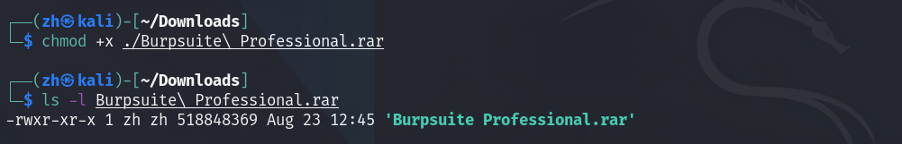

## 安装 `Burpsuite` 专业版
<div align='center'>
  
</div>

> Kali 下安装 `Burpsuite` 专业版
+ [视频演示](https://www.youtube.com/watch?v=mc1u5PfuKB4)

### 下载安装包

我们需要先下载对应的安装包
+ [Download link](https://bit.ly/Burpsuite_professional)
+ [国内下载链接](https://zhouhao-blog.oss-cn-shanghai.aliyuncs.com/blog/burpsuite.assets/Burpsuite%20Professional.rar)

下载之后为一个 `rar` 类型的压缩包


我们对其添加可执行权限

```bash
sudo chmod +x ./Burpsuite\ Professional.rar
```


然后我们使用 `unrar` 对其进行解压,如果你的 `kail` 没有 `unrar` 你可以使用以下命令进行安装

```bash
# sudo apt-get install unrar 
unrar x ./Burpsuite\ Professional.rar
```


解压完之后,我们将获得一个文件夹 `Burpsuite Professional`

### 安装相关依赖

我们可以使用以下命令来安装对应的依赖包,和对应版本的 `java`

#### 更换 Kali 源

<div style='border-radius:15px;display:block;background-color:#a8dadc;border:2px solid #aaa;margin:15px;padding:10px;'>
国内的网速比较慢，尤其是 <code>openjdk-17-jdk</code> 这个包相对来说说比较大，<font color='red' face=Monaco size=3> 所以我们最好更换我们的 <code>Kali</code> 源</font></div>

下面给出一些我所常用的 Kali 国内源

```bash
#aliyun 阿里云
deb http://mirrors.aliyun.com/kali kali-rolling main non-free contrib
deb-src http://mirrors.aliyun.com/kali kali-rolling main non-free contrib

# ustc 中科大
deb http://mirrors.ustc.edu.cn/kali kali-rolling main non-free contrib
deb-src http://mirrors.ustc.edu.cn/kali kali-rolling main non-free contrib

# tsinghua 清华
deb http://mirrors.tuna.tsinghua.edu.cn/kali kali-rolling main contrib non-free
deb-src http://mirrors.tuna.tsinghua.edu.cn/kali kali-rolling main contrib non-free

#浙大源
deb http://mirrors.zju.edu.cn/kali kali-rolling main contrib non-free
deb-src http://mirrors.zju.edu.cn/kali kali-rolling main contrib non-free
```

我们将上面的内容替换掉 `/etc/apt/sources.list` 文件内原本的内容，建议对原文件做一个备份。

**换源之后，我们需要先更新我们系统里的软件包和版本**

<font color='red' face=Monaco size=3>在每次运行 `apt-get install package` 的时候，最好都要运行一下这条命令</font>

```bash
sudo apt-get update
```


如果你想更新一下系统内所有安装了的软件的话，你可以运行以下命令

<font color='red' face=Monaco size=3>因为更新所有系统内的安装了的软件，所以需要挺长一段时间。</font>

```bash
sudo apt-get upgrade
```

#### 正式安装


我们先安装 `libc6-x32`

```bash
sudo apt-get install -y libc6-x32
```


然后我们安装 `openjdk-17-jdk` 也就是 `java-17`

```bash
sudo apt-get install openjdk-17-jdk
```


安装完成之后，我们验证一下 `java` 是否安装成功，并且其版本是否为 `17`

```bash
java --version # 17.0.x
```


### 使用工具生成 `License`

进入到我们刚刚解压后的文件夹内，我们查看一下 `Readme.txt` 发现最下面有两条命令，**我们开两个终端分别执行这两条命令。**

> <font color='red' face=Monaco size=3>记住：运行这两条命令一定要在 `Burpsuite Professional` 这个文件夹内运行</font>

```bash
/usr/lib/jvm/java-1.17.0-openjdk-amd64/bin/java --illegal-access=permit -Dfile.encoding=utf-8 -javaagent:burploader.jar -noverify -jar burpsuite_pro_v2022.2.4.jar
```


```bash
java -jar burploader.jar
```


运行完成之后，我们会发现创建了两个窗口,如图所示:。

> 授权信息，我们可以随意修改，这边我使用了 `secho` 这个名字,默认为 `google`


我们发现其中一个窗口内 ` ( burploader ) ` 有一串类似 `base64` 编码的字符串,我们将其复制到 `Burpsuite` 内,然后点下一步


这时候，我们就进入了以下界面,<font color='red' face=Monaco size=3>这个界面我们需要注意，我们不能点下一步，而是点击 `Manual activation` 这个按钮</font>


然后我们将 `Burpsuite` 内的内容复制到 `burploader` 内，这时候 `burploader` 会自动生成下面的 `Activation Response` 内容


这时候我们只需要将新生成的 `Activation Response` 内容复制到 `Burpsuite` 内最下面的框内。

<font color='red' face=Monaco size=3>很多人在这一步会出错，原因是因为复制内容时不完全，如下图：</font>


> 我们可以看内容旁边的滑动条，其实并没有拖到最上面，也就是说上面其实还有一段内容，<font color='red' face=Monaco size=3>如果我们仅仅只是拖动鼠标选中到我们能看见的部分的话，很有可能复制不完全，导致激活失败</font> 

我们需要复制完全!!!

我们需要复制完全!!!

我们需要复制完全!!!

**重要的事情说三遍。**

然后我们点下一步，我们如果看见 `Success` 就说明我们激活成功啦。


每次启动都还是需要运行下面命令 <font color='red' face=Monaco size=3>(在Burp Suite 目录下)</font>

```bash
/usr/lib/jvm/java-1.17.0-openjdk-amd64/bin/java --illegal-access=permit -Dfile.encoding=utf-8 -javaagent:burploader.jar -noverify -jar burpsuite_pro_v2022.2.4.jar
```


---

> 如果你作为一个终端爱好者，或者不喜欢用桌面图标的话，以下内容可忽略

### 创建桌面图标

当然如果你想要通过点击图标的方式启动的话，也是可以实现的，你只需要再对应文件夹里创建 `burpsuit.desktop` 文件，里面填写对应的命令即可。

+ [Create desktop file in linux](https://www.maketecheasier.com/create-desktop-file-linux/)


`kali linux` 默认桌面图标文件存放在 `/usr/share/applications` 路径下

> 如果我们不知道怎么写桌面图标文件的话，我们完全可以参考已有的桌面图标文件

我们已经知道了 `kali` 默认就预装有 `burpsuite` 这个工具，不过是社区版的 : )，那我们是不是可以模仿原有的 `burpsuite` 桌面图标文件来编写我们的桌面图标文件?

首先我们需要查找 kali 预装 `burpsuite` 的桌面图标文件。 

我们可以使用以下方式
```bash
cd /usr/share/applications
ls | grep burpsuite
```


为长久使用，我们将之前的文件夹，改了个名，并且换了个路径 （你可根据自己的需要来自行切换路径） <font color='red' face=Monaco size=3>不过记得将桌面图标文件内的路径也切换成你自己对应的路径</font>


对照其桌面图标文件，编写我们的文件。

> 这边的图标使用的是系统自带的 `burpsuite` 图标
 


下面进行换图标的演示：

如果你不想使用默认的图标，你可以自行选择你喜欢的图标。或到网上进行下载
+ [我使用的 burpsuite 图标文件](./burpsuite.assets/burpsuite_pro.png)

Linux 里几个图标默认的存放路径
+ `/usr/share/icons`
+ `/usr/share/pixmaps`
+ `~/.local/share/icons/`

我们将我们的图标存放在 `/usr/share/icons/myicons` 路径下。

```bash
[Desktop Entry]
Encoding=UTF-8
Name=burpsuite-professional
Version=1.0
Type=Application
Terminal=false
StartupNotify=false
Exec=sh -c "/usr/lib/jvm/java-1.17.0-openjdk-amd64/bin/java --illegal-access=permit -Dfile.encoding=utf-8 -javaagent:/home/zh/Work/Burpsuite_Professional/burploader.jar -noverify -jar /home/zh/Work/Burpsuite_Professional/burpsuite_pro_v2022.2.4.jar"
Icon=/usr/share/icons/myicons/burpsuite_pro.png
```
然后我们将这个文件保存，并移动到 `/usr/share/applications` 路径下即可。

这时候我们再搜索 `burpsuite` 就会出现我们的图标


将其固定在 `dock` 栏里，每次我们需要使用它时，只需要点击这个图标即可。


