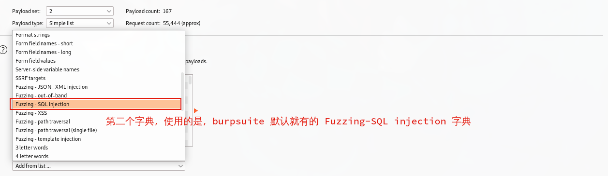

> 靶机环境介绍

+ [Billu_b0x](https://download.vulnhub.com/billu/Billu_b0x.zip) 
+ 难度等级 <font color=yellow> 中 (两种攻击方式)</font>

目标:
+ 取得 root 权限

**所用技术栈**

[TOC]

<div style='border-radius:15px;display:block;background-color:pink;border:2px solid #aaa;margin:15px;padding:10px;'>导入虚拟机时，一定要将下面的 <code>Mac Address Policy</code> 改成包含所有网卡的 MAC 地址，不然可能会获取不到 IP 地址</div>


## 主机发现与端口扫描

主机发现
```bash
sudo arp-scan -l
```


端口扫描,发现其开放了 22 和 80 端口


端口服务版本，服务内容扫描


既然开放了 80 端口，所以我们先访问一下其网页。

发现该页面上有 `Show me your SQLI skills`,说明这个表单一定存在 SQL 注入漏洞。


## SQL 注入

既然有 SQL 注入漏洞，那么我们就尝试一下使用万能密码，来进行登入。

发现登入失败


在进行多次尝试之后，发现都没能触发 SQL 注入漏洞的现象。

所以最后我们使用以下两个字典来尝试进行爆破

<font color='red' face=Monaco size=3>进行爆破需要使用 Burp Suite 的 intruder 功能模块,而这个模块需要专业版才能使用</font>

[Kali 里安装 Burp Suite 专业版教程](https://www.zhouhaobusy.com/articles/106)

我们先抓取登入网页的请求包,然后将其发送到 burp suite 的 intrude 模块内


然后添加两个字典文件
+ `/usr/share/seclists/Fuzzing/SQLi/Generic-SQLi.txt`
    + Runtime file 类型
    
+ 使用 Burp Suite 内置字典 `Fuzzing-SQL injection`
    + Simple List 类型
    


然后我们运行，并开始进行爆破,对 Length 进行排序。


我们还知道如果登入失败，会给我们返回一个弹窗 `Try again` 所以我们可以使用 burpsuite 的过滤功能将不含 Try again 的请求数据给过滤出来。


发现有以下 payload 不含 Try again 这个关键字。
所以我们选择一个 payload 进行尝试登入 ( 用户名为 `or 0=0 #` 密码为 `\` )


发现成功登入进入网站内部。

## 方法一

方法一我们使用了 <font color=red>文件包含，文件上传漏洞，内核提权</font>这三个技术栈成功打靶。

### 文件上传


发随便点击这些按钮,发现里面存在一个查看用户的功能和,添加用户的功能。


当我们点击添加用户时，发现里面存在 <font color='red' face=Monaco size=3>文件上传</font> 的功能。


所以我们尝试一下看看能不能将一句话木马给上传到服务器上。

我们使用下面的一句话木马 `shell.php`，对其进行上传，发现给我们返回 `only png,jpg and gif file are allowed` 说明该网站对我们上传的内容还是有限制的。

```php
<?php system($_GET["cmd"]);?>
```


所以我们使用 burp suite 对其进行多次长传，看看能不能绕过服务器端的检查。

我们先将文件的后缀改成 `png` 等图片文件的后缀，尝试一下看看能否上传成功。


很遗憾，发现上传失败.


我们知道如果文件的后缀名改了，那么想让该文件执行，那将变得非常困难。

然后我们尝试修改 `Content-Type` 里的内容，将其改成图片类型,`Content-Type:image/png`,并添加上图片文件的头部，`GIF89a;`,但不修改其文件的后缀名。


发现还是上传失败。

然后我们再尝试既修改 `Content-Type` 然后再加上图片文件的头部，并将其后缀改为 png 后发现该文件传成功


然后我们在点击用户查看，发现成功多出来一条记录。


我们查看这条记录上面的图片(并未显示出来，因为里面的php一句话木马)


复制其地址,对其进行访问。只返回图片显示错误的信息，说明我们的文件上传成功了。


我们尝试一下利用我们上传进去的一句话木马,发现利用失败了。说明并不解析该文件内的php代码，这时候我们如果能再找到一个文件包含漏洞，那么我们就能执行里面的代码了，从而获得 shell

>  如果这个时候，在这个网站上还能找到一个文件包含漏洞的话，就有可能利用我们所上传的一句话木马。


我们访问一下图片文件夹，发现里面有我们上传的 `shell.png`


### 文件包含

既然如此，老规矩，我们就对该网站使用 `dirsearch` 进行目录扫描 

```bash
dirsearch -u http://10.0.2.18/
```


我们访问一下 add.php 发现其显示的内容和我们刚刚的上传页面(panel.php)非常相似。

<table>
  <tr>
	<td>add.php 界面</td>
	<td>panel.php 界面</td>
  </tr>
  <tr>
	<td></td>
	<td></td>
  </tr>
</table>

所以我们怀疑会不会是 panel.php 这个界面调用了 add.php 里面的内容(接口) 进行显示的？所以我们抓一下 panel.php 流量包,查看一下是否通过传递参数的方式调用了 add.php 这个文件。

发现确实有一个参数 `load=add` 说明 panel.php 很有可能就是通过包含 add.php 这个文件来进行显示的，只是加了个样式。


我们将这个包发送给 burpsuite 的 repeater 模块,对其重放测试,看看是否有本地文件包含漏洞。

我们将 add 后面的参数改成 `/etc/passwd` 这个文件，发现成功显示该文件的内容。


> 这就成功发现了一个文件包含漏洞,这时候我们只需要将刚刚上传的一句话木马包含进来即可。

如果存在远程文件包含漏洞的话，就能成功将我们的一句话木马给加载进来

但当我们使用远程文件包含将该文件包含之后发现并没能成功给我们返回 id 命令的结果。


然后我们怀疑是不是不纯在远程文件包含漏洞，只存在本地文件包含漏洞？

然后我们尝试使用本地文件包含，将我们刚刚上传上去的 shell.png 包含进去.

发现还是没有返回我们要执行命令的结果。


### 反弹shell

我们这个方式是通过加载图片内的 php 代码然后传参数(命令) 去执行操作系统指令。

有可能这样一种调用方式在服务器端是不支持的。

所以我们就尝试一下，能不能使用一种 php 代码让服务器类似nc一样反弹shell给我们的攻击机，从而获取一个shell.

我们知道，在kali内存在很多类型反弹shell的代码。php 形式存在的目录 `/usr/share/webshells/php/`


然后我们使用相同的方式将该文件传到靶机上。


<font color='red' face=Monaco>记得将一些关键信息进行修改（如 ip 地址监听端口...）。</font>


我们再查看一下上传图片存放路径，发现成功上传上去。


然后我们再使用文件包含，包含这个反弹shell代码的文件，并使用 nc 监听我们设置好的端口。
发现成功反弹shell。

### 内核提权

老规矩我们可以使用python升级一下我们的 shell


提权，我们先查看其内核版本，发现为 3.13.9

我们使用 `searchsploit` 发现有一个利用脚本。


我们将该利用代码文件,传输到目标服务器上。


然后使用 gcc 进行编译,后运行,发现成功获得 root 权限。


## 方法二

方法二使用了 <font color=red>任意文件下载漏洞,源码审计，phpmyadmin 配置信息泄露 </font>等技术栈

### 任意文件下载漏洞

在尝试了很久对首页 sql 注入的突破，发现如果不是爆破，可能确实很难注入成功。

这时候我们就可以再使用以前讲的思路，进行信息收集。

我们在扫描目录的时候，我们还发现了以下两个文件。


我们对其进行访问，发现它提示我们要传一个 file 的参数。


是不是说明，我们需要传入一个file参数,然后存在文件包含漏洞？？?


但当我们传一个参数进去，还是提示我们需要传入一个 file 参数。

我们使用 burpsuite 进行发送 get 请求还是得到相同的结果


这时候，我们就猜测是不是因为我们请求的方式不对，导致这个问题。我们接下来就是使用 burpsuite 对请求方式进行不断更改进行尝试。


发现当我们使用 post 请求时能成功响应,并确定了这边存在 (文件包含或任意文件下载漏洞了)


<font color=red>既然如此，我们就测试一下这边的漏洞是否为文件包含漏洞。</font>

我们将 file 参数改成一个php文件。

发现该文件的内容完全被显示出来(代码也显示出来了) 如果是文件包含漏洞将不会显示出php代码，php代码会被执行。所以可以确定这里的漏洞是任意文件下载漏洞了。

> 任意文件下载就是将所有的指定文件显示出来，包括 php ,而文件包含漏洞并不会直接显示 php 的内容。


### 源码审计

既然是任意文件下载，我们即可使用该漏洞查看首页,看看存在什么样的sql注入漏洞，导致我们一直进不去。


首页的PHP代码如下

```php
<?php
session_start();

include('c.php');
include('head.php');
if(@$_SESSION['logged']!=true)
{
	$_SESSION['logged']='';
	
}

if($_SESSION['logged']==true &&  $_SESSION['admin']!='')
{
	
	echo "you are logged in :)";
	header('Location: panel.php', true, 302);
}
else
{
echo '<div align=center style="margin:30px 0px 0px 0px;">
<font size=8 face="comic sans ms">--==[[ billu b0x ]]==--</font> 
<br><br>
Show me your SQLI skills <br>
<form method=post>
Username :- <Input type=text name=un> &nbsp Password:- <input type=password name=ps> <br><br>
<input type=submit name=login value="let\'s login">';
}
if(isset($_POST['login']))
{
	$uname=str_replace('\'','',urldecode($_POST['un']));
	$pass=str_replace('\'','',urldecode($_POST['ps']));
	$run='select * from auth where  pass=\''.$pass.'\' and uname=\''.$uname.'\'';
	$result = mysqli_query($conn, $run);
if (mysqli_num_rows($result) > 0) {

$row = mysqli_fetch_assoc($result);
	   echo "You are allowed<br>";
	   $_SESSION['logged']=true;
	   $_SESSION['admin']=$row['username'];
	   
	 header('Location: panel.php', true, 302);
   
}
else
{
	echo "<script>alert('Try again');</script>";
}
	
}
echo "<font size=5 face=\"comic sans ms\" style=\"left: 0;bottom: 0; position: absolute;margin: 0px 0px 5px;\">B0X Powered By <font color=#ff9933>Pirates</font> ";

?>
```

发现其查询语句就是执行以下 SQL 语句

```php
$run='select * from auth where  pass=\''.$pass.'\' and uname=\''.$uname.'\'';
```
我对其进行简化，就能知道为什么我们方法一通过爆破  `or 0=0 #` 和 `\` 能成功登入进去。

最后执行的 SQL 语句如下，这也是为什么我们能进入到后台

```sql
select * from auth where  pass='''' and uname='' or 0=0 #'';
```

### 信息泄露

我们知道扫描目录之后，我们发现还有一个 `c` 文件，我们可以再用任意文件下载漏洞将该文件的内容查看一下,发现其内容如下。


```php
<?php
#header( 'Z-Powered-By:its chutiyapa xD' );
header('X-Frame-Options: SAMEORIGIN');
header( 'Server:testing only' );
header( 'X-Powered-By:testing only' );

ini_set( 'session.cookie_httponly', 1 );

$conn = mysqli_connect("127.0.0.1","billu","b0x_billu","ica_lab");

// Check connection
if (mysqli_connect_errno())
  {
  echo "connection failed ->  " . mysqli_connect_error();
  }

?>
```

我们还知道，该网站还有一个 phpmy 的目录，也就是说这个网站使用了 phpMyAdmin 来进行管理。

我们访问该网站，发现需要账号和密码，而刚刚我们就获得了一个账号和密码 `(billu b0x_billu)` 这个账号我尝试了进行登入首页，发现登不进去。


发现成功进入到 phpmyadmin 的后台管理界面。


这时我们就能查看一下网站用户信息，我们发现在 auth 里有一个用户，而这个用户就是我们登入首页的账号和密码.


我们还能在 phpmyadmin 里面查看我们上传过的图片等信息。


既然发现了 phpmy 这个目录，那我们再使用 dirsearch 对发现的 phpmy 这个目录再进一步进行探测。


发现扫出来 phpmyadmin 的配置文件，而我们知道，在配置文件里面一般会存在一些有用的信息，如用户名和账号等。

所以我们可以使用 任意文件下载漏洞查看该文件的信息，看看能不能发现一些有用的信息。


我们在里面发现了一个 root 用户的账号和密码。

我们尝试使用该用户名和密码登入phpmyadmin 的后台，发现登入失败。


我们在最开始端口扫描时，发现该靶机开放了 22 端口 ssh 服务，所以我就怀疑会不会这个账号和密码是主机的账号和密码？


所以我尝试使用 ssh 来验证一下这个账号和密码


发现成功以 root 身份登入到靶机。


<font color=green size=4>至此我使用两种方式都成功打靶</font>

