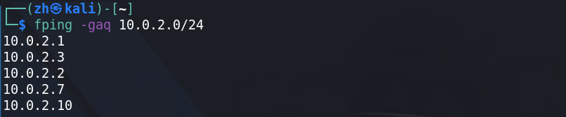
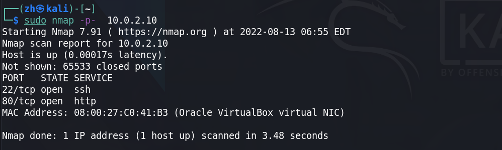
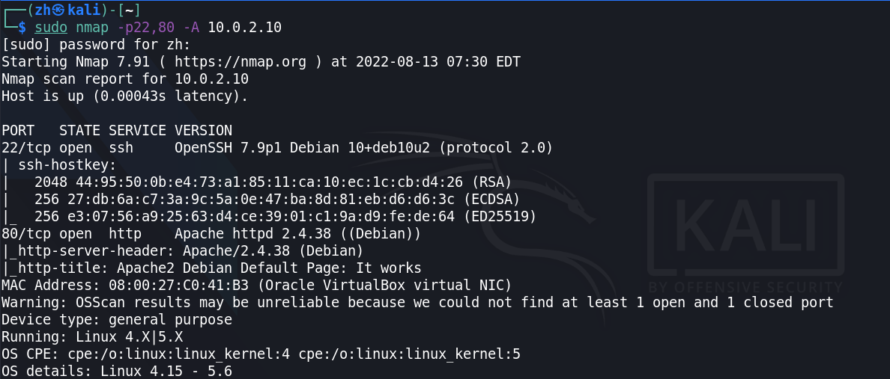
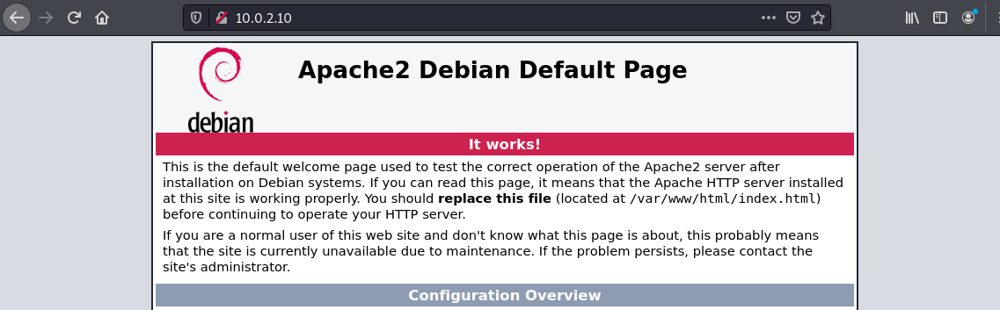
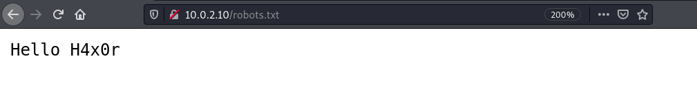
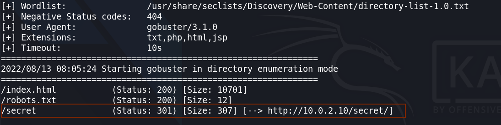
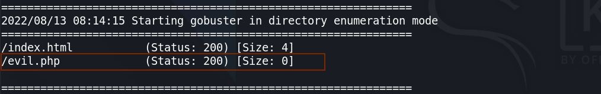
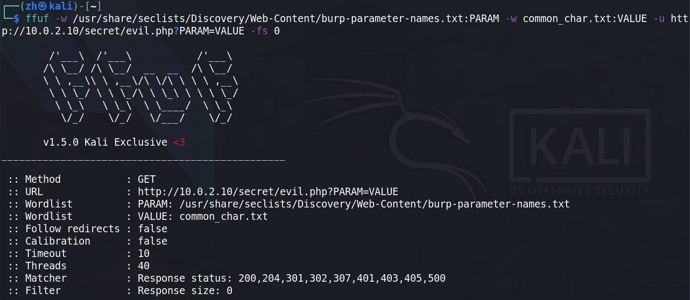

+ **靶机环境介绍**
	+ [EvilBox-One](https://download.vulnhub.com/evilbox/EvilBox---One.ova) 
	+ 难度等级 
		+ <font color=green>低 - 中</font>
+ 目标:
	+ 取得 root 权限 + 2 Flag
+ **所用技术栈**
	+ 主机发现
	+ 端口扫描
	+ 强制访问
	+ **参数爆破**
	+ 文件包含
	+ PHP封装器
	+ 任意文件读取
	+ SSH 公钥登入
	+ 离线密码破解
	+ 系统权限漏洞利用

## 主机发现与信息收集

这次的主机发现我们使用 `fping` 命令,我们知道单纯的 `ping` 命令不能直接 `ping` 整个网段,而 `fping` 则可以做到 

```bash
fping -gaq 10.0.2.0/24
# -g --generate 生成待ping列表 (可以根据ip/mask形式生成)
# -a --alive 显示存活主机
# -q --quiet 安静模式，只显示出结果，不显示 ICMP 错误
```




按照惯例，我们继续扫描其开放的端口,发现其开放了 22，80 端口



我们这次服务版本扫描使用 `-A` 参数 `-A`相当于  `-sV -sC -O` 这三个参数合起来使用



我们通过 `-A` 参数的扫描可以发现很多信息：
1. 目标系统可能为 `Debian`
2. 内核版本可能在 `4.15-5.6` 之间
3. ssh 是使用的 `OpenSSH`
4. 80 端口是由 `Apache` 开放的 `httpd` 服务产生的

既然开放了 80 端口,那我们就使用 浏览器去访问一下这个页面，发现是 `Apache2` 的默认初始界面，并没有获得什么有用的信息和攻击入口



这时候我们就想看看 `robots.txt` 里面是否有一些目录，发现并没有，只有一个 `H4x0r` 想着这玩意有没有可能是用户名或者密码，我们对 ssh 使用这个作为关键字生成字典进行爆破，无果.

是否有可能存在这个路径？ 经过访问，发现并没有这个目录/路径



在尝试多种操作无果后，我们又回到了最基本也是最重要的信息收集

之前我们尝试了 `dirsearch` 等目录遍历工具,这次我们使用 `gobuster` 来进行扫描

<font color='red' face=Monaco size=3>这款工具，默认kali并没有安装,我们需要使用 `apt-get` 来进行安装</font>

```bash
sudo apt-get install gobuster
```
<div style='border-radius:15px;display:block;background-color:#a8dadc;border:2px solid #aaa;margin:15px;padding:10px;font-family:"monospace";'>
gobuster 这个工具和 dirsearch / feroxbuster / dirb 这些工具有很多重叠的部分，不过这个工具除了能做路径的爆破，还能做 DNS 信息收集和爆破,同时这个工具是使用 go 语言开发的,速度相对较快;
</div>

下面我们就使用这款工具来进行路径的发现

> 这边我们使用 seclists 里面的字典,如果你的目录下没有这个目录，说明你的kali并没有安装 seclists，你只需要手动安装一下即可。

```bash
gobuster dir -u http://10.0.2.10 \
-w /usr/share/seclists/Discovery/Web-Content/directory-list-1.0.txt \
-x txt,php,html,jsp
```
+ `-u` 指定待爆破的 URL
+ `-w` 指定密码爆破字典 (`gobuster` 默认不提供字典)
+ `-x` 指定我们需要寻找的后缀名

经过一段时间的等待,我们扫描出来以下结果



我们发现了一个我们之前没尝试过的路径 `secret` 最为渗透测试人员，看见这个路径的名字就会敏感起来。 secret ： 秘密

所以我当即就访问了该目录，但是令人失望的是，这个路径并没有什么东西。

> 当我们扫描出来一个我们之前没有尝试过的路径时，我们最好还要以这个路径为基础，在爆破一次目录

这次我们还是使用相同的参数，相同的字典，只是在 url 后面添加上了我们刚刚爆破出来的路径 `secret`

经过一段时间，我们爆破出来了一个 `evil.php` 这个文件， 而 `evil : 邪恶` 这很明显是个提示性的名字. 我们立马访问这个页面，但是又很遗憾的是，这次又是空白界面.



针对这种情况，我们换了更大更全的字典，对这个路径进行爆破，发现还是只有这两个文件。

## 参数爆破


<div style='border-radius:15px;display:block;background-color:#a8dadc;border:2px solid #aaa;margin:15px;padding:10px;'>
当我们面对的页面没有直接暴露出这个页面存在哪些参数时，那么我们就有必要去针对这个页面来进行参数的爆破.
</div>

针对参数的爆破我们也有好多种方式。

之前我们都是使用 `burpsuit` 的 `intruder` 模块在 URL 后面构造 `?key=value` 形式来进行重放,所以我们要构造两个变量来进行爆破

**这次我们使用 `ffuf` 工具**

> 同样的，如果您的 kali 系统里没有这个工具，你可以使用 apt 去安装它

```bash
ffuf -w /usr/share/seclists/Discovery/Web-Content/burp-parameter-names.txt:PARAM \
-w common_char.txt:VALUE \
-u http://10.0.2.10/secret/evil.php?PARAM=VALUE \
-fs 0
```
+ **参数名字典**
	+ `burp-parameter-names.txt` 这个文件保存了 burp suit 专业版里对参数爆破参数名, <font color='red' face=Monaco size=3>包含大量网站里常用的参数名</font> 

+ **参数值字典**
	+ 下面这些个字符就是我的参数值字典 `common_char.txt` （记得每个值在做成字典都要换行，一行一条记录）
		+ `1 2 3 a b c ' " , % < ; / (`
--- 

<font color='red' face=Monaco size=3>因为我们要区别出参数名和参数值，所以我们要对字典起名字，我们只需要在字典后面添加 `: + name ` 即可区分出来。</font>
+ `-w` 指定特定的字典，可以指定多个
+ `-u` 指定要爆破参数的 URL
+ `-fs 0` 代表我们要过滤掉返回页面内容大小为 0 的结果
	+ 为什么选择 `0` 这个数值呢？
	+ 因为默认刚刚我们访问这些页面时，返回的就是空页面 所以选择 0



但是很可惜我们并没有匹配上一个参数

## 文件上传

到这里，我就想是否这个服务器存在文件上传漏洞，而参数值为路径名


