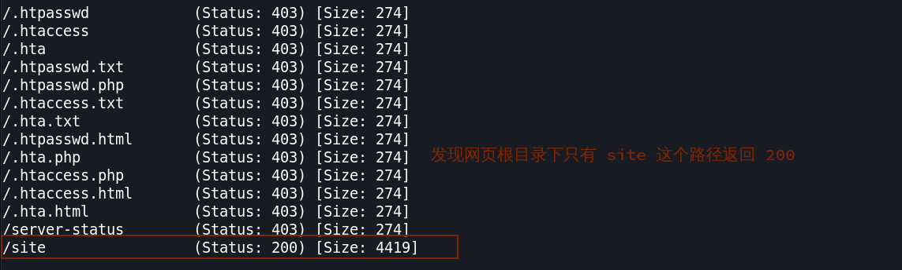
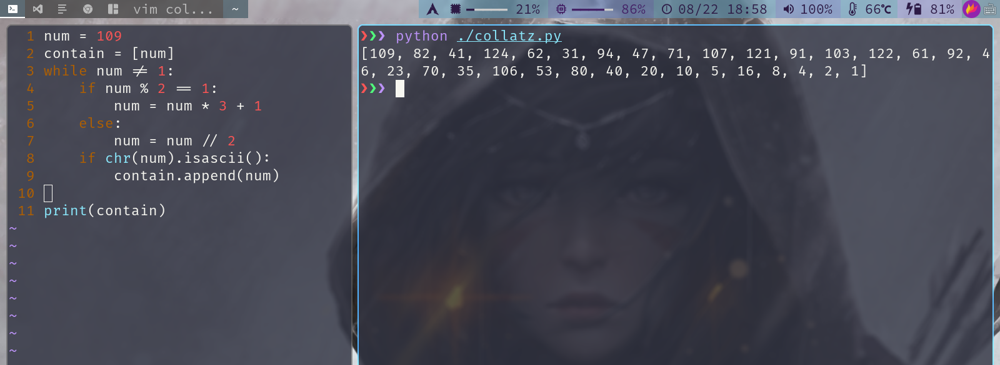

> 靶机环境介绍
+ [Vikings](https://download.vulnhub.com/vikings/Vikings.ova) 
+ 难度等级 <font color=green>低 - 中</font>

目标:
取得 root 权限 + 2 Flag


**所用技术栈**
+ 主机发现
+ 端口扫描
+ WEB 信息收集
+ 编码转化/文件还原
+ 离线密码破解
+ 隐写术
+ 二进制文件提取
+ 素数查找/科拉茨猜想
+ RPC 漏洞提权


## 主机发现与端口扫描

<div style='border-radius:15px;display:block;background-color:#a8dadc;border:2px solid #aaa;margin:15px;padding:10px;'>
主机、端口扫描，这边就不再赘述了，都是使用以前常用的命令和参数。
</div>

**发现主机**
```bash
sudo arp-scan -l
```


很明显 `10.0.2.12` 即我们要打靶的主机

**端口扫描**

```bash
sudo nmap -p- 10.0.2.12
```


发现靶机开放了 `22,80` 端口,我们照常对这两个端口进行服务版本的信息收集

**服务版本扫描**

```bash
sudo nmap -p22,80 -sV -sC 10.0.2.12
```


发现其 `22` 端口开放的是 `OpenSSH` 服务,而 `80` 端口则开放了一个正常的 `apache` 网站服务。
+ <font color='red' face=Monaco size=3>我们通过扫描还发现，其网站上还存在 `site` 目录</font>

按照惯例，我们对其网站服务进行一个基本的访问，发现确实存在一个 `site` 路径


当我们打开这个站点时，发现网站的响应速度及其缓慢，所以我就查看了一下网站源码，来弄清楚，到底为什么访问这个站点时，会这么慢。

通过访问源码我们发现，是因为该网站还使用了很多国外的 CDN  <font color='red' face=Monaco size=3> 加载了好多国外的 js 和 css</font> 而我们在国内，我们并不能访问国外的网站，尤其是 `google` 所以导致我们等待了很长一段时间，才显示这个页面，


页面上有一篇文章描述了战争故事，然后我们访问一下网站最下面的链接，发现都是无效链接，这个网页我们并没有发现更多有用的信息了。


## WEB 信息收集

既然网页上没什么有用的信息，所以我们还是使用最基本的渗透方案，对网站的隐藏文件，隐藏路径进行一个扫描。

+ 这边还是使用 `seclist` 这个字典工具里的一个基本字典进行暴力破解 ： `/usr/share/seclists/Discovery/Web-Content/common.txt` 
    + 这个字典包含了各网站常用的路径，字典大小也不是特别大

<font color='red' face=Monaco size=3>我们先使用 `gobuster` 对网站根路径进行扫描</font>

```bash
gobuster dir -r -u 10.0.2.12 -x txt,php,html -w /usr/share/seclists/Discovery/Web-Content/common.txt
```
j


扫描发现，只用一个 `site` 路径给我们返回了 200，而且这个路径也是我们已知的。



故而我们继续使用 `gobuster` 对 `site` 路径进行扫描

```bash
gobuster dir -r -u 10.0.2.12/site -x txt,php,html -w /usr/share/seclists/Discovery/Web-Content/common.txt
```


这一次我们很幸运，我们发现除了一些个 `css,js` 路径给我们返回 200 还有一个 `war.txt` 也给我们返回了 200 响应码


当即我们就使用浏览器对该路径进行了访问，发现该路径啥也没有，页面上只显示了 `/war-is-over`


## 编码转换

<font color='red' face=Monaco size=3>而这个东西一看就像是个路径</font> 所以当即我们就将  `war.txt` 替换成 `war-is-over` 对网站进行访问，发现出现了一屏幕类似 `base64` 编码过后的内容。


所以我们对其尝试使用 `base64` 进行解码，这边使用 `CyberChef` 编解码神器来进行解码 : )  


很遗憾，解码出来的玩意，我们似乎更看不懂了。

<font color='red' face=Monaco size=3>但是我们关注到，解码之后最开头的两个字符 `PK`,这似乎是个文件的头部信息</font>

我们知道，每个文件都有它的文件头，而文件头也是确认文件类型的一个有效方式。


为验证，我们解码之后的内容，可能是一个压缩文件，或者什么类型的文件，我们再次使用 `CyberChef` 对其进行验证。

<font color='red' face=Monaco size=3>而这次我们将使用 `CyberChef` 里的 `Entropy` (熵) 模块来验证内容是否被压缩/加密过</font>

> 熵这个概念最初是用在热力学上的，而现在这个概念也被广泛运用在宇宙，信息学等领域


看上面的说明：熵值超过 7.5 则说明这些数据很有可能为加密、压缩后的数据,而我们算出来的结果 `7.9999` 非常接近其最大熵值 `8` 所以我们有理由说这个数据就是加密、压缩过后的数据


所以现在我们就很想知道，如果是加密过后的数据，那么用的是什么加密算法进行加密的，如果是压缩的数据，那么用的是什么方式进行的压缩？

我们使用 `CyberChef` 里的 `detect file type` 模块来对数据进行文件检测.

检测完之后，我们发现该数据内容为 `zip` 文件,所以我们将 base64 解码后的数据保存成一个 `zip` 文件。


当我们获得 `zip` 文件之后，我们尝试对该文件进行解压缩，看看里面究竟有什么东西。

<font color='red' face=Monaco size=3>当我们尝试对压缩包进行解压时，发现我们解压需要密码</font>


## 离线密码破解

我们可以使用 `john` 这个离线密码暴力破解工具来对这个 zip 进行密码的暴力破解

<font color='red' face=Monaco size=3>首先我们要先使用 `zip2john` 这个小命令将我们要进行暴力破解的 `zip` 文件生成对应 `john` 工具能识别的 `hash` 形式的文件</font> 


这边还是使用 `rockyou.txt` 这个密码字典来对密码进行暴力破解


万事俱备，接下来我们就可以使用 `john` 使用 `rockyou.txt` 对其进行暴力破解

```bash
john hash -wordlist=rockyou.txt
```
很快我们就暴力破解出来了密码 **`ragnarok123`**


## 隐写术

使用我们暴力破解出来的密码对压缩包进行解压，解压之后我们发现是一张图片。

查看图片内容，也没发现什么有用的内容

> 这时候，我就想会不会在图片内隐藏了某些文件，因为之前在打 CTF 的时候， MISC 题型里就经常出现文件隐写类型的题目。

而这个图片就很符合文件隐写的特点。


### ~~`steghide`~~

我们使用 `steghide` 这个工具查看这个图片文件的信息。

```bash
steghide info ./king
```
发现确实有隐藏文件，但是隐藏文件需要我们输入密码    


如果密码简单的话，我们可以使用以下方式对其再进行暴力破解

我们可以写一个简易的脚本，将我们需要进行尝试的密码保存到一个文件内，然后使用这个脚本进行暴力破解。

```bash
for i in $(cat "dict.txt"); do steghide extract -p $i -sf ./king; done
```


我们使用 `rockyou.txt` 这个字典，进行暴力破解，尝试了很久还是没破解出来。

<font color='red' face=Monaco size=3>我并不推荐使用这种方式，只有在毫无办法的时候，可以适当尝试.</font>


> 我们使用 `steghide`  并没有成功提取出图片内的文件


### `binwalk`

所以我直接就先使用 `binwalk` 这个文件分离工具，查看一下文件是否存在别的文件.

发现这个图片里确实存在一个 `zip` 文件


<font color='red' face=Monaco size=3>我们还可以直接使用 `binwalk -e filename` 这个方式来提取图片内包含的文件</font> 


### `foremost`

我们还可以使用 `foremost` 这个工具，**在某些情况下，`foremost` 这个工具似乎比 `binwalk` 要好一点。**

```bash
foremost file_name
```
直接运行上面的命令，会在当前目录下生成 `output` 文件夹，而如果提取成功的话，文件夹里就会有我们要提取的文件。

这个文件我都试过了，使用 `binwalk,foremost` 都能成功提取到文件


### `dd`
<div style='border-radius:15px;display:block;background-color:#a8dadc;border:2px solid #aaa;margin:15px;padding:10px;'>
以前在打 <code>CTF</code> 时有遇见过使用 <code>binwalk,foremost</code> 都没有成功提取出隐写文件这种情况，但是我们又确信这个文件里面隐藏着其它文件，而且使用 <code>binwalk</code> 知道其分界点在哪里.
</div>

这时候我们就可以尝试一下使用 `dd` 这个命令来手动分离文件。

```bash
dd if=king bs=1 skip=142956 of=output.zip
```
> `dd` 命令是一个较为复杂的命令，下面对上面的命令参数进行一个解释
+ `if=king` 是指定输入文件名 `(king)`
+ `of=output.zip` 指定输出文件名 `(output.zip)`
+ `bs=1` 设置输入输出的块字节大小
+ `skip=142956` 是从输入文件开头跳过的块数 ( 这个值是看 `binwalk` 给我们的值 )


<font color='red' face=Monaco size=3>我们发现使用 `dd` 工具手动也成功提取出目标文件</font> 

<div style='border-radius:15px;display:block;background-color:#a8dadc;border:2px solid #aaa;margin:15px;padding:10px;'>
所以在我们渗透测试的时候要根据不同情况，使用不同的工具，甚至有些时候我们可以自己写一些小工具/小脚本来达到我们的目地。</div>

--- 

这时候我们查看一下里面隐藏的内容：


发现了一串类似连接 `ssh` 的账号和密码

> 而我们又知道，目标靶机确实开启了 `ssh` 服务。所以这两段字符串，很有可能就是 `ssh`的账号和密码   

所以我们先尝试使用这两段字符串进行连接目标靶机的 `ssh`


发现连接失败，我们再仔细观察了一下第一条字符串

<font color='red' face=Monaco size=3>我们知道 `ssh` 的命令格式为 `ssh username@IP`</font> 而我们知道 `vikings` 是我们靶机的名字，也就对应了我们目标靶机的 IP 地址，这边肯定没错。

<font color='darkcyan' face=Monaco size=3>观察之后就会发现，前面的用户名似乎有点长了，至少很少有这么长的用户名,而且 `FamousBoatbuilder` 似乎在描述 `floki` "这个用户"</font>

随即我们就尝试了使用 `floki` 当做我们的用户名。来尝试连接 ssh


发现真的成功连接上了。并获得了 `floki` 用户 shell


## 科拉茨猜想

我们获得了一个 `shell` 首先就是要先进行信息收集


我们查看 `/etc/passwd` 文件，发现里面有一个用户值得我们注意
: `ragnar` <font color='red' face=Monaco size=3>因为我们之前在网页，等多处地方看见过这个名词</font>

然后我们就要尝试一下，是否能直接切换成该用户
```bash
su ragnar
```


发现我们并不能直接切换成 `ragnar` 用户

然后我们抱着侥幸的态度尝试一下 `sudo -s` 直接切换成 `root` 用户，不出所料，我们没有 `sudo` 权限 : )


---

然后我们查看一下当前目录里的文件，发现两个文件 `readme.txt boat`

既然为 `readme.txt` 这么明显的提示文件,所以我们先查看一下这个文件 .


发现这个文件其实就是叫我们去查找一个 叫 `boat` 的文件。


而我们知道当前目录就有一个 `boat` 文件,我们查看一下这个文件发现我们需要先知道第 29 个素数,然后对该数进行科拉茨猜想.


对于第 29 个素数，我们可以编写以下简单的脚本来获得

```python
count = 0
max_num = 1000
for i in range(max_num):
    if i < 2:
        continue
    limit = int(i / 2) + 1
    for j in range(2, limit):
        if i % j == 0:
            break
    else:
        count += 1
        if (count == 29):
            print(count, ":", i)
            break
```
运行完之后，我们可以发现其数字为 `109`


+ [Collatz conjecture](https://en.wikipedia.org/wiki/Collatz_conjecture)

所以我们也可以编写以下程序来获得所有的科拉茨数。

```python
num = 109
contain = [num]
while num != 1:
    if num % 2 == 1:
        num = num * 3 + 1
    else:
        num = num // 2
    if chr(num).isascii():
        contain.append(num)

print(contain)
```
我们运行完之后，我们就获得了所有的数字



然后我们再次使用 `CyberChef` 来转换成可打印的字符


> 这边使用了三个 `CyberChef` 里的模块

+ `From Decimal` : 将数字转换成 ASCII
    + 记得将分隔符替换成 `, (Comma)`
+ `Strings` : 只显示可打印字符
    + 对每个字符进行匹配 (All printable chars)
+ `Find | Replace` : 将换行替换成空

<font color='red' face=Monaco size=3> 最后得到我们的结果 ：`mR)|>^/Gky[gz=\.F#j5P(`</font>

当然我们还可以直接使用程序一次性进行上面的一系列操作

<font color='red' face=Monaco size=3>`import string` `string.printable` 将会返回一个所有能打印的字符串，我们可以使用这个字符串来进行判断我们数字列表里的每个元素是否可打印</font>


## RPC 漏洞提权
使用上面获得的字符串尝试使用 ssh 连接 `ragnar` 用户的shell


ragnar 用户默认 shell 为 `/bin/sh` 所以我们可以先切换成 `/bin/bash` 来升级一下我们使用的 shell.

然后进入到 `ragnar` 的家目录发现了 `user.txt` 查看之后发现应该是第一个 flag


发现成功登入上去，但是在登入上去的时候，发现了一个问题。

<font color='red' face=Monaco size=3>就是在登入的时候，需要我们输入 `sudo` 的密码，当我们输入完密码后又提示我们不在sudo 组里</font>

这就很奇怪了，我们登入进去就需要我们输入 `sudo` 的密码，而当前用户却又不在 `sudo` 用户组里，说明在我们返回 shell 前肯定运行了一个需要 `sudo` 的程序，类似 `windows` 开机启动项一样.

<div style='border-radius:15px;display:block;background-color:#a8dadc;border:2px solid #aaa;margin:15px;padding:10px;'>
而我们知道，在 <code>Linux</code> 里也有类似 <code>Windows</code> 开机启动文件夹一样的机制，只是 <code>Linux</code> 是将要提前运行的东西，写在一些文件里，如 <code>~/.bashrc ~/.profile ...</code>
</div>

所以我就对这些初始化文件，一个个查看，我们在 `~/.profile` 里面发现了一个可疑的命令 

`sudo python3 /usr/local/bin/rpyc_classic.py`


我们简单审计一下这个 python 脚本
+ [rpyc_classic.py](./mechine9.assets/rpyc_classic.py)

<font color='red' face=Monaco size=3>我们看见其导入了一个库,对于我们不知道的库，首先我们要去搜索引擎里面搜索一下</font>

搜索之后，我们发现这个库和远程执行有关,和 `XMLRPC` 的工作原理差不多,并且我们在其官方说明文档里查找到及其类似的代码。
+ [rpyc document](https://rpyc.readthedocs.io/en/latest/)

并且我们发现我们还可以使用，`teleport()` 函数来远程执行我们自己构建的函数


这时候我就在想，我们是否可以构造一些恶意提权代码，来达到提权的目的,所以我就查看了一下该文件的权限和所有者，所属组。

可惜的是我们不能对该文件进行修改，不过幸运的是该文件所有者和所属组都是 root


<font color='red' face=Monaco size=3>如果我们可以修改该文件，就意味着我们可以让该服务器以root权限任何我们想运行的python代码</font>

经过查看官方文档得知，如果运行 `rpyc` 的服务端，默认会开放 `18812` 端口，所以我们查看一下服务器是否开启 `18812` 端口，来初步验证该服务是否开启


<font color='red' face=Monaco size=3>发现该服务确实开启了，但是只监听在 `127.0.0.1` 也就是本机 </font>

说明我们构造的客户端 `exp` 程序也一定要在目标服务器上运行,而不能在攻击机上运行

查看上面的官方文档后，所以我们可以构造以下利用代码。

下面这段代码就是使用 root 权限将 `ragnar` 加入到 sudo 组内。

```python
import rpyc

def shell():
	import os
	os.system("sudo usermode -a -G sudo ragnar")
conn = rpyc.classic.connect("localhost")

fn = conn.teleport(shell)
fn()
```
运行之后，再次连接其 ssh, 并执行 `sudo -s` 发现成功获得 root 权限。


我们进入到 `root` 的家目录发现了第二个 flag


<font color='green' face=Monaco size=4>至此这个靶机就已经成功渗透。</font>